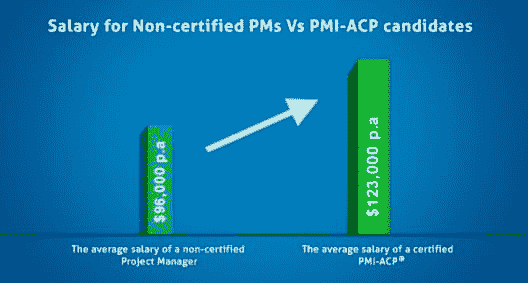
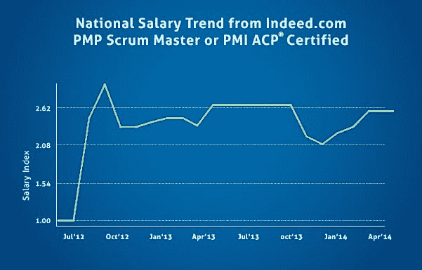
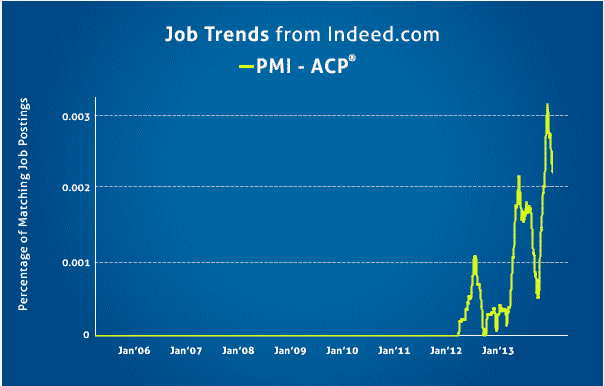
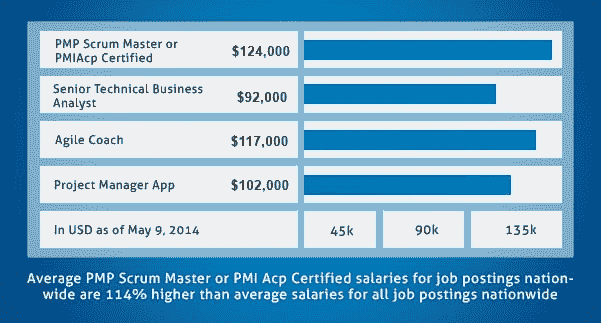

# PMI-ACP 对你的职业生涯有多大价值？

> 原文：<https://www.edureka.co/blog/how-valuable-is-pmi-acp-to-your-career/>

我们在之前的帖子中讨论了关于 [敏捷方法和 PMI-ACP](https://www.edureka.co/blog/importance-of-agile-pmi-acp/) 的重要性。在本帖中，我们将了解 PMI-ACP 在项目管理领域的意义，以及它给你的职业生涯带来的积极差异。

## **获得 PMI-ACP 认证的主要原因:**

*   敏捷是软件行业的一项新技术，旨在取代复杂的旧业务技术。因此，PMI-ACP 认证考试非常重要，它实际上可以让你为软件专业和商业计划中的最新挑战做好准备。PMI-ACP 考试提供了一个优势，主要是因为三大原因——职业选择、薪资和提高工作理解力。
*   大规模进行的大多数工作都是基于项目的，项目的结构和形式总是随着时间的推移而发展。正是由于这个原因,“敏捷”一词已经成为项目管理专业人员的完美定义。

*现在我们来详细看看原因。*

## **PMI-ACP 待遇更好:**

在这个竞争激烈的领域，你掌握的技能越多，你就越能出色地完成工作。人们还发现，有些公司会奖励那些在最少监督的情况下就能成功运作项目的员工。一定要记住，这个 PMI-ACP 认证考试是可以保证这个溢价的。

PMI-ACP 认证人员的工资比非认证专业人员高 28%左右。PMI-ACP 在业内很受重视，这也是他们获得如此高薪酬的原因。毫无疑问，成为 PMI-ACP 认证当然是值得的。

**** 上述薪资趋势表明，PMI-ACP 正在享受稳定的溢价薪资。

## **PMI-ACP 需求如何？**

*   目前缺少正确理解敏捷并且能够在当前项目管理意义上实施过程的专业人员。因此，对于作为开发人员或项目经理已经了解敏捷的专业人士来说，PMI-ACP 提供了一个展示他们资质的平台。
*   敏捷社区正在成长，**世界已经开始快速地大量实施敏捷方法，以便在动态环境中执行项目。**
*   **PMI-ACP 是为数不多的跨越方法论界限的认证之一，并且不仅仅关注其中一种方法(通常是 Scrum)** 。另一方面，敏捷是一个总体框架，它是一系列方法的集合，比如 Scrum、XP、精益、看板、Chrystal Clear、DSDM 等等。
*   大多数公司倾向于使用多种或混合这些方法，因此 **PMI-ACP 认证提供了这些工具、技能和知识领域的更全面的覆盖。**
*   认证要求展示敏捷的实际经验，而不仅仅是培训。除了参加培训和获得认证(在认证领域实际上被称为“证书”)之外，你还必须展示你在敏捷方面的经验，并通过认证机构的全面考试。

作为一个专业组织，PMI 是可信的，并且最适合为这个相对年轻和不一致的领域带来一些标准化和认证的严格性。在此之前，没有单一的最佳敏捷认证。以前最流行的认证是认证 Scrum Master (CSM ),这是:1)Scrum 独有的，2)很容易获得，在业界几乎没有意义。

## **PMI-ACP 的工作趋势** **:**

事实清楚地表明，PMI-敏捷认证专业人员(PMI-ACP)的就业趋势正在上升，因此需要这种熟练的专业人员。

## **不同的工作需要 PMI-ACP &他们的薪资:**

PMI-敏捷认证从业者(PMI-ACP)可以在各种需要他的技能的职位中进行选择。PMI-ACP 的各种职称是:

*   **PMP Scrum 大师**
*   **技术业务分析师**
*   **敏捷的蔻驰**
*   **项目经理**

在热门的求职网站 indeed.com 上搜索一下，就会发现上述职位需要 PMI-ACP 认证的专业人士。

**提升工作理解力:**

根据专家的说法，这种考试的最大优势是，因为与以前相比，可以在更短的时间内应用更多的技能，拥有这种证书的人实际上可以过上相对较少压力的生活。

大多数有资格胜任这份工作的人认为，与这次认证考试之前的情况相比，他们对自己必须做什么以及如何执行有了更好的理解。

## **结论:**

PMI-ACP 是 PMI 提供的最新、最全面、最受欢迎的认证之一。PMI-ACP 提供了一个完整的敏捷方法的整体研究，而不是集中在一个单一的方法上。这使得它成为一个受欢迎的职业选择，有巨大的就业机会。

有问题要问我们吗？在评论区提到它，我们会回复你。

**相关帖子:**

[敏捷方法论与 PMI-ACP 的重要性](https://www.edureka.co/blog/importance-of-agile-pmi-acp/ "Agile Methodology and Importance of PMI-ACP®")

*PMI-ACP 是项目管理协会的注册商标。Edureka 是全球 PMI 代表:ID 4021*