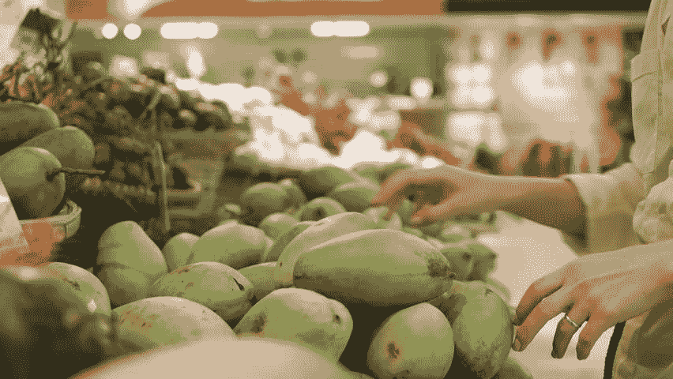
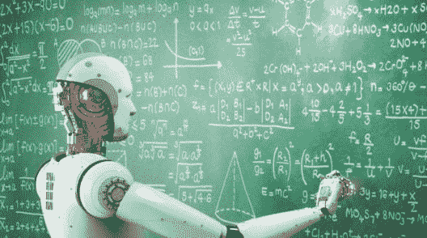
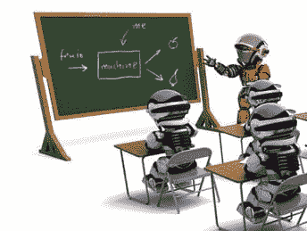

# 初学者的机器学习教程

> 原文：<https://www.edureka.co/blog/machine-learning-tutorial/>

我已经在我的博客[中介绍了机器学习的更高层次的概念，什么是机器学习？](https://www.edureka.co/blog/what-is-machine-learning/)正如我所承诺的，这里有一个系列教程博客，名为“机器学习教程”。本教程博客将帮助您了解:

*   [用类比理解机器学习](#MachineLearning)
*   [什么是机器学习？](#WhatIsMachineLearning)
*   [最大困惑 AI vs ML vs DeepLearning](#AIvsMLvsDL)
*   [理解监督学习](#SupervisedLearning)
*   [理解无监督学习](#UnsupervisedLearning)
*   [理解强化学习](#ReinforcementLearning)
*   [机器学习使用 Python](#MachineLearningUsingPython)

## 用类比理解机器学习

**作为人类:**假设有一天你去买芒果。卖主有一辆装满芒果的手推车，在那里你可以亲手挑选芒果，称重，并根据每公斤固定的价格付款。

****

**任务:你将如何挑选最好的芒果？**

下面给出的是集学，人类从他的购物芒果的经历中获得的，你可以深入下去详细地看一下。浏览一遍，你会很容易把它和机器学习联系起来。

#### 学习 1:亮黄色的芒果比淡黄色的更甜

***经历 1:***

*你被告知明亮的黄色芒果比苍白的黄色芒果更甜。*

*所以你制定了一个简单的**规则:只从亮黄色的芒果中挑选。**你检查芒果的颜色，挑选亮黄色的，付钱，然后回家。对吗？*

#### *学习 2:小而亮黄色的芒果只有一半时间是甜的*

****经历二:****

**当你回家品尝芒果时，有些并不像你想象的那么甜。你担心你的智慧不够。你的结论是，在购买芒果时，你不能只看颜色。**

**经过大量的琢磨和品尝不同种类的芒果，**

****你的结论是**较大的鲜黄色芒果一定是甜的，而较小的鲜黄色芒果只有一半时间是甜的(即，如果你买了 100 个鲜黄色芒果(50 个大，其余 50 个小)，那么 50 个大芒果都是甜的，而 50 个小芒果中，只有 25 个是甜的)。然后，你将更新你的芒果购物规则，从下次开始，你将记住这一点。**

#### **学习 3:小的，浅黄色的是最甜的**

*****经历三:*****

*****悲剧:**下一次在市场，你看到你最喜欢的小贩已经出城了。你决定从另一家供应商那里购买，这家供应商提供的芒果产自该国的另一个地区。现在，你意识到你曾经学过的规则(又大又亮的黄色芒果是最甜的)不再适用了。你得从头学起。你品尝了这个小贩的每一种芒果，发现小小的淡黄色芒果实际上是所有芒果中最甜的。***

#### ***学习 4:软芒果更美味***

*****经历 4:*****

***有一天，你的表哥从另一个城市来看你。你决定用芒果招待她。但她就像“我不在乎一个芒果的甜，我只想要最多汁的”。现在再一次，你运行你的实验，品尝各种各样的芒果，并意识到软的更多汁。***

#### ***学习 5:绿色的芒果比黄色的更美味***

*****经历 5:*****

***后来，你搬到了世界的另一个地方，你发现这里的芒果味道与你的祖国截然不同。你意识到对这个国家来说，绿色的芒果比黄色的更美味。***

#### ***学习 6:你不再需要芒果了***

*****经历 6:*****

***你嫁给了一个讨厌芒果却喜欢橙子的人。现在你去买橘子而不是芒果。现在，你积累的所有关于芒果的知识都一文不值了。现在你必须通过同样的实验方法来了解苹果的物理特性和味道之间的关系。***

## ***如果你必须为它写一个代码呢？***

*****作为人类编写的代码:**现在，想象你被要求编写一个计算机程序来选择你的芒果(或橙子)。你可以编写下面的规则/算法:***

***如果是明黄色的**和**个头大的**和**卖的:芒果是甜的。如果(软):芒果多汁***

***你可以用这些规则来选择芒果。***

*****作为人类的结论:*****

***但是每当你从实验中得出新的观察结果时，你都必须手动修改规则列表。***

***你必须了解影响芒果质量的所有因素的细节。如果问题变得足够复杂，你可能很难手工制定精确的规则来涵盖所有可能的芒果类型。这需要大量的研究和努力，不是每个人都有这么多的时间。***

## ***这就是机器学习发挥作用的地方***

## ***机器学习教程:什么是机器学习？***

****Definition: Machine Learning is a concept which allows the machine to learn from examples and experience, and that too without being explicitly programmed. So instead of you writing the code, what you do is you feed data to the generic algorithm, and the algorithm/machine builds the logic based on the given data.****

<figure class="wpb_wrapper vc_figure">**********</figure>

*****机器学习算法是普通算法的一种进化。它们允许你的程序从你提供的数据中自动学习，从而使你的程序“更聪明”。的算法主要分为:*****

******   训练阶段*   测试阶段*****

*******训练阶段*******

*****你从市场上随机选择一个芒果样本(**训练数据**，制作一个表格，列出每个芒果的所有物理特征，比如颜色、大小、形状、生长在国家的哪个地方、由哪个供应商出售等(**特征**，以及那个芒果的甜度、多汁度、成熟度(**输出变量**)。你将这些数据输入机器学习算法(**分类/回归**)，它就会学习一个平均芒果物理特征与其质量之间相关性的模型。*****

<figure class="wpb_wrapper vc_figure">**********</figure>

<figure class="wpb_wrapper vc_figure">**********</figure>

*******测试阶段*******

*****下次当你去购物的时候，你会测量你正在购买的芒果的特征(**测试数据**，并将其馈送给机器学习算法。它将使用之前计算的模型来预测芒果是否是甜的、成熟的和/或多汁的。该算法可能在内部使用规则，类似于您之前手工编写的规则(例如，一个**决策树**)。 最后，你现在可以非常放心地选购芒果了，不用担心如何挑选最好的芒果的细节问题。*****

*******结论为算法*******

*****你懂什么！你可以让你的算法随着时间的推移而改进(**强化学习**)，这样当它在越来越多的训练数据集上得到训练时，它就会提高它的准确性。万一它做出错误的预测，它将自己更新它的规则。*****

*****最棒的是，你可以用同一个算法训练不同的模型。你可以分别创建一个来预测苹果、葡萄、香蕉或任何你想要的东西的质量。*****

*****关于机器学习教程更详细的解释请随意浏览这段视频:*****

### *******机器学习教程|机器学习算法|爱德华卡*******

*****[//www.youtube.com/embed/YcUPVziBsMA?rel=0&showinfo=0](//www.youtube.com/embed/YcUPVziBsMA?rel=0&showinfo=0)***** *****#### 订阅我们的 YouTube 频道，随时了解我们的最新内容*****