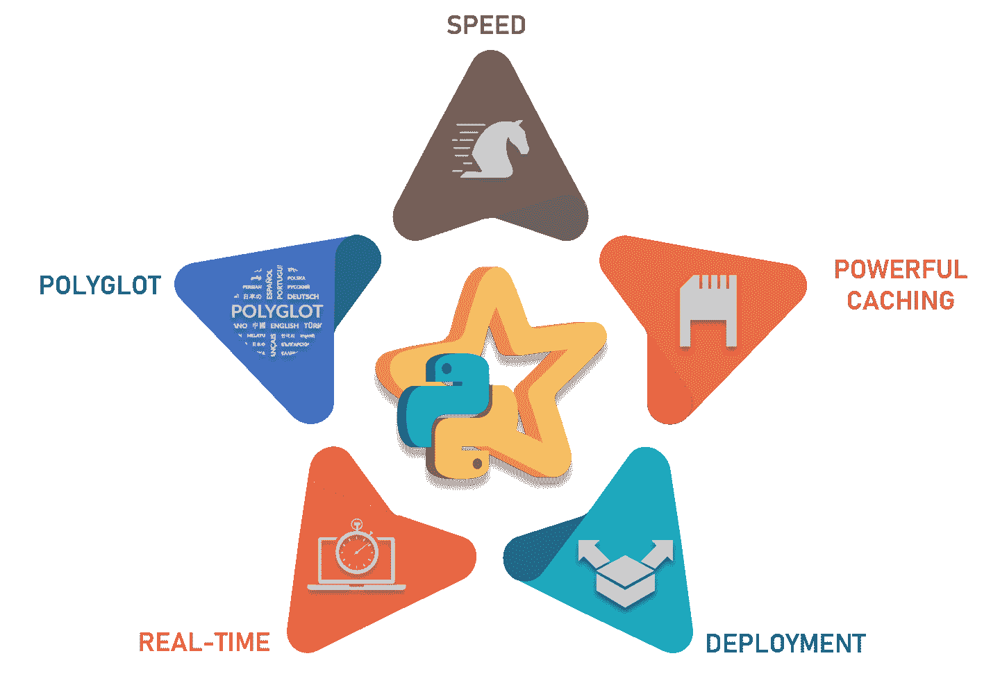

# PySpark 教程——使用 Python 学习 Apache Spark

> 原文：<https://www.edureka.co/blog/pyspark-tutorial/>

当今世界，数据正以如此惊人的速度生成，在正确的时间对这些数据进行正确的分析非常有用。Apache Spark 是实时处理大数据和执行分析的最令人惊叹的框架之一。一起， ***Python for Spark*** 或 PySpark 是最受欢迎的认证课程之一，让 Scala for Spark 大受欢迎。所以在这篇 **PySpark 教程**博客中，我将讨论以下话题:

*   [**py spark 是什么？**](#pyspark)
*   [**业内的 PySpark**](#industry)
*   [**为什么选择 Python？**](#why)
*   [**星火**](#RDD)
*   [**机器学习用 PySpark**](#ML)

## **PySpark 教程:PySpark 是什么？**

Apache Spark 是一个快速集群计算框架，用于处理、查询和分析大数据。基于内存计算，它比其他几个大数据框架有优势。

最初是用 Scala 编程语言编写的，开源社区已经开发了一个惊人的工具来为 Apache Spark 支持 Python。PySpark 通过其库 **Py4j 帮助数据科学家与 Apache Spark 和 Python 中的 rdd 接口。【PySpark 比其他框架有许多更好的特性:**

*   **速度:**比传统大规模数据处理框架快 100 倍
*   **强大的缓存:**简单的编程层提供强大的缓存和磁盘持久化能力
*   **部署:**可以通过 Mesos，Hadoop via Yarn，或者 Spark 自带的集群管理器进行部署
*   **实时:**实时计算&因内存计算而延迟低
*   **多语种:**支持 Scala、Java、Python 和 R 编程

让我们继续我们的 PySpark 教程博客，看看 Spark 在行业中的应用。

## **业内的 py spark**

每个行业都围绕着大数据，哪里有大数据，哪里就有分析。所以让我们来看看 Apache Spark 被应用的各个行业。从 [数据工程课程](https://www.edureka.co/microsoft-azure-data-engineering-certification-course) 了解大数据及其应用。

**媒体**是向在线流媒体发展的最大行业之一。**网飞**使用 Apache Spark 进行实时流处理，为其客户提供个性化的在线推荐。它每天处理 4500 亿个流向服务器端应用的事件。

****

**金融**是 Apache Spark 的实时处理发挥重要作用的另一个领域。银行正在使用 Spark 来访问和分析社交媒体档案，以获得洞察力，帮助他们为**信用风险评估**、定向广告和客户细分做出正确的商业决策。【Spark 的使用也减少了客户流失。**欺诈检测**是 Spark 参与的机器学习中应用最广泛的领域之一。

****

医疗保健提供商正在使用 Apache Spark**分析患者记录**以及过去的临床数据，以确定哪些患者在出院后可能面临健康问题。Apache Spark 用于**基因组测序**以减少处理基因组数据所需的时间。

****

**零售和电子商务**是一个无法想象不使用分析和定向广告就能运转的行业。当今最大的电子商务平台之一**阿里巴巴**运行着一些世界上最大的 Spark 作业，以分析数 Pb 的数据。阿里巴巴在图像数据中执行**特征提取**。**易贝**利用 Apache Spark 提供**针对性优惠**，提升客户体验，优化整体性能。

****

**旅游**行业也使用阿帕奇 Spark。**猫途鹰**，一家帮助用户计划完美旅行的领先旅游网站，正在使用 Apache Spark 加速其**个性化客户推荐**。猫途鹰使用 apache spark 向数百万旅行者提供建议，通过对比数百个网站为顾客找到最佳酒店价格。

本 PySpark 教程的一个重要方面是理解我们为什么需要使用 Python？为什么不是 Java，Scala 或者 R？

#### 订阅我们的 youtube 频道获取新的更新..！