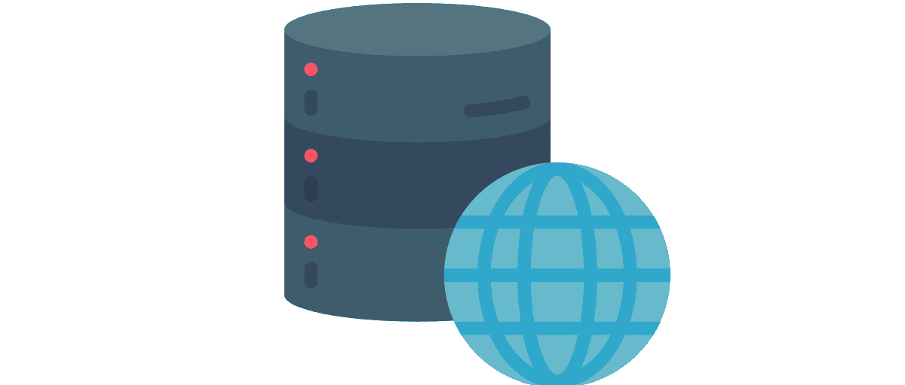

# NoSQL 数据库介绍

> 原文：<https://www.edureka.co/blog/introduction-to-nosql-database/>

[//www.youtube.com/embed/3z1KFA2qcSo](//www.youtube.com/embed/3z1KFA2qcSo)

## **NoSQL 数据库简介**

 NoSQL，不仅被称为 SQL 数据库，还提供了一种存储和检索数据的机制，是下一代数据库。它采用 MongoDB 的分布式架构，并且是开源的。大多数 NoSQL 都是开源的，它具有水平可伸缩性，这意味着可以添加商品类型的机器

可以增加集群的容量。它与模式无关，不需要设计表和将数据推送到表中。NoSQL 提供了简单的复制，声称在这方面有很少的人工干预。复制完成后，系统将自动进行故障切换。

NoSQL 的关键因素是它可以处理大量数据，可以通过向集群添加更多机器来提高性能，并且可以在商用硬件上实现。市场上有近 150 个 NoSQL 数据库，这将使你很难为你的系统做出正确的选择。

## **为什么是 NoSQL？**

有不同种类的数据是结构化的、非结构化的和半结构化的，因此 RDBMS 系统不是为以有效的方式管理这些类型的数据而设计的。NoSql 数据库出现了，并且有能力管理它。今天的人们正在使用不同种类的方法，如果你谈论代码速度和实现级别，人们希望同时执行不同的活动。说到传统的方式，就管理数据库和根据数据库编写应用程序而言是相当困难的。所以有了新的 NoSQL，事情变得容易多了。

## **NoSQL 的好处**

NoSQL 要求保护与其使用相关的各种益处。从管理数据到可扩展性，it 使用量急剧增加。可以管理大量数据，然后进行流式传输。可以分析不同种类的数据，如结构化和半结构化数据，并且可以执行分析活动。

如果您无法从任何数据中获取价值，您可以获取这类信息。它的面向对象编程易于使用且灵活。它提供水平扩展，而不是昂贵的硬件。如果您想要纵向扩展，则必须购买额外的 CPU 和 ram。但是在这里，水平扩展可以在商用硬件的帮助下使用。

## **NoSQL 数据库类别**

**文档数据库**–它将每个键与一个称为文档的复杂数据结构配对。它可以包含许多不同的键值对，或者键数组对，甚至嵌套文档

**键值存储**–它们是最简单的 NoSQL 数据库。数据库中的每一项都存储为属性名或键及其值。

图形存储库(Graph store)——它们用于存储网络信息，比如社会关系。图形库包括 Neo4J 和 HyperGraphDB。

**宽列存储-**Cassandra 和 HBase 等宽列存储针对大型数据集的查询进行了优化，将数据的列存储在一起，而不是行。

## **NoSQL Vs SQL 对比**

## **酸性属性**

ACID 是一组保证可靠处理的属性。在数据库环境中，对数据的单个逻辑操作称为事务。

原子性将事务定义为一个逻辑工作单元，它必须完成所有的数据修改，或者不执行任何修改。

一致性——在事务的最后，所有数据必须保持一致。

一个事务执行的数据修改必须独立于另一个事务。除非发生这种情况，否则交易的结果可能是错误的。

可维护性——当交易完成时，由交易执行的修改的效果必须在系统中是永久的。

有问题要问我们吗？在评论区提到它们，我们会给你回复。

**相关帖子:**

[开发生产 MongoDB](https://www.edureka.co/blog/development-and-production-of-mongodb/)

[MongoDB 中的 JSON 和 BSON 简介](https://www.edureka.co/blog/introduction-to-json-bson-in-mongodb/)

[入门 MongoDB](https://www.edureka.co/mongodb)