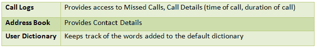
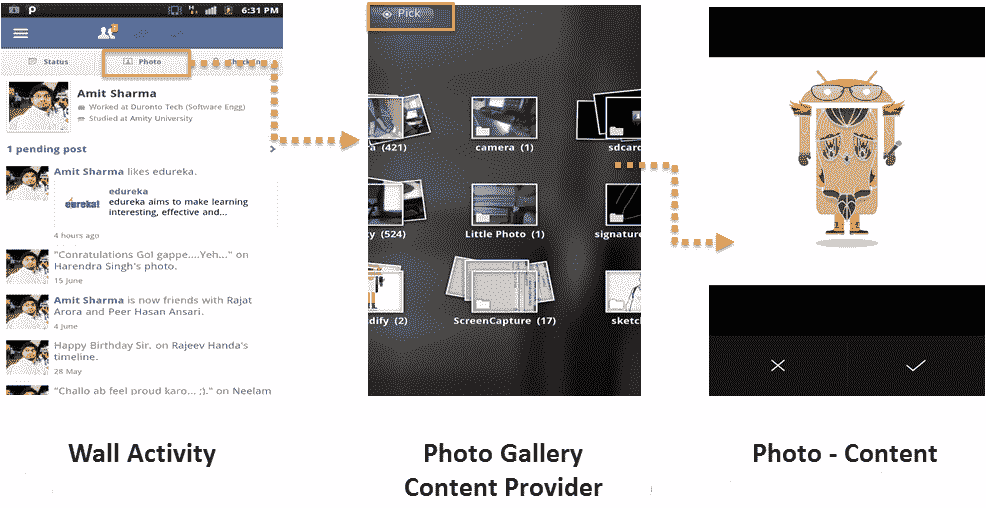
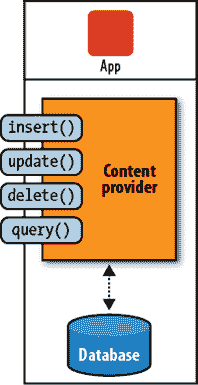

# Android 初学者教程第 4 部分:内容提供商

> 原文：<https://www.edureka.co/blog/beginner-android-tutorials-content-provider/>

在我们之前的 Android 初学者教程中，我们讨论了 Android 的前三个积木: [活动](https://edureka.co/blog/android-tutorials-for-beginners-activity-component/ "Android Tutorial : Activity") ， [意图](https://edureka.co/blog/android-tutorials-intent-component/ "Android Tutorials : Intent") 和 [服务](https://edureka.co/blog/android-tutorials-beginners-service-component/ "Android tutorials : Service") 。本文是面向初学者的 Android 教程系列的第四篇，讨论内容提供者，这是 Android 系统的另一个非常重要的组件。

内容提供商是您的 Android 系统的中间人，促进不同 Android 应用程序之间的数据交换。让我们在这个 Android 教程中深入了解一下细节。

***Android 初学者教程-4 奖金: [在这里下载内容提供商代码](# "Code for Content Provider") 。一旦你完成了教程，你会想要这段代码的！:)***

[dl URL = " # " class = " eModal eModal-6 " title = "下载代码" desc = " " type = " " align = " " for = " Download "]

### **安卓教程:内容提供商**

内容提供商促进了对中央数据存储或仓库的访问，以允许跨不同应用程序的数据共享和数据操作。

以下是 Android 系统 API 中默认内容提供者的几个例子:

[](https://www.edureka.co/blog/beginner-android-tutorials-content-provider/)

这些内容提供者允许用户从底层数据库中进行抽象。通常，内容提供商使用 SQLite 来存储底层数据库。

让我们以优秀的老脸书应用程序为例，它也帮助我们简化了之前的 Android 教程中的事情！

你们所有人在社交网络生活中的某个时刻，都上传过一张照片到你的脸书时间线上，对吧！你是怎么做到的？

点击墙上的照片按钮，你就可以进入照片库。在那里，您可以选择要上传的照片。

看过 ***安卓教程系列*** 之前的文章，对活动和意图有所了解；因此，你知道事情是这样的:

***你的脸书墙是一个“活动”。当你点击照片按钮时，一个传达信息的“意图”被传递，“内容提供者”(照片库)打开。使用网络上传“服务”上传照片。***

### [****](https://www.edureka.co/blog/beginner-android-tutorials-content-provider/)

[https://www.youtube.com/embed/lklcZDf91r0?version=3&rel=1&fs=1&autohide=2&showsearch=0&showinfo=1&iv_load_policy=1&wmode=transparent](https://www.youtube.com/embed/lklcZDf91r0?version=3&rel=1&fs=1&autohide=2&showsearch=0&showinfo=1&iv_load_policy=1&wmode=transparent)

观看此实况视频，了解内容提供商如何在您的脸书应用程序中工作。

#### 【Android 系统为什么需要内容提供商？

因为在一个应用程序中创建的数据库对另一个应用程序不可见，所以需要内容提供者。

使用 SQLite 在不同的应用程序中创建和存储数据库很简单，但问题是，Android 中的数据库对于创建它的应用程序来说是私有的。Android 中没有每个应用程序都可以访问的公共存储区域。因此，对于不同的应用程序使用一个数据库，Android 系统需要一个允许这种应用程序间和进程间数据交换的接口。这就是内容提供商发挥作用的地方。

#### 我真的需要内容提供商吗？

1)如果您想为某个特定的应用程序开发一个私有数据库，您**不需要开发自己的提供程序(除了创建该数据库的应用程序之外，其他应用程序无法访问该数据库)。**

2)然而，您需要一个定制的提供者在您自己的应用系统中提供定制的搜索建议。

3) 您还需要一个内容提供者**将复杂的数据从您的应用程序复制并粘贴到其他应用程序。**

#### 内容提供商支持哪些运营？

内容提供商支持以下基本操作:

**1)** **查询:**根据指定的 URI 向内容提供商查询所有对象。

**2)** **删除:**从内容提供商的数据库中删除指定的对象。

**3)** **更新:**对数据库中的对象进行更新。

**4)** **插入:**向数据库插入新对象。

[](https://www.edureka.co/blog/beginner-android-tutorials-content-provider/)

#### **在内容提供商中执行操作的步骤**

#### **步骤 1:访问内容提供商**

**ContentResolver 客户端对象**用于访问来自内容提供商的数据。它与 provider 对象通信，provider 对象接受访问数据的请求并返回所需的结果。由提供者和提供者客户端对象提供的数据交换接口允许跨不同进程/应用程序的通信。

需要访问数据库的应用程序必须声明这一点，并在其清单文件中请求权限。这将在我们后续的 Android 教程中详细讨论。

**内容 URI**

内容 URI 是用于标识提供程序中的数据的参数之一。它有四个部分:

**1)** **方案:**内容提供者的方案有一个常量值:“内容”。

**2)** **权限:**是提供者的符号名称，对每个提供者都是唯一的。这就是我们如何从众多内容提供商中挑选出想要的内容提供商。

**3)** **路径:**路径**帮助从完整的数据库中分辨出所需的数据**。例如，呼叫日志内容提供商区分未接呼叫、已接呼叫等。使用不同的路径。

**4)** **ID:** 不是强制成分，在 URI 可能不存在；但是如果存在，它应该是数字。例如，*如果你想从你的媒体内容提供商那里访问一个特定的音乐文件，你也可以指定一个 ID*。

**流程**

使用提供者授权，内容解析器识别正确的内容提供者(因为授权对于每个内容提供者是唯一的)。完成后，URI 的路径组件用于选择正确的(请求的)数据表。如果存在 ID，提供者将知道请求的确切数据。

[](https://www.edureka.co/blog/beginner-android-tutorials-content-provider/)

URI 氏症有两种类型:

[](https://www.edureka.co/blog/beginner-android-tutorials-content-provider/)

此外，URIs 也可能有限制性信息。

#### **步骤 2:如何从内容提供商处检索数据**

尽管 ContentResolver 现在可以访问数据表，但它不能检索所需的数据，除非应用程序对该特定提供者拥有*“读访问权限”*。该权限在每个内容提供者的清单文件中定义。

应用程序*(想要访问这个数据库)*所要做的就是请求这个许可。

现在，正如本 Android 教程前面所讨论的，使用内容提供者 可以执行 ***四个操作。我们将逐一检查。***

#### **查询**

现在，您已经访问了提供程序，并且有权限从中检索数据。下一步是**构造查询，向提供者**请求所需的动作。

以下是查询时使用的参数:

**URI** :它的工作原理和上面解释的完全一样。

**2)** **投影:**查询应该**从整个数据库表中返回一组列**。这就是所谓的投射。传递 null 将返回所有列，效率很低。

**3)** **选择子句:**一个**过滤器，声明返回哪些行**，格式为 SQL WHERE 子句(不包括 WHERE 本身)。传递 null 将返回给定 URI 的所有行。

例如，如果你在地址簿的搜索栏中输入一个字母(比如“P”)，它会返回所有以“P”开头的联系信息。但是，如果您没有在搜索栏中输入任何内容，则会检索完整的联系人列表(在这种情况下，选择子句被设置为“null”)。

**4)** **选择论据:**你可能包括”？s ”,它将被 selectionArgs 中的值替换，替换顺序与它们在选择中出现的顺序相同。

**5)****sort ORDER:**SQL ORDER BY 子句(不包括 ORDER BY 本身)。传递 null 将获取可能是无序的结果。

#### 用于查询的代码示例:

*   在通讯录中搜索电话号码

```
Cursor cursor = contentresolver.query(ContactsContract.Contacts.CONTENT_URI, null,
null, null, null);
int count = cursor.getCount();

if (count > 0) {
String contactDetails = "";
	while (cursor.moveToNext()) {
		String columnId = ContactsContract.Contacts._ID;
		int cursorIndex = cursor.getColumnIndex(columnId);
		String id = cursor.getString(cursorIndex);
		String name = cursor.getString(cursor
.getColumnIndex(ContactsContract.Contacts.DISPLAY_NAME));
		int numCount = Integer.parseInt(cursor.getString(cursor
			.getColumnIndex(ContactsContract.Contacts.HAS_PHONE_NUMBER)));
		if (numCount > 0) {
			Cursor phoneCursor = contentresolver.query(
ContactsContract.CommonDataKinds.Phone.CONTENT_URI,null,
				CommonDataKinds.Phone.CONTACT_ID+" = ?", new String[] { id
}, null);

				while (phoneCursor.moveToNext()) {
				String phoneNo = phoneCursor.getString(phoneCursor
.getColumnIndex(ContactsContract.CommonDataKinds.
Phone.NUMBER));

					contactDetails += "Name: " + name + ", Phone No: "
								+ phoneNo + "
";

					}

					phoneCursor.close();
				}
			}
		}

```

#### **插入**

让我们假设您想要在您的地址簿中插入新的联系人。 **ContentValues 对象**用于执行这些插入操作。为此，ContentValue 对象键和内容提供者列必须匹配。这里有一个例子:

#### 插入的代码示例:

*   操作是插入名为“Rajnikant”和编号为“9988999888”的新条目

```
// Operation
ArrayList ops = new ArrayList();
int rawContactInsertIndex = ops.size();

ops.add(ContentProviderOperation.newInsert(RawContacts.CONTENT_URI)
	.withValue(RawContacts.ACCOUNT_TYPE, null)
	.withValue(RawContacts.ACCOUNT_NAME, null).build());

ops.add(ContentProviderOperation
	.newInsert(Data.CONTENT_URI)
	.withValueBackReference(Data.RAW_CONTACT_ID,rawContactInsertIndex)
	.withValue(Data.MIMETYPE, StructuredName.CONTENT_ITEM_TYPE)
	.withValue(StructuredName.DISPLAY_NAME, “Rajnikant”).build());

ops.add(ContentProviderOperation.newInsert(Data.CONTENT_URI)
	.withValueBackReference(Data.RAW_CONTACT_ID,rawContactInsertIndex)
	.withValue(Data.MIMETYPE, Phone.CONTENT_ITEM_TYPE)
	.withValue(Phone.NUMBER, “9988999888”)
	.withValue(Phone.TYPE, Phone.TYPE_MOBILE).build());

getContentResolver().applyBatch(ContactsContract.AUTHORITY, ops);

```

#### **更新**

要更新内容提供者，需要使用以下参数:

**1)** **URI:** 内容提供商的 URI

**2)** **内容值:**包含替换现有数据的值。

**3)** **选择子句:**这可以帮助选择要更新的具体记录

**4)** **选择论据:**你可能包括”？s ”,它将被 selectionArgs 中的值替换，替换顺序与它们在选择中出现的顺序相同。

同样，ContentValues 对象的**键必须匹配内容提供者**中的列；否则，更新不会发生。

#### 更新的代码示例:

*   更新姓名为“Rajnikant”的电话号码

```
String where = ContactsContract.Data.DISPLAY_NAME + " = ? ";
String[] params = new String[] { “Rajnikant” };

ArrayList ops = new ArrayList();

ops.add(ContentProviderOperation.newUpdate(ContactsContract.Data.CONTENT_URI)
.withSelection(where, params)
	.withValue(ContactsContract.CommonDataKinds.Phone.NUMBER, “9876543210”)
.build());

getContentResolver().applyBatch(ContactsContract.AUTHORITY, ops);

```

#### **删除**

删除使用与更新相同的参数；ContentValues 参数除外，它不是必需的，因为不会有任何替换值。

#### 删除的代码示例:

*   删除姓名为“Rajnikant”的联系人

```
String where = ContactsContract.Data.DISPLAY_NAME + " = ? ";
String[] params = new String[] { “Rajnikant” };

ArrayList ops = new ArrayList();
ops.add(ContentProviderOperation.newDelete(ContactsContract.RawContacts.CONTENT_URI)
	.withSelection(where, params).build());

getContentResolver().applyBatch(ContactsContract.AUTHORITY, ops);

```

***在插入操作的情况下，URI 必须基于目录。在所有其他情况下，URIs 可以基于 ID，也可以基于目录。***

我们希望 **Android 初学者教程:第 5 部分**不会太难理解！我们将在后续的 Android 教程中讨论更多关于内容提供商的内容。享受学习基础知识直到那时！

#### **[你对这个安卓教程有什么疑惑吗？问我们。](#)**

快乐学习！

以下资源被用于创建这个 Android 教程！[安卓官方开发者](http://developer.android.com/index.html "Android Tutorials Official page")，[Edureka.co](https://edureka.co "Android tutorials for beginners")

#### **你可能也会喜欢这些相关的帖子:**

*   [Android 初学者教程第 5 部分:广播接收机](https://www.edureka.co/blog/android-tutorials-broadcast-receivers/ "Android Tutorials for Beginners-5: Broadcast Receiver")
*   [Android 初学者教程第三部分:Android 服务](https://www.edureka.co/blog/android-tutorials-beginners-service-component/ "Android Tutorials for beginners Part-3: Android Services")
*   [如何在 Android 中创建 Android Widgets:rating bar](https://www.edureka.co/blog/tag/how-to-create-android-widgets/ "How to create Android widgets: RatingBar in Android")
*   [安卓项目:21 点游戏](https://www.edureka.co/blog/android-tutorial-on-blackjack/ "Android Project : BlackJack Game")
*   [如何创建 Android Widgets:自定义 Toast](https://www.edureka.co/blog/android-tutorial-custom-toast/ "How to create Android Widgets:Custom Toast")