# 什么是 Docker 容器？–使用 Docker 将您的应用容器化

> 原文：<https://www.edureka.co/blog/docker-container/>

好吧，我希望你已经看过我之前在 **[Docker](https://www.edureka.co/blog/docker-tutorial)** 上的博客，我在那里介绍了 Docker 的基础知识。在这篇 Docker 容器博客中，我将讨论什么是 Docker 容器以及它是如何工作的。我们将主要关注 Docker 的实践和用例。

我已经列出了 Docker 容器博客的主题:

*   为什么我们需要码头集装箱？
*   Docker 容器是如何工作的？
*   Docker 容器的用例

## **我们为什么需要码头工人集装箱？**

我还记得很清楚，我当时正在做一个项目。在那个项目中，我们遵循微服务架构。对于那些不知道什么是微服务的人，不要担心我会给你一个介绍。

微服务背后的理念是，当某些类型的应用被分解成更小的、可组合的、协同工作的部分时，它们变得更容易构建和维护。每个组件都是单独开发的，因此应用程序只是其组成组件的总和。

考虑下面的例子:

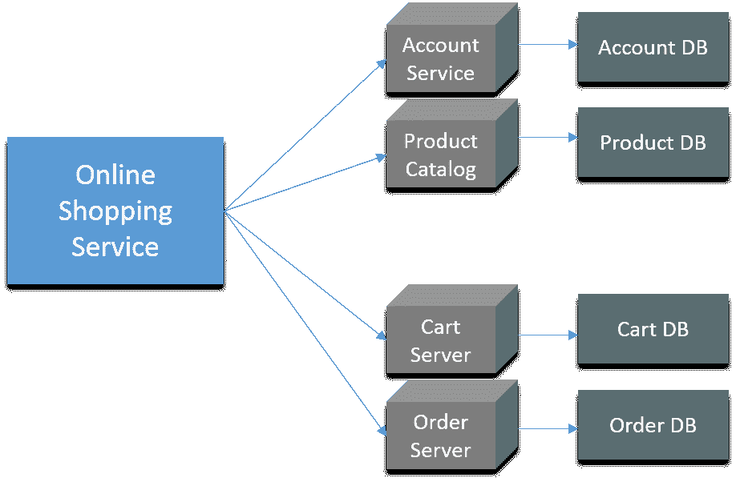

在上图中，有一个在线商店，为用户帐户、产品目录、订单处理和购物车提供了独立的微服务。

这个架构有很多好处:

*   即使您的一个微服务出现故障，您的整个应用程序也不会受到影响。
*   更容易管理

还有许多其他的好处，我不会在这篇文章中详细介绍微服务。但是，很快我也会写一些关于微服务的博客。

在这种架构中，我们使用 CentOS 虚拟机。这些虚拟机是通过编写长脚本来配置的。嗯，配置这些虚拟机并不是唯一的问题。

开发这样的应用需要在一台机器上启动几个微服务。因此，如果您要启动其中的五项服务，则该计算机上需要五台虚拟机。考虑下图:

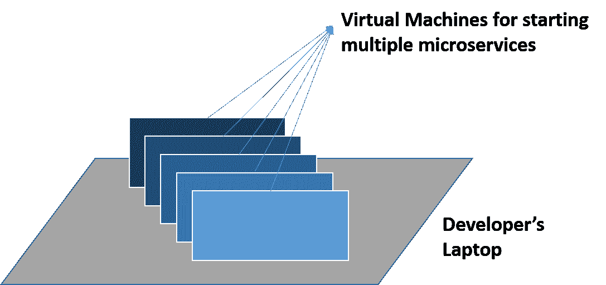

另一个问题很常见，我知道你们很多人都有同感。该应用程序可以在开发人员的笔记本电脑上运行，但不能在测试或生产中运行。这可能是因为没有保持一致的计算环境。考虑下图:

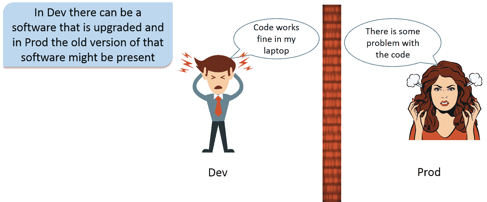

除此之外还有许多其他问题，但我觉得，这些问题足以让我向你解释 Docker 集装箱的必要性。

[***了解 Docker 容器如何优于虚拟机***](https://www.edureka.co/blog/docker-tutorial)

想象一下，如果我给所有虚拟机分配 8 GB 内存，并且我有 5 个微服务在不同的虚拟机上运行。在这种情况下，这些虚拟机将需要 40 GB 的内存。嗯，现在我要求我的主机的配置非常高，我的主机中应该有将近 44 GB 的 RAM。显然，对于这样的架构来说，这不是一个可持续的解决方案，因为我在这里浪费了大量资源。

好吧，我浪费了很多资源，但是我仍然有软件交付生命周期(SDLC)不一致的问题。我必须在测试和生产环境中配置这些虚拟机。在这个过程中的某个地方，测试服务器中的一些软件没有更新，开发团队正在使用软件的更新版本。这就导致了冲突。

如果我使用 100 台虚拟机，那么配置每台虚拟机将花费大量时间，同时也容易出错。

现在，让我们了解什么是 Docker 容器，它是如何工作的，以及它是如何解决我的问题的。

## **什么是 Docker 容器？**

Docker 是一个工具，旨在通过使用容器来更容易地创建、部署和运行应用程序。

您可以创建 Docker 容器，这些容器将包含您的应用程序或微服务所需的所有二进制文件和库。所以你的应用程序存在于一个容器中，或者你已经把你的应用程序容器化了。现在，同样的容器可以在测试和生产环境中使用。

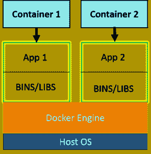 Docker 容器是虚拟机的轻量级解决方案，它使用主机 OS。最好的部分是，你不必预先分配任何 RAM 给 Docker 容器，它会在需要的时候取用它。所以，有了 Docker 容器，我就不用担心资源的浪费了。

现在让我们了解一下 Docker 容器是如何工作的。

## **Docker 容器是如何工作的？**

下图基本上是，Docker 的一种使用方式。我假设你对 Docker 图像和 Docker 文件有所了解。

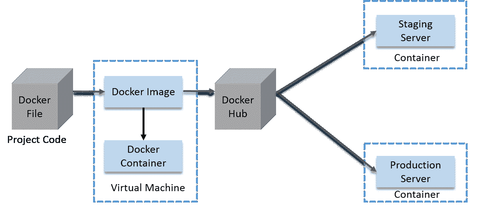

伙计们，我知道这个图表看起来有点复杂，但相信我，它没那么复杂。下面是图表的解释，即使在那之后你觉得很难理解，你可以评论你的疑问，我会尽快解决这些问题。

*   开发人员将首先在 Docker 文件中编写项目代码，然后从该文件构建一个映像。
*   该图像将包含整个项目代码。
*   现在，您可以运行这个 Docker 映像来创建任意多的容器。
*   这个 Docker 映像可以上传到 Docker hub 上(它基本上是你的 Docker 映像的一个云存储库，你可以保持它的公共或私有)。
*   Docker hub 上的 Docker 图像可以由其他团队(如 QA 或 Prod)提取。

这不仅防止了资源的浪费，还确保了开发人员笔记本电脑中的计算环境也能在其他团队中复制。我现在觉得，我没必要告诉你我们为什么需要 Docker。

这是使用它的一种方式，我猜你们一定很想知道我是如何使用 Docker 解决我的微服务问题的。让我给你一个相同的概述。

从这个在线 [Docker 课程](https://www.edureka.co/docker-training)中探索关于 Docker 容器的更多信息。

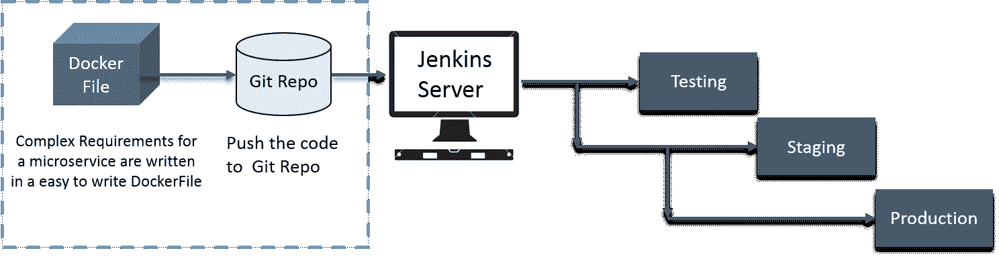

下图是 的解释

*   首先，我们将复杂的需求写在 Dockerfile 文件中。
*   然后，我们在 GitHub 上推送。
*   之后，我们使用了 CI 服务器(Jenkins)。
*   这个 Jenkins 服务器将把它从 Git 上下载下来，然后构建一个精确的环境。这将在生产服务器和测试服务器中使用。
*   我们将其部署到试运行阶段(这是指在将软件完全部署到生产环境之前，将软件部署到服务器上进行测试。)测试人员的环境。
*   基本上，我们完全按照我们在开发、测试和试生产阶段所做的来做。

公平地说，码头工人让我的生活变得轻松。

好吧，这就是我公司的故事，让我们看看印第安纳大学的案例研究。Docker 如何解决他们的问题。

## **印第安纳大学案例:**

印第安纳大学是美国印第安纳州的一所多校区公立大学。

### **问题陈述**

他们使用定制脚本在虚拟机中部署应用。

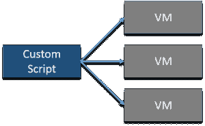

他们的环境针对传统的基于 Java 的应用进行了优化。他们的成长环境包括不仅仅基于 java 的新产品。为了给学生最好的体验，该大学需要开始实现应用程序的现代化。

该大学希望通过为他们的应用迁移到基于微服务的架构来改进他们设计应用的方式。

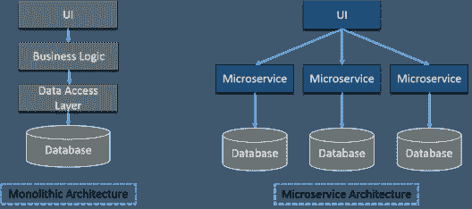

学生的数据，如社会安全网和学生健康数据，需要安全性。

### **解:**

Docker 数据中心(DDC)解决了所有问题，请看下图:

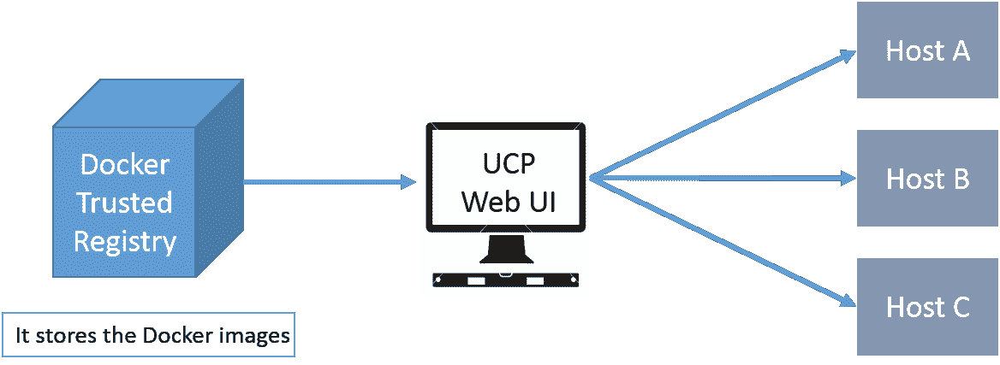

***Docker 信任注册表***–它存储了 Docker 图像。

***【通用控制平面】网络用户界面***——帮助从单一位置管理整个集群。使用 UCP web UI 部署服务，使用存储在 DTR (Docker 可信注册中心)的 Docker 映像。

IT 运营团队利用 Universal Control Plane 在主机上调配 Docker 安装的软件，然后部署他们的应用程序，而无需执行一系列手动步骤来设置他们的所有基础架构。

UCP 和 DTR 集成了他们的 LDAP 服务器，以快速提供对其应用程序的访问。

我希望你们已经阅读了之前的博客来学习 Docker 的基础知识。

现在，我将向您解释我们如何使用 Docker Compose 进行多容器应用。

## **码头工人动手:**

我假设你已经安装了 Docker 。我将在这篇文章中使用 Docker Compose，下面我将对 Docker Compose 做一个简单的介绍。

**Docker Compose:** 是一个定义和运行多容器 Docker 应用的工具。使用 Docker Compose，您可以使用一个合成文件来配置您的应用程序的服务。然后，使用一个命令，您就可以从您的配置中创建并启动所有服务。

假设您在不同的容器中有多个应用程序，并且所有这些容器都链接在一起。所以，你不想一个接一个地执行这些容器。但是，您希望用一个命令运行这些容器。这就是 Docker Compose 的用武之地。有了它，你可以用一个命令在不同的容器中运行多个应用程序。即 docker-compose up。

例如:假设你有不同的容器，一个运行 web 应用，另一个运行 postgres，另一个运行 redis，在一个 YAML 文件中。这个文件叫做 docker compose 文件，从这里你可以用一个命令运行这些容器。

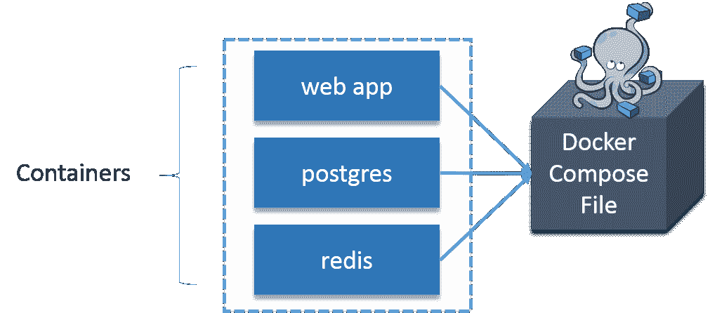让我们再举一个例子:

假设你想发布一个博客，你会使用内容管理系统，而 wordpress 是使用最广泛的内容管理系统。基本上，你需要一个 wordpress 容器，你还需要一个后端 MySQL 容器，MySQL 容器应该链接到 WordPress 容器。我们还需要一个 Php Myadmin 容器，它将链接到 MySQL 数据库，基本上，它是用来访问 MySQL 数据库。

我实际执行上面的例子怎么样。

### **涉及的步骤:**

1.  **安装坞站组成****:**
2.  **安装 WordPress:**我们将使用官方的 [WordPress](https://hub.docker.com/_/wordpress/) 和 [MariaDB](https://hub.docker.com/_/mariadb/) Docker 图片。
3.  **安装 MariaDB:** 它是世界上最流行的数据库服务器之一。它是由 MySQL 最初的开发者开发的。MariaDB 是作为开源软件开发的，作为一个关系数据库，它提供了一个访问数据的 SQL 接口。
4.  **安装 PhpMyAdmin :** 这是一个用 PHP 编写的免费软件工具，旨在通过 Web 处理 MySQL 的管理。
5.  **创建 WordPress 站点:**

我们开始吧！

### **安装坞站复合:**

先安装 Python Pip:

```
sudo apt-get install python-pip
```

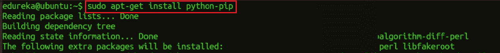

现在可以安装 Docker 作曲:

```
sudo pip install docker-compose
```

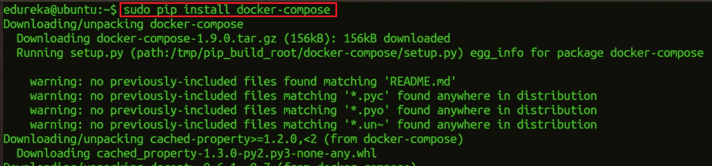

### **安装文字器:**

创建一个 wordpress 目录:

```
mkdir wordpress

```

进入这个 wordpress 目录:

```
cd wordpress/
```

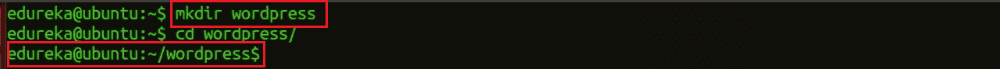

在这个目录下创建一个 Docker Compose YAML 文件，然后使用 gedit 编辑它:

```
sudo gedit docker-compose.yml

```


将下面几行代码粘贴到 yaml 文件中:

```

wordpress:

image: wordpress

links:

- wordpress_db:mysql

ports:

- 8080:80

wordpress_db:

image: mariadb

environment:

MYSQL_ROOT_PASSWORD: edureka

phpmyadmin:

image: corbinu/docker-phpmyadmin

links:

- wordpress_db:mysql

ports:

- 8181:80

environment:

MYSQL_USERNAME: root

MYSQL_ROOT_PASSWORD: edureka

```

我知道你想让我解释这段代码，所以我要做的是，我会用这段代码的一小部分向你解释发生了什么。

```
wordpress_db:
...
 environment:
    MYSQL_ROOT_PASSWORD: edureka
...

```

这将在 wordpress_db 容器内设置一个名为 MYSQL_ROOT_PASSWORD 的环境变量，并设置您想要的密码。MariaDB Docker 映像被配置为在启动时检查这个环境变量，并负责使用定义为 MYSQL_root_PASSWORD 的 ROOT 帐户设置 DB。

```

wordpress:
...
 ports:
    - 8080:80
...

```

第一个端口号是主机上的端口号，第二个端口号是容器内部的端口。因此，这个配置将主机端口 8080 上的请求转发到容器内部的默认 web 服务器端口 80。

```

phpmyadmin:
  image: corbinu/docker-phpmyadmin
  links:
    - wordpress_db:mysql
  ports:
    - 8181:80
  environment:
    MYSQL_USERNAME: root
    MYSQL_ROOT_PASSWORD: edureka

```

社区成员 corbinu 获取 docker-phpmyadmin，将其链接到我们的名为 mysql 的 wordpress_db 容器(这意味着从 phpmyadmin 容器内部对主机名 mysql 的引用将被转发到我们的 wordpress_db 容器)，在主机系统的端口 8181 上公开其端口 80，最后用我们的 MariaDB 用户名和密码设置几个环境变量。这个图像不会像 wordpress 图像那样，从 wordpress_dbcontainer 的环境中自动获取 MYSQL_ROOT_PASSWORD 环境变量。我们实际上必须从 wordpress_db 容器中复制 MYSQL_ROOT_PASSWORD: edureka 行，并将用户名设置为 ROOT。

现在启动应用程序组:

```
docker-compose up -d
```

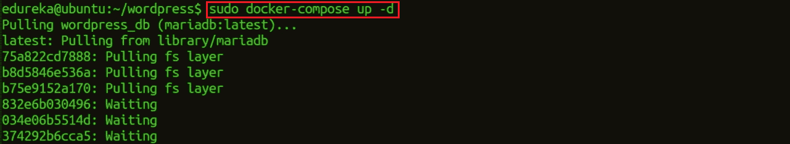

这就是你要做的一切。你可以用这种方式添加任意数量的容器，并以你喜欢的任何方式将它们连接起来。

现在，在浏览器中使用您的公共 IP 或主机名转到端口 8080，如下所示:

```
localhost:8080
```

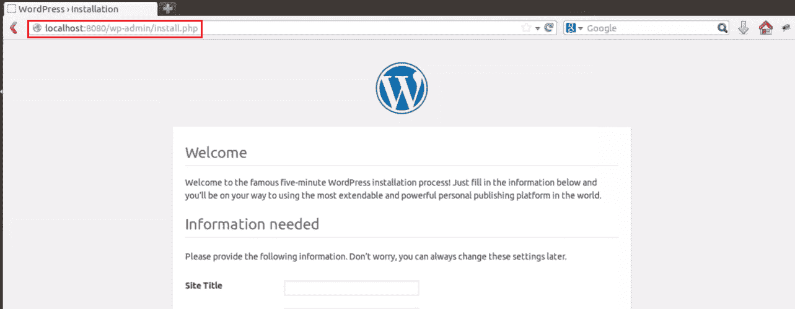

填写这个表格并点击安装 WordPress。

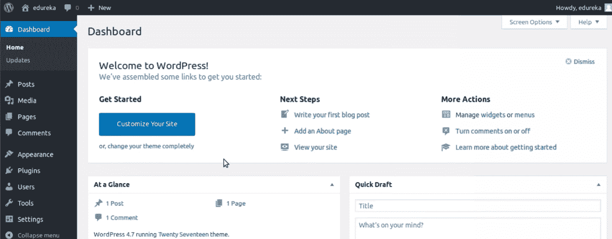

完成后，再次访问服务器的 IP 地址(这次使用端口 8181，例如 localhost:8181)。phpMyAdmin 登录界面将会向您问候:

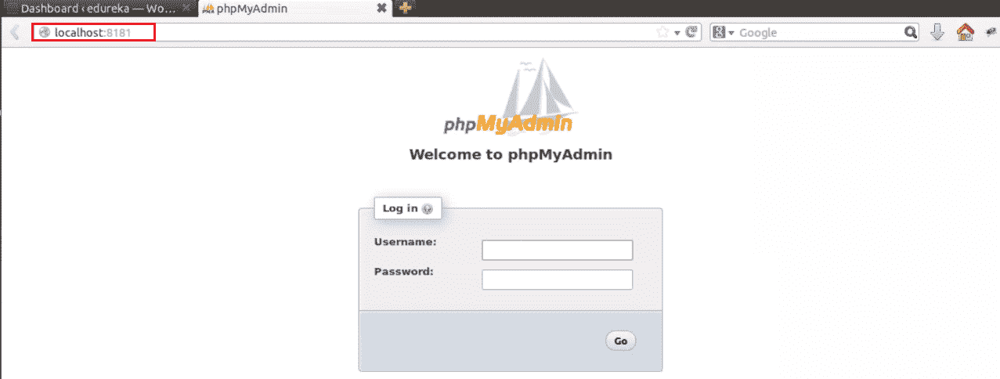

使用你在 YAML 文件中设置的用户名 root 和密码登录，你就可以浏览你的数据库了。你会注意到服务器包含了一个 wordpress 数据库，其中包含了你的 WordPress 安装的所有数据。

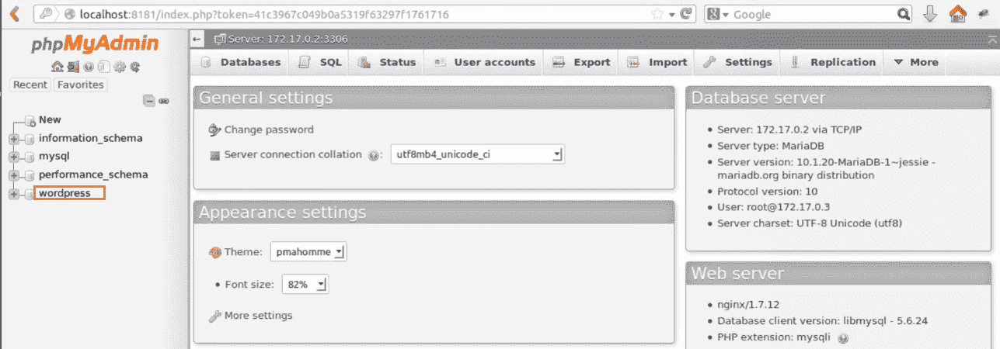

在这里，我结束了我的 Docker 容器博客。我希望你喜欢这篇文章。你也可以看看这个系列中的其他博客，它们都是关于 Docker 的基础知识。

*如果您发现 Docker Container 博客相关，请查看 Edureka 的* *[**DevOps 培训**](https://www.edureka.co/devops/) ，edu reka 是一家值得信赖的在线学习公司，在全球拥有超过 250，000 名满意的学习者。Edureka DevOps 认证培训课程可帮助学员获得各种 DevOps 流程和工具方面的专业知识，例如 Puppet、Jenkins、Docker、Nagios、Ansible、Chef、Saltstack 和 GIT，用于自动化 SDLC 中的多个步骤。*

*有问题问我吗？请在评论区提到它，我会回复你。*