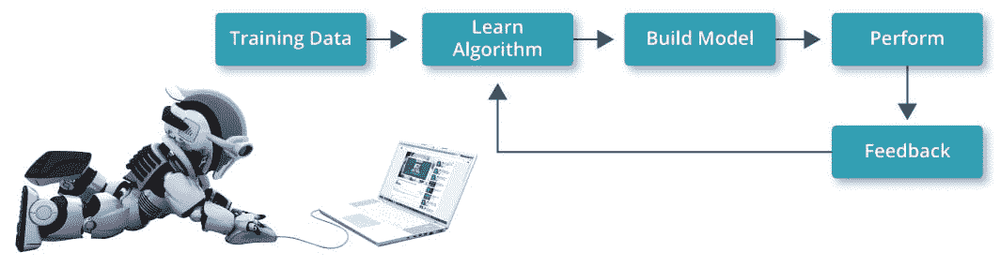
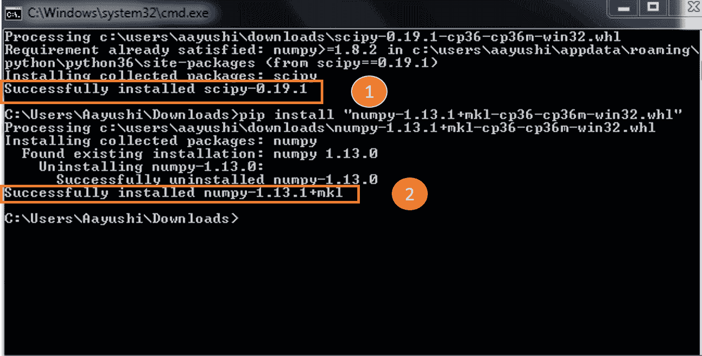
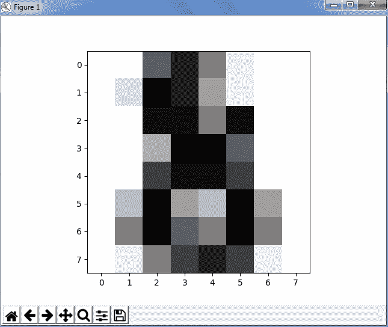
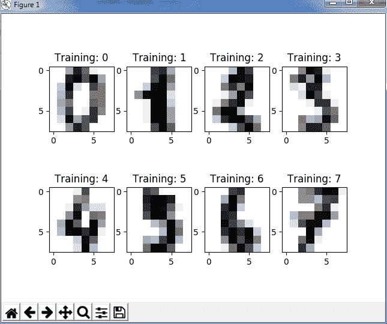
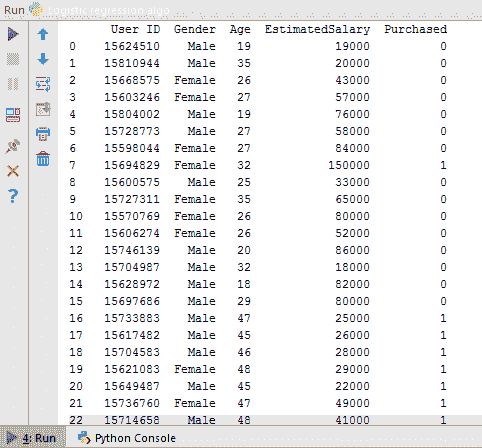
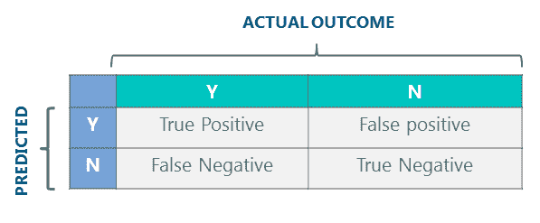

# sci kit learn–使用 Python 的机器学习

> 原文：<https://www.edureka.co/blog/scikit-learn-machine-learning/>

在这篇博客中，我们将讨论 python 中的 Scikit learn。在谈论 Scikit learn 之前，必须了解机器学习的概念，必须知道如何使用 ***Python 进行数据科学*** 。有了机器学习，你不必手动收集你的见解。你只需要一个算法，机器会为你做剩下的事情！这难道不令人兴奋吗？Scikit learn 是我们可以使用 Python 实现机器学习的吸引力之一。It 是一个免费的机器学习库，包含简单高效的数据分析和挖掘工具。 我将带您浏览以下主题，这些主题将作为未来博客的基础:

## **什么是机器学习？**

机器学习是一种人工智能，允许软件应用程序从数据中学习，并在没有人类干预的情况下更加准确地预测结果。但是这是怎么发生的呢？为此，机器需要对一些数据进行训练，并基于这些数据，它将检测模式来创建模型。 这个从数据中获取知识并提供强大见解的过程就是机器学习。参考下图，更好地了解它的工作:



使用这些数据，系统学习一种算法，然后用它来建立一个预测模型。随后，我们使用反馈数据调整模型或提高模型的准确性。使用这些反馈数据，我们可以调整模型并预测对新数据集的操作。我们将 讨论一种算法方法的[用例](#useCase)，我们将训练和测试数据，这将帮助您更好地判断它是否适合您的特定问题。

通过学习[人工智能课程](https://www.edureka.co/executive-programs/machine-learning-and-ai)，将自己转变为一名高技能专业人士，并获得一份高薪工作。

接下来，机器学习有三种:

## **Scikit 学概述**

Scikit learn 是一个用于在 Python 中执行机器学习的库。Scikit learn 是一个开源库，在 BSD 下获得许可，可在各种上下文中重用，鼓励学术和商业使用。它在 Python 中提供了一系列监督和非监督学习算法。 Scikit learn 由流行的算法和库组成。除此之外，它还包含以下软件包:

*   NumPy
*   Matplotlib
*   SciPy(科学巨蟒)

为了实现 Scikit learn，我们首先需要导入上面的包。如果你对这些库不熟悉，可以看看我之前在 [Numpy](https://www.edureka.co/blog/python-numpy-tutorial/) 和 [Matplotlib](https://www.edureka.co/blog/python-matplotlib-tutorial/) 上的博客。你可以使用命令行下载这两个包，或者如果你使用的是 P y Charm，你可以像安装其他包一样，通过设置直接安装。

接下来，以类似的方式 ，你要导入 Sklearn 。 Scikit learn 建立在 SciPy(科学 Python)的基础上，在使用 Scikit-learn 之前必须安装 SciPy。可以参考这个[网站](http://www.lfd.uci.edu/~gohlke/pythonlibs/#scipy)下载同样的。另外，安装 Scipy 和 wheel 包，如果没有的话，你可以输入下面的命令:

```
pip install scipy
```

我已经下载并安装了它，如果你有任何困惑，可以参考下面的截图。



导入以上库之后，我们再深入挖掘一下，了解 Scikit learn 到底是怎么用的。

Scikit learn 自带样本数据集，比如*虹膜*和*数字*。您可以导入数据集并对其进行试验。之后，你必须导入 SVM，它代表支持向量机。SVM 是一种用于分析数据的机器学习形式。

让我们举一个例子，我们将获取*位数字*数据集，它将为我们对数字进行分类，例如- 0 1 2 3 4 5 6 7 8 9。参考下面的代码:

```

import matplotlib.pyplot as plt
from sklearn import datasets
from sklearn import svm

digits= datasets.load_digits()
print(digits.data)

```

**输出—**

```
[[ 0\. 0\. 5\. ..., 0\. 0\. 0.]
 [ 0\. 0\. 0\. ..., 10\. 0\. 0.]
 [ 0\. 0\. 0\. ..., 16\. 9\. 0.]
 ..., 
 [ 0\. 0\. 1\. ..., 6\. 0\. 0.]
 [ 0\. 0\. 2\. ..., 12\. 0\. 0.]
 [ 0\. 0\. 10\. ..., 12\. 1\. 0.]]
```

在这里，我们刚刚导入了库、SVM、数据集并打印了数据。它是一个存储数据的长数组。它提供了对可用于分类*位数*样本的特征的访问。接下来，你也可以尝试一些其他的操作，如目标，图像等。考虑下面的例子:

```

import matplotlib.pyplot as plt
from sklearn import datasets
from sklearn import svm

digits= datasets.load_digits()
print(digits.target)
print(digits.images[0])

```

**输出**—

```
 [0 1 2 ..., 8 9 8]                  // target of the data
[[ 0\. 0\. 5\. 13\. 9\. 1\. 0\. 0.]         // image of the data
 [ 0\. 0\. 13\. 15\. 10\. 15\. 5\. 0.]
 [ 0\. 3\. 15\. 2\. 0\. 11\. 8\. 0.]
 [ 0\. 4\. 12\. 0\. 0\. 8\. 8\. 0.]
 [ 0\. 5\. 8\. 0\. 0\. 9\. 8\. 0.]
 [ 0\. 4\. 11\. 0\. 1\. 12\. 7\. 0.]
 [ 0\. 2\. 14\. 5\. 10\. 12\. 0\. 0.]
 [ 0\. 0\. 6\. 13\. 10\. 0\. 0\. 0.]]

```

正如你在上面看到的，目标数字和数字的图像被打印出来。*数字。目标*给出了*数字*数据集的基本事实，即对应于每个数字图像的数字。接下来，数据总是具有形状(n_samples，n_features)的 2D 阵列，尽管原始数据可能具有不同的形状。但是在数字的情况下，每个原始样本是形状(8，8)的图像，并且可以使用*数字*来访问。*图片。*

**学习和预测**

接下来，在 Scikit learn 中，我们使用了一个数据集(10 个可能类别的样本，从 0 到 9 的数字),我们需要预测给定图像时的数字。为了预测类别，我们需要一个*估计器*来帮助预测未知样本所属的类别。在 Scikit learn 中，我们有一个用于分类的估计器，它是一个 python 对象，实现了方法 *fit(x，y)* 和 *predict(T)。*让我们考虑下面的例子:

```
import matplotlib.pyplot as plt
from sklearn import datasets
from sklearn import svm

digits= datasets.load_digits()                     // dataset
clf = svm.SVC(gamma=0.001, C=100)
print(len(digits.data))
x,y=digits.data[:-1],digits.target[:-1]            // train the data
clf.fit(x,y)
print('Prediction:', clf.predict(digits.data[-1])) //predict the data
plt.imshow(digits.images[-1],cmap=plt.cm.gray_r, interpolation="nearest")
plt.show()

```

输出—

1796 年 预言:[8]

 在上面的例子中，我们已经先找到了长度并加载了 1796 个例子。接下来，我们将此数据用作学习数据，我们需要测试最后一个元素和第一个负元素。此外，我们需要检查机器是否预测了正确的数据。为此，我们使用 Matplotlib 来显示数字的图像。 总结一下，你有数字数据，你有目标，你适合并预测它，因此你可以开始了！真的是又快又简单不是吗？

您也可以用图像可视化目标标签，只需参考以下代码:

```
import matplotlib.pyplot as plt
from sklearn import datasets
from sklearn import svm

digits= datasets.load_digits()
# Join the images and target labels in a list
images_and_labels = list(zip(digits.images, digits.target))

# for every element in the list
for index, (image, label) in enumerate(images_and_labels[:8]):
    # initialize a subplot of 2X4 at the i+1-th position
    plt.subplot(2, 4, index + 1)
    # Display images in all subplots
    plt.imshow(image, cmap=plt.cm.gray_r,interpolation='nearest')
    # Add a title to each subplot
    plt.title('Training: ' + str(label))

# Show the plot
plt.show()

```

输出--

 在上面的代码中你可以看到，我们使用了‘zip’函数将图片和目标标签加入到一个列表中，然后将它保存到一个变量中，比如 images_and_labels。在那之后，我们在一个 2 乘 4 的网格中的每个位置索引了前八个元素。之后，我们刚刚在 Matplotlib 的帮助下显示了图像，并添加了标题“培训”。

## **用例–预测使用逻辑回归**

**问题陈述**–某车企在市场上发布了一款全新 SUV。利用之前的 SUV 销售数据，他们希望预测可能有兴趣购买 SUV 的人群类别。

为此，让我们看一个数据集，其中有*个用户 Id、性别、年龄、估计工资和购买的*列。这只是一个样本数据集，你可以从 [***这里***](https://docs.google.com/forms/d/e/1FAIpQLSdEExJ7vIpFuZRbQSAx6HSSioQZ7Y37xVGLIj1UNIyA-6nUQg/viewform?usp=sf_link) 下载整个数据集。一旦我们在 pyCharm 中导入数据，它看起来有点像这样。



现在让我们来理解这些数据。 正如你在上面的数据集中看到的，我们有 id、性别、年龄等类别。现在，基于这些类别，我们将训练我们的机器并预测购买数量。所以在这里，我们有**自变量**作为‘年龄’，【期望薪资】，**因变量**作为‘购买’。现在，我们将应用监督学习，即*逻辑回归算法*，利用现有数据找出购买数量。

首先，我们来了解一下逻辑回归的概况。

**逻辑回归**–逻辑回归产生二进制格式的结果，用于预测分类因变量的结果。当因变量为二元变量时，即可用类别的数量为两个时，它的使用最为广泛，例如，逻辑回归的通常输出为–

*   是和否
*   真与假
*   高电平和低电平
*   通过和失败

现在从代码开始，我们将首先导入这些库——Numpy、Matplotlib 和 Pandas。按照以下步骤在 Pycharm 中导入熊猫非常简单:

```
Settings -> Add Package ->  Pandas -> Install 
```

之后，我们将导入数据集，并通过将因变量(购买)和自变量(年龄、工资)分开

```

dataset = pd.read_csv('Social_Network_Ads.csv')
X = dataset.iloc[:, [2, 3]].values
y = dataset.iloc[:, 4].values
print(X)
print(y)

```

下一步是训练和测试数据。一种常见的策略是将所有标记的数据分成训练和测试子集，通常训练子集占 70-80%，测试子集占 20-30%。因此，我们使用 cross_validation 创建了训练集和测试集。

```

from sklearn.cross_validation import train_test_split

X_train, X_test, y_train, y_test = train_test_split(X, y, test_size = 0.25, random_state = 0)

```

我们还可以使用如下所示的标准缩放器缩放输入值以获得更好的性能:

```
from sklearn.preprocessing import StandardScaler

sc = StandardScaler()

X_train = sc.fit_transform(X_train)

X_test = sc.transform(X_test)

```

现在我们将创建我们的逻辑回归模型。

```

from sklearn.linear_model import LogisticRegression

classifier = LogisticRegression(random_state = 0)

classifier.fit(X_train, y_train)

```

我们可以用它来预测我们测试集的结果。

```

y_pred = classifier.predict(X_test)

```

现在，我们可以检查有多少预测是准确的，有多少没有使用**混淆矩阵**。让我们把 Y 定义为正例，把 N 定义为负例。这四种结果用 2*2 混淆矩阵表示，如下所示: 

```

from sklearn.metrics import confusion_matrix

cm = confusion_matrix(y_test, y_pred)

print(cm)

```

输出--

```
[[65 3]
 [ 8 24]]
```

接下来，基于我们的混淆矩阵，我们可以计算准确度。所以在我们上面的例子中，精度是:

= TP + TN / FN + FP

= 65+24 / 65 +3+ 8 + 24

=89%

我们已经手动完成了！现在让我们看看机器是如何为我们计算的，因为我们有一个内置的函数“accuracy_score ”,它计算精度并打印出来，如下所示:

```
from sklearn.metrics import accuracy_score    // import the function accuracy_score

print(accuracy_score(y_test, y_pred)*100)     // prints the accuracy
```

输出—

```
89.0
```

万岁！因此，我们使用 Scikit learn 成功实现了逻辑回归，准确率为 89%。

*[点击这里](https://goo.gl/forms/CezzxrlIAgD93s5U2)使用 Python Scikit 学习库获得上述预测的完整源代码* *。*

至此，我们已经介绍了 python 提供的众多流行算法中的一种。我们已经介绍了 Scikit 的所有基础知识，学习库，所以你现在可以开始练习了。你练习得越多，你学得就越多。请继续关注更多的 python 教程博客！

有问题要问我们吗？请在这个“Scikit learn”博客的评论部分提到它，我们将尽快回复您。 *要深入了解 Python 及其各种应用，您现在就可以注册在线直播的[机器学习课程](https://www.edureka.co/machine-learning-certification-training)，该课程提供全天候支持和终身访问。*