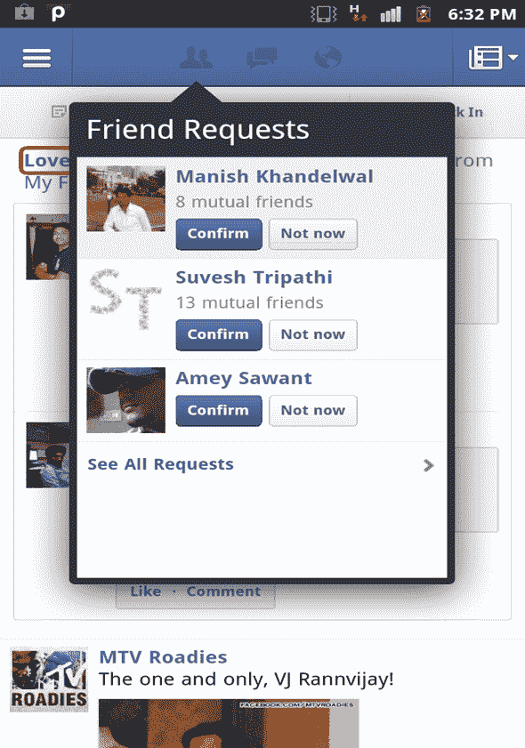
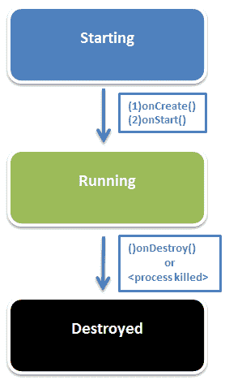
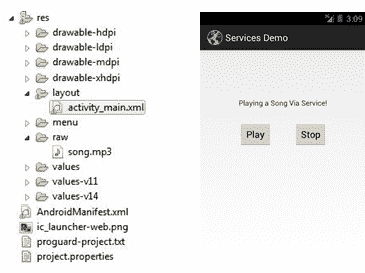

# Android 初学者教程第 3 部分:Android 服务

> 原文：<https://www.edureka.co/blog/android-tutorials-beginners-service-component/>

这篇文章是我们的 Android 初学者系列教程的第三篇，详细讨论了 Android 的服务组件。在我们之前的 Android 教程中，我们讨论了活动和意图；如果你错过了，请在这里阅读:

[Android 初学者教程第一部分:活动](https://edureka.co/blog/android-tutorials-for-beginners-activity-component/ "Android Tutorials: Activity")

[Android 初学者教程第二部分:意图](https://edureka.co/blog/android-tutorials-intent-component/ "Android Tutorials: Intent")

### Android 初学者教程:Android 服务

#### **Android 系统中有哪些服务？**

**1)** **匿名组件:**Android 系统后台运行的**组件**为服务组件。它们非常像活动，只是没有用户界面。

**2)** **处理长时间运行的后台任务:**它们执行应用程序所需的长时间运行的任务(无需用户干预)。服务运行不需要用户界面的后台任务。

**3)** **不受活动切换的影响:**每个服务都有特定的工作，如果你在不同的活动之间切换，或者即使你完全切换到不同的应用程序，它们也会继续工作。

**4)** 它还可以向其他应用程序提供**功能**。

服务的例子:一个很好的例子就是你的音乐播放器。

当您使用播放列表在 Android 手机上播放音乐时，音乐播放器会自动完成工作，无需用户干预。您不必在每首歌曲结束时都更换歌曲。这种自动化是由于 Android 的服务组件。

***我们在后面的文章中已经详细讨论了音乐播放器的例子。坚持读下去才有意义！:)***

[https://www.youtube.com/embed/mGQmPomG_-k?version=3&rel=1&fs=1&autohide=2&showsearch=0&showinfo=1&iv_load_policy=1&wmode=transparent](https://www.youtube.com/embed/mGQmPomG_-k?version=3&rel=1&fs=1&autohide=2&showsearch=0&showinfo=1&iv_load_policy=1&wmode=transparent)

观看此视频，了解服务概述。

#### **脸书应用中的服务组件**

再来说说脸书应用，各种好友动态和好友通知等等。都是服务的例子。**新好友邀请总是在后台更新，无论你是否与之互动。**

#### **服务生命周期**

现在让我们来讨论服务生命周期。因为服务缺少用户界面，所以它总是在后台运行(与活动不同)。因此，其生命阶段与活动的生命周期略有不同。您应该记得，当活动可见但用户没有与之交互时，它处于暂停状态。

*由于**服务总是在后台运行，无论用户正在与哪个活动交互，暂停状态是不可能的。***

因此，服务具有以下阶段:

*   开始
*   运转
*   破坏

#### **服务形式**

服务可以有两种形式:

**1)** **已启动/未绑定:**在这种情况下，一个应用程序组件启动服务，它将**继续在后台运行，即使启动它的原始组件被销毁**。例如，当启动时，一项服务会无限期地在后台继续播放音乐。

**2)** **绑定:**一个 Android 组件可以使用 bindservice()将自己绑定到一个服务。一个绑定的服务将**运行，只要其他应用程序组件绑定到它**。一旦它们解除绑定，服务就会自我毁灭。

未绑定的活动无限期运行，而绑定活动的生命周期取决于绑定到它的应用程序组件。

#### **后台运行的服务何时被销毁？**

尽管(根据定义)服务应该无限期地执行长时间运行的操作，但如果它们在后台运行，它们注定最终会被 Android 系统杀死。

***事情是这样的:***

#### **1)** **当一个服务启动时，它在主进程中运行:**

服务在创建时不会为自己创建单独的线程/进程(除非被指示这样做)；相反，它运行在正在运行的应用程序的主线程中，从而消耗主系统的内存资源。

#### **2)** **系统内存低怎么办？**

系统会选择关闭低优先级但仍在消耗系统资源的组件。因此，**不在用户焦点中的背景组件是系统首先杀死的**。因此，**会破坏后台运行的服务。**这是为了释放系统资源给更重要的组件*(例如:前台与用户交互的活动)。*

#### **3)** **系统在杀死服务释放资源时是否遵循某种模式？**

是的，它是！请继续阅读，寻找答案:

**a)** **未绑定服务:**随着时间的推移，系统会将一个长时间运行的服务下推到后台任务列表中的较低优先级，当内存不足时，这个服务更有可能首先关闭(如果未绑定)。

**b)** **绑定到前台活动的服务:**绑定到前台运行的活动或任何其他应用程序组件的服务比未绑定的活动更不容易被杀死。

**c)** **前台服务:**如果一个服务被声明为 ***在前台*** 运行，系统绝不会杀死它。我们将在以后的 Android 教程中对此进行更多的讨论。待在原地！

#### **4)** **如何让一个服务不被杀死？**

a)您可以**创建单独的线程**,同时为要运行的服务创建服务。因此，减少了主应用存储器的消耗，并且服务由于存储器不足而被破坏的可能性比其他情况低。

b)如前所述，您可以**声明一个在前台**运行的服务。这可以防止系统终止服务。

#### **Android 教程:服务示例**

由于这是一个初学者的 Android 教程，我们使用了一个服务的最基本的例子，即音乐播放器。

***下面是使用服务播放和停止歌曲的代码和快照:***

遵循本 Android 教程中描述的步骤:

**步骤 1:** 创建一个**新的 Android 项目，类名为 MainActivity** 。

**第二步:**在布局中添加两个按钮，命名为**播放和停止**。

**第三步:** **在 MainActivity 中设置两个按钮**的 onClick 监听器。

**第四步:** **创建一个新类**“my Service”并将其扩展为服务类

**第五步:**在【res】目录下新建一个**文件夹，命名为“raw”，在里面复制一首歌。**

要添加到清单中的标记:

<服务

安卓:名称 = *”。my service "*

安卓:启用 = *【真】* >

</服务>

#### **代号:MainActivity.java**

**公共** **类** 主活动 **扩展** 活动{

@覆盖

**受保护** **无效**onCreate(Bundle savedInstanceState){

**【超级】** 。oncreate(savedinstancestat)：

setContentView(r . layout .*activity _ main*)；

按钮播放，停止；

play =(Button)findViewById(r . id .Button 1T3)；

stop =(Button)findViewById(r . id .Button 2T3)；

play . setonclicklistener(**新建** 视图。OnClickListener() {

@覆盖

**公开** **作废** onClick(查看 v) {

意向服务= **新增** 意向(MainActivity。 **这个** ，MyService。 **类**)；

startService(服务)；

}

});

stop . setonclicklistener(**新建** 视图。OnClickListener() {

@覆盖

**公开** **作废** onClick(查看 v) {

Intent name =**new**Intent(main activity。 **这个** ，MyService。 **类**)；

stopService(名称)；

}

});

}

}

#### **代号:MyService.java**

**公共** **类** MyService **扩展** Service {

media playerMP；

@覆盖

**public**I binder onBind(Intent arg 0){

**返回****null**；

}

@覆盖

**公开** **作废** onCreate() {

**超级** 。onCreate()；

mp = MediaPlayer。*创建* (getApplicationContext()、r . raw .宋)；

}

@覆盖

**public****int**onstart command(意图， **int** 标志，**int**startId){

mp 。start()；

**返回**0；

}

@覆盖

**公开**作废 公开(){

mp 。发布()；

**超级** 。on destroy()；

}

}

我们将在后续的 Android 教程中讨论服务的高级主题(例如， ***如何创建服务组件(启动和绑定)*** )。敬请关注！

**现在，[加入这个直播安卓教程](https://www.edureka.co/android-development-certification-course "Live Android Tutorial")！**

[dl URL = " https://www . edu reka . co/Android-development-certification-course/？"title= "参加免费网络研讨会" desc="" type="" align="" for= "网络研讨会"]

快乐学习！

#### **你可能也会喜欢这些相关的帖子:**

*   [Android 初学者教程第二部分:Android 意图](https://www.edureka.co/blog/android-tutorials-intent-component/ "Android Tutorials for Beginners-2: Android Intent")
*   [Android 初学者教程第 4 部分:内容提供商](https://www.edureka.co/blog/beginner-android-tutorials-content-provider/)
*   应对软件公司第一次校园面试的 12 个技巧
*   [如何在 Android 中创建 Android Widgets:rating bar](https://www.edureka.co/blog/tag/how-to-create-android-widgets/ "How to create Android widgets: RatingBar in Android")