# 什么是 Azure？–微软 Azure 云简介

> 原文：<https://www.edureka.co/blog/what-is-azure/>

你是听到“蔚蓝色的云”这个流行语并来到这里的人吗？不要担心，你已经到达正确的地方。到这个*什么是 Azure* 博客结束时，你将拥有开始使用微软 Azure 的一切。

这是 Azure 教程博客系列的第一篇博客。在这篇博客中，我将讨论以下话题:

1.  [云服务商](#cloud)
2.  [蔚蓝市场份额](#market)
3.  [什么是 Azure？](#what)
4.  [服务领域在蔚蓝](#service)
5.  [建筑应用在蔚蓝](#build)
6.  [如何在 Azure 上报名？](#sign)

## **云服务商**

有些公司提供云服务。这些公司被称为云提供商。在下图中，我们列出了一些顶级的云提供商。AWS 是最大的云提供商，您一定想知道为什么要了解其他云提供商，对吗？

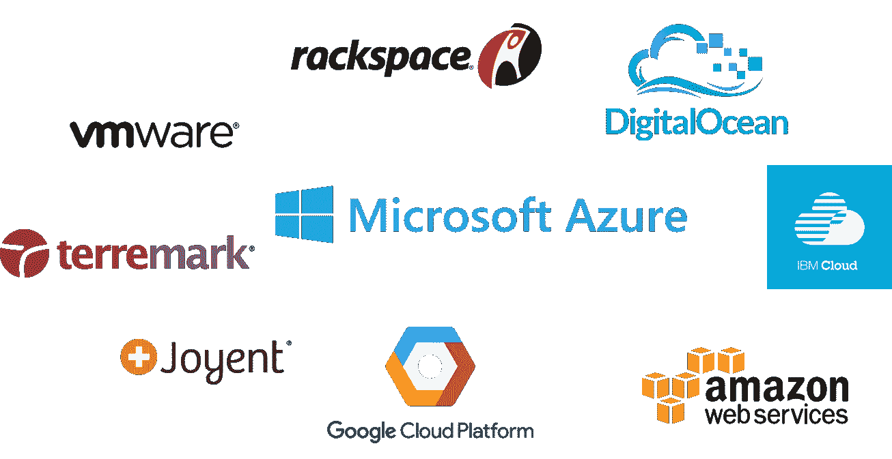

好问题！但是，如果您心爱的 AWS 出现故障怎么办？想过吗？您的业务不能只依赖一种服务。在这种情况下，你需要一个后备人选。因此，也有必要了解其他云提供商。话虽如此，Azure 是第二大云提供商！如果你想超越这个博客&想更详细地了解 Azure——今天就加入我们的 [Azure 培训](https://www.edureka.co/microsoft-certified-azure-solution-architect-certification-training)！

## **蔚蓝市场份额**

下图显示了采用各自的云提供商作为其“主要”IaaS 合作伙伴的公司的百分比。

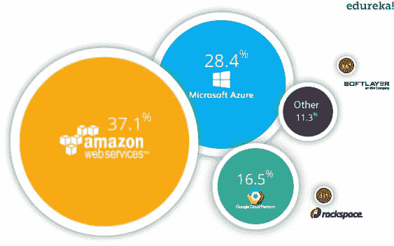

从上图你可以清楚地看到，在 AWS 之后，人们正在采用微软 Azure。

让我们在这个博客中继续前进，了解什么是 Azure。

## **什么是蔚蓝？**

***微软 Azure*** 是由**微软**创建的云计算平台，开发人员和 IT 专业人员通过其全球数据中心网络来构建、部署和管理应用程序。要了解更多，请加入我们的[微软 azure master program](https://www.edureka.co/masters-program/azure-cloud-engineer-certification-training)

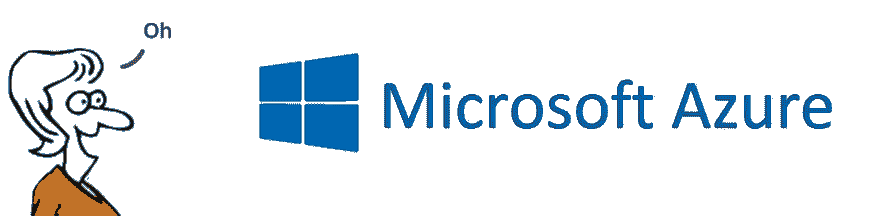

你可能想知道 Azure Dashboard 实际上是什么样子，这里有一个截图:

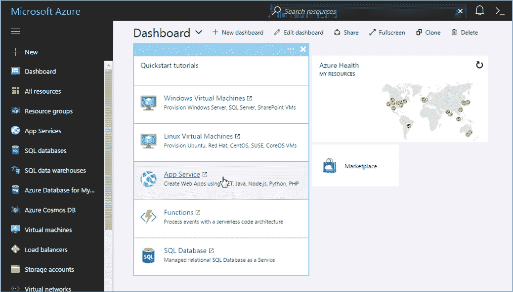

在左侧，列出了所有的资源。这些资源可以大致分为以下几类:

## **Azure 中的服务域**

*   **计算** 它用于通过利用同时服务于多个实例的强大处理器来处理云上的数据。

*   虚拟机
*   虚拟机规模设置
*   天蓝色容器
*   集装箱登记处
*   功能
*   批次
*   服务结构
*   云服务

*   **存储服务** 顾名思义，存储用于在云中存储数据，并且能够根据需要进行扩展。这些数据可以存储在任何地方。
    *   斑点存储
    *   队列存储
    *   文件存储
    *   表格存储

*   **数据库** 数据库域用于提供由 Azure 管理的可靠的关系和非关系数据库实例。
    *   SQL 数据库
    *   文档数据库
    *   再快取

*   **联网** 它包括提供各种联网功能的服务，如安全性、更快的访问速度等。
    *   虚拟网络
    *   负载平衡器
    *   应用网关
    *   Azure DNS
    *   内容传递网络
    *   VPN 网关
    *   交通经理
    *   快速路线

*   **开发人员工具** 它包括提供简化组织编码能力的服务。例如:它简化了团队共享代码、跟踪工作和发布软件。
    *   Visual Studio 团队服务
    *   应用洞察
    *   API 管理

*   **管理和监控工具** 它包括可以用来管理和监控你的 Azure 实例的服务。
    *   微软 Azure 门户网站
    *   Azure 资源管理器
    *   自动化

*   **企业集成** 服务带来无缝集成企业和云等功能。
    *   服务总线
    *   SQL Server 伸展数据库

*   **安全和身份** 它包括用户认证服务或限制对 Azure 资源上某一组受众的访问。
    *   密钥库
    *   Azure 活动目录
    *   Azure AD B2C
    *   Azure 广告域名服务
    *   多因素认证

*   **Web 和移动应用** 这些主要用于为任何平台和任何设备创建 Web 应用或移动应用。
    *   网络应用
    *   手机应用
    *   API 应用
    *   逻辑应用
    *   通知中心
    *   活动中心
    *   Azure 搜索

我已经在我的下一篇博客中详细讨论了所有的服务: **[Azure 教程](https://www.edureka.co/blog/microsoft-azure-tutorial?#services)** 。

## **建筑应用在蔚蓝**

*Sometimes you have to run before you can walk! *

**首先，你应该分析你的申请是关于什么的？它是否需要您担心底层基础架构？是需要数据库的东西吗？这是否需要监控？**

**因此，一旦你知道了应用程序的所有需求，你就可以选择一个域，从而选择一个服务。**

**比如你想在 Azure 上部署一个应用，不需要你操心底层架构，你会选择哪个服务？**

**嗯，在计算部分有一种叫做 Web App 的服务。你只需上传你的应用程序，Azure 会帮你完成剩下的工作。就这么简单！**

**当然，如果你没有使用过这些服务，你是不会知道的，对吗？这就是为什么 Azure 提出了一个惊人的免费层选项。**

****了解我们在顶级城市/国家的 Microsoft Azure 培训****

| **印度** | **美国** | **其他城市/国家** |
| [班加罗尔](https://www.edureka.co/microsoft-certified-azure-solution-architect-certification-training-bangalore) | [纽约](https://www.edureka.co/microsoft-certified-azure-solution-architect-certification-training-new-york-city) | [英国](https://www.edureka.co/microsoft-certified-azure-solution-architect-certification-training-uk) |
| [海德拉巴](https://www.edureka.co/microsoft-certified-azure-solution-architect-certification-training-hyderabad) | [芝加哥](https://www.edureka.co/microsoft-certified-azure-solution-architect-certification-training-chicago) | 伦敦 |
| [德里](https://www.edureka.co/microsoft-certified-azure-solution-architect-certification-training-delhi) | 亚特兰大 | [加拿大](https://www.edureka.co/microsoft-certified-azure-solution-architect-certification-training-canada) |
| [钦奈](https://www.edureka.co/microsoft-certified-azure-solution-architect-certification-training-chennai) | [休斯顿](https://www.edureka.co/microsoft-certified-azure-solution-architect-certification-training-houston) | [多伦多](https://www.edureka.co/microsoft-certified-azure-solution-architect-certification-training-toronto) |
| [孟买](https://www.edureka.co/microsoft-certified-azure-solution-architect-certification-training-mumbai) | 洛杉矶 | [澳大利亚](https://www.edureka.co/microsoft-certified-azure-solution-architect-certification-training-australia) |
| [浦那](https://www.edureka.co/microsoft-certified-azure-solution-architect-certification-training-pune) | [波士顿](https://www.edureka.co/microsoft-certified-azure-solution-architect-certification-training-boston) | 阿联酋 |
| 加尔各答 | [迈阿密](https://www.edureka.co/microsoft-certified-azure-solution-architect-certification-training-miami) | [迪拜](https://www.edureka.co/microsoft-certified-azure-solution-architect-certification-training-dubai) |
| 艾哈迈达巴德 | [旧金山](https://www.edureka.co/microsoft-certified-azure-solution-architect-certification-training-san-francisco) | [菲律宾](https://www.edureka.co/microsoft-certified-azure-solution-architect-certification-training-philippines) |

****谁有资格获得此免费等级？****

**每位客户从他/她在 Azure 上注册时起，都会收到免费层选项，并有资格获得同样的服务。**

**这有什么帮助？**

**您可以尝试在 Azure 上启动一个应用程序并学习！你练习得越多，你就越了解 Azure 是什么。**

**也就是你免费学！免费层包括什么？你可以参考 Azure 教程博客中我们的 [Azure 定价](https://www.edureka.co/blog/microsoft-azure-tutorial?#pricing)部分。**

**如果您是新客户，让我为您设置注册部分，这将为您带来免费积分。**

## ****如何在 Azure 中注册？****

****第一步:**转到这个特定的环节:[https://azure.microsoft.com/en-in/free/](https://azure.microsoft.com/en-in/free/)**

**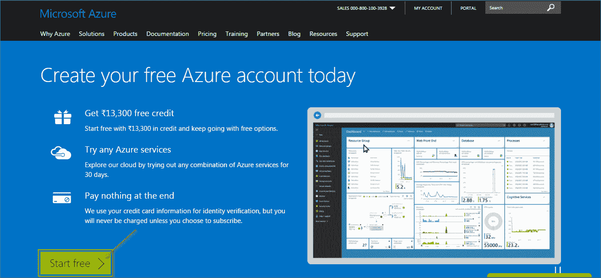**

****第二步:**点击创建新的微软账户。**

**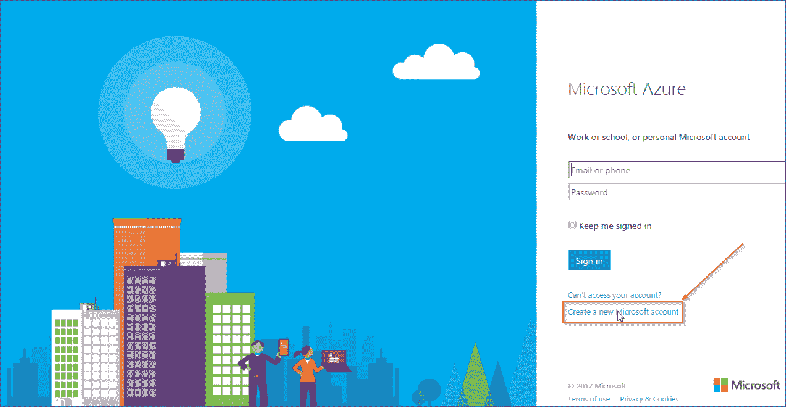**

****第三步:**做以下步骤:**

***   输入您的电子邮件地址*   输入合适的密码*   点击创建账户**

**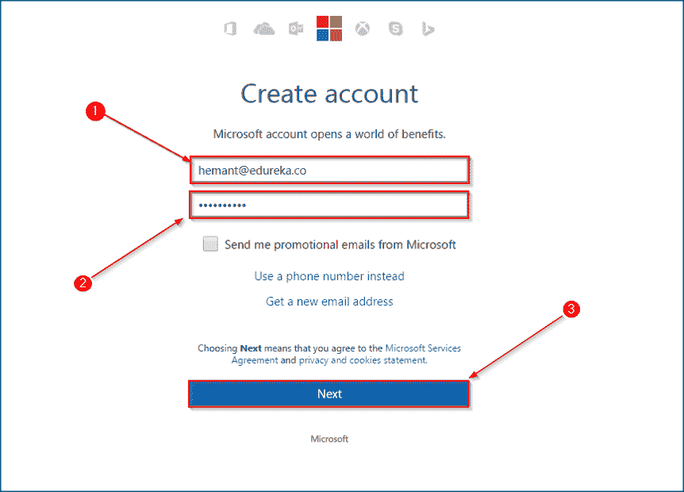**

****第四步:**在下一页，做以下事情:**

***   输入发送到电子邮件地址的验证码*   点击验证**

**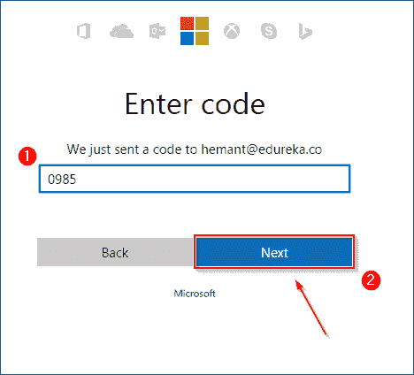**

****第五步:**在下一页，做以下步骤:**

***   输入您的手机号码*   输入您手机上的接入码，至空白 2*   最后，点击下一步**

**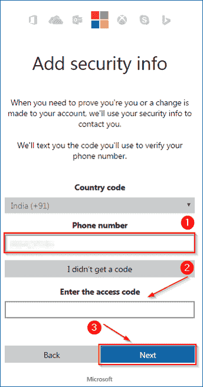**

****第六步:**在下一页，做以下事情:**

***   如你所见，作为新用户，你获得了 13，300 卢比的免费使用积分*   输入你的名字*   您的电子邮件地址*   电话号码*   组织名称*   最后，点击下一步**

**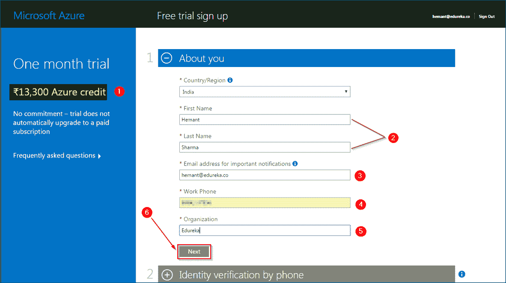**

****第 7 步:**在下一页，您将验证您的手机**

***   输入手机号码*   点击发送短信，或者任何你喜欢的方式。**

**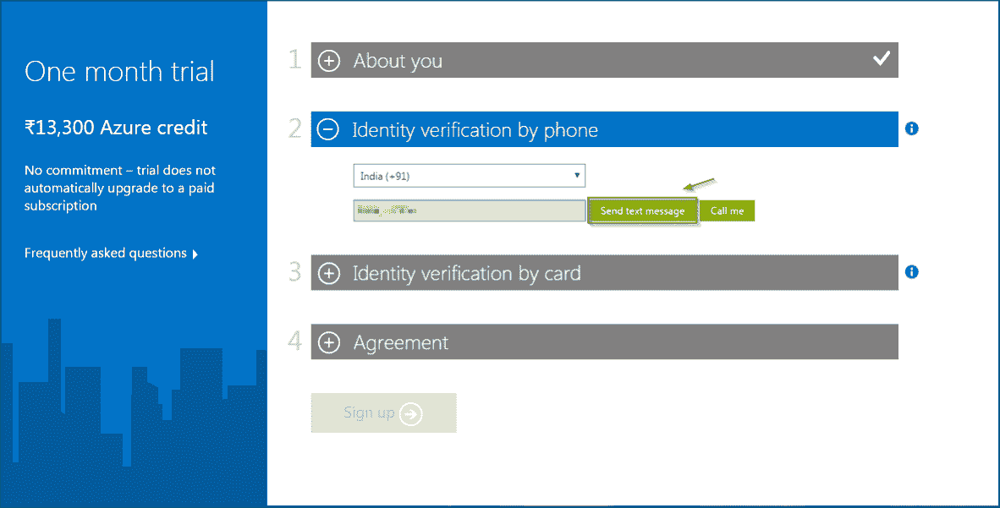**

****第 8 步:**在这个页面上，您将输入您的信用卡详细信息。一旦输入，点击**

**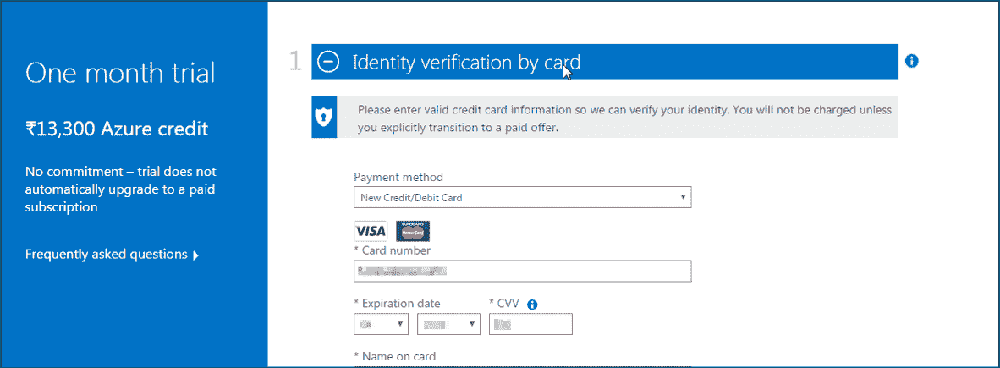**

****第九步:**点击同意条件，最后点击报名。**

**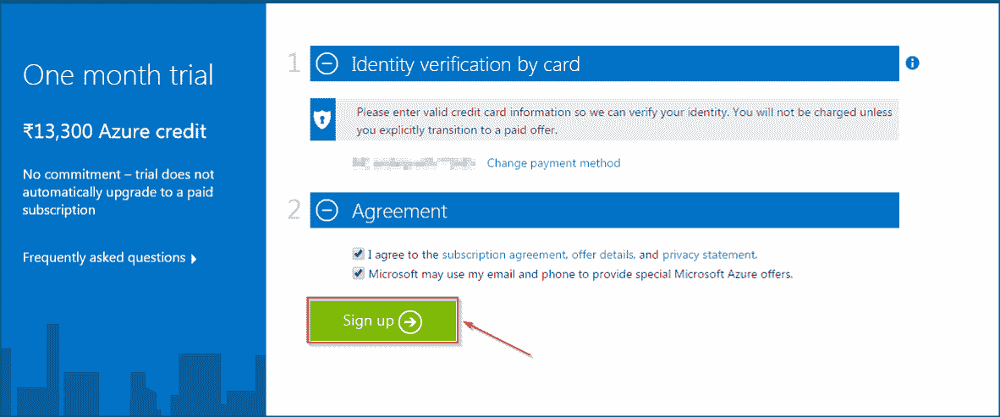**

****第十步:**瞧！你准备好了。点击 Azure 订阅入门。**

**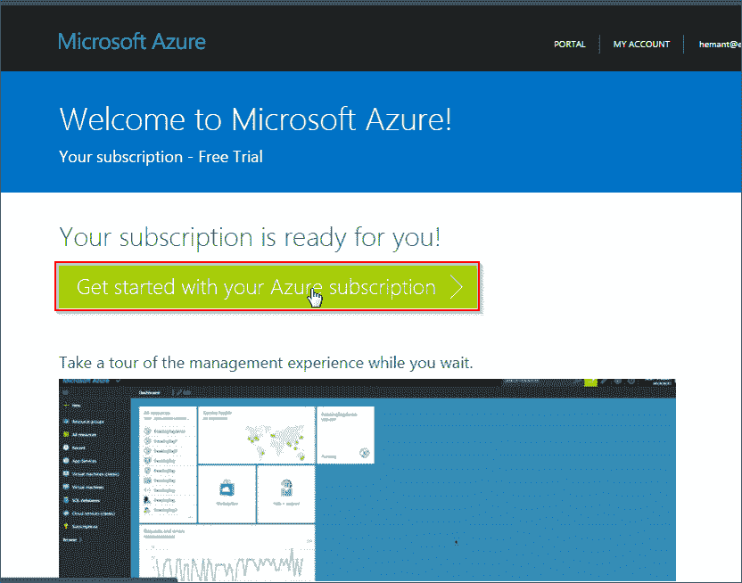**

**给你，你自己的微软仪表板！**

**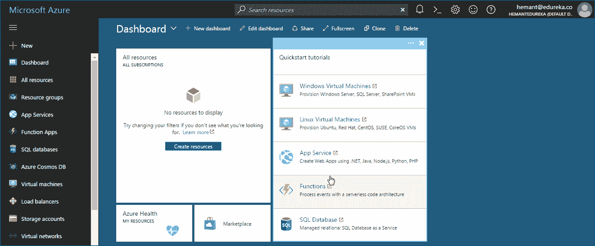**

**这就结束了我们在这个什么是 Azure 博客中的注册过程。注册完成后，你就可以用你的*免费点数*玩 Azure 了。**

**伙计们，就是这样了！我希望你喜欢这个什么是 Azure 博客。如果你正在读这篇文章，那么恭喜你！你不再是 Azure 的新手了！你练习得越多，你学得就越多。为了让您的旅程更轻松，我们推出了这个 **[蔚蓝教程](https://www.edureka.co/blog/microsoft-azure-tutorial)** 博客系列，将会经常更新，敬请关注！**

**我们还设计了一套课程，涵盖了通过 Azure 考试所需的所有内容！你可以在这里看看 *[**蔚蓝** **C** **e** **认证**](https://www.edureka.co/microsoft-certified-azure-solution-architect-certification-training) 培训*的课程详情。快乐学习！**

***有问题吗？请在这个什么是 Azure 博客的评论部分提到它，我们将会回复你或者今天就参加我们在德拉敦的 [Azure 培训。](https://www.edureka.co/microsoft-certified-azure-solution-architect-certification-training-dehradun)***