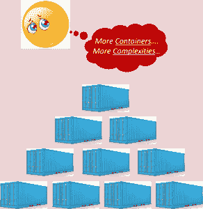
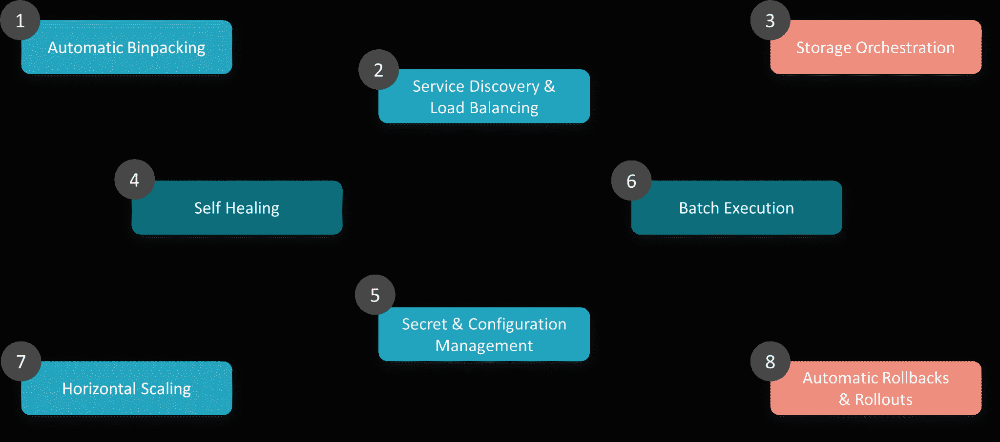
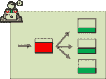
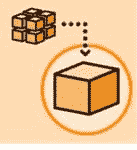
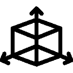
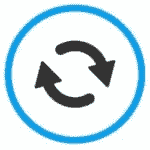
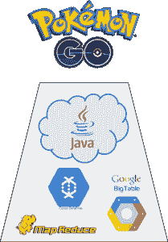
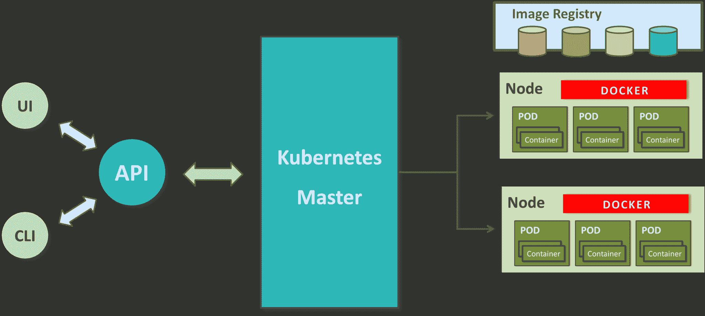

# 什么是 Kubernetes？容器编排工具简介

> 原文：<https://www.edureka.co/blog/what-is-kubernetes-container-orchestration>

我们都知道容器在当今快速发展的 IT 世界中变得多么重要。几乎每个大型组织都已经摆脱了使用虚拟机的传统方法，开始使用容器进行部署。他们希望参加 [Kubernetes 培训](https://www.edureka.co/kubernetes-certification)，这些人对容器化和编排工具有深入的了解。所以，你早该明白什么是库伯内特斯了。以下是本博客的主题:

1.  [什么是 Kubernetes？](#WhatsKubernetes)
2.  [为什么要用 Kubernetes？](#WhyKubernetes)
3.  [库伯内特](#KubernetesFeatures)的特点
4.  [案例分析:Kubernetes 为口袋妖怪 Go](#PokemonGoKubernetes) 供电 
5.  [Kubernetes 建筑](#KubernetesArchitecture)

如果你想了解更多关于容器的优势以及公司如何用 Docker 重塑他们的部署架构，点击[这里](https://www.edureka.co/blog/what-is-docker-container)。或者继续阅读这个关于 Kubernetes 的博客。

## **什么是 Kubernetes？**

Kubernetes 是一个开源的容器管理(编排)工具。其集装箱管理职责包括集装箱调配、定标&集装箱除垢&集装箱负载平衡。

***注** : Kubernetes 不是一个集装化平台。这是一个多容器管理解决方案。*

根据定义，你可能会觉得 Kubernetes 很普通，不重要。但是相信我，这个世界需要 Kubernetes 来管理容器，就像它需要 Docker 来创建容器一样。让我告诉你为什么！如果你喜欢视频解释，你可以看下面的视频。

## 什么是 Kubernetes | Kubernetes 简介| Kubernetes 初学者教程| Edureka

[https://www.youtube.com/embed/F-p_7XaEC84?rel=0&showinfo=0](https://www.youtube.com/embed/F-p_7XaEC84?rel=0&showinfo=0)This Edureka video on “What is Kubernetes” will introduce one of the most popular DevOps tools in the market – Kubernetes- and its importance in today’s IT processes.

## **为什么要用 Kubernetes？**

外面的公司可能正在使用 Docker、Rocket 或简单的 Linux 容器来封装他们的应用程序。但是，不管是什么，他们大规模使用它。他们不会停留在生产中使用 1 或 2 个容器。而是用 **10 个或 100 个**集装箱来平衡流量负载，确保高可用性。

请记住，随着流量的增加，他们甚至不得不增加容器的数量来满足每秒钟“n”个请求。当需求减少时，他们也不得不缩小集装箱的尺寸。所有这些能在本地完成吗？

嗯说实话，我不确定这能做到。即使可以做到这一点，也只是在管理这些容器的大量人工工作之后。所以，真正的问题是，**值得吗**？自动化干预不会让生活更轻松吗？会的！

这就是为什么对容器管理工具的需求迫在眉睫。T2 的 Docker Swarm 和 T4 的 Kubernetes 都是流行的容器管理和编排工具。但是，Kubernetes 是无可争议的市场领导者。部分原因是它是谷歌的创意，部分原因是它的功能更好。

从逻辑上讲，Docker Swarm 是一个更好的选择，因为它运行在 Docker 之上，对吗？如果我是你，我会有同样的疑问，这将是我要解决的第一个谜。所以，如果你有同样的想法，读一读这篇关于 [Kubernetes vs Docker Swarm](https://www.edureka.co/blog/kubernetes-vs-docker/) 的比较的博客。

如果我可以在两个中选一个，我会选择 Kubernetes。原因很简单，就是基于流量需求的容器自动缩放。然而，Docker Swarm 不够智能，无法进行自动缩放。尽管如此，让我们进入下一个话题:什么是 Kubernetes 博客？

## 的特点

这是谈论 Kubernetes 特性的恰当时机，因为你已经知道了它的功能以及它与 Docker Swarm 的比较。

*Kubernetes 特性–什么是 Kubernetes*

### **1。自动装箱**

 Kubernetes 根据需求和可用资源自动打包您的应用程序并调度容器，同时不会牺牲可用性。为了确保完全利用并节省未使用的资源，Kubernetes 在关键工作负载和尽力而为工作负载之间进行平衡。

### **2。服务发现&负载均衡**

有了 Kubernetes，就不需要担心联网和通信问题，因为 Kubernetes 会自动为容器分配 IP 地址，并为一组容器分配一个 DNS 名称，这样可以在集群内部实现流量负载平衡。

### **3。存储编排**

使用 Kubernetes，您可以挂载自己选择的存储系统。你可以选择本地存储，或者选择 GCP 或 AWS 等公共云提供商，或者使用 NFS、iSCSI 等共享网络存储系统。

### **4。自愈**

就我个人而言，这是我最喜欢的功能。Kubernetes 可以自动重启在执行过程中失败的容器，并杀死那些不响应用户定义的健康检查的容器。但是，如果节点本身失效，那么它会在其他可用的节点上替换和重新调度那些失效的容器。

### **5。秘密&配置管理**

 Kubernetes 可以帮助您部署和更新机密和应用程序配置，而无需重建您的映像，也不会暴露您的堆栈配置中的机密。

### **6。批量执行**

除了管理服务，Kubernetes 还可以管理您的批处理和 CI 工作负载，从而在需要时替换失败的容器。

### **7。水平缩放**

 Kubernetes 只需要一个命令就可以在使用 CLI 时放大或缩小容器。否则，也可以通过仪表板(kubernetes UI)进行缩放。

### **8。自动回滚&回滚**

 Kubernetes 通过确保不是所有实例都在同一个实例上工作，逐步推出对应用程序或其配置的更改和更新。即使出现问题，Kubernetes 也会为您回滚更改。

这些是库伯内特斯的一些显著特征。让我通过一个 Kubernetes 的实际实现来深入研究它的迷人之处，以及它是如何解决一个主要的行业问题的。

## **案例研究:Kubernetes 如何处于口袋妖怪 Go 进化的中心**

我很确定每个阅读这篇博客的人都玩过这款著名的智能手机游戏。或者至少你听说过这个游戏。我之所以如此肯定，是因为这款游戏打破了游戏应用程序在 *Android* 和 *iOS* 市场创造的每一项记录。

口袋妖怪 Go 由 Niantic Labs 开发，最初仅在北美、澳大利亚&新西兰推出。在全球发行的短短几周内，这款游戏在**的下载量就达到了 5 亿多次**，在**平均每天有 2000 多万活跃用户**。这些统计数据比《糖果粉碎》和《部落冲突》更好。

### **口袋妖怪 Go:–游戏后端搭配 Kubernetes**

app 后端用 Java 结合 libGDX 编写。该计划是托管在 Java 云与谷歌云 Bigtable NoSQL 数据库。这个架构建立在 Kubernetes 之上，这是他们的扩展策略。

得益于 MapReduce，特别是云数据流，可以快速迭代地在全球范围内推送更新，从而合并数据，进行高效的 MapReduce 重组，并扩展其基础架构。

**实际挑战**:对于像这样的大多数大型应用程序来说，是水平扩展。横向扩展是指当你扩展你的服务器来满足来自多个玩家和游戏环境的不断增长的请求时。但是对于这个游戏来说，垂直缩放也是一个巨大的挑战，因为玩家的实时环境在不断变化。这种变化也必须反映到所有在附近玩的其他人身上，因为向每个人反映同一个游戏世界是游戏的工作方式。每台服务器的性能和规格也必须同时调整，这是 Kubrenetes 需要解决的最大挑战。

**结论**:Kubernetes 不仅在容器的水平和垂直缩放方面提供了帮助，而且在工程预期方面表现出色。他们为一个基本的估计计划了他们的部署，服务器为最大 5 倍流量的做好了准备。然而，游戏的受欢迎程度如此之高，以至于他们不得不将规模扩大到 50 倍。问问其他公司的工程师，95%的人会回答他们的服务器崩溃故事以及他们的业务是如何崩溃的。但《口袋妖怪 Go》的开发者 Niantic Labs 却没有。

**吴**软件工程总监，在娘娘腔称，

*“We knew we had something special on hand when these were exceeded in hours.”   “We believe that people are healthier when they go outside and have a reason to be connected to others.”*

**口袋妖怪 Go 超出了所有工程预期的 50 倍，尽管它在早期推出时遇到了问题，但仍设法保持运行。这成为现代增强现实游戏的灵感和基准，因为它激励用户在一年内走过*54 亿英里* 。Niantic 实验室的实施使其成为有史以来部署的最大的 Kubernetes。**

## ****Kubernetes 建筑****

**那么，现在进入这个*“什么是 Kubernetes”*博客的下一部分，让我解释一下 Kubernetes 的工作架构。**

**由于 Kubernetes 实现了一个集群计算后台，一切都是从一个 ***Kubernetes 集群*** 内部运作。该集群由一个充当集群“主节点”的节点托管，其他节点作为“节点”执行实际的“ 容器化”。下图显示了同样的情况。**

****

***库伯建筑—什么是库伯***

**主控制集群和其中的节点。它确保执行只发生在节点，并协调行动。节点托管容器；事实上，这些容器被逻辑地分组以形成容器。对于一个部署，每个节点可以运行多个这样的 pod，即一组相互交互的容器。**

**复制控制器是主设备的资源，以确保请求数量的 pod 始终在节点上运行。服务是主服务器上的一个对象，它在一组复制的 pod 之间提供负载平衡。**

***有问题吗？请在“ **Kubernetes 教程，**的评论区提到它，“我今天会回复你或者参加我们在班加罗尔的 [Kubernetes 培训。](https://www.edureka.co/kubernetes-certification-training-course-bangalore-city)***

**这就是库伯内特的建筑。你可以在我的下一篇博客中看到更多关于这个架构的细节。更好的消息是，下一篇博客还会有安装 Kubernetes 集群和部署应用程序的实际操作演示。**