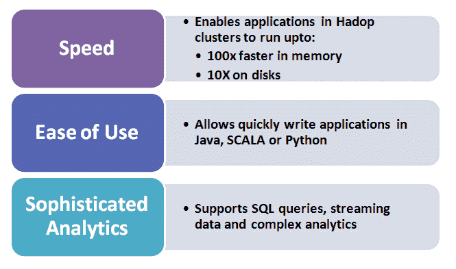
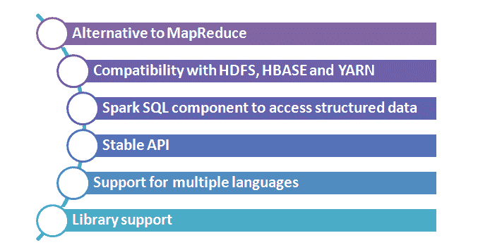

# Apache Spark 与 Hadoop——为什么重要？

> 原文：<https://www.edureka.co/blog/apache-spark-with-hadoop-why-it-matters/>

Hadoop 是一个数据处理框架，它本身已经成为一个平台，当好的组件连接到它时，它会变得更好。Hadoop 的一些缺点，如 Hadoop 的 MapReduce 组件以实时数据分析速度慢而闻名。

Apache Spark 是一个基于 Hadoop 的数据处理引擎，专为批处理和流工作负载而设计，现在推出了 1.0 版本，配备的功能体现了 Hadoop 正在推动包括哪些类型的工作。Spark 运行在现有 Hadoop 集群之上，以提供增强的附加功能。

*让我们看看 spark 的主要特性，以及它如何与 Hadoop 和 **[及其项目](https://www.edureka.co/apache-spark-scala-training#Projects)** 协同工作。*

## **阿帕奇星火关键好处:**

## **Spark 的牛逼功能:**

*   **Hadoop 集成**–Spark 可以处理存储在 HDFS 的文件。
*   Spark 的交互外壳–Spark 是用 Scala 编写的，有自己版本的 Scala 解释器。
*   **Spark 的分析套件**–Spark 自带工具，用于交互式查询分析、大规模图形处理和分析以及实时分析。
*   **弹性分布式数据集(RDD 的)**–RDD 的是可以跨计算节点集群缓存在内存中的分布式对象。它们是 Spark 中使用的主要数据对象。
*   **分布式操作符**——除了 MapReduce，还有许多其他操作符可以在 RDD 上使用。

## **结合 Hadoop 使用 Apache Spark 的优势:**

*   Apache Spark 适合 Hadoop 开源社区，**构建在 Hadoop 分布式文件系统(HDFS)之上。**然而，Spark 并不依赖于两阶段 MapReduce 范式，并且承诺对于某些应用程序，其性能比 Hadoop MapReduce 快 100 倍。

*   **非常适合机器学习算法**–Spark 为内存集群计算提供原语，允许用户程序将数据加载到集群的内存中并重复查询。

*   **运行速度快 100 倍**–Spark，分析软件也可以加速在 Hadoop 数据处理平台上运行的作业。被称为“Hadoop 瑞士军刀”的 Apache Spark 提供了创建数据分析作业的能力，其运行速度比在标准 Apache Hadoop MapReduce 上运行的作业快 100 倍。MapReduce 被广泛批评为 Hadoop 集群中的瓶颈，因为它以批处理模式执行作业，这意味着无法对数据进行实时分析。

*   **MapReduce 的替代方案–**Spark 提供了 MapReduce 的替代方案。它以间隔不超过 5 秒的短时间微批处理执行作业。它还提供了比 Twitter Storm 等实时、面向流的 Hadoop 框架更高的稳定性。该软件可用于各种工作，例如正在进行的实时数据分析，由于软件库，涉及机器学习和图形处理的计算更深入的工作。

*   **支持多种语言**–使用 Spark，开发人员可以用 Java、Scala 或 Python 编写数据分析工作，使用一组 80 多个高级操作符。

*   **库支持**–Spark 的库旨在通过最新商业支持的 Hadoop 部署来补充更积极探索的处理作业类型。MLlib 实现了一系列常见的机器学习算法，如朴素贝叶斯分类或聚类；Spark Streaming 能够高速处理从多个来源获取的数据；GraphX 允许对图形数据进行计算。

*   **稳定的 API**–在 1.0 版本中，Apache Spark 提供了一个稳定的 API(应用程序编程接口)，开发人员可以使用它通过自己的应用程序与 Spark 进行交互。这有助于在基于 Hadoop 的部署中更轻松地使用 Storm。

*   **SPARK SQL 组件**–用于访问结构化数据的 SPARK SQL 组件，允许在分析工作中与非结构化数据一起查询数据。Spark SQL 目前只在 alpha 中，它允许对存储在 Apache Hive 中的数据运行类似 SQL 的查询。通过 SQL 查询从 Hadoop 中提取数据是 Hadoop 中涌现的另一种实时查询功能。

*   **Apache Spark 与 Hadoop 的兼容性【HDFS、HBASE 和 YARN】**–Apache Spark 完全兼容 Hadoop 的分布式文件系统(HDFS)，以及其他 Hadoop 组件，如 YARN(另一个资源协商器)和 HBase 分布式数据库。

## **行业采用者:**

Cloudera、Pivotal、IBM、Intel 和 MapR 等 IT 公司都将 Spark 纳入了他们的 Hadoop 堆栈。由 Spark 的一些开发者创建的 Databricks 公司为该软件提供商业支持。雅虎和美国宇航局等都使用该软件进行日常数据操作。

## **结论:**

Spark 所能提供的对于 Hadoop 的用户和商业供应商来说都是一个巨大的吸引力。希望实施 Hadoop 以及已经围绕 Hadoop 构建了许多分析系统的用户被能够将 Hadoop 用作实时处理系统的想法所吸引。

Spark 1.0 为他们提供了另一种支持或构建专有项目的功能。事实上，三大 Hadoop 供应商之一 Cloudera 已经通过其 Cloudera 企业产品为 Spark 提供商业支持。Hortonworks 也一直在提供 Spark 作为其 Hadoop 发行版的一个组件。顶级公司大规模实施 Spark 表明了它的成功及其在实时处理方面的潜力。

有问题要问我们吗？在评论区提到它们，我们会给你回复。

**相关帖子:**

[大数据和 Hadoop 培训](https://www.edureka.co/big-data-and-hadoop)

[Spark 和 Scala 培训](https://www.edureka.co/apache-spark-scala-training)

[Hadoop 教程的重要性](https://www.edureka.co/blog/importance-of-hadoop-tutorial/ "Importance of Hadoop Tutorial")

[阿帕奇星火重新定义大数据处理](https://www.edureka.co/blog/videos/apache-spark-redefining-big-data-processing/ "Apache Spark Redefining Big Data Processing")