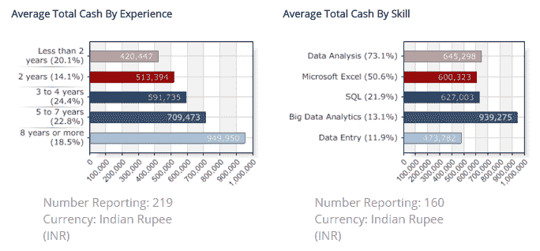
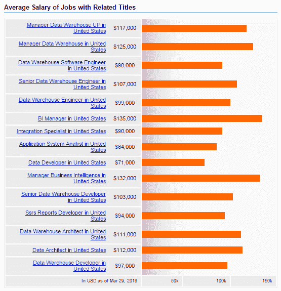

# 数据仓库和商业智能职业道路:包数据仓库和数据挖掘工作

> 原文：<https://www.edureka.co/blog/data-warehousing-and-business-intelligence-career-path-bag-data-warehousing-and-data-mining>

如今，数据仓库和商业智能与组织决策紧密相连。无论是大公司还是小公司，都在帮助知识工作者(高级管理人员、分析师和数据所有者)基于对大规模数据的分析，做出快速、有策略且以结果为中心的决策。基于 DBMS 的系统用于数据同化、存储、检索和处理的日子已经一去不复返了。如今，需要同时处理来自各种来源的数据，并呈现和处理即时结果，以确保以客户为中心的业务运营。像 BFSI、医疗保健、公用事业甚至政府组织这样的垂直行业正在转向由商业智能驱动的数据仓库，以在竞争中保持领先。

数据仓库的快速发展为那些专门从事数据仓库和商业智能技术的人打开了无数的就业机会。在过去的几个月里，在世界范围内，包含这些技术的工作岗位激增。

## 数据仓库和商业智能工作角色

一些受欢迎的职位是:

*   数据仓库顾问
*   数据挖掘器
*   商业智能技术专家
*   数据仓库业务分析师
*   数据仓库 ETL 专家
*   数据仓库架构师
*   数据仓库开发人员

## 数据仓库和商业智能工资

虽然数据分析和 SQL 等技能在稳步增长，但大数据和分析技能是印度薪酬最高的技能，工资中位数为卢比。939,275.值得注意的一个有趣趋势是，随着经验的增加，数据仓库和商业智能专业人员的收入会成倍增加。与不到两年经验的专业人员相比(rs。420，447 卢比)，有八年左右工作经验的人可以预期收入约为卢比。950,000.

资料来源:Payscale.com

然而，在美国，商业智能经理(及相关职位)的薪酬最高，为 13.5 万美元，其次是数据仓库经理(12.5 万美元)、数据架构师(11.2 万美元)和高级仓库工程师(10.7 万美元)。以下是对应工作角色的详细薪资清单:

资料来源:Indeed.com

## 数据仓库和商业智能职业道路

作为一名初学者，你可以从事任何头衔的工作，只要你的起点围绕着数据库工作。你的下一个逻辑发展应该是在 DWBI 成为一名开发人员或管理员，这取决于你更喜欢写代码还是管理运营。接下来，你可以专注于数据挖掘，这是一个至关重要的工作角色，尤其是在大型组织中。最有希望的是成为预测分析专家。随着 BI 技能的加入，这种进步可以让你成为一名对公司利润和未来至关重要的专业人士。然而，如果你决定坚持使用数据库，你总是可以作为一个 ETL 开发人员来发展你的职业生涯，通过每个项目，你对你的公司变得越来越有价值。毕竟，数据永远不会停止增长。

对于那些寻求围绕商业智能建立职业生涯但希望远离数据仓库的人来说，有两条合乎逻辑的职业道路——一是功能方面，你可以参与测量不同的指标；二是技术方面，你可以实际构建工具来更好地跟踪。

Edureka 有一门专门策划的关于数据仓库和商业智能的课程。本课程旨在帮助您成为数据仓库和商业智能技术的专家，涵盖了数据仓库架构、数据建模、ETL 编程基础、业务报告、数据可视化等概念。新批次即将开始；或者注册我们的[数据仓库课程](https://www.edureka.co/data-warehousing-and-bi)或 [商业智能课程](https://www.edureka.co/masters-program/business-intelligence-certification) 将帮助您挖掘这些数据，并增强整个组织的决策过程。

有问题要问我们吗？在评论区提到它们，我们会回复你。