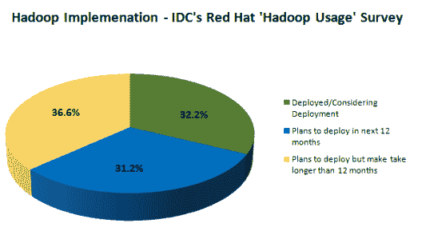
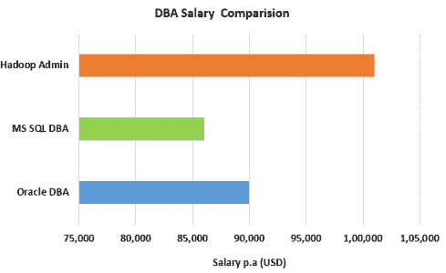
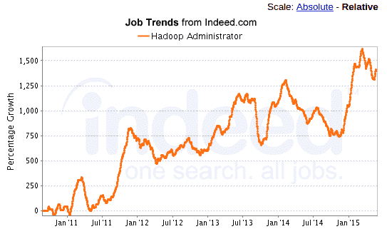

# 你为什么应该参加 Hadoop 管理课程？

> 原文：<https://www.edureka.co/blog/why-should-you-go-for-hadoop-administration-course/>

“Hadoop”是 IT 界最热门的话题之一，在很短的时间内，Hadoop 已经大规模发展，并被证明对大量不同的项目非常有用。Hadoop 社区正在快速发展，并在其领域中扮演着非常重要的角色。Hadoop 的创始人 Doug Cutting 认为，未来将会是 Hadoop 被广泛和日益使用的时代。Hadoop 因其处理事务、搜索和分析的理想方式而变得流行，它也用于分析结构化数据、半结构化数据和非结构化数据。

随着 Hadoop 的出现，需要精通 Hadoop 管理的专业人员。这就是为什么参加 [Hadoop 管理课程](https://www.edureka.co/hadoop-administration-training-certification)是绝对必要的。

## **汹涌的大数据/Hadoop 市场:**

当前的市场趋势和未来的市场预测对 Hadoop 产生了积极的影响。

以下是 Gartner、IDC、Allied Market Research&Market and Market 对 Hadoop 的一些预测:

*   Hadoop 有望在未来几年变得更加流行。
*   本报告中的关键预测是 **Hadoop 是一款广受好评的分析工具。**
*   公司已经将 Hadoop 与其他数据库相结合，以不同的方式用于大数据分析。
*   Allied Market Research 预测，2013 年价值 20 亿美元的 Hadoop 生态系统将在 2020 年快速增长到 500 亿美元。
*   据市场研究咨询公司 Marketsandmarkets.com 称，全球**Hadoop 和大数据分析市场将从 2012 年的 15 亿美元激增至 2017 年预计的 139 亿美元**

## **Hadoop 实施的增加等于对 Hadoop 管理员需求的增加:**

成熟行业和初创企业中大大小小的公司都在采用 Hadoop。即使有些组织尚未实施 Hadoop，也要知道任何超过 20-30 个节点的生产集群都需要一名全职管理员。因此，需要具备 Hadoop 管理技能的专业人员。

Hortonworks 首席执行官 Rob Bearden 预计，在未来几年内，80%的企业数据将迁移到 Hadoop。 在最近的一项调查中，IDC 询问了一些公司实施 Hadoop 的策略，结果表明 Hadoop 是寻求大数据解决方案的企业的首选。从调查中可以明显看出，在未来两年内，99%的受访公司将实施 Hadoop。

## **支付套餐:**

下面是不同数据库管理员的工资，让我们看看他们之间的比较。

谈到 DBA 的薪酬待遇，Hadoop 管理员在竞争中处于领先地位。再加上大数据已经存在，并且在顶级薪酬技能中占据主导地位，这是提升 Hadoop 管理技能和加快职业发展的恰当时机。

## **工作趋势:**

Hadoop 的实施越来越多，产生了大量的就业机会。就连科技求职网站 Dice 也报道称，Hadoop 是其董事会上最热门的技能之一。

随着公司转向大数据，对 Hadoop 熟练专业人员的需求显而易见。与 Hadoop 开发人员技能一样，具有 Hadoop 管理技能的专业人员也非常受欢迎。Hadoop 管理技能也存在技能缺口。

在任何一天，Dice.com 都有超过 1500 个 Hadoop 技能的职位空缺。 与去年 相比，Hadoop 相关职位的 ***上涨了 35%。Dice 总裁 Shravan Goli 肯定了同样的说法:“Hadoop 作为大数据技术的重心，正在经历巨大的增长。”***

## **寻找 Hadoop 管理员的公司:**

你知道顶级公司都在寻找具有 Hadoop 管理技能的专业人士吗？以下是一些寻找 Hadoop 管理员的组织的列表:

*   通用电气公司
*   迈克菲
*   麦格劳丘陵
*   Teradata
*   威瑞森
*   花旗银行
*   梅西百货
*   Expedia
*   索尼电子公司
*   康卡斯特。

用必要的技能更新自己，然后被这些顶级公司雇佣。您可以从 Pune 的 [Hadoop 管理课程中更好地理解 Hadoop 概念。](https://www.edureka.co/hadoop-administration-training-certification-pune)

有问题要问我们吗？请在评论区提及它们，我们将会回复您。

**相关帖子:**

[Hadoop 管理入门](https://www.edureka.co/hadoop-admin)

[学习 Hadoop 的 5 个理由](https://www.edureka.co/blog/5-reasons-to-learn-hadoop)

[Hadoop 培训有多重要？](https://www.edureka.co/blog/how-essential-is-hadoop-training/)