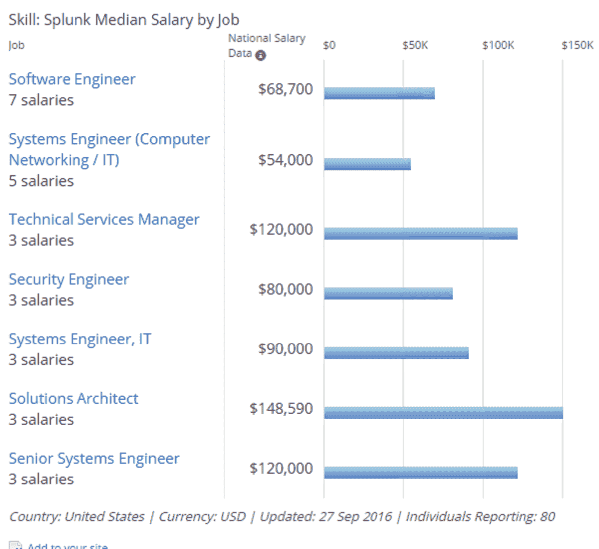
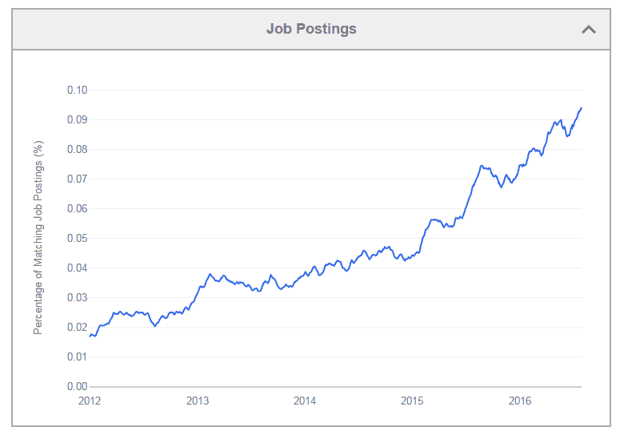
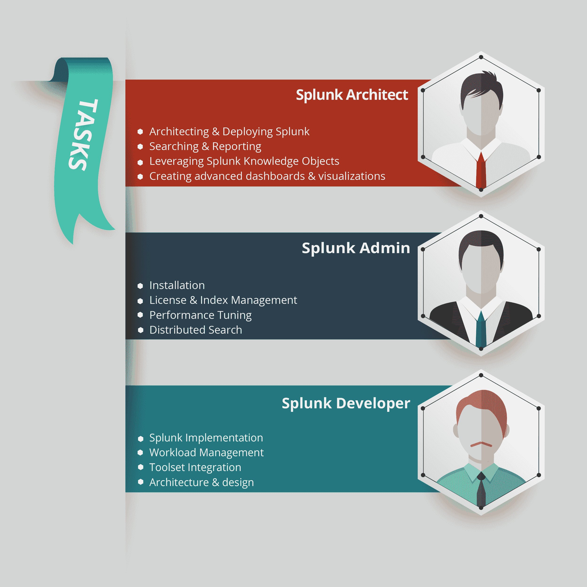

# Splunk 职业——您获得热门大数据工作的途径

> 原文：<https://www.edureka.co/blog/splunk-careers-big-data-jobs/>

*“Splunk careers are extremely lucrative with paychecks of up to $148,590” – Indeed*

**作为一个近几年来一直密切关注 SMAC(社交、移动、分析&云)革命的人，我过去常常想知道 SMAC 产生的所有“废物”数据都去了哪里。有人试着去看看它是否包含有用的东西吗？瞧啊。我的预感是对的。非结构化数据显然是一个信息宝库，全世界的企业都可以利用它。还有呢？他们甚至提供关于顾客、他们的行为、他们预期的未来行为等的宝贵见解。聪明的人很快就创造出帮助你获得这些洞察力的工具，Splunk 是这类工具的领导者。因此，Splunk 职业是当今业界最受欢迎的职业之一。报名参加 [Splunk 培训](https://www.edureka.co/splunk-certification-training)，开始您在这一领域的职业生涯。**

**本博客旨在简要了解 Splunk 的发展以及它在大数据的各个领域可能带来的巨大职业机会。如果您还不知道，Splunk 是一个用于监控和分析由组织的技术基础设施、安全系统、业务运营和其他来源生成的大数据的平台。当然，贵公司的 SMAC 生成了一卡车 Splunk 急需的数据。Splunk 整理、索引和处理所有这些数据，帮助组织从大量机器生成的数据中获取有价值的运营情报。让我试着解释一下这是一些细节。从[大数据 Hadoop 认证](https://www.edureka.co/big-data-hadoop-training-certification)中得到更好的理解。**

**Splunk 使用 Splunk 搜索处理语言(SPL ),无论数据的格式或位置如何，该平台都会整理和索引数据。Splunk 还从日志、点击流、传感器、web 服务器、云服务器、自定义应用程序等中识别事件或活动之间的关系。目前，Splunk 有 1200 多个应用程序帮助理解不同格式的日志数据，提供跨内部、云和混合环境的可见性。在这些应用程序和 Splunk 在大大小小的组织中的突然扩散之间，Splunk 周围的职业生涯在过去几年中飞速发展，有一个公平的迹象表明，事情只会从现在开始变得更好。**

## ****【Splunk】****

**福布斯称[在过去的五年里，与非结构化机器数据和物联网(IoT)相关的大数据](https://www.edureka.co/blog/10-reasons-why-big-data-analytics-is-the-best-career-move)相关工作在全球范围内出现了前所未有的增长，增长率超过了 704%。有望在 Splunk 获得丰厚职业回报的具体工作角色包括:**

***   软件工程师*   系统工程师*   编程分析师*   解决方案架构师*   安全工程师*   技术服务经理**

**据 Indeed 报道，Splunk 的相关工作要求解决方案架构师的工资高达 148，590 美元，高级系统工程师的工资高达 120，000 美元。与世界各地的其他软件开发和 IT 工作相比，即使是起薪也很有吸引力。我已经为你找出了数字，它们看起来很有希望。**

****

**我做了一些调查，看看谁真正在使用 Splunk。虽然你可以在几乎任何技术领域拥有辉煌的 Splunk 职业生涯，但最近有五个行业是 Splunk 的旗手。这些行业包括金融和保险、制造业、信息技术、零售贸易和技术服务。目前，100 多个国家的 9，000 多家企业、政府机构、大学和服务提供商使用 Splunk 来深入了解业务和客户，降低网络安全风险、防止欺诈、提高服务绩效和降低总体成本。从 Splunk 被全球组织采用的速度来看，其数量只会呈指数级增长。**

**看一下这里的图表(来源:的确)。这表明 Splunk 的工作岗位自过去几年以来一直在飙升，没有放缓的迹象:**

****

## ****Splunk 职业轨迹****

**如果你是一名 Splunk 发烧友(或渴望在不久的将来成为一名发烧友)，未来充满了充满挑战和有利可图的可能性。这正是学习和掌握 Splunk 的最佳时机。Splunk 的职业生涯有三个主要分支:架构师、管理员和开发人员。如果你决定在简历中加入 Splunk，根据你选择的职位，下面列出了你需要完成的任务:**

****

**如果您是 Splunk 架构师，您的组织会希望您利用 Splunk 来搜索和报告数据、创建 Splunk 知识对象、操作仪表板和可视化，以及在整个组织中设计和部署 Splunk。另一方面，如果您决定成为 Splunk 管理员，您需要执行安装、许可证管理、Splunk 应用程序管理、配置和索引管理、事件解析、分布式搜索和性能调整。最后，如果您渴望成为 Splunk 开发人员，您将全权负责端到端解决方案的开发和维护。Splunk 开发人员的主要职责包括实施、工作负载管理、架构、设计和评估。**

## **组织致力于 Splunk**

**截至 2016 年 10 月，以下公司在全球范围内有极具吸引力的 Splunk 能力空缺。好好看看这些公司，它们是从技术到物联网到制造以及介于两者之间的所有行业的混合体。有了正确的 Splunk 知识和培训，您很快就能拥有一张印有这些大牌之一的名片。**

## ****前途光明****

**正如某位智者曾经说过的，“低效率是所有机会之母”。看起来聪明的灵魂已经想到了挥霍！今年早些时候，Gartner 发出了警告——非结构化数据的增长速度正在迅速超过结构化数据，并且在文件共享、个人设备和云中的控制、存储和管理都很差。这种认识源于这样一个事实，即世界上 50%的 IT 团队对非结构化数据的巨大增长完全没有准备。更令人震惊的事实是，到 2022 年，数字世界中 93%的数据将是非结构化的(来源:IDG)。不需要什么高深的科学就能明白，企业无法仅凭 7%的数据就生存下去。来自社交聊天、使用日志、客户点击流等的数据。是对组织战略和成功非常重要的关键数据，Splunk 等产品的发展很大程度上利用了对非结构化数据的管理不善。简而言之，这意味着一件事——全世界都迫切需要 Splunk 专家。不用说，你可以站在这场革命的最前沿。**

***了解了 Splunk 的职业机会后，最好借助使用案例来了解 Splunk 的工作方式。***