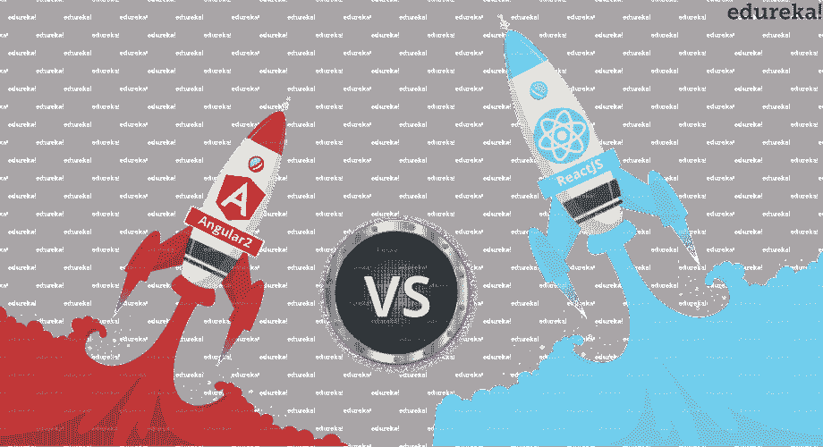
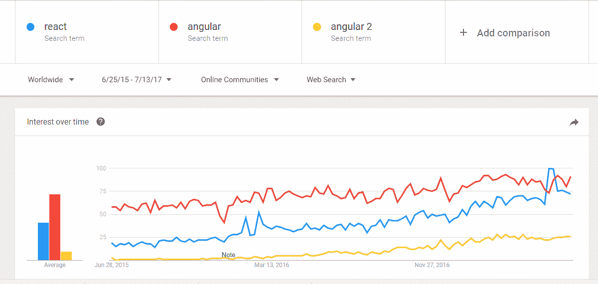
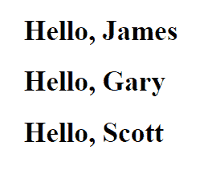

# react vs Angular——JavaScript 重量级人物之间的战争

> 原文：<https://www.edureka.co/blog/react-vs-angular>

## **一场战斗等于**

每当 React 和 Angular 之间的争论发生时，第一个问题就是，如何比较视图库 React 和成熟的框架 Angular？

所以，让我先澄清一下，告诉 你为什么他们在同一条船上。

【F】或者所有那些认为你不能将“苹果”与“橙子”相提并论的人，w 如果我告诉你，将 React 与 Angular 进行比较，就像使用单独的零件(定制)从零开始组装一辆汽车，然后得到一辆现成的(标准)汽车。O 既然第一辆车造出来了，就可以和第二辆车比。 现在我们可以把它的‘苹果’说成‘苹果’了。

我希望这能解决关于 React 是一个库而 Angular 是一个框架的古老争论。

***“这是一场平等者之间的战斗。”***

*你可以浏览一下 React vs Angular 的录像，我们的[网站开发专家](https://www.edureka.co/frontend-development-certification-courses)已经用例子详细解释了这些主题，这将帮助你更好地理解这个概念。*

## **React vs Angular | React 的对比&Angular | edu reka**

[https://www.youtube.com/embed/7H0BpZP4W_s?rel=0&showinfo=0](https://www.youtube.com/embed/7H0BpZP4W_s?rel=0&showinfo=0)

虽然 React 和 Angular 用于执行相同的任务，即前端 web 开发，但 t 它们都使用对比鲜明的编程范例，并且都提供不同的特性、功能和性能。在这篇 React vs Angular 的博客中，我们将向你阐明这两种技术带来了什么，以及应该选择哪一方。

*反应 vs 棱角分明——对峙*


## **反击 vs 角力:对抗**

Vue.js、jQuery 等库和 Ember、Backbone.js b ut 等框架中有许多 JavaScript 选项，为什么开发者社区和商业企业都非常依赖 React 和 Angular？

这是因为除了它们提供的功能外，它们还分别得到了脸书和谷歌等科技巨头的支持。 React 和 Angular 一起覆盖了今天前端 web 空间的巨大份额 。现在让我们来看看使用这两个竞争对手构建的一些流行网站。谁选择了谁？

——谷歌、贝宝、卫报、自由职业者

***React***——脸书、Airbnb、网飞、Dropbox

GitHub star 排行榜列出的顶级 JavaScript 库显示:

*   反应超前有角。
*   虽然 Angular 在 React 后面，但在 Redux 前面，Redux 经常与 React 连用。

| **排名** | **主人** | **储存库** | **语言** | **星辰** | **分叉** |
| 3 | [脸谱](https://github.com/facebook) | [反应过来](https://github.com/facebook/react) | [JavaScript](http://github-rank.com/star?language=JavaScript) | 70235 | 13183 |
| 7 |  | [angular.js](https://github.com/angular/angular.js) | [JavaScript](http://github-rank.com/star?language=JavaScript) | 56332 | 28132 |
| 19 | [反应过来](https://github.com/reactjs) | [redux](https://github.com/reactjs/redux) | [JavaScript](http://github-rank.com/star?language=JavaScript) | 32185 | 6769 |

在这篇 React vs Angular 的博客中，我们接下来看看 2015-2017 年间这两种技术的谷歌趋势搜索量。就受欢迎程度而言，据观察，最初 Angular 在顶部，这并不奇怪，因为它的首次发布是在 2009 年。

然而，2013 年首次推出的 React 显示出上升趋势，最近几个月与 Angular 并驾齐驱。Angular 2 虽然在逐渐上升，但是落后于 React。这可以归功于 Angular 2 在 2016 年年中发布。

**

*React vs Angular——谷歌趋势对比*

## **五官脸关**

| **题目** | **反应过来** |  |
| 家 | 虚拟 | 常规 |
| 学习曲线 | 浅 | 陡峭 |
| 性能 | 高效 | 急剧改善；仍然落后于使用自定义 UI 的大型应用程序。 |
| 调试 | 及早发现错误(编译时) | 错误不会被注意到(在运行时出现) |
| 依赖注入 | 未包含 | 固有特性 |
| 由维护 | 脸书 | 谷歌 |

*反应 vs 棱角——五官对峙*

## **DOM**

React 的核心是虚拟 DOM w h ich 创建了实际 DOM 的虚拟副本。它利用一种算法来识别被修改的节点，并在实际的 DOM 中仅对这些节点进行更新。这优化了 DOM 操作，从而降低了性能开销。

Angular 使用常规 DOM 的同时，Angular 也在快速学习其竞争对手 React，并对其变化检测机制进行了新的更新。 要深入了解 Angular，您可以报名参加 Edureka 提供的 [***Angular 课程***](https://www.edureka.co/angular-training) ，全天候支持，终身访问。

## **学习曲线**

React最大的一个优点就是它对任何个人来说都很容易学会。React 纯粹基于 ***JavaScript** ，*所以一个新手如果不在几天之内就会在一周之内熟悉 React。

React 的学习曲线较浅，适合初学者，而 Angular 的学习曲线较陡。这是因为你需要在 Angular *中学习一个额外的依赖项，叫做。*

现在让我给你看一个例子。

我们将创建一个组件向三个用户显示消息“你好”龙与他们的名字。在 React 中，我们只使用一个文件来包含 JavaScript 代码和带有类似 html 的 JSX 的标记。

文件“Hello.jsx”的内容

```
function Message(props) {
return 

<h1>Hello, {props.username}</h1>

;
}
function App() {
return (

<div>
<Message username="James" />
<Message username="Gary" />
<Message username="Scott" />
</div>

);
}

ReactDOM.render(
<App/>,
document.getElementById('root')
);

```

然而我们用*打字稿*打成有棱角的文件。 *TypeScript* 是微软*的一种静态类型编程语言。TypeScript* 是 ES6 Javascript 的类型化超集，在运行时*被转换成 ES5 JavaScript。*HTML 模板单独附加在不同的文件中。这是 Angular 的一个关键区别，因为每个创建的组件都需要一个额外的 HTML 文件，这导致了开销。

在 Angular 中，我们指定 Decorators)来包含关于组件的元数据。选择器标签允许你将组件的实例加载到父视图组件 中。 模板文件的路径在 templateUrl 中指定。这种 **Angular** 的特定语法对初学者来说可能很有挑战性。

文件' app.component.ts '的内容

```
import { Component } from '@angular/core';

@Component({
selector: 'app-root',
templateUrl: './app.component.html'

})
export class AppComponent {
users = ["James","Gary","Scott"];

}

```

Angular 利用指令 、其作用类似于面向对象语言中的函数。

**ngFor 是一个角度指令，用于操纵 DOM。我们创建一个包含用户的数组。*

在这里，它用于迭代“用户”数组，并为每个用户*创建一个新项目。*这再次表明使用了与实际 *JavaScript* 不同的 **Angular** 特定语法。

文件“app.component.html”的内容

```

<ul>

<li *ngFor = "let user of users">
Hello! {{user}}
</li>

</ul>

```

在这两种情况下，显示屏如下图所示 

## **表现**

React 以超强的渲染速度著称。 由此得名“作出反应”，瞬间反应以最小延迟改变。

Angular 2 通过修改其变化检测算法，大幅提升了性能。 虽然 Angular 在较小的应用程序中与 React 并驾齐驱，但随着自定义 UI 的大小和复杂性的增加，R eact 明显优于 Angular。

Angular 是一种端到端的解决方案，而 React 仅提供适用于部署简单应用程序的 UI 支持。

不过 React 可以结合 Redux(或者 Flux)做更大的应用。 React Native 不像 Angular 更注重用户界面。

## **调试**

代码需要从两个方面来看，即你的逻辑和标记。至于逻辑，React 使用编译时调试并在早期检测错误。从而使其成为调试 **JavaScript** 的首选，而 Angular 使用运行时调试，这导致在运行时出现未检测到的错误。谈到标记，React 使用 JSX，这是一种类似 HTML 的语法，需要追溯到生成的 HTML，这可能是一项繁琐的任务。Angular 的 HTML 模板类似于生成的 HTML，允许我们无缝调试。

接下来，在这篇 React vs Angular 博客中，我们继续讨论一个重要的话题，即依赖注入。

## **依赖注入**

依赖注入(DI)是 Angular 独有的固有特性，DI 用于在组件之间共享服务。

每次创建一个组件时，注入器使用包含服务实例的容器来提供服务。因此，以前组件中存在于容器中的服务可以在新组件之间共享。

这就是 Angular 如何使用 DI 来使其组件可重用，从而提高开发人员的生产力。

反应默认不部署迪。在 React 中，我们可以包含一个名为“ReactDI”的特殊库来实现 DI。

然而，为了制造可重用的组件，每当一个组件依赖于一个函数时，这个函数就作为一个“道具”被传递。

我们不能简单地预测两者之间的赢家，但我们会根据给定的背景帮你选择一方。

### **基于开发者团队经验**

对于一个有 Java 或任何其他静态类型语言(如 c#)经验的有经验的开发者来说，他会发现转移到*类型脚本*更容易。

说到这里，对于任何一个新手开发者来说，学习 Angular 特定的语法都是一项艰巨的任务。 另一方面 ，如果有一个经验丰富的开发团队能够充分利用 Angular 的*打字稿*，将会产生可靠的代码和更少的错误。这更适合大型企业应用程序。

### **基于应用需求**

如果你的用户界面是通用的，那么声明性的语言将适合你的应用程序。它提供了一个可靠的内置架构，如果您愿意牺牲一点性能，它可以提供一个更有组织的方法。

定制元素或复杂的用户界面最好留给反应型应用程序来开发。

这一切都归结于在“灵活和快速反应”或“更有结构和组织”之间取得平衡。

无论您是喜欢 Angular 这样的“现成”功能，还是选择 React 这样的“现成”功能，都由您来决定。

这两项技术的美妙之处在于，在 React 中，如果你愿意，你可以添加 *TypeScript* ，在 Angular 中，你可以通过包含 Redux 来改进你的架构。

这两项技术都得到大型开发者社区的支持，并得到了脸书和谷歌的支持。所以两种都试试吧，不要只相信我的话。这就把我们带到了 React vs Angular 博客的结尾。我希望它能给你带来信息和附加值。

*如果你发现这篇博客与“ **React vs Angular** ”相关，请查看 Edureka 的 **[React JS 认证](https://www.edureka.co/reactjs-redux-certification-training) t** 培训，edu reka 是一家值得信赖的在线学习公司，在全球拥有超过 250，000 名满意的学习者。本 Edureka* *课程帮助学习者获得 React 基础和高级主题的专业知识，使您能够随时随地开发成熟的动态 web 应用程序。*

*有问题吗？请在评论区提到它，我们会给你回复。*