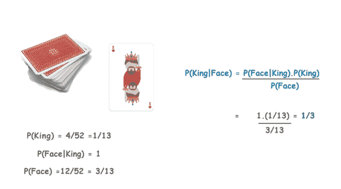
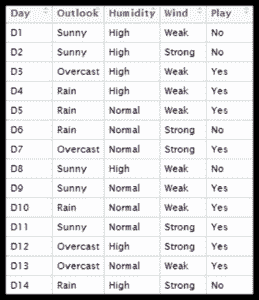
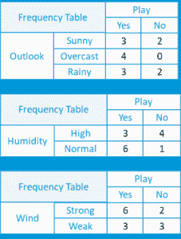
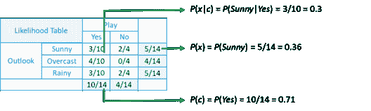

# 朴素贝叶斯分类器:用 Python 学习朴素贝叶斯

> 原文：<https://www.edureka.co/blog/naive-bayes-tutorial/>

在一个充满机器学习和人工智能的世界，围绕着我们周围的几乎一切，分类和预测是机器学习最重要的方面之一，朴素贝叶斯是一种简单但惊人强大的预测建模算法据 ***[机器学习行业专家](https://www.edureka.co/machine-learning-certification-training)*** 。所以，伙计们，在这个朴素贝叶斯教程中，我将涵盖以下主题:

## **什么是朴素贝叶斯？**

朴素贝叶斯是用于**分类**的最简单和最强大的算法之一，它基于贝叶斯定理并假设预测器之间是独立的。朴素贝叶斯模型易于构建，对于非常大的数据集尤其有用。这个算法有两个部分:

*   **天真**
*   **贝叶斯**

朴素贝叶斯分类器假设一个类中某个特征的存在与任何其他特征无关。即使这些特征相互依赖或依赖于其他特征的存在，所有这些属性独立地促成了特定水果是苹果或桔子或香蕉的概率，这就是为什么它被称为**“幼稚”。【T2**

让我们继续我们的朴素贝叶斯教程博客，理解贝叶斯定理。

## **什么是贝叶斯定理？**

在统计学和概率论中，贝叶斯定理描述了一个事件发生的概率，基于可能与该事件相关的条件的先验知识。这是一种计算条件概率的方法。

给定一个假设 **H** 和证据 **E，** 贝叶斯定理指出，得到证据前假设的概率 **P(H)** 和得到证据后假设的概率 **P(H|E)** 之间的关系为:

这就把得到证据前的假设概率 **P(H)** ，和得到证据后的假设概率 **P(H|E)** 联系起来了。为此，将**称为先验概率**，而将 **P(H|E)** 称为**后验概率**。将两者联系起来的因子 **P(H|E) / P(E)** 称为**似然比**。使用这些术语，贝叶斯定理可以重新表述为:

**“后验概率等于先验概率乘以似然比。”**

走的有点迷茫？别担心。 让我们继续我们的朴素贝叶斯教程博客，用一个简单的概念来理解这个概念。

Learn Python From Experts [<button>Start Learning Now</button>](https://www.edureka.co/python)

## **贝叶斯定理例子**

假设我们有一副牌，我们希望找出“**我们随机抽取的牌成为王的概率，假设它是一张脸牌**”。所以，根据贝叶斯定理，我们可以解决这个问题。首先，我们需要找出概率

*   **P(国王)**也就是 **4/52** 因为一副牌里有 4 个国王。
*   **P(脸|王)**等于 **1** 因为所有的王都是脸牌。
*   **【P(面)】**等于 **12/52** 因为一套 13 张牌中有 3 张面牌，总共有 4 套。

现在，把所有的值放入贝叶斯方程我们得到的结果为 **1/3**

## **利用贝叶斯定理进行游戏预测**

让我们继续我们的朴素贝叶斯教程博客，并预测我们拥有的天气数据的未来。

这里我们有我们的数据，包括天气、前景、湿度、风况和我们必须预测的最后一场比赛。

*   首先，我们将使用数据集的每个属性创建一个**频率**表。

*   对于每个频率表，我们将生成一个**可能性**表。

*   ‘**是**的可能性‘给定’**晴**是:

**P(c | x)= P(Yes | Sunny)= P(Sunny | Yes)* P(Yes)/P(Sunny)=(0.3 x 0.71)/0.36 =0.591**

*   同样，‘**否**‘给定’**晴**的可能性是:

**P(c | x)= P(No | Sunny)= P(Sunny | No)* P(No)/P(Sunny)=(0.4 x 0.36)/0.36 =0.40**

#### 订阅我们的 youtube 频道以获取新的更新..！