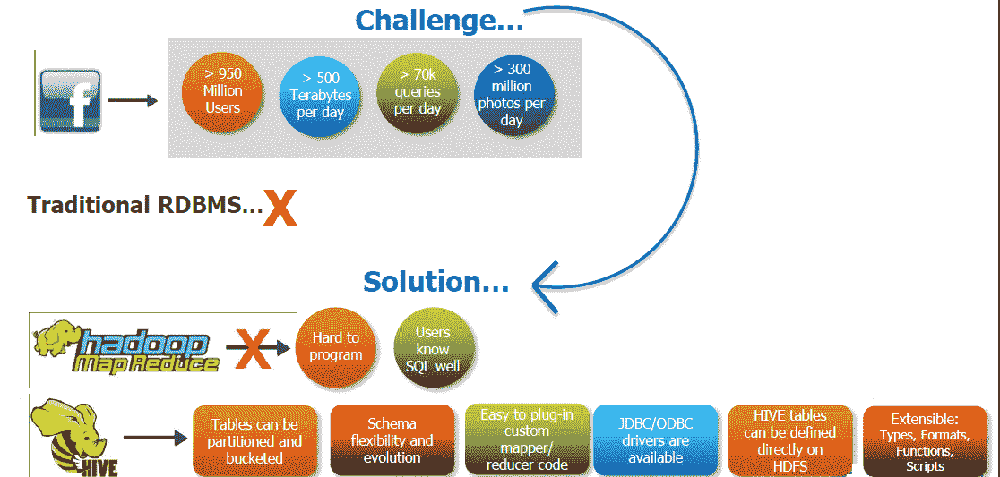
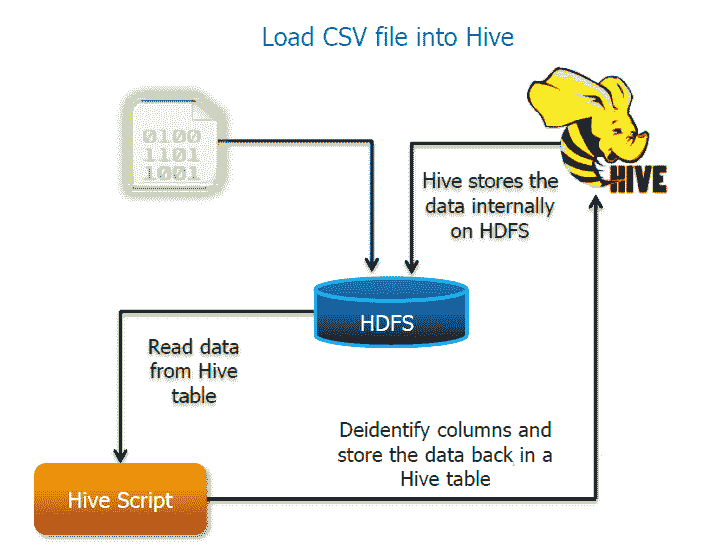
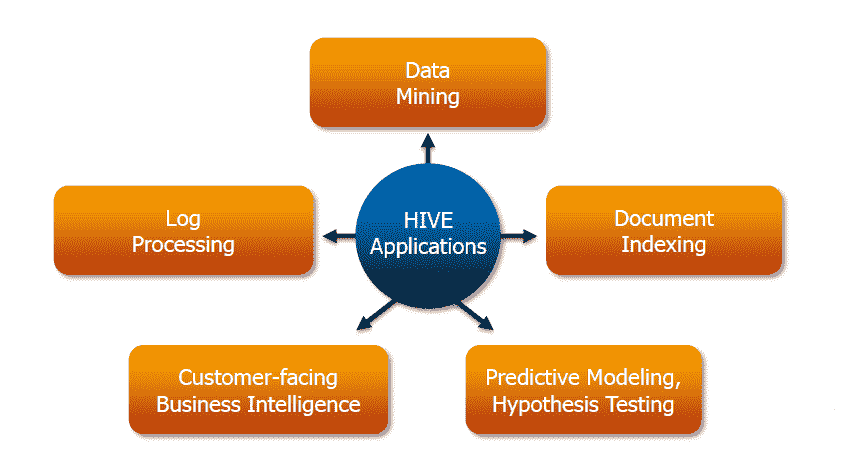
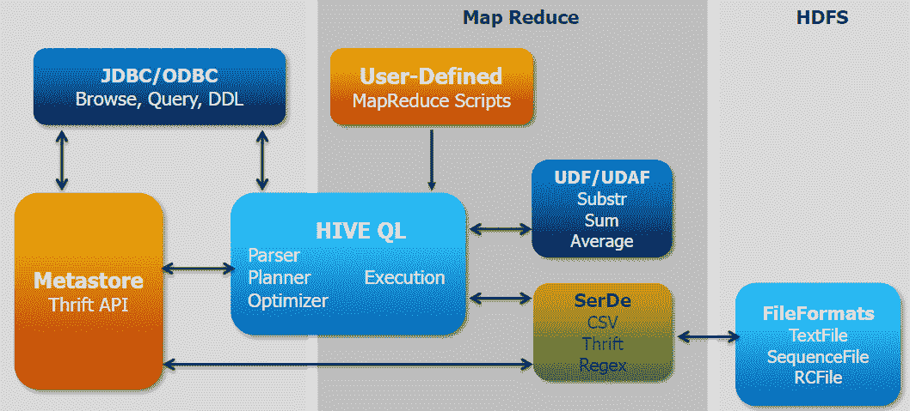
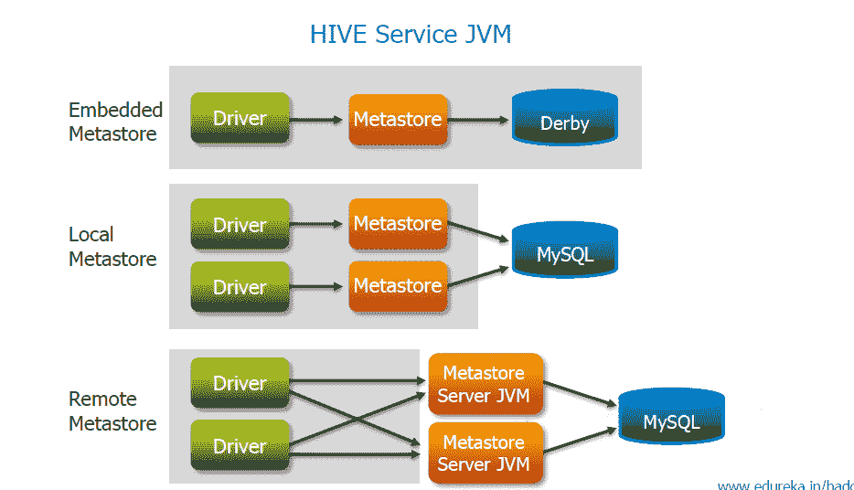
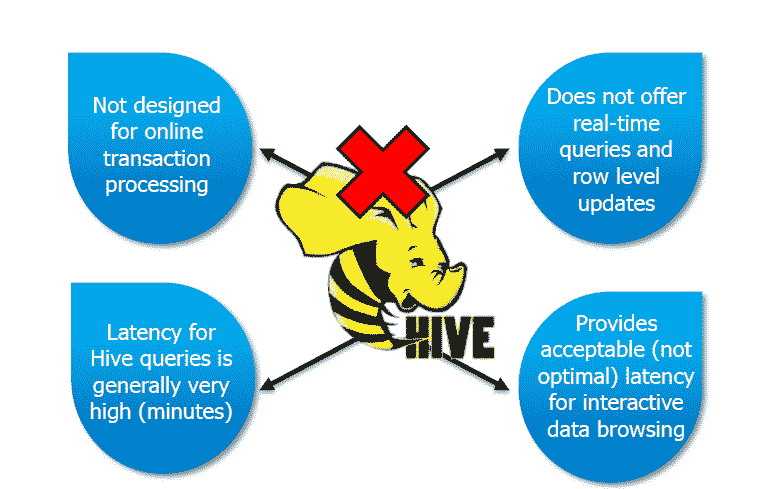

# Apache Hive 简介

> 原文：<https://www.edureka.co/blog/introduction-to-apache-hive/>

[//www.youtube.com/embed/asBMEOuw3lw](//www.youtube.com/embed/asBMEOuw3lw)

Apache Hive 是一个构建在 Hadoop 之上的数据仓库包，用于数据分析。Hive 的目标用户是熟悉 SQL 的用户。它类似于 SQL，称为 HiveQL，用于管理和查询结构化数据。Apache Hive 用于抽象 Hadoop 的复杂性。这种语言也允许传统的 map/reduce 程序员插入他们定制的映射器和 reducer。Hive 的流行特点是不需要学习 Java。

Hive 是一个开源的基于 Hadoop 的 peta 级数据仓库框架，由脸书的数据基础设施团队开发。Hive 也是用于满足脸书需求的技术之一。Hive 非常受脸书内部所有用户的欢迎，并被用于在有数百个用户的集群上运行数千个作业，用于各种各样的应用程序。位于脸书的 Hive-Hadoop 集群存储超过 2PB 的原始数据，并且每天定期加载 15 TB 的数据。

让我们来看看它的一些受欢迎和用户友好的特性:

*   允许程序员插入定制的映射器和缩减器。
*   拥有数据仓库基础设施。
*   提供工具实现简单的数据 ETL。
*   定义了类似 SQL 的查询语言，称为 QL。

## **Apache Hive 用例——脸书:**

在实施 Hive 之前，脸书面临着许多挑战，因为生成的数据量不断增加，或者说呈爆炸式增长，这使得处理这些数据变得非常困难。传统的 RDBMS 无法承受这种压力，因此脸书在寻找更好的选择。为了解决这个迫在眉睫的问题，脸书最初尝试使用 Hadoop MapReduce，但由于编程困难和 SQL 方面的强制性知识，使其成为一个不切实际的解决方案。Hive 让他们克服了面临的挑战。

借助 Hive，他们现在能够执行以下操作:

*   桌子可以分成几份和几桶
*   模式灵活性和进化
*   JDBC/ODBC 驱动程序可用
*   配置单元表可以直接在 HDFS 中定义
*   可扩展–类型、格式、功能和脚本

## **医疗保健中的 Hive 用例:**

## **哪里用蜂巢？**

Apache Hive 可以用在以下地方:

*   数据挖掘
*   日志处理
*   文件索引
*   面向客户的商业智能
*   预测建模
*   假设检验

## **蜂巢架构:**

Hive 由以下主要组件组成:

*   Metastore–存储元数据。
*   JDBC/ODBC——查询编译器和执行引擎，将 SQL 查询转换成 MapReduce 序列。
*   SerDe 和 object inspectors–用于数据格式和类型。
*   UDF/UDAF–用于用户定义的功能。
*   客户端——类似于 MySQL 命令行和 web 用户界面。

## **蜂巢的组成:**

**Metastore:**

Metastore 存储关于表、分区和表中的列的信息。Metastore 中有 3 种存储方式:嵌入式 Metastore、本地 Metastore 和远程 Metastore。大多数情况下，远程 Metastore 将用于生产模式。

## **蜂巢的局限性:**

Hive 有以下限制，不能在这种情况下使用:

*   不是为在线交易处理而设计的。
*   为交互式数据浏览提供可接受的延迟。
*   不提供实时查询和行级更新。
*   配置单元查询的延迟通常很高。

有问题要问我们吗？在评论区提到它们，我们会给你回复。

**相关帖子:**

[大数据和 Hadoop 培训](https://www.edureka.co/big-data-and-hadoop)

[蜂巢命令](https://www.edureka.co/blog/hive-commands-with-examples "HIVE COMMANDS")

[猪 Vs 蜂巢](https://www.edureka.co/blog/pig-vs-hive/ "Pig Vs Hive")