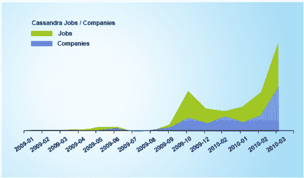

# 为什么要用 Hadoop 学习 Cassandra？

> 原文：<https://www.edureka.co/blog/why-learn-cassandra-with-hadoop/>

“公司意识到他们可以挖掘有价值的商业情报来改进决策并获得竞争优势。Hadoop 和 Cassandra 等工具使这一切成为可能，正因为如此，各个层次的 NoSQL 技能都非常吃香。”–TechRepublic 上的分析师

作为脸书的一个内部项目，Cassandra 是 T2 的一个开源分布式数据库管理系统。它于 2008 年在 Google Code 上作为**开源项目**发布，随后自 2010 年起成为 **Apache 软件基金会**的**顶级项目**。

## **卡珊德拉是下一件大事:**

*   Apache Cassandra 被设计为**跨众多商用服务器处理海量数据**(就速度、容量和多样性而言)，确保高可用性，并且不提供 SPOF(单点故障)。
*   Cassandra 还为跨多个数据中心的集群提供了强大的支持。不像传统架构那样采用“主从结构”,如果某个特定节点出现故障，对系统的影响**为零。**
*   多伦多大学的研究人员对 NoSQL 系统进行了研究，他们指出，就**可伸缩性和每节点最大吞吐量**而言，Cassandra 显然是赢家。NoSQL DBMS 的主要焦点是确保**可伸缩性**、**性能**和**高可用性。与大多数 NoSQL DBMS 一样，Cassandra 可以处理结构化和非结构化数据，并且在上述参数上表现相当好。**
*   Cassandra 既可以作为在线/交易应用程序的**实时数据存储库**(记录系统)，也可以作为商业智能系统的**读取密集型数据库**。阅读我们关于 [的博文，了解 Cassandra](https://www.edureka.co/blog/apache-cassandra-advantages/ "Apache Cassandra Advantages") 提供的各种优势。

## **为什么要和 Cassandra 一起去做 Hadoop？**

简而言之，拥有:

*   统一工作负载
*   有效性
*   更简单的部署

当谈到 Hadoop 时，企业对 Hadoop 的底层存储结构不感兴趣，而是对其用于分析和处理大量数据的经济高效的交付方法感兴趣。能够从 MapReduce、Hive、Pig、Mahout 和其他操作的输出中做出决策对这些组织来说是最重要的。

## **要点记住:**

*   **Hadoop 分布式文件系统(HDFS)** 是 Hadoop 生态系统中包含的众多不同组件和项目之一。**Apache Hadoop 项目将 HDFS 定义为 Hadoop 应用使用的主要存储系统**。HDFS 可以存储大量分布式非结构化数据集。数据可以直接存储在 HDFS 中，也可以以半结构化格式存储在 HBase 中，h base 允许快速记录级数据访问，并模仿谷歌的 BigTable 系统。另一方面，Cassandra 是一个非关系系统**，它使用 BigTable 数据模型**，但是使用 Amazon 的 Dynamo 方案进行数据分发和集群。
*   Hadoop 做了很多伟大的事情，它的核心 MapReduce 功能非常强大。行业专家崇拜 Hive 及其类似 SQL 的设计。**然而，HDFS 文件系统的设置极其复杂，存在单点故障，而且根据主要企业的反馈，它还没有准备好做他们想要它做的事情**。另一方面，Cassandra 提供了 Hadoop 堆栈底层的所有功能。同时，Cassandra 还在该基础设施中提供低延迟实时应用功能。

## **Cassandra 和 Hadoop 如何协同工作？**

许多供应商正在提供 HDFS 的替代品。一个名为 GigaOM 的组织最近发表的一篇论文提供了一个高层次的概述，介绍了如何使用 Apache Cassandra 文件系统来取代 HDFS，从开发的角度来看，只需要进行最少的编程更改，以及如何在这个过程中获得许多好处。领先的 Cassandra 发行版商业提供商 DataStax 将 Cassandra 与 Hadoop 相结合，并将其命名为 Brisk。随着轻快，HDFS 是由卡珊德拉文件系统取代。探索更多关于 HDFS 的概念。看看这个由顶级工业工作专家打造的 [**在线大数据课程**](https://www.edureka.co/big-data-hadoop-training-certification) 。

## **Cassandra-Hadoop 组合的优势:**

*   也可以在同一个集群上用 Hadoop 实现 Cassandra。这意味着你可以两全其美。
*   T **基于输入法的实时**在 Cassandra **应用**下运行(实时是 Cassandra 的强项)，而**基于批处理的分析**和**查询**不需要时间戳，可以在 Hadoop 上运行。在这种生态系统中，HDFS 被卡珊德拉取代，这对开发者来说是不可见的。我们可以在适当的时候在 Cassandra 和 Hadoop 环境之间动态地重新分配节点。
*   Cassandra 文件系统**移除了与 HDFS 关联的单点故障**，即与 HDFS 关联的 NameNode 和作业跟踪器故障点。

因此，这个想法是将 Cassandra(它是高容量实时事务处理的先驱)与 Hadoop(T2)相结合，Hadoop 擅长更多面向批处理的分析解决方案。

## **卡珊德拉和大款:**

垂直行业中的许多组织都在采用 Cassandra 来实现各种业务目标。一些突出的例子是:

*   网飞使用 Cassandra 作为流媒体服务的后端数据库。
*   思科的 WebEx——使用 Cassandra 近乎实时地存储用户反馈和活动。
*   **SoundCloud**–使用 Cassandra 存储他们用户的仪表盘。
*   IBM 已经研究了基于 Cassandra 构建一个可扩展的电子邮件系统

## **涉及 Hadoop 和 Cassandra 技能的职位名称:**

Simplyhired 的研究表明，由于卡珊德拉工作在行业中的高采用率，尤其是在过去几年中，卡珊德拉工作的需求很高。未来看起来很有希望。

让我们看看 Indeed.com 中提到的一些涉及 Hadoop-Cassandra 技能的职位名称及其薪资:

*   数据架构师:这个职位的平均工资是 107，000 美元。数据架构师需要在创建数据模型、数据仓库、分析数据和数据迁移方面有一些经验
*   **数据科学家:**他们收集数据，分析数据，直观地呈现数据，并使用数据进行预测/预报。数据科学家的平均工资是 104，000 美元
*   **系统工程师:**系统工程师的平均工资是 89000 美元。
*   DBA 的平均收入超过 10 万美元。
*   软件应用程序开发人员:软件开发人员的平均工资为 10.7 万美元，应用程序开发人员的平均工资为 9.3 万美元。拥有这些技能的人可以获得大量的自由职业工作，如果他们有创业精神，也可以创办自己的公司。

**相关帖子:**

[选择合适的 NoSQL 数据库](https://www.edureka.co/blog/choosing-the-right-nosql-database/) 。

[如何打开 Windows 上安装的 Cassandra 的 CQLSH？](https://www.edureka.co/blog/how-to-open-cqlsh-of-cassandra-installed-on-windows/)