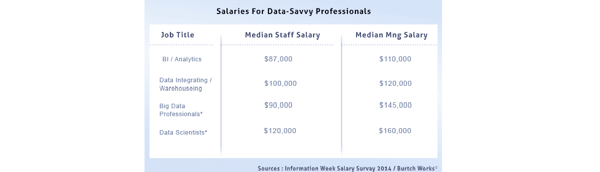

# 云计算中数据科学的重要性

> 原文：<https://www.edureka.co/blog/importance-data-science-cloud-computing/>

分析和存储是大型和小型组织面临的两大挑战。首先，产生的大数据量急剧增加。经济而安全地存储这些数据是一个组织的首要任务之一，而云正是在这个组织中出现的。这引发了雇佣熟练数据分析师、数据工程师，尤其是数据科学家的趋势。

除了数据科学家必须具备的各种技能，如分析、统计和编程，他/她还需要在组织存储数据的新平台上工作。

## **云计算对数据科学的重要性**

数据科学和云计算本质上是齐头并进的。数据科学家通常会分析存储在云中的不同类型的数据。随着大数据的增加，组织越来越多地在线存储大型数据集，因此需要数据科学家。要获得深入的数据科学知识，您可以参加 Edureka 提供的实时数据科学培训，该培训提供全天候支持和终身访问。

让我们看看数据科学家可能在云中工作的数据类型:

*   看看结构化、半结构化和非结构化数据
*   查看不同的数据集，无论其大小、格式等如何。
*   分析它们以得出见解

然而，此类数据的问题是，它们通常位于不同的孤岛中。鉴于存储现在便宜得多，并且开源平台和工具可供数据科学家使用，云是关键。

## **云计算与数据科学家？**

*   云计算可以帮助数据科学家使用 Windows Azure 等平台，这些平台可以提供免费和收费的编程语言、工具和框架。
*   数据科学家通常喜欢使用 Hadoop 等 MapReduce 工具来存储数据，以及 Pig 和 Hive 等检索工具。他们还使用 Python、Java 等其他语言编写程序。
*   通常，数据科学家使用两种类型的工具——开源工具，如 R、Python、Hadoop 框架，以及几种可扩展的机器学习工具和其他更商业化的工具，如 MS SQL、Tableau、Oracle RDB 和 BusinessObjects。
*   鉴于数据集的规模以及工具和平台的可用性，理解云对于数据科学家来说不仅相关，而且至关重要。

**了解我们在顶级城市开设的数据科学与 Python 课程**

| 印度 | 美国 | 其他热门城市 |
| [海得拉巴的数据科学与 Python 培训](https://www.edureka.co/data-science-python-certification-course-hyderabad) | [达拉斯的数据科学与 Python 课程](https://www.edureka.co/data-science-python-certification-course-dallas) | [德里的数据科学与 Python 课程](https://www.edureka.co/data-science-python-certification-course-delhi) |
| [班加罗尔的数据科学与 Python 培训](https://www.edureka.co/data-science-python-certification-course-bangalore) | [夏洛特的 Python 数据科学](https://www.edureka.co/data-science-python-certification-course-charlotte) | [孟买的数据科学与 Python 课程](https://www.edureka.co/data-science-python-certification-course-mumbai) |
| [钦奈的数据科学与 Python 培训](https://www.edureka.co/data-science-python-certification-course-chennai) | [纽约的数据科学与 Python 课程](https://www.edureka.co/data-science-python-certification-course-new-york-city) | [用 Python 进行数据科学西雅图](https://www.edureka.co/data-science-python-certification-course-seattle) |

## **物联网**

根据 Gartner 的数据，到 2020 年，物联网上将有大约 260 亿台设备。试想一下这种互联产生的数据；其中大部分将在云上提供。因此，需要灵活性、多个处理系统和不同的数据集，并且数据科学与云计算密切相关。

## **数据科学家的薪水**

在从事大数据&分析工作时，数据科学家是最受欢迎的人之一。与其他职业的简单比较将清楚地表明事情是如何变化的。

数据科学家所需的技能范围很广，而且这类技能明显短缺，因此薪酬极具竞争力。根据 Burtch Works 的一项调查，工作经验不足 3 年的数据科学家的平均工资约为 90，000 美元，而在管理层，工资可能高达 160，000 美元甚至更多。根据图表显示，管理级别的数据科学家的薪酬比中级大数据专业人员更具竞争力，这进一步重申了数据科学家拥有光明未来的事实。

## **数据科学的未来&云计算**

当组织在两个方面投入最大资源以保持盈利时:大数据和确保数据留在云中。处理数据并将其转移到云组织有两个好处，包括处理用于决策的大型数据集和降低基础架构的总体成本。这两个领域都有巨大的需求和数十亿美元的投资。

如果你想成为一名云工程师或者开始你的云计算职业生涯，现在是时候了。通过获得必要的资格，你可能会成为一名成功的云工程师。你也可以参加网上的 [云计算课程](https://www.edureka.co/masters-program/cloud-architect-training) 。

*此外，Edureka 还特别策划了 [**数据科学与 Python 课程**](https://www.edureka.co/data-science-python-certification-course) ，帮助你获得机器学习算法方面的专业知识，如 K-Means 聚类、决策树、随机森林和朴素贝叶斯。您还将学习统计学、时间序列、文本挖掘的概念，以及深度学习的介绍。新一批[数据科学课程](https://www.edureka.co/executive-programs/advanced-program-data-science-course-iitg)即将开始！！*

有问题要问我们吗？在评论区提到它们，我们会给你回复。