# 使用 Sbteclipse 在 Eclipse IDE 中运行 Scala 应用程序

> 原文：<https://www.edureka.co/blog/running-scala-application-in-eclipse-ide-using-sbteclipse>

这篇博文将帮助你理解如何安装和设置 sbteclipse 插件，以便在 Eclipse IDE 中运行 Scala 应用程序。首先，让我们了解什么是 SBT。维基百科将其定义为“Scala 社区事实上的构建工具，由 Lift web 框架和 Play 框架使用。”它本质上是 Scala 和 Java 项目的开源构建工具，类似于 Java 的 Maven 或 Ant。

它的主要特性有:原生支持编译 Scala 代码并与许多 Scala 测试框架集成使用 DSL 构建用 Scala 编写的描述使用 Ivy(支持 Maven 格式的存储库)进行依赖管理持续编译、测试和部署与 Scala 解释器集成以实现快速迭代和调试支持混合 Java/Scala 项目

然而 Sbteclipse 是 sbt 0.13 的一个插件。为了安装这个插件，你应该先在系统上安装 sbt。让我们先下载 sbt。

指令:wget http://dl . bintray . com/SBT/rpm/SBT-0 . 13 . 8 . rpm

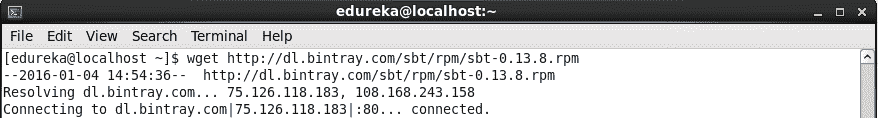

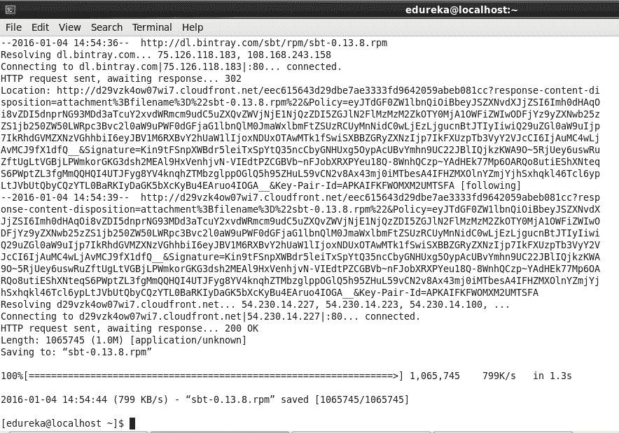

命令:sudo yum local install SBT-0 . 13 . 8 . rpm

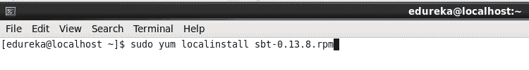

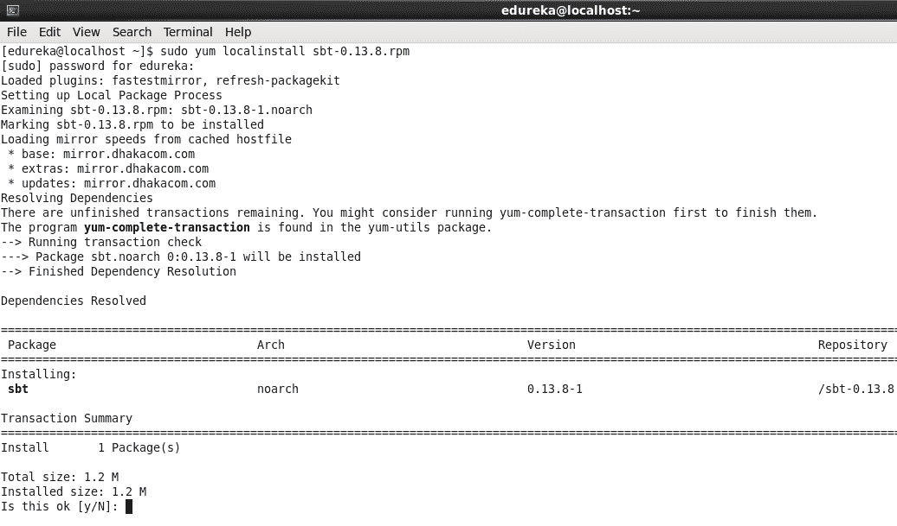

指令:wget http://dl . bintray . com/SBT/rpm/SBT-0 . 13 . 8 . rpm

现在让我们检查 sbt 版本。命令:SBT–版本

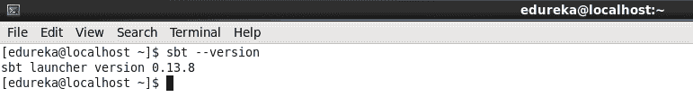

要将项目导入 Eclipse，必须将 sbteclipse 添加到插件定义文件中。你可以在~/使用任何一个全局的。sbt/plugins/plugins.sbt 或 PROJECT _ DIR/PROJECT/plugins . SBT 中特定于项目的文件:

让我们全局添加插件，这样我们就不需要在每个项目中单独添加了。这样做的步骤是:在里面做一个插件目录。sbt/0.13/ 命令:mkdir -p .sbt/0.13/plugins 创建文件 plugins.sbt 命令:sudo gedit。sbt/0.13/plugins/plugins.sbt

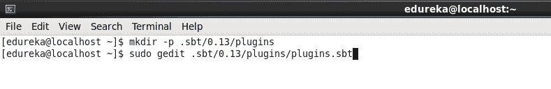

为了添加 sbteclipse 插件，只需将此设置添加到该文件中。

addSbtPlugin(" com . type safe . sbteclipse " % " sbteclipse-plugin " % " 4 . 0 . 0 ")

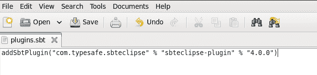

现在 sbteclipse 插件已经设置好了。一旦安装完成，我们将能够在启动 sbt 时使用额外的命令 eclipse。这些是 sbt 直接运行项目的步骤。接下来我们将学习如何在 eclipse 中运行项目。 sbt 包

mkdir hello worldCD hello world/mkdir-p src/main/Scalasudo gedit src/main/Scala/hello . Scala

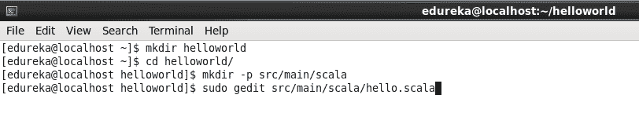

把这段代码:

对象你好{

def main(args:Array[String])= {println(" Hello World ")}}

在 helloworld 目录中创建一个 build.sbt 文件。

sudo gedit build.sbt

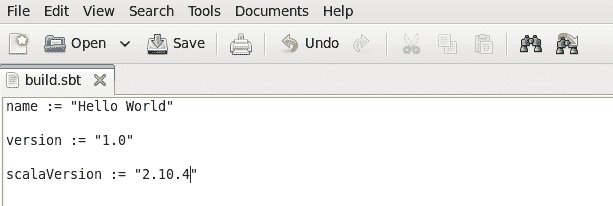

下面是一个非常基本的 sbt 文件，您可以在其中添加应用程序所需的依赖项。

sbt 软件包

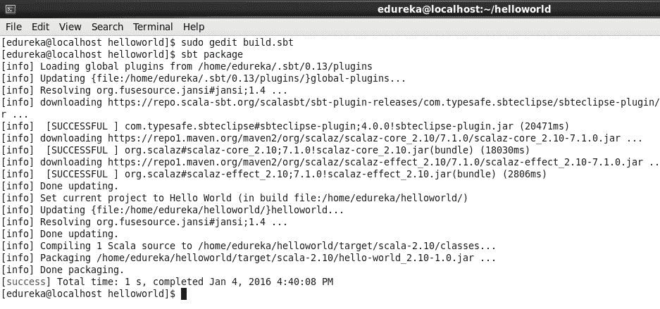

这将创建 jar 文件来运行这个应用程序。现在运行这个命令来运行您的应用程序。

命令:spark-submit–class " Hello "–master local[2]target/Scala-2.10/Hello-world _ 2.10-1.0 . jar

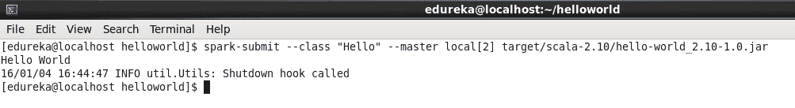

## Sbt 日蚀

下面的命令将使项目 eclipse 兼容，您将能够在 eclipse 中导入这个项目并成功运行它。命令:sbt eclipse

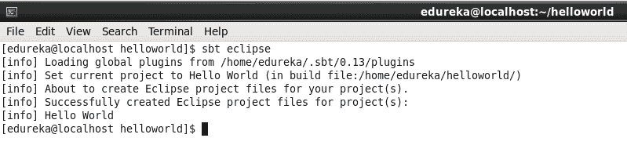

进入 Scala IDE，文件->导入

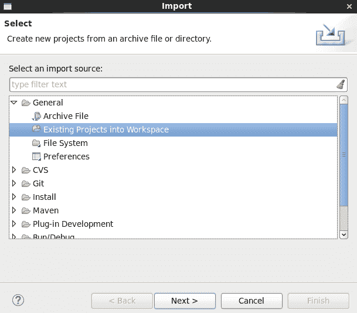

选择根目录 helloworld。

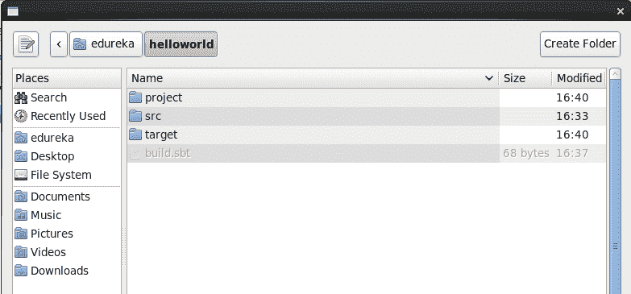

您现在可以看到，您可以通过单击 Finish 来导入这个项目。

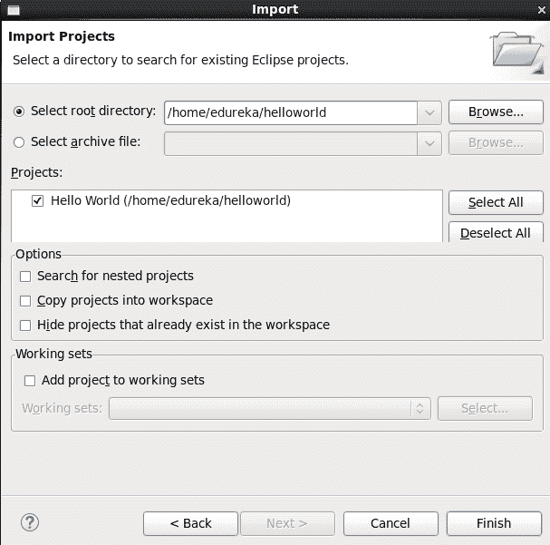

现在，让我们将它作为 Scala 应用程序运行。

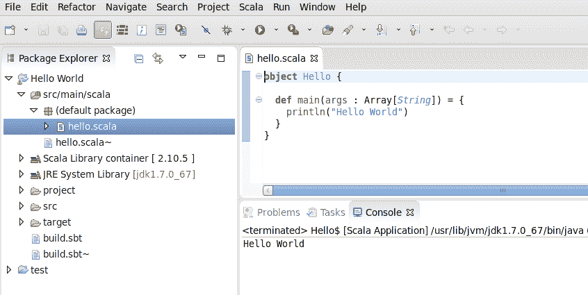

仅供参考，当你在设置 SparkConf 时，一定要记住如下设置 Master。

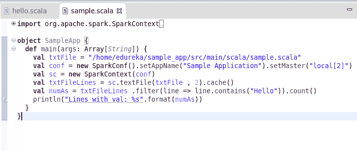

现在您可以运行您的应用程序了。

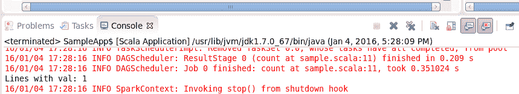

有问题要问我们吗？请在评论区提出来，我们会回复你，或者你也可以今天就加入我们的 [Scala 认证](https://www.edureka.co/apache-spark-scala-certification-training)..

**相关帖子:**

[Apache Spark Vs Hadoop MapReduce](https://www.edureka.co/blog/apache-spark-vs-hadoop-mapreduce "Spark Vs MapReduce")

[学习阿帕奇星火的 5 个理由](https://www.edureka.co/blog/5-reasons-to-learn-apache-spark/ "5 reasons to learn Apache Spark")

[阿帕奇卡夫卡与火花串流:实时分析重新定义](https://www.edureka.co/blog/videos/apache-kafka-with-spark-streaming-real-time-analytics-redefined/ "Apache Kafka with Spark streaming")