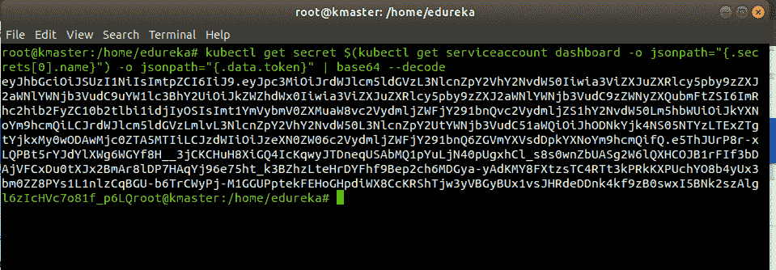
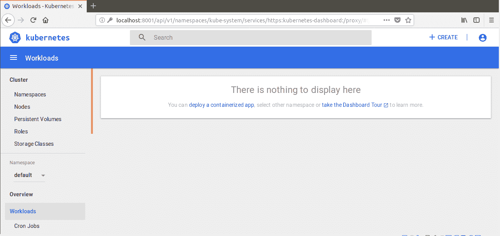
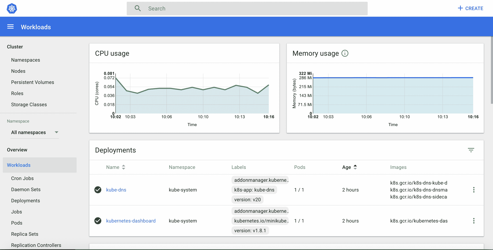
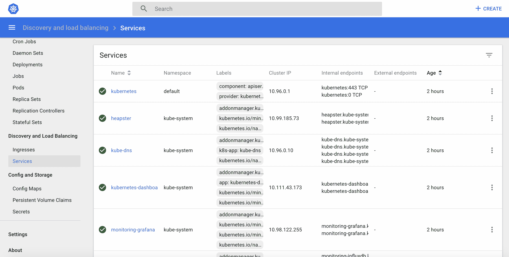
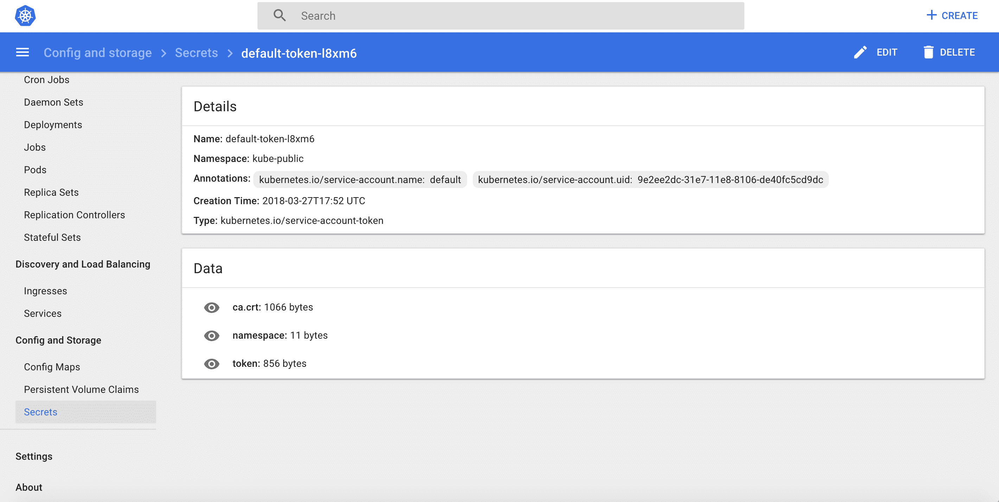

# Kubernetes 仪表板安装和视图

> 原文：<https://www.edureka.co/blog/kubernetes-dashboard/>

Kubernetes Dashboard 是一个用于 Kubernetes 集群的基于 web 的通用用户界面。它允许用户管理集群中运行的应用程序并对其进行故障排除，以及管理集群本身。因此，如果你想获得 Kubernetes 认证，并掌握这个工具，你可以通过 [Kubernetes 认证](https://www.edureka.co/kubernetes-certification)提升你作为 DevOps 工程师的职业生涯。

所以在进入之前，让我们看看有哪些话题，我们将在这个博客中讨论:

*   [什么是 Kubernetes 仪表盘？](#WhatisKubernetesDashboard?)
*   [安装 Kubernetes 仪表盘](#InstallingtheKubernetesDashboard)T5
*   [Kubernetes 仪表盘 UI 视图](#ViewsoftheKubernetesDashboardUI)

## **什么是 Kubernetes 仪表盘？**

Kubernetes 仪表板是一个基于网络的 Kubernetes 用户界面，用于 将容器化的应用程序部署到 Kubernetes 集群，对应用程序进行故障排除，以及管理集群本身及其附带资源。

### **Kubernetes 仪表盘的用途**

*   了解集群上运行的应用程序的概况。
*   创建或修改单个 Kubernetes 资源，例如部署、工作等。
*   它提供了集群中 Kubernetes 资源的状态信息，以及可能发生的任何错误的信息。

## **安装 Kubernetes 仪表盘**

**如何部署 Kubernetes Dashboard？**

运行以下命令来部署仪表板:

```
`kubectl create -f https://raw.githubusercontent.com/kubernetes/dashboard/master/src/deploy/recommended/kubernetes-dashboard.yaml` 
```

## **使用 kubectl** 访问仪表板

```
kubectl proxy
```

它将在你的机器和 Kubernetes API 服务器之间代理服务器。

现在，要在浏览器中查看仪表板，请在主虚拟机的浏览器中导航到以下地址:

```
http://localhost:8001/api/v1/namespaces/kube-system/services/https:kubernetes-dashboard:/proxy/
```

该页面将提示您输入凭证:

## ****

## **创建集群管理服务账号**

在这一步中，我们将为仪表板创建服务帐户并获取其凭据。 ***注意**:在一个**新终端**中运行所有这些命令，否则你的 kubectl 代理命令会停止。*

运行以下命令:

该命令将在默认名称空间中为仪表板创建一个服务帐户

```
kubectl create serviceaccount dashboard -n default
```

将集群绑定规则添加到您的仪表板帐户

```
kubectl create clusterrolebinding dashboard-admin -n default  --clusterrole=cluster-admin  --serviceaccount=default:dashboard
```

使用以下命令复制您的仪表板登录所需的密钥:

```
kubectl get secret $(kubectl get serviceaccount dashboard -o jsonpath="{.secrets[0].name}") -o jsonpath="{.data.token}" | base64 --decode
```



通过选择令牌选项,复制秘密令牌并将其粘贴到仪表板登录页面

## ****

登录后，您将进入 Kubernetes 主页。

**主页** 您将看到主页/欢迎页面，在其中 您可以查看在您的集群的 `kube-system` 命名空间中默认运行哪些系统应用程序，例如仪表板本身。

## ****

## **Kubernetes 仪表盘 UI 视图**

Kubernetes 仪表板由以下仪表板视图组成:

*   管理视图
*   工作量视图
*   服务视图
*   存储和配置视图

让我们从管理视图开始。

### **管理视图**

它列出了节点、名称空间和持久卷，并提供了它们的详细视图，其中节点列表视图包含所有节点上汇总的 CPU 和内存使用情况指标，详细视图显示了节点的指标、其规格、状态、分配的资源、事件以及在该节点上运行的 pod。


### **工作量视图**

入口点视图显示了在所选名称空间中运行的所有应用程序。它汇总了有关工作负载的可操作信息，例如，副本集的就绪 Pod 数量或 Pod 的当前内存使用情况。



### **服务视图**

它展示了 Kubernetes 资源，这些资源允许向外部世界公开服务并在集群中发现它们。



### **存储和配置视图**

存储视图显示应用程序用于存储数据的持久卷声明资源，而 配置视图用于显示所有用于集群中运行的应用程序的实时配置的 Kubernetes 资源。




*有问题吗？请在持续集成工具评论部分提及它，我们将会回复您，或者今天就参加我们在阿格拉的 [Kubernetes 培训。](https://www.edureka.co/kubernetes-certification-training-course-agra-city)*