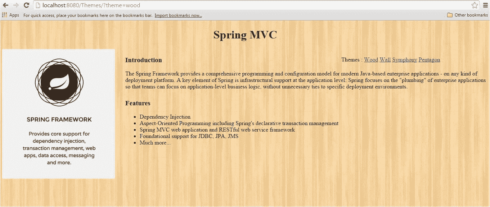
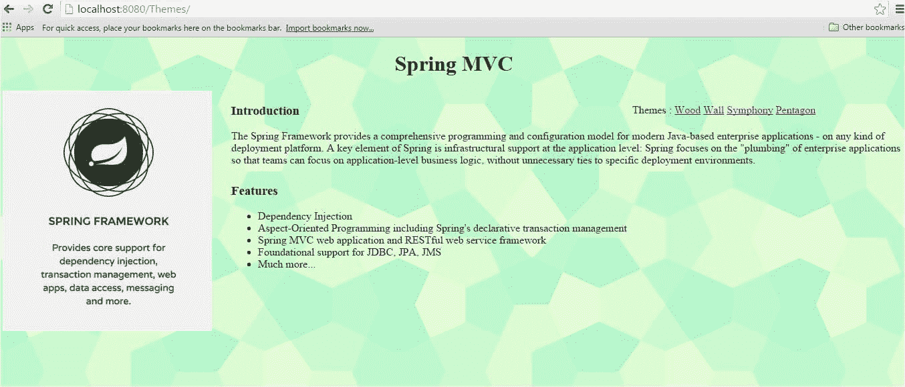
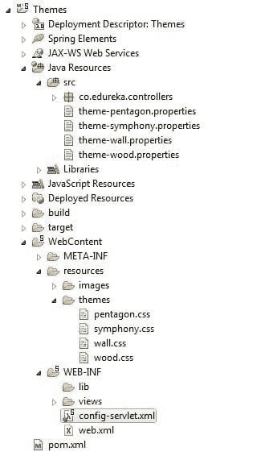
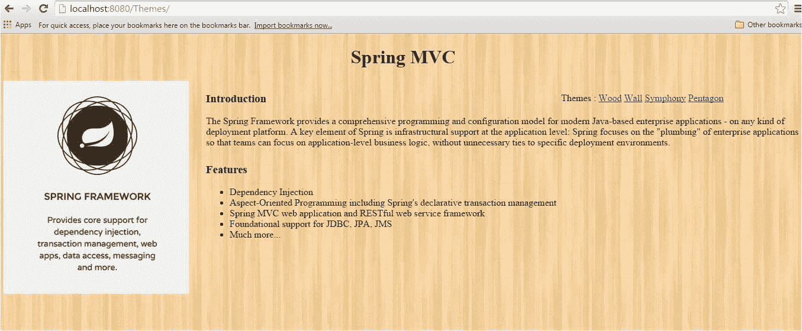
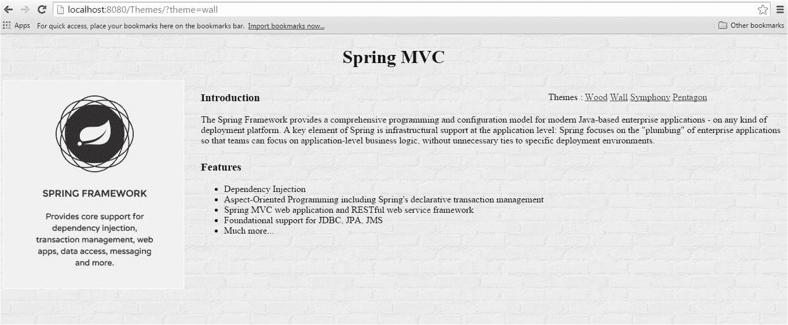
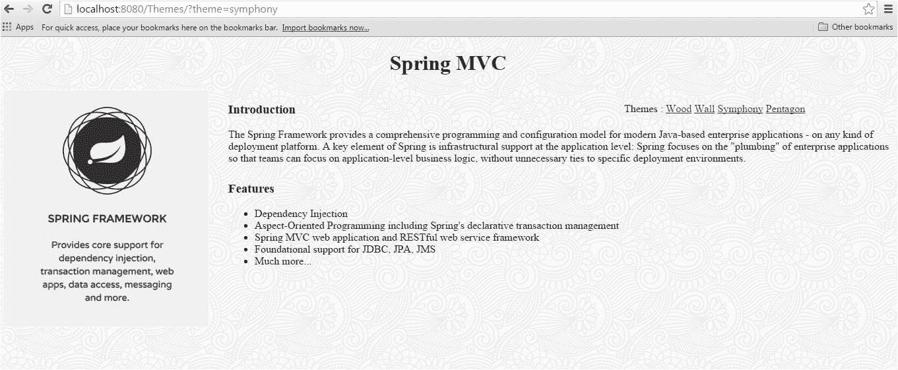
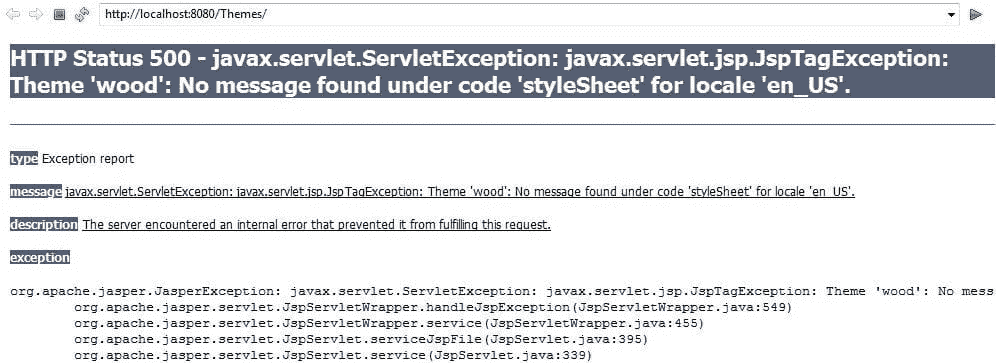

# 如何使用 Spring MVC 主题

> 原文：<https://www.edureka.co/blog/how-to-use-spring-mvc-themes/>

如果我们只需一次点击就能改变 web 应用程序的外观和感觉，那该有多好。Spring MVC 框架就是这么做的。它允许您更改应用程序的外观，从而增强用户体验。

## **什么是主题？**

主题是静态资源的集合，通常是影响应用程序视觉风格的样式表和图像。下面给出了使用不同主题的应用程序的快照

**木头主题**

[](https://www.edureka.co/blog/wp-content/uploads/2015/06/wood-theme.jpg)

**五边形主题**

[](https://www.edureka.co/blog/wp-content/uploads/2015/06/pentagon-theme.jpg)

## **如何使用 Spring MVC 主题？**

要在 Spring web 应用程序中使用主题，您必须设置一个**org . Spring framework . ui . context . theme source**接口的实现。这里我们将使用**org . spring framework . ui . context . support . resourcebundlethemesource**实现从类路径的根加载属性文件。

使用 ResourceBundleThemeSource 时，主题是在一个简单的属性文件中定义的。属性文件列出了组成主题的资源。这里有一个例子:

```
styleSheet=/themes/wood.css
```

属性的关键字是从视图代码(例如 JSP 文件)中引用主题元素的名称。

对于 JSP，我们使用 **spring:theme** 定制标签。以下 JSP 片段使用示例中定义的主题来自定义外观:

```
< %@ taglib prefix="spring" uri="http://www.springframework.org/tags"%>
< html>
    < head>
        < link rel="stylesheet" href="< spring:theme code='styleSheet'/>" type="text/css"/>
    < /head>
    < body>
        ...
    < /body>
< /html>
```

**配置主题？**

在 bean 定义文件中配置 ResourceBundleThemeSource bean。

```
< bean id="themeSource" class="org.springframework.ui.context.support.ResourceBundleThemeSource">
	< property name="basenamePrefix" value="theme-" />
< /bean>
```

注意，我们已经将 bean 的 basnamePrefix 属性设置为“theme-”,默认情况下，ResourceBundleThemeSource 使用一个空的基本名称前缀。

因此，属性文件应该命名为主题文件名。属性，如主题木材。属性，主题五边形。属性等。

**主题解析器**

定义主题后，由 ThemeResolver 实现决定使用哪个主题。Spring 提供了各种主题解析器，例如:FixedThemeResolver、SessionThemeResolver、CookieThemeResolver。

在这个例子中，我们将使用 CookieThemeResolver 实现，其中选择的主题存储在客户端的 cookie 中。

**配置主题解析器**

```
< bean id="themeResolver" class="org.springframework.web.servlet.theme.CookieThemeResolver">
	< property name="defaultThemeName" value="wood" />
< /bean>
```

注意:我们已经将默认主题设置为木材。因此，当用户第一次访问 web 应用程序时，wood 主题将生效。

**主题拦截器**

为了让用户只需点击一下就能改变主题，Spring 提供了 ThemeChangeInterceptor。下面是 bean 定义文件中 ThemeChangeInterceptor 的配置

```
< bean id="themeChangeInterceptor" class="org.springframework.web.servlet.theme.ThemeChangeInterceptor">
	< property name="paramName" value="theme" />
< /bean>
```

我们已经将属性 paramName 的值指定为 theme，这意味着无论何时使用具有不同值的参数“theme”发出请求，都将调用 ThemeChangeInterceptor。

我们还需要配置上面定义为拦截器的 themechangeectorbean。我们可以使用 **mvc:拦截器**来实现

```
< mvc:interceptors>
   < ref bean="themeChangeInterceptor">< /ref>
< /mvc:interceptors>
```

**项目结构:**

下面是 Eclipse IDE 中项目结构的快照

[](https://www.edureka.co/blog/wp-content/uploads/2015/06/theme-project-structure.jpg)

让我们看看 src 文件夹下的 theme-pentagon.properties 文件

```
 styleSheet=themes/pentagon.css
```

只有一行，它定义了获取相应 CSS 文件的 URL。同样，对于其他属性文件，如主题交响乐，主题木材，主题墙。

在每个属性文件中，只有一行引用 CSS 文件的 URL。

因此，每当 ThemeChangeInterceptor 截获主题中的更改时，它将查找相应的属性文件，并尝试按照属性文件中指定的 URL 访问 CSS 文件。

因为我们所有的主题(CSS 文件)都在 resources/themes 文件夹下。我们必须将 themes/css-filename 配置为 resources/themes/css-filename，否则属性文件将无法找到 css 文件。我们可以使用 mvc:resources 来实现，如下所示:

```
< mvc:resources mapping="/themes/**" location="/resources/themes/">< /mvc:resources>
```

**wood.css**

在 wood.css 文件中，我们只需更改 body 标签的背景图像。但是你不仅仅局限于改变背景图片，你还可以改变文本样式、字体、颜色等等。

```
body {
	 background-image : url("/Themimg/wood_pattern.png");
}
```

**家庭控制器**

我们有一个简单的 HomeController，它将为运行主题应用程序的 home.jsp 页面提供服务

```
@Controller
public class HomeController {

	@RequestMapping("/")
	public String getHomePage(){
		return "home";
	}

}
```

**运行主题应用**

现在，我们已经准备好运行主题应用程序了。在运行该应用程序时，你会看到 home.jsp 页面带有木质(我们声明为默认)主题

[](https://www.edureka.co/blog/wp-content/uploads/2015/06/theme-homepage.jpg)

让我们通过点击 home.jsp 页面右侧的主题链接来探索其他主题。

**墙壁主题**

[](https://www.edureka.co/blog/wp-content/uploads/2015/06/wall-theme.jpg)

**交响乐主题**

[](https://www.edureka.co/blog/wp-content/uploads/2015/06/symphony-theme.jpg)

**注意:**点击不同主题链接，查看 URL 的变化。在点击一个主题链接时，例如 wood，一个带有值 wood 的请求参数主题被发送到服务器。ThemeChangeInterceptor 截获主题中的更改，并显示适当的主题。

**使用主题时遇到的问题**

下面是一些你在使用主题时应该注意的重要问题

*   确保您的属性文件在类路径中。为此，将属性文件直接放在 src 文件夹下。如果您的属性文件不在类路径中，您将得到 ServletException，说“Theme 'wood ':在区域设置' en_US '的代码' styleSheet '下找不到消息”。如果找不到属性文件，您将会遇到以下错误消息

[](https://www.edureka.co/blog/wp-content/uploads/2015/06/classpath-error.jpg)

*   要记住的下一个要点是我们在属性文件中用来链接到 CSS 的 URL。注意，在属性文件中，我们提到了 URL themes/css-file-name 来查找主题文件。不要忘记将这个 URL 映射到保存 CSS 文件的实际位置。要进行映射，请使用 mvc:resources，正如我们在本例中所做的:<resources mapping="”/themes/**”" location="”/resources/themes/”">。如果你忘记做映射，你将不会得到任何错误信息，但是主题将不会工作，因为它将不能访问 CSS 文件</resources>

*   使用 Spring 主题时可能犯的最后一个愚蠢的错误是，不要在 JSP 文件中使用 spring:theme 标签。注意，我们在 home.jsp 页面中使用了 spring:themes 标签。要让主题发挥作用，Spring 主题标签是必需的。

和往常一样，如果您有兴趣自己尝试代码，请下载它。

【button leads form _ title = " Download Code " redirect _ URL = https://edu reka . wistia . com/medias/f 7v 8 yqavdp/Download？media _ file _ id = 79851340 course _ id = 62 button _ text = "下载代码"]

有问题要问我们吗？请在评论区提到它，我们会给你回复。

**相关帖子:**

[Java 入门/J2EE](https://www.edureka.co/java-j2ee-soa-training)

[使用 JSP Servlet 创建在线测验应用程序](https://www.edureka.co/blog/creating-an-online-quiz-application-using-jsp-servlet/)

[使用 SAX 解析器解析 XML 文件](https://www.edureka.co/blog/parsing-xml-file-using-sax-parser/)

[用 JAX-WS](https://www.edureka.co/blog/how-to-write-restful-web-services-with-jax-ws/) 编写 RESTful Web 服务

开始参加[春季认证](https://www.edureka.co/spring-certification-course)课程