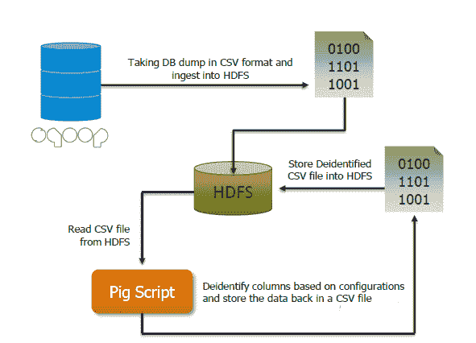
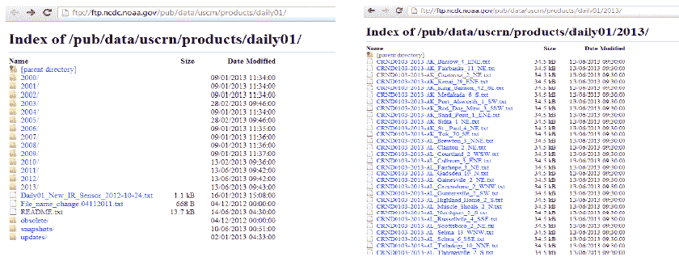
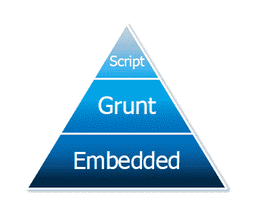
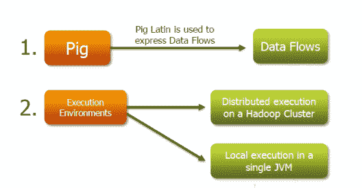
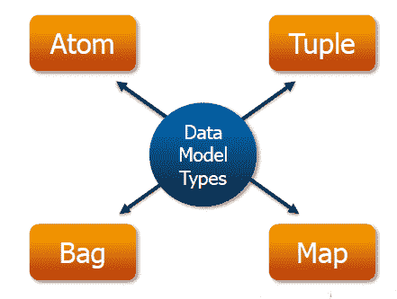

# 猪简介

> 原文：<https://www.edureka.co/blog/introduction-to-pig/>

[//www.youtube.com/embed/J0Nc8qJCO9s](//www.youtube.com/embed/J0Nc8qJCO9s)

## **什么是猪和猪拉丁语？**

Pig 是一个开源的高级数据流系统。它提供了一种简单的语言，称为 Pig Latin，用于查询和数据操作，然后编译到运行在 Hadoop 上的 MapReduce 作业中。

Pig 很重要，因为像雅虎、谷歌和微软这样的公司正在以点击流、搜索日志和网络爬行的形式收集大量的数据集。Pig 还用于对所有信息进行特定形式的处理和分析。

## **为什么需要猪？**

*   这很容易学，尤其是如果你熟悉 SQL 的话。
*   Pig 的多重查询方法减少了数据扫描的次数。这意味着与编写原始 MapReduce 相比，只需要 1/20 的代码行和 1/16 的开发时间。

*   Pig 的性能与原始 MapReduce 相当
*   Pig 提供数据操作，如过滤、连接、排序等。以及 MapReduce 中缺少的嵌套数据类型，如元组、包和地图。
*   猪拉丁语很容易写和读。

## **猪为什么被创造出来？**

Pig 最初是由 Yahoo 在 2006 年开发的，为研究人员提供了一种在非常大的数据集上创建和执行 MapReduce 作业的特别方法。创建它是为了通过多查询方法减少开发时间。Pig 也是为非 Java 背景的专业人员创建的，以使他们的工作更容易。你甚至可以通过 [数据工程师课程](https://www.edureka.co/microsoft-azure-data-engineering-certification-course) 了解大数据的细节。

## **Pig 应该用在哪里？**

清管器可用于以下情况:

*   当数据加载对时间敏感时。
*   处理各种数据源时。
*   当需要通过采样获得分析见解时。

## **哪里不用猪？**

*   在数据完全非结构化的地方，如视频、音频和可读文本。
*   在存在时间限制的地方，as Pig 比 MapReduce 作业要慢。
*   在需要更多功率来优化代码的地方。

## **阿帕奇猪的应用:**

*   网络日志的处理。
*   搜索平台的数据处理。
*   支持跨大型数据集的即席查询。
*   处理大型数据集的算法的快速原型。

## **雅虎如何！**用途猪:

雅虎使用 Pig 的目的如下:

*   **In Pipelines**–从其网络服务器获取日志，这些日志经过清理步骤，删除僵尸程序、公司间隔视图和点击。
*   **在研究中**——快速写一个脚本来测试一个理论。Pig 集成使得研究人员可以轻松地获取 Perl 或 Python 脚本，并针对庞大的数据集运行它。

## **猪在医疗领域的用例:**

上图清晰、逐步地解释了数据如何流经 Sqoop、HDFS 和 Pig 脚本。

## **对比 MapReduce 和 Pig 使用的天气数据:**

来源:ftp://ftp.ncdc.noaa.gov/pub/data/uscrn/products/daily01/

## **猪的基本程序结构:**

<figure id="attachment_11021" aria-describedby="caption-attachment-11021" style="width: 356px" class="wp-caption aligncenter">

<figcaption id="caption-attachment-11021" class="wp-caption-text">Source: Pig Wiki</figcaption>

</figure>

以下是 Pig 程序结构的层次结构:

*   **脚本**–Pig 可以运行包含 Pig 命令的文件脚本。猪剧本。运行本地文件 script.pig 中的命令
*   这是一个用于运行 Pig 命令的交互式 shell。也可以使用 run 和 exec 从 Grunts 内部运行 pig 脚本。
*   **嵌入式**–可以从 Java 运行 Pig 程序，就像你可以使用 JDBC 从 Java 运行 SQL 程序一样。

## **猪的成分:**

## **什么是猪拉丁程序？**

Pig Latin 程序由一系列应用于输入数据以产生输出的操作或转换组成。Pig 的工作是将转换转换成一系列 MapReduce 作业。华盛顿 [蔚蓝数据工程认证](https://www.edureka.co/microsoft-azure-data-engineering-certification-course-washington) 可以更好的了解。

## **Pig 中数据模型的基本类型:**

Pig 由 4 种基本类型的数据模型组成。它们如下:

*   atom–它是一个简单的原子数据值。它以字符串的形式存储，但可以作为字符串或数字使用
*   元组–一组有序的字段
*   bag–元组的集合。
*   map–一组键值对。

有问题要问我们吗？在评论区提到它们，我们会给你回复。

**相关帖子:**

[阿帕奇猪 UDF–Eval，聚合&过滤函数](https://www.edureka.co/blog/apache-pig-udf-part-1-eval-aggregate-filter-functions/ "Apache Pig UDF: Part 1 – Eval, Aggregate & Filter Functions")

[阿帕奇猪中的运算符——关系运算符](https://www.edureka.co/blog/operators-in-apache-pig/ "Operators in Apache Pig: Part 1- Relational Operators")

[大数据和 Hadoop 培训](https://www.edureka.co/big-data-and-hadoop)