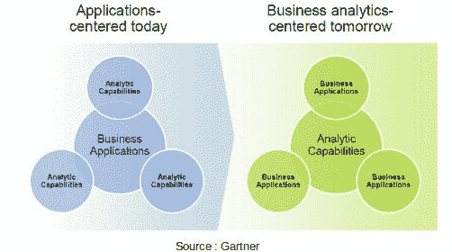
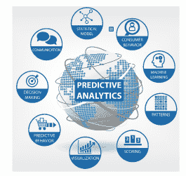
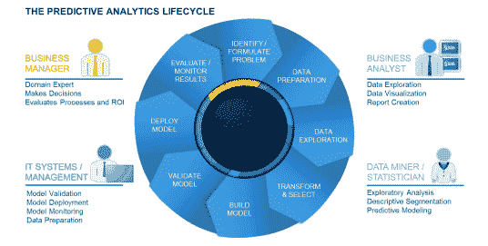
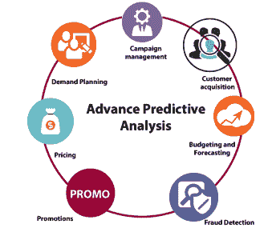
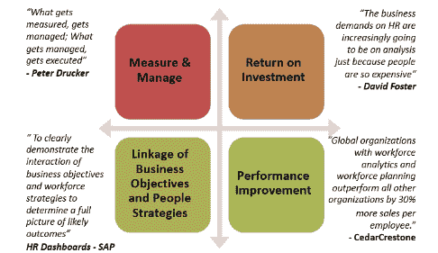
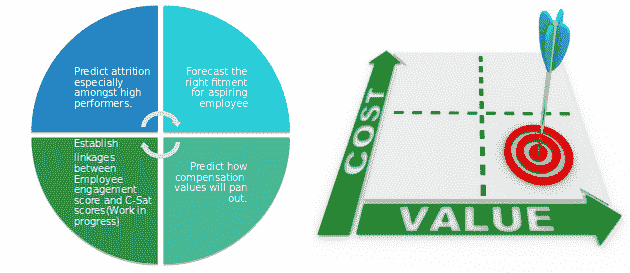
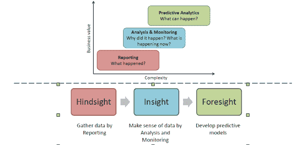
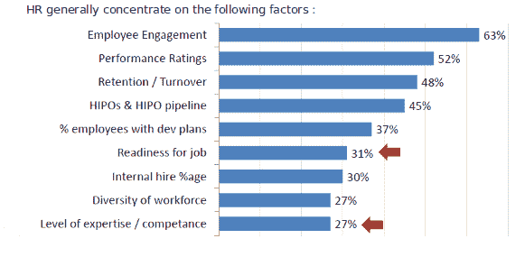
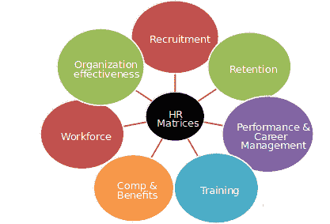

# 预测分析如何帮助您应对员工流失

> 原文：<https://www.edureka.co/blog/learn-how-predictive-analysis-can-help-you-combat-employee-attrition/>

分析的目的不仅仅是了解你为什么会失去一名员工，而是如何防止你失去一名员工。洞察力是预测分析的灵魂。组织创建和使用数据的方式正在改变生活、工作或休闲的过程。

该网络研讨会博客重点关注更聪明的组织如何采用预测分析，并且这样做是正确的！它还详细阐述了以下主题:

*   商业智能与商业分析。
*   分析的类型。
*   为什么选择预测分析？
*   预测分析创造奇迹的领域。
*   人力资源分析的优势。
*   人力资源分析的实时示例。

## **商业智能 VS 商业分析:**

商业智能基本上就是你的企业正在发生的事情。它用于能见度。数据仓库和可视化仪表板是 BI 的推动者。而巴则是它发生的原因；未来可能发生的事情。它用于调查、预测和处方。数据分析和数据科学是 BA 的推动因素。

## **分析类型:**

有三种类型的分析:

*   描述性:帮助你理解事情进展的分析。
*   预测:帮助您预测未来绩效和结果的分析。
*   说明性的:建议规定步骤或行动的分析。

## **下一代分析:**

这超越了测量和描述过去，延伸到预测可能发生的事情和优化应该发生的事情。

## **未来分析:**

## **什么是预测分析？**

预测分析是通过使用统计算法和机器学习技术对数据进行分析，以根据历史数据确定未来结果的可能性。

## **预测分析的生命周期:**

让我们看看下图，以了解预测分析的生命周期:

## **预测分析的优势:**

预测分析有助于分析过去的业务绩效，以便获得能够推动业务决策和行动的洞察力。

## **为什么要预测分析？**

《福布斯》称，三分之二到四分之三的高管的首要目标是培养建模和预测行为的能力，以便能够根据手头的分析实时做出个人决策。

## **使用预测分析的主要领域:**

预测分析不再是数据科学家的唯一领域。随着预测分析软件变得越来越容易使用，该技术被各行各业采用也就不足为奇了。使用预测分析的一些主要领域包括银行、电子商务、人力资源、零售、运输、医疗保健、IT 行业等。

让我们看看预测分析如何防止员工流失:

## **什么是流失或减员？**

流失是指客户减少使用或完全停止使用你的产品或服务。他们会离开你的品牌，可能会购买你的竞争对手的产品。客户流失预测是一个常见的应用程序，在这种应用程序中，客户流失的数量通常比留下来的客户数量少。

## **为什么 HR 需要分析？**

让我们看看下面的图表，了解分析如何帮助人力资源:

从预测高绩效员工的流失到预测薪酬值的结果，人力资源可以从预测性分析中受益匪浅:

## 

## **分析学中的阶段:**

下图解释了分析中涉及的不同阶段:

## **一个 HR 正常衡量什么:**

## 

## **预测分析可以测量什么？**

除了上述因素，人力资源还应该注意:

## 

## **常见 HR 要避免的错误:**

1.即使没有明确的业务原因，也要保持指标的活力。

2.仅仅依靠一些指标来评估员工的表现。聪明的员工可以玩系统。

3.在分析被接受之前坚持 100%准确的数据——这相当于永远不做决定。

4.仅仅根据简单的标准来评估员工，比如成绩和考试分数，这通常不能准确预测成功。

5.使用分析来雇用低层员工，但不在评估高层管理人员时使用。

6.仅分析人力资源效率指标，而未能解决人才管理对企业绩效的影响。

## **预测分析是游戏规则改变者:**

预测分析可以精确地确定特定商店员工敬业度提高 0.1%的价值。例如，在百思买，价值超过商店年营业收入的 10 万美元。

许多公司青睐来自名校、学习成绩优异的求职者——但美国电话电报公司和谷歌通过定量分析发现，表现出主动进取的能力更能预示工作表现出色。

Sprint 已经确定了最能预测哪些员工将在相对较短的时间后离职的因素。在三周内，甲骨文就能预测出哪些优秀员工会离开公司，以及离开的原因。这一信息现在正在推动留住关键员工的全球政策变化，并提供了经批准的业务案例，以扩大预测高绩效员工的范围。

## **高级和预测分析应用:**

**问题陈述:**

印度跨国公司有一个线性增长模型。它希望确定%收入增长和%员工增长之间的关系。他们有过去 10 年的收入和员工人数的详细资料。

**解决方法:**

*   根据数据类型确定相关系数，并绘制散点图。
*   鉴于下一年的收入增长率预计为 X%,我们可以预测员工人数的增长。

**问题陈述:**

人力资源经理确定了 20 个变量，如学历、大学、年龄、性别、国籍等。预测招聘效率。他想找出影响招聘效率的互斥变量。

**解决方法:**

*   使用因子分析，可以识别相互排斥的因子。

## **成功关键:**

*   发展数据驱动的决策文化。
*   业务和劳动力信息的透明度。
*   授权给直线领导，而不仅仅是 HR 和 L&D。
*   分析应该被视为一个旅程，而不是终点。

## **下面是 PPT 演示:**

[//www.slideshare.net/slideshow/embed_code/key/rUDyrux3Lx4yuo](//www.slideshare.net/slideshow/embed_code/key/rUDyrux3Lx4yuo)

[//www.slideshare.net/slideshow/embed_code/key/rUDyrux3Lx4yuo](//www.slideshare.net/slideshow/embed_code/key/rUDyrux3Lx4yuo)

有问题要问我们吗？在评论区提到它们，我们会回复你。

**相关帖子:**

[数据科学入门](https://www.edureka.co/data-science)