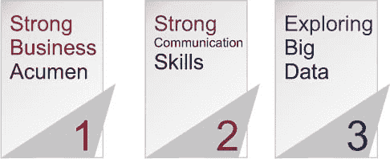
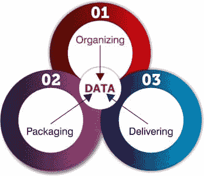
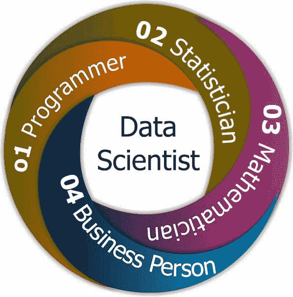
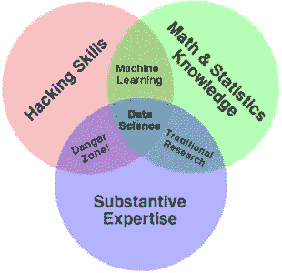
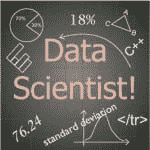

# 谁是数据科学家？

> 原文：<https://www.edureka.co/blog/who-is-a-data-scientist/>

## **谁是数据科学家？**

*前几天，我在 venturebeat.com 的[上读到一篇文章](http://venturebeat.com/2013/05/19/obama-campaigns-chief-data-guy-gets-candid-about-the-data-strategy-that-won-the-election/)，揭示了先进的数据分析如何帮助奥巴马赢得 2012 年总统大选！这个故事以及更多像美国银行受益于其数据密集型技术或 Wipro 向美国数据科学公司投资 3000 万美元或 Paypal 招聘数据科学家的故事，清楚地反映了数据科学家是哈佛大学引用的 21 世纪最性感的工作。*

*听了这么多数据科学的东西，还是来点基础的吧！*

**什么是数据科学？**

有人称其为*土木工程*的数据，也有人称其本身为*学科*；毕竟，*数据科学*到底是什么？

***数据科学是 EMC 2 开始流行的一个术语。它是一个从“数据”中提取有价值见解的过程。***

*您可以浏览“谁是数据科学家”的网络研讨会录像，我们的[专家](https://www.edureka.co/masters-program/data-scientist-certification)已经详细解释了该主题。*

**谁是数据科学家？如何成为一名数据科学家？爱德华卡**

[//www.youtube.com/embed/M3m52htoNns?rel=0&controls=0&showinfo=0](//www.youtube.com/embed/M3m52htoNns?rel=0&controls=0&showinfo=0)

这个关于“谁是数据科学家”的 Edureka 视频将帮助您了解数据科学家的工作、角色和职责，以及数据科学概况。

我们生活在 [**大数据**](https://www.edureka.co/blog/the-hype-behind-big-data/) 时代，数据科学正在成为一个非常有前途的领域，可以利用和处理来自各种来源的海量数据。数据科学本身是一门庞大的学科，由统计、数学、编程、计算机科学等专业技能组成。数据科学由几种元素、技术和理论组成，包括数学、统计学、预测分析、数据建模、数据工程、数据挖掘和可视化。

数据科学的学科不是一夜之间发展起来的。事实上，它已经以商业分析或竞争情报的形式存在多年了，但直到现在它的真正潜力才被意识到。数据科学的主要目的是有效地提取和解释数据，并以简单、非技术性的语言将其呈现给最终用户。

***因此，数据科学就是构建有用的信息，从而将其转化为数据驱动的产品！***

#### **谁是数据科学家？**

*他/她是一个整日整夜与数据搏斗或者在他/她的实验室里用复杂的数学做实验的人吗？毕竟‘谁是数据科学家’？*

这里有几个关于数据科学家的定义。简单地说，数据科学家就是实践数据科学艺术的人。非常流行的术语“*数据* *科学家”*是由 *DJ 帕蒂尔*和*杰夫·哈默巴赫尔*创造的。数据科学家是那些利用他们在某些科学领域的专业知识来解决复杂数据问题的人。他们研究与数学、统计学、计算机科学等相关的几个要素(尽管他们可能不是所有这些领域的专家)。

***数据科学家是商业分析师还是数据分析师，有区别！***

*虽然所有这些学科的初始培训或基本要求都差不多，但数据科学家要求:*

*无论是农业科学家希望了解今年小麦产量与去年相比的增长百分比(以及相关原因)，还是金融公司希望根据客户的信用度对其进行分类(在发放贷款之前)，或者零售组织希望向其忠诚的客户奖励额外积分，都需要数据科学家来处理大量结构化和非结构化数据，以便做出关键的业务决策。*

当今数据科学家面临的主要挑战不是找到现有业务问题的解决方案，而是找出对组织及其成功最关键的问题。

### **为什么数据科学家被称为‘数据科学家’？**

“数据科学家”一词是在考虑到数据科学家从科学领域和应用程序(无论是统计还是数学)中获取大量信息后创造出来的。他们充分利用最新技术来寻找解决方案并得出对组织的成长和发展至关重要的结论。与结构化和非结构化形式的原始数据相比，数据科学家以更有用的形式呈现数据。

就像任何其他科学学科一样，数据科学家总是需要对他们可用的数据提出疑问并找到答案 ***什么****如何****谁**和**为什么*** 。他们需要制定一个明确的计划，并努力在有限的时间、精力和金钱内实现目标。

## **数据科学三要素:**

 数据科学由三个部分组成，即组织、包装和传递数据(数据的 OPD)。让我们来简单了解一下这些:

**1。组织数据:** 组织是在应用了数据处理的最佳实践之后，对数据的物理存储和结构进行规划和执行的地方。

**2。打包数据:** 打包是创建原型、应用统计和开发可视化的地方。它包括在逻辑上和美学上以可呈现的形式修改和组合数据。

**3。交付数据:** 交付是讲述故事和接收价值的地方。它确保最终的结果已经交付给相关人员。

## **数据科学家具备哪些技能？**

*数据科学家的角色的确很有挑战性！尽管数据科学家采用的技能和能力大相径庭，但要成为一名高效的数据科学家，他应该:*

1.  极具创新在运用各种技术智能地提取数据并获得有用见解以解决业务问题和挑战方面，他的方法与众不同。
2.  有能力**定位**和解析**丰富的数据源**。
3.  在数据挖掘技术方面有**实践经验，例如图形分析、模式检测、决策树、聚类或统计分析。**
4.  **通过应用实验和迭代的方法和技术，开发操作模型**、系统和工具。
5.  **从各种来源**和角度分析数据，找出隐藏的见解。
6.  **执行数据调节**，即通过应用统计、数学工具和预测分析将数据转换成有用的形式。
7.  **研究**，分析、执行、呈现统计方法，获得实用的见解。
8.  **即使在硬件、软件和带宽受限的情况下，也能管理大量数据**。
9.  **创建可视化**，帮助任何人轻松理解数据分析的趋势。
10.  **担任团队领导**，与其他业务分析师、产品经理和工程师有效沟通。

  简而言之，一个数据科学家应该在这些技能(编程、统计、数学、商业技能)中的任何一个方面都非常强，同时拥有相关技能集的工作知识。例如，一个拥有强大统计背景的人可以成为一名数据科学家，同时获得编码和业务方面的大量技能。

数据科学家就像一个网站管理员，他不仅需要精通所有的行业，还需要精通以上领域中的至少一个。

### **那么，数据科学家是做什么的呢？**

数据科学家有双重角色——既是"*分析师*，又是"*艺术家*！数据科学家非常好奇，他们喜欢大量的数据，不仅如此，他们还喜欢摆弄如此庞大的数据，以得出重要的推论并发现趋势！这是数据科学家与传统数据分析师的区别。数据科学家不仅参考一个特定的来源，如社交媒体网站或日志文件，还参考各种其他来源，目的是找出对组织非常重要的隐藏见解。他们执行“ *what if* ”分析，提出问题，从不同角度查看数据，并将大数据转化为下一个大创意！

### **康威图:**

#### ****

这是由著名数据科学家德鲁·康威绘制的关于数据科学的**康威维恩图**。该图将数据科学呈现为一个非常受欢迎的技能的组合，如黑客技能、数学技能和统计知识，包括实质性的专业知识。

**数据科学也是一门艺术！**

数据科学不仅是一门科学或技术，也是一门“艺术”。数据科学是一门艺术，在面对大量数据时倾听你的直觉，对其进行分类、评估并得出结论。不是每个人都有这种艺术！数据科学家需要在以各种图形形式可视化数据方面具有真正的创造力，并以非常简单友好的方式呈现高度复杂的数据！如果一个数据科学家能够将数 Pb 的结构化和非结构化数据(图像、视频、日志文件等)转换成非常容易和简单的格式，他就是一个“艺术家”！

*毕竟，只有技术娴熟的数据科学家才能管理* *麦当劳* *的数据库或上传到 Youtube 上的视频，或者乐购的海量数据或通用电气的医疗保健数据，或者管理与阿波罗医院数以千计的患者血液样本相关的数据或 x 光片产生的非结构化数据！*

## **数据科学家乔布斯**

*“美国面临 14 万至 19 万人的短缺”具有深厚的分析能力，以及 150 万名拥有使用大数据分析做出有效决策的知识的管理者和分析师。"****——麦肯锡全球研究院***

由于数据科学是一个新兴领域，世界各地都有大量的机会。 只需浏览任何一个求职门户网站；不同行业的数据科学家的职位空缺数量会让你大吃一惊，无论是 it 还是医疗保健、零售还是政府部门或学术界、生命科学、海洋学等。风险投资家从未像数据驱动型初创企业那样对投资表现出如此大的热情。

## **数据科学家工资:**

下面的 **你可以找到非常有利可图的[提供给数据科学家的薪资包](https://www.edureka.co/blog/data-scientist-salary/)！**

*无论你称他们为数据科学家或数据大师，还是其他什么别出心裁的名字，基本原理都是一样的！这个世界迫切需要聪明而有创造力的人，他们可以深入大数据的海洋，拯救世界于无知，为企业提供有价值的见解，并帮助世界经济增长！*

*Edureka 有专门策划的 **[数据科学课程](https://www.edureka.co/masters-program/data-scientist-certification)** ，帮助你获得机器学习算法方面的专业知识，如 K-Means 聚类、决策树、随机森林、朴素贝叶斯。您将学习统计学、时间序列、文本挖掘的概念，以及深度学习的介绍。本课程的新批次即将开始！！*