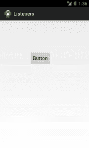
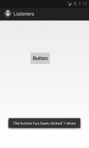
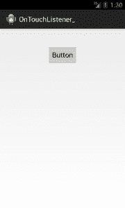
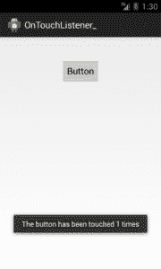

# Android 教程第 6 部分:Android 事件监听器

> 原文：<https://www.edureka.co/blog/android-tutorials-event-listeners/>

关于 Android 系统的基本组件，我们之前的 Android 教程已经介绍了很多。让我们用更先进的概念来结束这一年。这篇 Android 教程解释了 Android **的一个非常重要的部分，那就是事件监听器**。

## **安卓教程:什么是监听器？**

Android ***监听器用于捕获事件*** 。例如，当用户通过点击按钮与 Android 系统交互时，监听器会提示底层活动执行与按钮点击相关的任务。

所以，每当你想让 Android 系统执行一个任务的时候(事件发生的时候)，监听器都在工作。在 Android 系统中，有 20 多个监听器，但有几个更频繁。在这个 Android 教程中，我们将只坚持基本的。

[](https://www.edureka.co/android-development-certification-course)

#### **最常用的监听器有哪些？**

以下**基本监听器**是最常用的:

*   **OnClickListener**
*   **OnTouchListener**
*   **OnDateSetListener**

#### 让我们深入了解每一个细节。

#### **1。OnClickListener**

OnClickListener 用于在点击事件中想要 ***执行任务的情况。***

**举例:**点击按钮，一条吐司会显示点击次数。

 下面是这个例子的代码:

**a)在 onCreate 方法之外全局声明一个变量:**

```
//Declaring the variable to count the number of clicks
			int count = 0;

```

在 onCreate 方法中实现以下内容。这里，我们在一个按钮上设置一个 onclick listener:

```
// Declaring the Button and Type Casting it.
		Button btn1 = (Button) findViewById(R.id.button1);

		// Setting OnClickListener on btn1
		btn1.setOnClickListener(new OnClickListener() {

			@Override
		public void onClick(View v) {
			//Executing the following code on the click

//Incrementing the variable count by 1 on the click of the button
			count++;

//Displaying the count using a Toast Toast.makeText(MainActivity.this,
"The button has been clicked " + count +     " times",Toast.LENGTH_SHORT).show();
		}
	});

```

#### **2。Android OnTouchListener**

OnTouchListener 用于**捕获触摸事件并执行与之相关的任务。**

**例如:**按下按钮后，会显示一个 toast，并显示计数(触摸事件发生的次数)。

 下面是上面例子的代码:

**a)在 onCreate 方法之外全局声明一个变量:**

```
//Declaring the variable to count the number of clicks
			int count = 0;

```

在 onCreate 方法中实现下面的 i **。**这里我们在一个按钮上设置一个 OnTouchListener:

```
 // Declaring the Button and Type Casting it.
		Button btn1 = (Button) findViewById(R.id.button1);

		//Setting OnTouchListener on btn1
		btn1.setOnTouchListener(new OnTouchListener() {

			@Override
			public boolean onTouch(View v, MotionEvent event) {
			//Incrementing the variable count by 1 on every Touch
				count++;
				Toast.makeText(MainActivity.this,
"The button has been touched " + count  + " times",Toast.LENGTH_SHORT).show();

				return false;
			}
		});

```

#### **3\. OnDateSetListener**

它用于**从 DatePicker 小部件中获取所选的日期。**

**示例:**点击按钮，会出现一个日期选择器对话框，您可以从中选择日期。做出选择后，点击完成按钮，会出现一个显示所选日期的祝酒词。

以上示例的代码如下:

```
//Declaring a button and the DatePickerDialog
private Button btnDatePicker;
	DatePickerDialog _date;

```

在 onCreate 方法中实现下面的 i **。这里**我们在一个按钮上设置一个 OnClickListener:

```
//Typecasting the Button
	btnDatePicker = (Button) findViewById(R.id.button1);

	//Setting an OnclickListener on the Button
	btnDatePicker.setOnClickListener(new OnClickListener() {

		@Override
		public void onClick(View v) {

//Creating an object of DatePickerDialog incontext of the Mainactivity
		//dateCallback is called which defined below
_date = new DatePickerDialog(MainActivity.this, dateCallback,     	           2012, 10, 12);
		//Showing the DatePickerDialog
			_date.show();
		   }
	    });

	//Setting OnDateSetListener on the DatePickerDialog
private DatePickerDialog.OnDateSetListener dateCallback = new OnDateSetListener() {

		@Override
public void onDateSet(DatePicker view, int year, int monthOfYear,int dayOfMonth) {

//Displaying a Toast with the date selected
Toast.makeText(MainActivity.this, "The date is : " + dayOfMonth+"/"+  ++monthOfYear +"/"+  year, Toast.LENGTH_LONG).show();
		}
	};

```

我们希望你喜欢这篇关于 Android 监听器的教程。

快乐学习！

*以下资源用于创建本 Android 教程:* *[**开发者**。](https://developer.android.com/index.html "Android Tutorials Official")**[Edureka.co](https://www.edureka.co/ "Android tutorials")***

#### **你可能也喜欢这些相关的帖子:**

*   [Android 开发入门](https://www.edureka.co/android-development-certification-course)
*   [Android 初学者教程-5:广播接收机](https://www.edureka.co/blog/android-tutorials-broadcast-receivers/ "Android Tutorials for Beginners-5: Broadcast Receiver")
*   [Android 初学者教程:Android 意图](https://www.edureka.co/blog/android-tutorials-intent-component/ "Android Tutorials for Beginners-2: Android Intent")
*   [如何在 Android 中创建 Android Widgets:rating bar](https://www.edureka.co/blog/tag/how-to-create-android-widgets/ "How to create Android widgets: RatingBar in Android")
*   [大一新生的 5 大安卓面试问题](https://www.edureka.co/blog/interview-questions/top-5-android-interview-questions-for-freshers/ "Top 5 Android Interview Questions for freshers")
*   [Android 初学者教程:活动组件](https://www.edureka.co/blog/android-tutorials-for-beginners-activity-component/ "Android Tutorials for Beginners Part-1: Activity component")