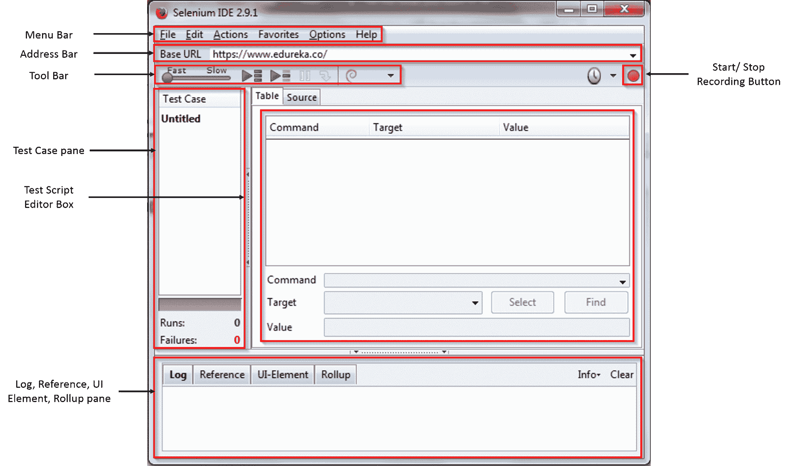
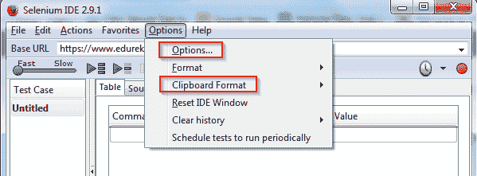
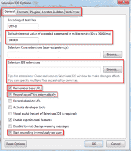
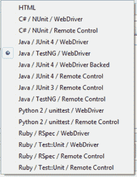
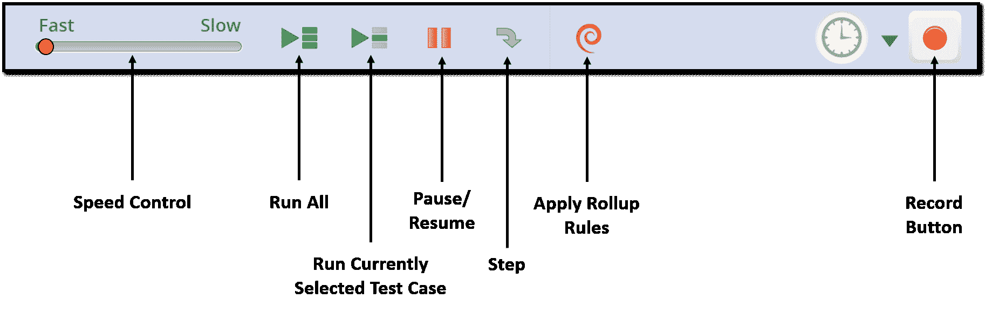
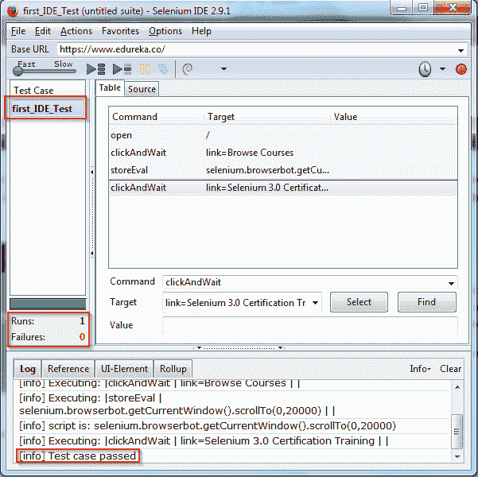

# 用户对 Selenium IDE 的看法

> 原文：<https://www.edureka.co/blog/selenium-ide>

在我之前的这个 Selenium 教程系列的博客中，我已经讨论了自动化测试的需求和对 *[**Selenium 认证培训**](https://www.edureka.co/testing-with-selenium-webdriver)* 的需求。在这篇博客中，我将告诉您如何安装和使用 Selenium IDE，这是 Selenium 套件中的另一个重要工具。如果你错过了阅读任何以前的博客，我敦促你从这里开始阅读:[什么是硒](https://www.edureka.co/blog/what-is-selenium/)。

## **关于硒 IDE**

硒 IDE 的完整形式是**硒**T3I**D**发育 **E** 环境。虽然 WebDriver 和 RC 允许我们通过编程逻辑编写测试用例，但 Selenium IDE 的工作方式略有不同。您可以简单地记录您在浏览器上的交互来创建测试用例。这听起来很简单，对吗？**是**！

不像 WebDriver 和 RC，不需要编程逻辑。您可以简单地记录您在浏览器上执行的操作，并使用回放选项来重新运行测试(即您的操作)。事情就是这么简单。但是，这里有一个陷阱。Selenium IDE 是一个 **Mozilla Firefox 插件**，这意味着测试只能在**Firefox 浏览器**上记录，其他任何浏览器都不支持。

*如果你想知道如何下载 Selenium IDE，那就从[这个页面](https://www.seleniumhq.org/download/)下载吧。请注意，您只能在 Firefox 中安装 Selenium IDE。你可以在 Firefox 中点击右上角的图标来打开 Selenium IDE。*

记录在 Selenium IDE 上的测试用例可以导出到其他编程语言中。它们可以导出到 C#、Java、Ruby 或 Python。但是，不要把这个工具的简单性误认为是一个成熟的测试工具，因为它不适合复杂的测试用例或测试套件。这只是一个原型工具，只适用于静态网页。测试动态(实时)网页带来了许多挑战。

在我继续之前，让我向你展示一下 IDE 的界面。



我在上面的截图中强调了某些功能。他们是:

1.  [菜单栏](#MenuBar)
2.  [地址栏](#AddressBar)
3.  [工具栏](#ToolBar)
4.  [测试用例窗格](#TestCasePane)
5.  [测试脚本编辑框](#TestScriptEditorBox)
6.  [日志、引用、UI 元素和汇总窗格](#LogReference)

这些功能在处理测试用例时提供了各种选项。让我们深入了解每一项功能。

### **硒 IDE–菜单栏**

菜单栏由以下选项卡组成:**文件**、**编辑**、**动作**、**收藏夹**、**选项**和**帮助**。

**文件**:该选项卡为我们提供了打开、保存、导出和创建新的测试用例及测试套件的选项。默认情况下，测试以 HTML 格式保存，并且可以导出到。cs(C#)，。java(java)，。py(python)或者。rb(ruby)格式。一旦导出，它们可以在 Selenium RC 和 Selenium WebDriver 上运行。

**编辑**:在这个标签页下，我们可以选择复制、粘贴、删除、撤销和选择所有编辑测试用例及测试套件的操作。除此之外，我们还有插入新命令和新注释的选项。当我们想要在测试用例中手动添加一个步骤时，这两个选项就派上了用场。

**Actions** :在 Actions 标签下，你可以找到选项，或者执行单个测试用例，或者以测试套件的形式执行一组测试用例。事实上，它还可以选择在测试用例中执行单个命令，并在测试用例中设置断点。

**选项**:该选项卡为我们提供了更改 IDE 设置的更多选项。该选项卡下有两个重要的类别，分别是**选项**和**剪贴板格式**。

 高级 IDE 设置可以在**选项= >选项**下找到。虽然这里有许多设置，我们将只集中在几个重要的。 

在*常规*选项卡下，我们可以设置在页面上定位元素的超时值。如果在定位元素之前超过了上述时间，那么将会抛出一个错误，测试用例将会失败。默认值为**30000 毫秒**。

Selenium IDE 扩展可用于扩展 IDE 的功能。

如果选中了*记住基本 URL* 复选框，则 IDE 将使用指定的 URL 启动。否则 IDE 将会以空白 URL 启动。

如果*记录 assertTitle 自动*被选中，那么每次提取新的标签页，都会返回页面的标题。

*打开时自动开始记录*使 IDE 在启动时自动记录浏览器交互。



在*定位器构建器*选项卡下，您可以设置元素属性的优先顺序。默认情况下，具有最高优先级的属性将用于定位元素。如果没有为元素指定该属性，那么将使用具有下一个首选项的属性。

剪贴板格式可以在**选项= >剪贴板格式**下找到。在剪贴板格式选项下，您可以选择要将 Selenese 命令复制到的编程语言。作为测试用例一部分的单个 Selenese 命令可以被复制到您的首选 IDE 中。

默认情况下，会以 HTML 格式提取。左侧的截图显示了我们可以提取的其他格式。

## **Selenium IDE–地址栏**

地址栏由基本 URL 组成，它是启动 Selenium IDE 时获取的 URL。除此之外，地址栏还有一个下拉列表，以前访问过的网站会列在下面以便于访问。

### **Selenium IDE–工具栏**

Selenium IDE 中的工具栏有以下选项:

*   您可以使用*速度控制*选项来控制测试用例执行的速度。
*   *运行*按钮用于运行当前选中的测试用例
*   *【全部运行】按钮用于执行测试套件*中的所有测试用例
*   *暂停/恢复* e 按钮允许测试用例的启动和重新启动
*   *步骤*用于通过一次运行一个命令来“步入”测试用例
*   *Rollup* 用于重复一系列 Selenium 命令
*   *记录*按钮记录用户的浏览器动作，从而生成一个测试用例

### **Selenium IDE–测试用例窗格**

测试用例窗格将包含您已经记录的测试用例列表。您可以一次打开多个测试用例，当您打开一个测试套件时，该套件中包含的所有测试用例都会在测试用例窗格中列出。每个测试用例将包含多个 Selenium IDE 命令。在 test case 窗格下面，您可以看到各种测试用例的通过/失败状态。

### **Selenium IDE–测试脚本编辑框**

测试用例中记录的每个用户交互都将作为 Selenium IDE 命令存储在编辑框中。编辑框分为 3 栏:**命令**、**目标**和**值**。

*   命令是在浏览器元素上执行的实际操作/动作。举个 E 的例子，如果你正在打开一个新的网址，命令将是‘打开’，如果你正在点击网页上的链接或按钮，那么命令将是‘点击’。将会有一个下拉列表，您可以从中选择任何命令。
*   Target 是一个 web 元素，在这个元素上操作必须和一个 locator 属性一起执行。如果您点击一个名为“Selenium Course”的按钮，那么目标将是“link=Selenium Course”。
*   Value 是可选字段，当我们需要发送一些参数时使用。如果您在文本框中输入电子邮件地址或密码，那么该值将包含实际的凭据。

这些命令的 HTML 等价物可以在 source 选项卡中查看。与 table 类似，您的脚本可以从 Table 视图中编辑。

### **Selenium IDE–Log/Reference/UI-Element/roll up 窗格**

**日志**窗格显示执行期间的运行时消息。它提供 Selenium IDE 正在执行的操作的实时更新。日志消息可以分为四种类型:信息、错误、调试和警告。此处的日志消息将与其所属的类别一起显示。

**参考**窗格显示了编辑器中当前所选硒文命令的简明描述。它还显示了将在该命令中使用的定位器和值的描述。

**UI 元素**使用 JavaScript 对象符号(JSON)来定义元素映射。文档和资源可以在 Selenium IDE 的帮助菜单下的“UI 元素文档”选项中找到。

**Rollup** 让你一步执行一组命令。汇总可重复使用；也就是说，它们可以在测试用例中多次使用。由于汇总是组合成一组的命令，它们在缩短您的测试脚本方面做出了很大贡献。

### **Selenium IDE——运行你的第一个测试用例**

现在你已经对 IDE 中的各种组件及其功能有了一个大致的概念，让我们开始我们的第一个测试。

将 IDE 插件添加到 Firefox 后，您可以点击 Firefox 工具栏上的 IDE 按钮来启动 IDE。然后，您可以点击 record 按钮，并通过在浏览器上执行操作来开始运行您的测试用例。您执行的操作将作为命令存储在编辑器框中。您可以从编辑框中提取整个测试用例，甚至是一个命令到您喜欢的编程语言中。为了理解这些概念，请看下面的截图。



上面的截图是 Selenium IDE 插件的截图。您在图像中看到的命令和日志是记录浏览器上以下交互的结果:

1.  导航到 www.edureka.co
2.  点击按钮:浏览课程
3.  向下滚动页面，直到 *Selenium 3.0 认证培训*出现
4.  点击课程链接:*硒 3.0 认证培训*

我已经将我的测试用例命名为 ***first_IDE_Test*** 。如果您查看日志窗格，显示的最终日志表明*测试用例通过了*。在 test case 窗格下面，您可以看到测试用例的结果。我只运行了一个测试，它已经通过了。

需要注意的重要一点是，记录了、的浏览器动作在我们稍后运行时并不总是能成功执行。这是因为页面的动态性。这和我之前提到的、只能测试静态网页是同一个问题。

**向下滚动一页**是 IDE 编辑框中不会记录的动作的一个例子。因此，当我们运行记录的测试时，IDE 不会向下滚动页面来定位 web 元素，从而导致测试用例失败。另一个例子是**页面加载超时**。使 Selenium IDE 速度与网页速度同步是一个挑战。这就是为什么 IDE 不是测试的首选工具。

如果你试着在 Edureka 的主页上运行同样的测试，就像我在博客前面展示的那样，测试很可能会失败。解决方法是在测试脚本编辑器中手动添加命令，以同步 IDE 速度和页面速度。我已经手动添加了一个命令，并在编辑器中修改了另一个命令。

其中之一是向下滚动页面。命令是:

```
command: storeEval target: selenium.browserbot.getCurrentWindow().scrollTo(0,20000) value: <blank>
```

我修改的另一个命令是点击链接。

```
command: clickAndWait target: link=Selenium 3.0 Certification Training value: <blank>
```

所以，这就把我们带到了这篇博客的结尾。如果您正在寻找 Selenium IDE 的视频教程，那么您可以观看下面由行业专家提供的视频。

## **Selenium IDE 初学者教程| Selenium 教程| edu reka**

[//www.youtube.com/embed/rn7i6NAKVbo?rel=0&showinfo=0](//www.youtube.com/embed/rn7i6NAKVbo?rel=0&showinfo=0)*I urge you to install Selenium IDE and play around with the tool and if you encounter any problem while working with the tool, put those queries in the comment section below and we will get back to you at the earliest.*

*如果您希望学习 Selenium 并在测试领域建立自己的事业，请点击这里查看我们的交互式在线直播 [Selenium 3.0 认证培训](https://www.edureka.co/testing-with-selenium-webdriver)，它将提供 24*7 支持，在整个学习期间为您提供指导。*