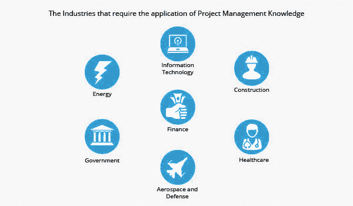
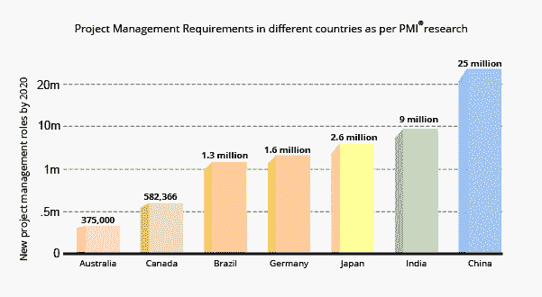

# 不同行业中不断增长的 PMP 职业机会

> 原文：<https://www.edureka.co/blog/growing-pmp-career-opportunities-in-different-industries/>

在这个技术工业时代，由于项目的规模和复杂性，项目管理是一项一直被需要的特殊技能。通过 [PMP 课程](https://www.edureka.co/pmp-certification-exam-training)了解如何改善你的职业前景。

**PMI 报告对 PMP 证书持有者日益增长的需求有什么看法**

不时进行市场调研，预测行业对项目经理的需求。进行项目管理专业考试的 PMI 一直在做这一领域的具体研究，其年度报告显示了项目管理领域对个人的需求日益增长。

根据 PMI 发布的 2014 年报告，对项目管理从业者的需求将会很高。需求将体现在以下方面:

*   提供的机会
*   所需技能

这些需求也会因以下因素而异:

*   工业部门
*   地理位置

***举例:*** 在印度和中国这样的发展中经济体，分别对 IT 和制造业的项目管理专业人才需求巨大。例如，中国在其行业中没有有效实施项目管理流程。这迫使当地产业和全球的中国公司将 it 与全球客户的需求相结合。

在仍在从全球金融危机中复苏的国家，越来越需要项目管理专业人员进行战略性思考并有效地部署项目。

你甚至可以通过查看 ITIL 的详细情况。

## **对项目管理专业人才需求日益增长的行业**

****

**能量**

国际社会更加团结一致地谈论对不可再生能源的需求。这导致在这些领域开展了大量项目:

*   太阳能
*   风能
*   地热能

这些领域对项目专业人员的需求非常大。

与此同时，我们不能忽视传统能源。新油田的发现和化石燃料提取技术的进步导致了许多大规模项目的开展。

***例句:*** 巴西沿海一处未开发的油田最近被发现，有可能成为最大的产油国之一。然而，巴西缺乏熟练的劳动力，更不用说项目管理专业人员了。通过在这些长期项目中引进熟练的项目管理专业人员，这一差距正在得到解决。欧洲也产生了类似的需求，最近在北海地区发现了能源油田。因此，这一领域潜力巨大。

**医疗保健**

改善护理和降低成本是该行业的主要关注领域。在美国,《患者保护和平价医疗法案》刺激了保险行业的竞争，迫使公司进行创新以赢得客户。在不久的将来，降低成本、提高效率和改善客户体验的需求将成为私人保险公司的重要驱动力。

根据 CIO Insight 的调查，拥有强大 IT 技能的项目经理将在使用移动设备、社交媒体和数据分析来统一多渠道服务的医疗保健项目中找到机会。

到 2017 年，移动医疗保健预计将产生 230 亿美元的收入，并且将开展一些项目来获取医疗保健数据，并使用这些数据来改善医疗保健服务，同时降低运营成本。因此，非常需要具有以下经验的项目经理:

*   软件开发生命周期
*   大规模预算管理
*   跨职能项目

这种趋势在发达经济体和发展中经济体都很明显，如南亚、非洲和南美洲，那里的中产阶级要求更好地获得医疗保健设施。

**施工**

到 2025 年，建筑业预计将增长 70%以上，达到 15 万亿美元，并将集中在三个国家:中国、美国和印度。

对于有建筑行业经验的项目经理来说，亚洲的就业市场是他们应该去的地方，因为项目管理流程在这些地区还不是很成熟。印度的人口增长超过了基础设施的增长，因此专业人才短缺，到 2022 年，这一需求将达到 300 万。该国需要大约 100 万名熟练的项目经理来填补大型建筑项目的缺口，这些项目需要高度的独立性和复杂的监管合规性。

从[填写 PMP 申请表的分步指南](https://www.edureka.co/blog/step-by-step-guide-to-filling-the-pmp-application-form)中全面了解项目管理。

**信息技术**

科技仍然是强大的就业引擎，没有放缓的迹象。在美国，技术行业的就业增长速度比其他所有行业都快 3 倍。总部设在美国的跨国信息技术公司正在迅速接管较小的信息技术公司，并向亚洲、中东和非洲的新兴市场扩张。

由于公司雇佣了来自不同文化背景的众多员工，因此非常需要具备标准化技能的项目经理来进行系统重组，并将战略愿景转化为切实的目标和有效的产出。

IT 项目经理需要:

*   善于理解他们工作的组织的政治文化和原则
*   具有战略性思考和行动的能力
*   有架构主导的项目管理经验

## **对项目管理专业人才需求日益增长的国家**

****

**加拿大**

预计到 2020 年将需要 582，366 个新的项目管理职位。

**T2**巴西

该国的十年能源计划将吸引 1330 亿美元的投资。巴西约三分之二的雇主报告称，他们找不到足够多拥有合适技能的工人。到 2020 年，预计将需要超过 130 万个新的项目管理职位。

**T2**北海

仅在 2013 年，北海地区的深海石油钻探就有望创造 5 万个新工作岗位。到 2030 年，北海将需要 10 万名拥有金融和项目管理大学学位的新工人。

**德国**

预计到 2020 年，中国将需要超过 160 万个新的项目管理职位。

**印度**

耗资 1000 亿美元的德里-孟买工业走廊开发项目是印度有史以来最大的基础设施项目。到 2020 年，预计将需要近 900 万个新的项目管理职位。

**中国**

中国拥有世界上最大的高速铁路系统:10463 公里(6501 英里)的铁轨。该国计划每年投资 1000 亿美元，到 2015 年完成 18000 公里(11185 英里)的轨道，到 2020 年完成 120000 公里(74565 英里)的高速铁路。到 2020 年，预计将产生近 2500 万个项目管理职位。

**澳洲**

澳大利亚有三个运营中的液化天然气项目，还有七个在建项目，投资超过 2000 亿澳元。澳大利亚相应的劳动力短缺意味着那里的项目经理薪水更高。到 2020 年，预计将需要超过 375，000 个新的项目管理职位。

**日本**

根据 PMI 的项目管理人才缺口报告，到 2020 年，预计将创造 260 万个新的项目管理职位。

毫无疑问，PMP 在钦奈的培训带来了惊人的工作机会。PMP 认证考试是一个艰苦的过程，因此，一定要看看由 Edureka 提供的考试准备课程。本课程由在项目管理行业拥有丰富经验的认证讲师提供在线培训，终身学习录音课程，并提供 24X7 全天候支持，是成功通过考试的不二法门。

***PMP 相关岗位:***

[PMP 考试备考指南。](https://www.edureka.co/blog/pmp-exam-prep/)

[用结构化教程破解 PMP 考试。](https://www.edureka.co/blog/cracking-pmp-exams-with-structured-pmp-tutorials/)

*PMP 是项目管理协会的注册商标。Edureka 是全球 PMI 代表:ID 4021*