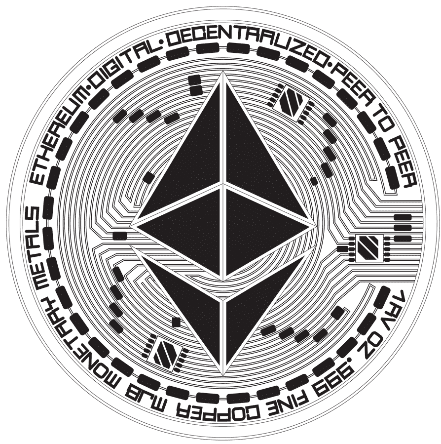
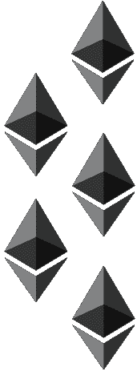
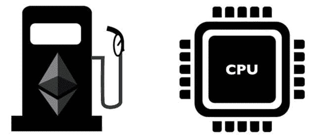
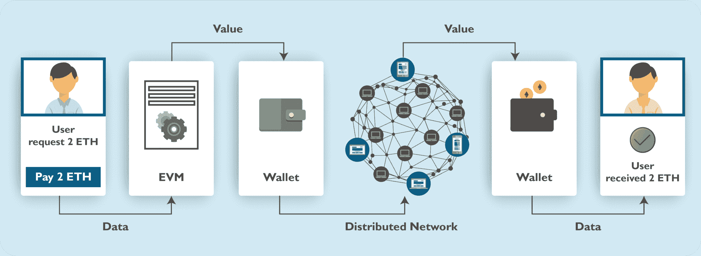
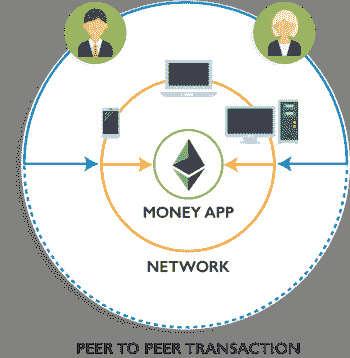
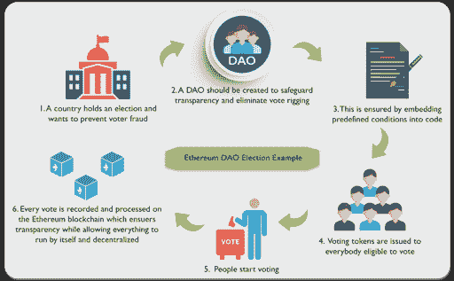
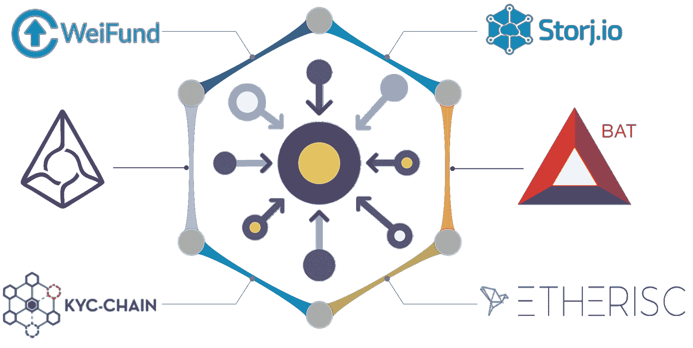

# 以太坊是什么？一个分散世界的平台

> 原文：<https://www.edureka.co/blog/what-is-ethereum/>

区块链技术 [**的创新**](https://www.edureka.co/blog/blockchain-technology/) 引领了一个名为**以太坊**的新平台的发展。和比特币一样，以太坊也是一个分布式网络。它被恰当地称为区块链 2.0，为开发者为区块链社区做贡献铺平了道路。这篇关于“什么是以太坊”的博客将丰富你关于以太坊的知识。

**以下是我在这篇博客中谈到的话题:**

1.  [以太坊是什么？](#whateth)
2.  [智能合约](#whatcontract)
3.  [以太币](#whatcrypto)
4.  [【以太坊虚拟机】](#whatevm)
5.  [【分散应用(DApps)](#whatdapp)
6.  [【分散自治组织(道)](#whatdao)
7.  [以太坊上正在建造什么？](#whatbuilt)
8.  [以太坊会被用来做什么？](#whatused)

**以太坊是比特币发明以来区块链的第二次重大创新。**

*虽然比特币可以描述为一种数字货币。*

*以太坊是一个去中心化的平台，用于编程一种* *数字货币。*

虽然比特币和以太坊是由分布式账本驱动的，但两者在许多技术方面存在差异，让我来帮助你理解两者之间的差异。

## **比特币 vs 以太坊**

| **功过** | **比特币** | **以太坊** |
| 概念 | 数字货币 | 世界计算机 |
| 创始人 | 中本聪(神秘) | 白丁的活力&团队 |
| 脚本语言 | 图灵不完整 | 图灵完成 |
| 发布日期 | 【2009 年 1 月 | 【2015 年 7 月 |
| 硬币发行方式 | 早期开采 | 至 ICO |
| 平均阻塞时间 | ~10 分钟 | ~12-15 秒 |
| 目的 | 常规货币的替代品 | 点对点合同 |

比特币和[以太坊](https://www.edureka.co/blog/ethereum-tutorial-with-smart-contracts/)经常被拿来相互比较，但是，这两者是以不同的愿景和目标设计的。比特币是一种公认的用于交易的加密货币，以太坊是一个多功能平台，其数字货币是 [**智能合约**](https://www.edureka.co/blog/smart-contracts/) 功能的燃料。

但是以太坊是什么，它对我们的社会有什么样的未来，这里有一个排练。

## **以太坊是什么？**

以太坊是一个开源的&基于公共区块链的分布式计算平台，用于构建分散的应用程序。【T2

因此，在以太坊创建之前，区块链应用程序被设计为执行非常有限的一组操作。例如，比特币和其他加密货币专门被开发用来作为点对点数字货币。

[***维塔利克·布特林***](https://www.youtube.com/watch?v=TDGq4aeevgY&t=1s) 设想以太坊作为开发者在区块链上编写程序的平台。为了实现他的目标，他使用了与比特币类似的区块链设计&协议，并临时将其用于支持货币发行以外的应用。

全球各地的任何人都可以与区块链以太坊连接开发程序，并可以保持网络的当前状态，因此有了“世界计算机”这个术语 ***。***

## **什么是以太坊|智能合约和以太坊讲解| Edureka**

[https://www.youtube.com/embed/JD120_jN4ZU?rel=0&showinfo=0](https://www.youtube.com/embed/JD120_jN4ZU?rel=0&showinfo=0)

它基本上可以直接在同行之间创建一个可编程的契约。

## **智能合约**

*一种自动执行的合同，并处理强制执行、管理、履行、&付款。*******

简单地说，它可以被定义为一个自我执行的合同，并处理强制执行、管理、履行、&支付。

执行智能合约和交易都需要代币。所以基本上， *以太坊没有加密货币是不完整的。 * 

## **以太坊加密货币**

以太坊运行在名为的本地令牌上，它有两个主要用途:

1.  应用程序执行任何操作都需要支付额外费用，以便被破坏的恶意程序得到控制
2.  以太是对矿工的奖励，他们用自己的资源为以太网做出贡献——很像比特币的结构。

每次执行合同时，以太坊都会消耗被称为**气体**的令牌来运行计算。

**以太坊中的气体**

[**煤气**](https://kb.myetherwallet.com/gas/what-is-gas-ethereum.html) 在区块链以太坊上做的每一个手术都要付费。

它的价格用乙醚表示，由矿工决定，矿工可以拒绝以低于**确定的**天然气价格进行交易。

<figure id="attachment_60638" aria-describedby="caption-attachment-60638" style="width: 639px" class="wp-caption aligncenter">

<figcaption id="caption-attachment-60638" class="wp-caption-text">**                                   Ether buys gas to fuel up the E.V.M.**</figcaption>

</figure>

## 以太坊虚拟机

*   以太坊虚拟机是执行交易代码的引擎
*   E.V.M .支持在一个平台上开发数千种不同的应用程序
*   用智能合同专用编程语言编写的合同被编译成“字节码”，EVM 可以读取并执行 

它实际上处理以太坊中的内部状态和计算。实际上，EVM 可以被认为是一台大型的分散式计算机，它有数百万个被称为“T1 账户”的对象，这些对象有能力维护一个内部数据库，执行代码，并且它们还可以相互对话。

以太坊以 EVM 为核心，支持开发成千上万个势不可挡的应用。

*想知道以太坊上能建什么？*嗯，以太坊可以用来构建一些非常酷的应用，叫做 **DApps。**

**了解我们在顶级城市/国家的区块链培训**

| **印度** | **其他城市/国家** |
| [班加罗尔](https://www.edureka.co/blockchain-training-bangalore) | [纽约](https://www.edureka.co/blockchain-training-new-york-city) |
| [海德拉巴](https://www.edureka.co/blockchain-training-hyderabad) | [英国](https://www.edureka.co/blockchain-training-uk) |
| 喀拉拉邦 | [美国](https://www.edureka.co/blockchain-training-usa) |
| [钦奈](https://www.edureka.co/blockchain-training-chennai) | [加拿大](https://www.edureka.co/blockchain-training-canada) |
| [孟买](https://www.edureka.co/blockchain-training-mumbai) | [澳大利亚](https://www.edureka.co/blockchain-training-australia) |
| [浦那](https://www.edureka.co/blockchain-training-pune) | [新加坡](https://www.edureka.co/blockchain-training-singapore) |

## 分散应用(DApps)

*   dapp 是通过区块链运行的计算机应用程序，支持最终用户和提供商之间的直接交互
*   它可以由单个 DAO 甚至一系列 DAO 组成，它们一起工作来创建一个应用程序

用户可能需要交换以太网作为与另一个用户结算合同的方式，使用网络的分布式计算机节点作为促进该数据分发的方式。

以太坊也允许用户建立分散的组织。

## **【道】**【分散自治组织】

*   DAO 是完全存在于区块链上并受其协议管理的组织
*   它旨在持有资产，并使用一种投票系统来管理其分配 

## **以太坊上正在建造什么？**

随着以太坊和其他项目使得编写 DApps 协议变得更快更容易，出现了许多可能具有破坏性的 DApps。

## **以太坊会用来做什么？【T2**

**分散现有服务:**使用以太坊可以分散现有服务。这将通过直接连接个人和消除中介来降低成本和费用。

**百万种可能性:** Dapps 可以颠覆数百个老牌行业，比如:

1.  金融
2.  房地产
3.  保险

考虑到技术的发展趋势和进步，可以说以太坊作为一个平台的前景非常光明。随着行业和开发商继续在技术上投入资源、信念和时间，区块链社区将继续繁荣。

“什么是以太坊”博客到此结束。希望它是有帮助的和信息丰富的。

*如果你希望学习以太坊，并在区块链技术方面建立职业生涯，那么请查看我们的[区块链课程](https://www.edureka.co/blockchain-training)，该课程提供有讲师指导的现场培训和真实项目体验。该培训将帮助您深入了解什么是以太坊区块链，并帮助您掌握该主题。*

*有问题吗？请在评论区提到它，我们会给你回复。*