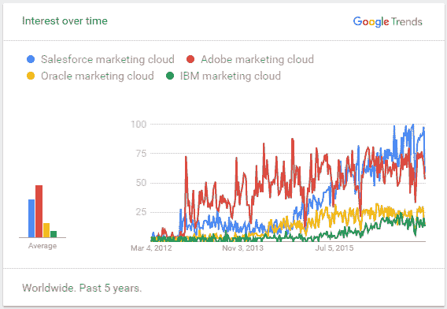
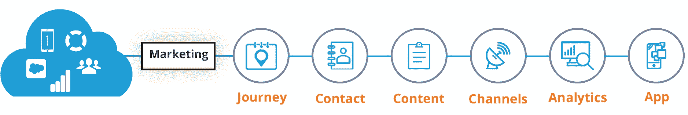
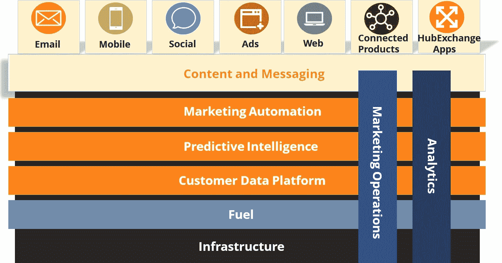
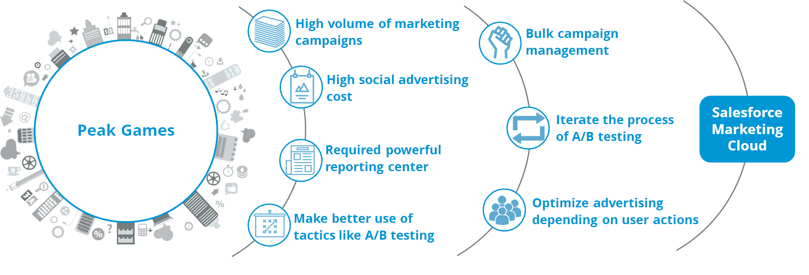

# Salesforce 营销云:强大的营销平台

> 原文：<https://www.edureka.co/blog/salesforce-marketing-cloud/>

您是否发现与客户沟通和建立关系很困难？您的组织是否需要软件来在线销售商品和服务？如果你对以上问题的回答是肯定的，那么你应该考虑让自己*获得 Salesforce 营销云*的认证。在我之前的博客中，我们已经了解了 [Salesforce](https://www.edureka.co/blog/what-is-salesforce/) ，Salesforce 中可用的不同[认证](https://www.edureka.co/blog/salesforce-certifications/)，如何在 Salesforce 平台上创建[应用程序，以及关于](https://www.edureka.co/blog/salesforce-tutorial) [Salesforce 服务云](https://www.edureka.co/blog/salesforce-service-cloud/)。

在这篇博客中，我将向您介绍 Salesforce 营销云。我将向您详细介绍为什么您应该选择 Salesforce 营销云，以及它提供的不同平台和渠道。最后，我们来看一个用例，它解释了营销云是如何在 Peak Games 中用于广告的。

## **简史**

在 2012 年 Salesforce 推出营销云之前，数字营销面临着各种挑战。我在下面列出了这些挑战:

*   很难利用来自社交网络的客户和受众信息。

*   在线对话和指标的增长需要一个平台来管理产生的大量内容。

*   组织和客户之间的对话分散在不同的渠道。

*   客户的所有可用数据都滞留在孤岛中，没有得到利用。

*   公司努力通过多种渠道寻求投资回报。

为了解决这些挑战，Salesforce 提出了营销云——一个整合所有社交项目和数据的平台。

## **为什么选择 Salesforce 营销云？**

Salesforce 营销云是营销云领域的市场领导者之一，其他云包括 Adobe 营销云、IBM 营销云和 Oracle 营销云。Salesforce 营销云的总市场份额为 24%，仅次于 Adobe 营销云。下面是来自 *google trends* 的图片，展示了随着时间的推移，人们对不同营销云的兴趣。如您所见，人们对 Salesforce 营销云的兴趣一直在快速增长。如果你有兴趣在 Salesforce 发展事业，那么这是你在线申请 [Salesforce CRM 认证](https://www.edureka.co/masters-program/salesforce-architect-certification-course)的最佳时机。

如果您想知道是什么让营销云脱颖而出，那么您应该看看下面给出的好处:

*   Salesforce 营销云为您提供了一个规划、个性化和优化客户旅程的平台。

*   您可以在一个软件中绘制多个渠道、设备和客户生命周期阶段的客户旅程。

*   Salesforce 营销云可以与其他软件集成，如 Salesforce CRM、Salesforce 销售云、 [Workfront](https://www.workfront.com/) 和其他应用程序，以提供更深入、更好的客户洞察。

像阿斯顿-马丁、沃达丰、飞利浦、西联汇款、通用电气等拥有庞大客户群的公司使用 Salesforce 营销云与他们的客户联系。 采用这些工具的企业拥有巨大的优势，不仅仅是现在，而是未来。

## **什么是 Salesforce 营销云？**

营销云是跨渠道和设备交付相关的个性化旅程的平台，使营销人员能够通过正确的渠道向正确的人传递正确的信息。下图显示了 Salesforce marketing cloud 为您的组织提供的不同功能——旅程构建器、联系人管理工具、内容管理工具、分析构建器和各种渠道，如电子邮件和手机。

我们已经了解了为什么 Salesforce 将营销云引入市场，以及为什么您的组织应该考虑使用它。现在，让我们深入了解该产品，看看 Salesforce 营销云提供的不同平台和渠道。

下面是来自 www.salesforce.com的图片，描述了完整的 Salesforce 营销云产品。Salesforce 营销云构建于 Salesforce 基础架构和 Fuel 平台之上。它由各种其他平台组成，您可以利用这些平台来实现您组织的营销目的。可以用来存储客户数据的客户数据平台。一个预测智能平台，可用于构建一对一客户旅程的预测模型。它还包括一个维护您组织的内容和消息的平台。它还提供了对从客户那里获得的数据进行分析和营销操作的工具。你可以通过电子邮件、手机、广告、社交网络等各种渠道联系你的客户。您还可以使用 hub exchange 上列出的应用程序向您的营销云添加额外的营销功能。

现在，让我们看看 Salesforce 营销云提供的不同平台和渠道，以及您的组织如何利用这些强大的功能获益。

**平台—**sales force marketing cloud 为您提供了 6 种不同的平台，您的组织可以利用这些平台来制定有效的营销策略。我在下面详细描述了每个不同的平台:

|  | **旅程构建器**–使用旅程构建器，您可以大规模构建一对一的旅程。您可以为每个人提供简单或复杂的旅程，无论您的客户群规模如何。您可以将销售和服务活动融入旅程中。使用旅程构建器，您可以定义具体的目标，并衡量点击率、时间、渠道、转化率等。你可以评估自己的进步，并在过程中优化表现。 |
|  | **受众构建器**–借助受众构建器，您可以使用来自销售云、服务云和其他数据源等不同来源的数据构建客户的单一视图。受众生成器为您提供了从多个来源即时过滤数据的功能。这可以帮助你的组织瞄准聪明的受众。不仅如此，你还可以验证受众，并在适当的时候与他们互动。 |
|  | **个性化构建器**–您的组织可以利用个性化构建器的预测分析和预测建模功能，了解每个客户的偏好。这使您的组织能够建立客户档案。然后，您可以使用这些配置文件来定制个性化内容，并通过不同的渠道交付。 |
|  | **内容构建器*****–***借助内容构建器，您可以从一个位置创建、管理和跟踪所有数字频道的内容。内容构建器为您提供了拖放式智能内容块，因此您可以一次创建内容并在不同位置使用它。Content builder 带有复杂的算法，可以为每个客户确定和提供最佳内容。 |
|  | **分析构建器**–使用分析构建器，您可以发现关于客户的新见解。借助 analytics builder，您可以使用条形图、饼图、散点图和其他可视化技术来显示您的报告。Analytics builder 还附带了电子邮件分析和报告功能，您可以使用这些功能了解客户是否打开、点击、退订了您的每项活动。 |
|  | **营销云连接**–借助营销云连接，您可以访问您所有的 Salesforce 客户数据–不同 Salesforce 产品中的数据。您可以触发连接跨 Salesforce sales cloud、Salesforce service cloud 和其他 Salesforce 产品的交互的活动。 |

**渠道—**sales force 营销云为您提供了 5 种不同的渠道，您的组织可以使用这些渠道与客户进行互动。下面我已经描述了各个通道:

|  | **Email Studio—**您的组织可以使用 Email Studio 创建吸引客户的电子邮件。使用 email studio，您可以密切关注您的电子邮件活动。借助内置的 A/B 测试功能、集成的预测智能和电子邮件交付工具，您可以进一步提高投资回报。此外，使用电子邮件工作室，您可以过滤您的用户群，并根据客户数据发送有针对性的电子邮件。 |
|  | **Social Studio**–Social Studio 为您的组织提供社交倾听工具，以倾听来自不同来源的对话。您可以计划、执行和跟踪社交媒体营销活动。使用 social studio，您可以监控自己的社交渠道，并参与大规模对话。 |
|  | **Mobile Studio**–借助 Mobile Studio，您的组织可以通过短信、彩信、推送消息和群组消息获得移动优先的理念。您可以立即与客户互动，发送实时警报和通知。使用 mobile studio，您可以构建强大的 API 来自动化移动营销解决方案。使用地理定位技术，您可以在正确的地点和时间与客户互动。 |
|  | **Advertising Studio—**有了 Advertising Studio，您就可以制作数字广告并管理广告活动。你可以使用来自多个来源的客户数据，通过脸书、谷歌、Instagram、Twitter 等各种平台安全地接触到客户和类似客户。您的组织可以使用广告工作室来管理大规模的广告活动。 |
|  | **Web Studio**——Web Studio 为您提供创建漂亮、动态网页和个性化内容的工具。您可以跟踪网站上的实时客户互动，并从中获得洞察力。使用 web studio，您的组织可以提供个性化的内容和建议。 |

使用 Salesforce 营销云，您可以做很多事情。一般来说，组织只利用上述几个特性。 **第一中西部银行** 利用移动工作室与客户互动， **史丹利百得** 利用电子邮件工作室和社交工作室了解客户。下面我详细描述了移动游戏公司**Peak Games**如何利用 Salesforce 营销云来降低他们的社交广告成本。

## **Salesforce 营销云用例——巅峰游戏**

巅峰游戏在移动游戏界可谓家喻户晓。他们在 150 个国家拥有超过 2 . 75 亿用户。你可能玩过他们的一些热门游戏，比如 Okey Plus、雇佣兵之战和迷失泡泡。目前，Peak games 每天运行超过 175 个营销活动，他们使用 Salesforce 营销云来完成这些活动。在这一部分，我将描述 Peak Games 面临的挑战以及他们如何使用 Salesforce 营销云来克服这些挑战。我们还将了解 Salesforce 营销云对 Peak Games 的影响。

巅峰游戏面临的挑战有:

*   Peak games 过去常常开展大量的营销活动。因此，他们需要一种工具来进行批量营销活动管理。

*   Peak games 利用付费社交广告营销他们的游戏。Peak Games 希望扩大他们的社交广告规模。

*   Peak games 采用了 A/B 测试、广告细分和受众目标优化等策略。他们想更好地利用这些策略，以便获得更好的投资回报。

*   Peak games 需要一个强大的报告中心来处理他们的报告。

作为解决方案，巅峰游戏求助于 Salesforce marketing cloud 的广告工作室平台。

*   Peak games 使用批量活动管理功能来处理他们的营销活动。

*   Peak games 能够重复图片的 A/B 测试过程，以了解哪张图片是有效的。

*   使用营销云，Peak games 广告团队能够开发最佳实践来吸引高质量的游戏玩家。

*   使用营销云，Peak games 团队能够全面地观察其玩家，并根据他们的行动优化广告。

下图清晰地描述了 peak games 面临的挑战以及 Salesforce 营销云为他们提供的解决方案。

营销云不仅解决了这些挑战，还对公司产生了积极影响。Peak games 使用 Salesforce 营销云的结果是:

*   Peak games 能够降低每次参与的成本，并找到最佳受众。

*   Peak games 能够在点击率(CTR)和每次安装成本(CPI)方面比较两个独立图像的成功。

*   巅峰游戏还发现:
    *   在图像中使用 20%的文本余量可降低 27%的 CPI。
    *   显示用户与游戏互动的图像使点击率增加了一倍，每次点击费用减少了 50%。

Salesforce 营销云使 Peak games 能够更有效地利用社交广告的力量，同时更好地了解其受众及其偏好。

我强烈建议您观看这个 Salesforce 营销云视频教程，它解释了我们在博客中讨论的所有内容。继续，欣赏视频，告诉我你的想法。您也可以申请 [Salesforce PD1 认证](https://www.edureka.co/salesforce-platform-developer-1-certification-training)成为认证开发者。

**Salesforce 营销云培训视频| edu reka**

[//www.youtube.com/embed/MGNdWzJTuwM?rel=0&showinfo=0](//www.youtube.com/embed/MGNdWzJTuwM?rel=0&showinfo=0)

这个面向初学者的 Edureka Salesforce 营销云培训视频将帮助您了解 Salesforce 营销云的优势、它是什么、它的各种功能、使用案例以及营销云演示。

从这篇博客中，我希望您已经完全了解了 Salesforce 营销云、它提供的不同渠道和平台，以及如何利用它们为您的组织带来好处。欢迎在下面的评论框中留下你的任何问题。

查看我们在悉尼举办的 [Salesforce 培训，该培训包含讲师指导的现场培训和真实项目体验。欢迎在下面的评论框中留下你的任何问题。](https://www.edureka.co/salesforce-administrator-and-developer-training-australia)