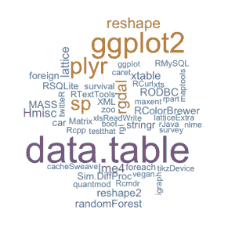
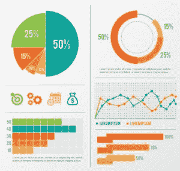

# 掌握 R 是顶级数据科学职业的第一步

> 原文：<https://www.edureka.co/blog/r-programming-for-data-science>

在每天产生 2.5 万亿字节数据的世界里，能够组织这些海量数据以提供商业解决方案的专业人士才是真正的英雄！数据科学家角色所需的人格特质、经验和分析技能的组合被认为很难找到，因此，近年来对合格数据科学家的需求超过了供应。

“数据科学家”是 21 世纪最性感的职位。数据科学家在 2016 年和 2017 年两次被 Glassdoor.com 评为全美 50 份最佳工作之首，这是基于工作满意度、职位空缺数量和基本工资中位数等指标，成为一名数据科学家的简单方法在于 R 编程。

R 是用于统计计算和图形的语言和环境，是像 SAS、STATA 和 SPSS 这样的商业软件包的增长最快的开源竞争者。r 已经成为一种非常强大的语言，广泛用于数据分析和统计计算。r 已经成为一种非常强大的语言，广泛用于数据分析和统计计算。自从 90 年代初诞生以来，R 的用户界面已经变得越来越强大，越来越具有交互性。

## R 的几个有助于其领导地位的特征是:

*   **统计分析环境:** R 提供了一个完整的统计分析环境。在 r 中很容易实现统计方法。它在面向对象的框架中包括传统和现代统计模型的工具，包括回归、方差分析、GLM 和树，这使得提取和合并所需的信息比复制更容易。统计分析和建模方面的大多数新研究都是使用 r 完成的。因此，新技术最初仅在 r 中可用。

*   **开源:** R 是开源技术，所以非常容易与其他应用集成。R 的编码很简单，很容易掌握，甚至对于那些希望将 R 作为独立编程语言来学习的人来说也是如此。即使是非技术背景的专业人士，如销售、市场营销、经济、研究、科学、运营等，也可以轻松地学习 R 编程。

*   **庞大的社区支持:** R 拥有来自世界各地的顶尖统计学家、数据科学家的社区支持，发展迅速。

*   **软件包的可用性:** R 提供了超过 10000 个为不同计算任务定制的软件包。通过利用这些软件包，人们可以获得高性能的计算体验。

*   **图表的好处:** R 有一些很棒的工具来辅助数据可视化，以创建图表、条形图、多面板点阵图、散点图和新的定制设计的图形。R 语言提供的无与伦比的图表和图形受到数据可视化专家的高度影响。基于 R 编程的图形可以在像《纽约时报》、《经济学人》和《流动数据》这样的博客中看到。

## **R vs . Python 之战**

在 R 和 Python 之间做出选择是一场势均力敌的战斗。对于一个蓬勃发展的数据科学职业，你必须掌握这两种语言中的至少一种。人们更倾向于 R，因为它更适合进行复杂的探索性数据分析。r 有一些对数据科学应用程序很重要的独特特性。其中一些功能解释如下:

*   R 是一种**向量语言**可以同时执行许多操作。添加函数和避免循环是 R 的一个特性，这使得它比其他语言更强大、更快。
*   研发不需要任何编译器，因为它是一种解释语言。与 Python、Java 或 C 等其他语言不同，R 直接将代码解释成成熟的程序，使得开发更加容易。
*   对于统计分析和图表来说，没有比 R 更好的选择了，它具有开箱即用的矩阵乘法功能。随着 R 的力量被认识到，它在许多其他领域也有用途，从金融研究到遗传学、生物学和医学。这是因为 R 是一种图灵完全语言，这意味着任何任务都可以用 R 来编程
*   R 为数据科学应用提供**支持功能**。其中有图表、图形、数据接口、统计函数等。所有这些功能都专门用于数据科学应用和统计分析。
*   R 能够无缝地将数学转化为代码，这使得它成为对编程知之甚少但想成为数据科学家的人的理想选择。另一方面，Python 可能没有 R 那么多的包和库，但是它有像 Pandas、Numpy、Scipy、Seaborn 等工具。履行相同的职责。为了简单易学，R 可能是一个稍微好一点的选择。

## **大枪已犯 R**

从汽车到社交网络到银行，每个行业都致力于使用 R 编程进行有效的数据分析。**福特汽车**在分析了用户希望在汽车中实现的梦想功能的社交聊天后，在其嘉年华汽车中增加了一些功能。**脸书**使用 R 编程将状态消息分为 68 类，并根据一天中不同时间发布的状态消息的性质得出一个度量标准。谷歌不仅使用 R 语言，还为这种被广泛接受的语言编写了标准。**微软**购买 Revolution Analytics，这是一种商业版本的 R 和开发的服务器和服务。**优步**自从扩大车队规模以来，成功地提出了减少全美酒后驾驶案件的见解。

这些只是 R 采用的许多有趣用例中的几个。每天都有新人加入 R，开始新的创新数据科学之旅。

*Edureka 有一个特别策划的 **[数据科学培训](https://www.edureka.co/masters-program/data-scientist-certification)课程**，帮助你获得机器学习算法方面的专业知识，如 K 均值聚类、决策树、随机森林、朴素贝叶斯。您将学习统计学、时间序列、文本挖掘的概念，以及深度学习的介绍。本课程的新批次即将开始！！*