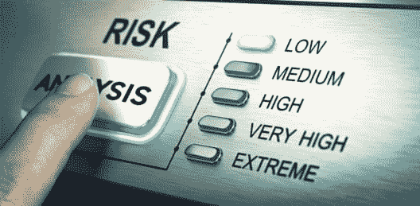
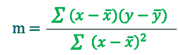
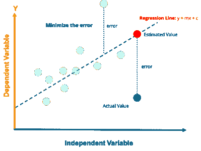
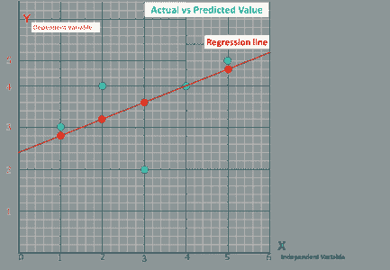
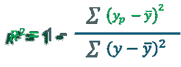

# 从头开始线性回归算法

> 原文：<https://www.edureka.co/blog/linear-regression-in-python/>

**什么是线性回归？**

线性回归是机器学习中最简单的统计模型之一。理解其算法是[数据科学 Python](https://www.edureka.co/data-science-python-certification-course) 认证课程的关键部分。它用于显示因变量和一个或多个自变量之间的线性关系。


在我们深入探讨线性回归之前，让我简单介绍一下什么是回归，因为线性回归是回归算法的一种

## **什么是回归？**

*Regression analysis is a form of predictive modelling technique which investigates the relationship between a dependent and independent variable*

## ****回归类型****

***   线性回归

    *   逻辑回归

    *   多项式回归

    *   逐步回归** 

## **线性回归 vs 逻辑回归**

| **依据** | **线性回归** | **逻辑回归** |
| 核心概念 | 使用直线对数据建模 | 使用 sigmoid 对数据进行建模 |
| 与一起使用 | 连续变量 | 分类变量 |
| 输出/预测 | 变量的值 | 事件发生的概率 |
| 精确度和拟合优度 | 以损失、R 平方、调整后 R 平方等衡量。 | 用准确度、精密度、召回率、F1 分数、ROC 曲线、混淆矩阵等衡量 |

## **线性回归用在哪里？**

## ****1。评估趋势和销售预测****

****

**线性回归可以在商业中用于评估趋势和做出估计或预测。 **例如，**如果一家公司的销售额在过去几年中每个月都在稳步增长，那么对销售数据进行线性分析(y 轴为每月销售额，x 轴为时间)将会生成一条描绘销售额上升趋势的直线。在创建趋势线之后，公司可以使用该线的斜率来预测未来几个月的销售额。**

## ****2。**分析价格变动的影响**

## ********

**线性回归也可以用来分析定价对消费者行为的影响。**

****例如**，如果一家公司多次改变某种产品的价格，它可以记录每个价格水平的销售量，然后以销售量为因变量，价格为解释变量进行线性回归。结果将是一条线，描述随着价格上涨，消费者减少产品消费的程度，这可能有助于指导未来的定价决策。**

****3。评估风险****

****

**线性回归可以用来分析风险。**

****例如****

**健康保险公司可能会进行线性回归，绘制每位客户的索赔数量与年龄的关系图，并发现年龄较大的客户往往会提出更多的健康保险索赔。这种分析的结果可能会指导做出重要的商业决策来考虑风险。**

## **线性回归算法是如何工作的？**

****线性回归算法| Python 中的线性回归| edu reka****

****

**[https://www.youtube.com/embed/E5RjzSK0fvY?rel=0&showinfo=0](https://www.youtube.com/embed/E5RjzSK0fvY?rel=0&showinfo=0)**

**本线性回归算法视频旨在让您深入了解该算法。**

## **最小二乘法-寻找最佳拟合线**

***Least squares is a statistical method used to determine the best fit line or the regression line by minimizing the sum of squares created by a mathematical function. The “square” here refers to squaring the distance between a data point and the regression line. The line with the minimum value of the sum of square is the best-fit regression line.***

****回归线， **y = mx+c** 其中，****

****y =因变量****

****x=自变量；c = y 轴截距****

********

## ****最小二乘法——使用 Python 实现****

****F 还是实现部分，我将使用一个由不同人的头部大小和大脑 重量组成的数据集。****

********

```
****# Importing Necessary Libraries

%matplotlib inline
import numpy as np
import pandas as pd
import matplotlib.pyplot as plt
plt.rcParams['figure.figsize'] = (20.0, 10.0)

# Reading Data
data = pd.read_csv('headbrain.csv')
print(data.shape)
data.head()

# Collecting X and Y
X = data['Head Size(cm^3)'].values
Y = data['Brain Weight(grams)'].values**** 
```

****为了找到 m 和 c 的值，首先需要计算 X 和 Y 的平均值****

```
****# Mean X and Y
mean_x = np.mean(X)
mean_y = np.mean(Y)

# Total number of values
n = len(X)

# Using the formula to calculate m and c
numer = 0
denom = 0
for i in range(n):
numer += (X[i] - mean_x) * (Y[i] - mean_y)
denom += (X[i] - mean_x) ** 2
m = numer / denom
c = mean_y - (m * mean_x)

# Print coefficients
print(m, c)**** 
```

****将上面得到的 m 和 c 的值加到这个方程中****

****BraInWeIgHt=c+m∫H****

## ****绘制线性回归线****

****现在我们有了直线方程。因此，对于 x 的每个实际值，我们将找到 y 的预测值。一旦我们得到这些点，我们就可以绘制它们并创建线性回归线，****

```
****# Plotting Values and Regression Line
max_x = np.max(X) + 100
min_x = np.min(X) - 100
# Calculating line values x and y
x = np.linspace(min_x, max_x, 1000)
y = c + m * x 

# Ploting Line
plt.plot(x, y, color='#52b920', label='Regression Line')
# Ploting Scatter Points
plt.scatter(X, Y, c='#ef4423', label='Scatter Plot')

plt.xlabel('Head Size in cm3')
plt.ylabel('Brain Weight in grams')
plt.legend()
plt.show()**** 
```

## ****R 平方方法——拟合优度****

******R**–**平方**值是显示数据与拟合回归线有多接近的统计度量****

********

****y =实际值****

****y̅= y 的平均值****

****yp=y预测值****

********

****R 平方并不表示回归模型是否合适。对于好的模型，可以使用低 R 平方值，对于不符合数据的模型，可以使用高 R 平方值！****

## ****R square–使用 Python 实现****

```
****#ss_t is the total sum of squares and ss_r is the total sum of squares of residuals(relate them to the formula).
ss_t = 0
ss_r = 0
for i in range(m):
y_pred = c + m * X[i]
ss_t += (Y[i] - mean_y) ** 2
ss_r += (Y[i] - y_pred) ** 2
r2 = 1 - (ss_r/ss_t)
print(r2)**** 
```

## ****线性回归–使用 scikit learn 实现****

****如果您已经学到这里，我假设您现在已经很好地理解了使用最小二乘法的线性回归算法。现在是时候告诉你如何使用一个叫做[scikit-learn](https://www.edureka.co/blog/scikit-learn-machine-learning/)的机器学习库来简化事情和实现相同的模型了****

```
****from sklearn.linear_model import LinearRegression
from sklearn.metrics import mean_squared_error

# Cannot use Rank 1 matrix in scikit learn
X = X.reshape((m, 1))
# Creating Model
reg = LinearRegression()
# Fitting training data
reg = reg.fit(X, Y)
# Y Prediction
Y_pred = reg.predict(X)

# Calculating R2 Score
r2_score = reg.score(X, Y)

print(r2_score)**** 
```

****这都是关于使用 python 的线性回归算法。如果你还有疑问，不要犹豫，把你的疑问添加到博客的评论区。****