# 什么是 IoT(物联网)？物联网架构解释

> 原文：<https://www.edureka.co/blog/what-is-iot/>

物联网(IoT)正在改变我们所知道的世界。智能汽车、智能家居、智能城市，我们周围的一切都可以借助物联网变成智能设备。物联网确实给科技带来了酷的因素。虽然 ***[物联网](https://www.edureka.co/iot-certification-training)*** 有望带来就业市场的下一次大繁荣，但缺乏技能是寻求实施这项技术的公司面临的最大障碍。要想被考虑担任前面提到的任何角色，你需要做好行业准备。现在，如果你开始想知道什么是物联网，你已经找到了正确的页面，这个博客将带你了解物联网的基础知识。

本博客将涵盖以下主题:

*   [什么是物联网？](#what)
*   [互联网的演变](#evolution)
*   [物联网架构](#archit)
*   [物联网的应用](#app)

## **什么是物联网？**

*物联网(IoT)是一种无需任何人为干预，通过互联网感知、积累和传输数据的设备网络。*

是什么让生物活着？他们能感应到彼此并相互交流，不是吗？现在想象一下，如果无生命的物体可以在没有任何人类干预的情况下相互感应和互动。听起来很神奇，不是吗？

这是物联网的基本概念。

## 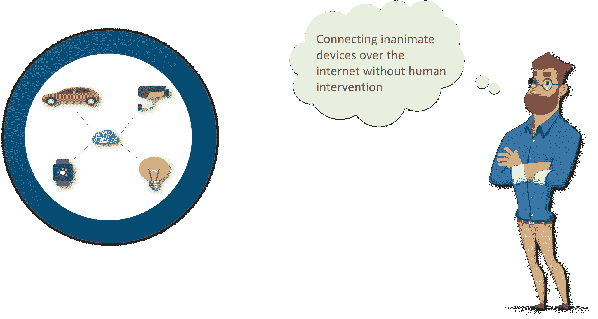

## **互联网的演变**

既然我们已经了解了物联网到底是什么，那么看看互联网的发展会很有趣。

## ****

**互联网前期**

在前互联网时代，大多数人与人之间的交流是通过固定电话和移动电话进行的。

**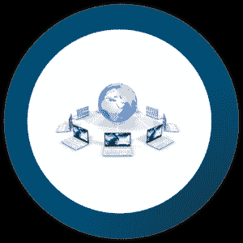**

**互联网的曙光**

随着互联网的出现，世界立刻发生了变化。我们可能相隔几个大洲，但仍然可以通过点击一个按钮来共享重要信息。

## **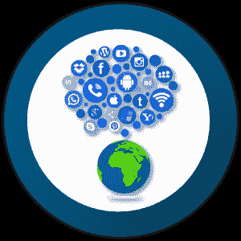**

**物联网**

博客发明后，社交媒体开始流行起来。MySpace 和 LinkedIn 等网站在 21 世纪初获得了显著地位。YouTube 于 2005 年问世，为人们创造了一种全新的远距离交流和分享的方式。

## ****

**物联网**

今天，互联网上几乎所有可用的数据都是由人类首先捕获和创建的。问题是，人们的时间、注意力和准确性有限，这意味着他们不太擅长捕捉真实世界中事物的数据，因此，如果我们有知道事物一切信息的计算机，在没有我们任何帮助的情况下使用它们收集的数据，我们将能够跟踪和计算一切，并大大减少浪费、损失和成本，这就是“物联网”的诞生。

## **物联网架构**

到现在为止，你可能已经明白物联网不仅仅是连接互联网的消费设备。事实上，物联网是一种构建系统的技术，该系统能够在没有人类干预的情况下自主感知和响应来自现实世界的刺激。因此，我们需要为构建物联网解决方案的明确框架开发流程。物联网架构通常包括以下 4 个阶段:

### **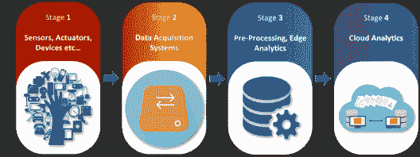 第一阶段(传感器/执行器):** 

“物联网”背景下的一个东西，应该配备传感器和执行器从而赋予发射、接受和处理信号的能力。

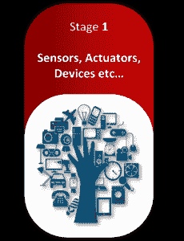

### **第二阶段(数据采集系统):**

来自传感器的数据以模拟形式开始，需要汇总并转换成数字流，以便进一步处理。*数据采集系统*执行这些数据汇总和转换功能。

## **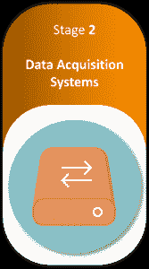**

### **第三阶段(边缘分析):**

一旦物联网数据被数字化和聚合，在进入数据中心之前可能需要进一步处理，这就是边缘分析的用武之地。

## **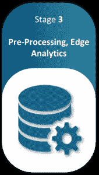**

### **第四阶段(云分析):**

需要更深入处理的数据被转发到物理数据中心或基于云的系统。

## **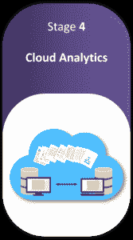**

## **物联网的应用**

**自然灾害管理与物联网**

物联网平台可用于利用远程监控工具积累与特定地理位置相关的数据，并进行分析，以便发现灾害的早期预警。

**用物联网更好医疗**

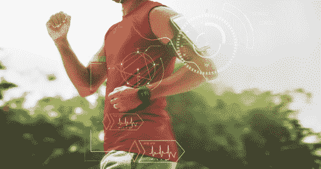

在远程健康监控方面，物联网可以产生重大影响。即使患者在移动，他的生命体征也可以在物联网平台的帮助下持续发送给医生。

**智能养殖与物联网**

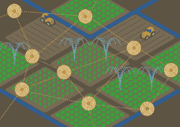

在物联网的帮助下，灌溉任务可以实现自动化。诸如光、湿度、温度的一组传感器可用于连续监控田间条件。

**智能能源管理与物联网**

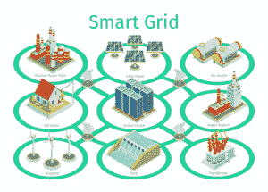

用智能电网可以优化能源分配。这些电网还不断收集实时数据，这有助于有效地分配电力，并减少停电。

**用物联网治理污染**

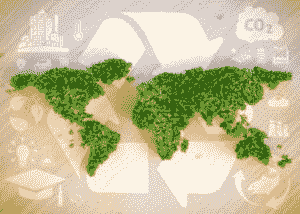

物联网平台帮助我们持续监测空气质量和水质。这些数据将被发送到云端，在那里可以进行进一步的分析，以便采取适当的行动来控制污染。

希望这篇博客对你有所帮助。如果你想了解更多关于物联网以及如何使用树莓派的信息，你可以查看我们的 ***[物联网教程](https://www.edureka.co/blog/iot-tutorial/)*** 博客。

*现在你已经了解了物联网的基本概念，可以查看一下 Edureka 的 **[使用 Azure](https://www.edureka.co/iot-certification-training)** 的物联网训练。物联网是一个由可通过互联网访问的相互连接的物理对象组成的生态系统。根据 Gartner 报告，到 2020 年，各种技术的联网设备将达到 206 亿台。根据思科的报告，未来十年，物联网将在所有行业产生 14.4 万亿美元的价值。所有这些都会带来更好的工作机会。认证培训旨在涵盖所有这些围绕企业应用程序开发的新概念。*

*有问题吗？请在评论区提到它，我们会给你回复。*