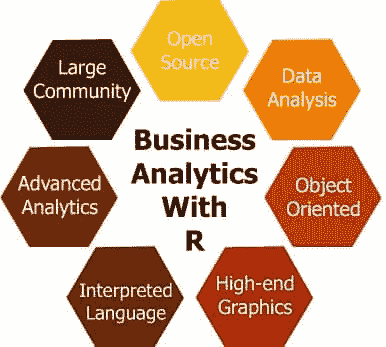

# 你对 R 的商业分析了解多少？

> 原文：<https://www.edureka.co/blog/what-do-you-know-about-business-analytics-with-r/>

**考虑以下情况:**

MBA 毕业生的职位空缺数量正在迅速增长，商学院当局渴望了解哪些 MBA 课程最受欢迎、雇主提供的基本薪资水平、当前薪资水平与前几年的比较、5 年工作经验薪资水平的增长百分比等等。

所有这些似乎都是典型的统计工作，涉及各种分析数据的工具和技术。无论分析数据的动机是什么，有一点是肯定的，那就是快速有效的分析 MBA 毕业生就业机会的手段将非常有助于各商学院做出有效的决策。

那么，今天的统计学家有没有什么魔杖可以处理如此复杂的 ***大数据*** 并进行富有成效的分析呢？有没有什么东西能给今天的数学家和科学家提供一些喘息的机会，让他们进入错综复杂的情况，并得出他们寻找了很久的答案？是的，我们有所谓的***‘商业分析学用 R****’***！让我们了解一下…

#### “R”是什么意思？

*** 商业分析用 R *** 或俗称' *R 编程语言'*是一种开源编程语言，是一种由统计人员设计并为统计人员服务的软件环境。它基本上用于统计计算和高端图形。因此，它是数学家、统计学家、数据挖掘者以及进行数据分析的科学家之间的一种流行语言。

R 是一个 **GNU 项目**，在 GNU(通用公共许可证)下可以免费获得，R 带有预编译的二进制版本，适用于 Unix 和类似系统(FreeBSD、Linux)、Windows 以及 MacOS 等多种操作系统。

#### “R 编程语言”的诞生！

R 编程语言最初是由新西兰奥克兰大学的罗斯伊哈卡和 T2 编写的，现在由 R 开发核心团队开发。r 是由贝尔实验室的约翰·钱伯斯开发的“S”编程语言的一种实现。“R”这个名字在一定程度上来源于它的创造者——Ross Ihaka 和 Robert Gentleman 的名字，并且在一定程度上基于“S”编程语言。此外，一大群人通过向开发人员发送代码和错误报告为“R”做出了贡献！

r 有主页:。

#### “R”语言是做什么的？

***【R】是一种完全可编程的计算机语言，即:***

*   使用一套数值和文本运算符对数组和矩阵进行计算，高效地存储和处理数据。
*   由数据分析工具组成。
*   配备了图形服务，以提供可理解和翔实的数据分析。
*   由真正的编程技术组成，具有完善的函数、循环、条件和输入输出设施。
*   由类似 LaTeX 的文档格式组成，以硬拷贝和软拷贝的形式提供了广泛的文档。这使得 R 很容易通过函数和扩展来扩展，允许开发人员增加它现有的功能。

#### “R”语言不做什么？

***R 语言附带着各种神话。给你一个清晰的认识:***

*   R 不是数据库，尽管 R 编程语言很容易连接到 DBMSs(数据库管理系统)。
*   尽管 R 的语言解释器有调用自己的 C/C++代码的能力，但它有时还是很慢。
*   R 不包含任何图形用户界面，尽管它对 Java、Tcl/TK 很友好。
*   R 语言不提供任何数据的电子表格视图，尽管它可以很容易地连接到 Excel/MS office。

#### 具有 R 的业务分析的一些关键特征:

***R 是一种非常强大的企业驱动编程语言，它有以下显著特点:***

**1。** **R 是一款开源软件！**

对，R 免费！它是根据 GPL 许可的(就像 Linux 一样),你可以自由地用 R 做任何你想做的事情！你可以尽可能的有创意，在里面做有趣的修改。r 也可以集成到其他系统中。使用 R 编程语言时，您可以访问数据，无论是在 *SAS、SPSS、SQL Server、Oracle 还是 Excel* 上，也可以将 R 集成到各种应用程序和网络服务器中。

**2。** **R 编程是为数据分析而设计的！**

r 主要是一个数据分析软件，包括大量的数据检索、处理、分析和高端统计图形的算法。R 具有内置的通用统计方法，如*均值、中值、分布、协方差、回归、非线性混合效应、GLM、GAM* 等等……R 编程语言的功能可以访问所有领域的分析结果，并结合分析方法得出对组织至关重要的某些结论。

例如，关于使用特定手机的人数(及其背景)的精确信息对移动公司利用其业务非常有用。

**3。** **R 编程是面向对象的！**

是的，是真的！与其他统计语言相比，R 语言具有很强的面向对象编程能力。这是因为 R 源于 S 编程语言。尽管 R 精通开发完全面向对象的程序，但它的面向对象方法是基于通用函数而不是类层次结构。r 由三个 OOP 系统 *S3、S4 和 R5* 组成。这些特性基于类和方法的概念。将 R 与典型的面向对象语言如 Perl、Python、Ruby 等进行比较是不公平的。

**4。** **R 是一种解释型计算机语言！**

r 是一种典型的解释型计算机语言，允许使用函数进行难以置信的分支、循环和模块化编程。R 分布由广泛的统计程序功能组成，如*时间序列分析、经典参数和非参数检验、线性和非线性回归模型、聚类、平滑*等。此外，R 编程的高级开发人员可以编写 C 代码来直接处理 R 对象。

**5。** **R 语言产生高端图形！**

r 编程作为一个灵活的图形环境，为数据显示提供各种图形功能，如*条形图、饼图、直方图、时间序列、点阵图、图像图、3D 表面、散点图、地图*等。使用 R，您可以无休止地自定义您的图形，并通过组合不同的图形类型开发新鲜的图形，并获得巨大的乐趣！

**6。 B** **provides 高级分析！**

您可以找到各种令人惊叹的领域特定套件，如用于计算金融的 ***Rmetrics Project*** 和用于高通量基因组数据分析和理解的 ***BioConductor*** 。除了这些套件之外，还有几个可用于 R 的附加包，例如 ***CRAN*** (一个遍布全球的 ftp 和 web 服务器的设置，用于存储 R 的相同和最新版本的代码和文档)和 ***Task Views*** (对于某些方法和规程来说很方便的 R 函数和包的指南)。

**7。**B**与 R****h成为一个紧密结合的共同体！**

r 编程语言有一个巨大的社区，有 200 万人，这个社区正在呈指数级增长！r 不再仅仅是一种编程语言，而是全世界不同程序员之间的一种文化。在网上冲浪，你会发现几个网站，论坛，博客文章，关于 R 编程语言的文章。例如，我们有 ***Crantastic*** ，一个 R 包的社区网站，在那里你可以搜索、评论和标记 CRAN 包。如果你正在 twitter 上寻找 R tweets，这是如何去做的——Twitter 上的#rstats 标签。

因此，我们从 R 编程语言中学到的一件事是 R 在数据分析方面是无限的。它有一些突出的特点，可以进一步探索，以实现强大而灵活的数据计算。随着 R 的功能和受欢迎程度的增长，R 编程语言将长期存在，并继续在复杂的数据分析过程中帮助组织。

*有问题吗？？在评论区提到它们，我们会给你回复。*

**相关帖子:**

[商业分析与 R 培训](https://www.edureka.co/r-for-analytics)

[商业分析学导论](https://www.edureka.co/blog/videos/introduction-business-analytics-with-r/ "Introduction to Business Analytics with R")