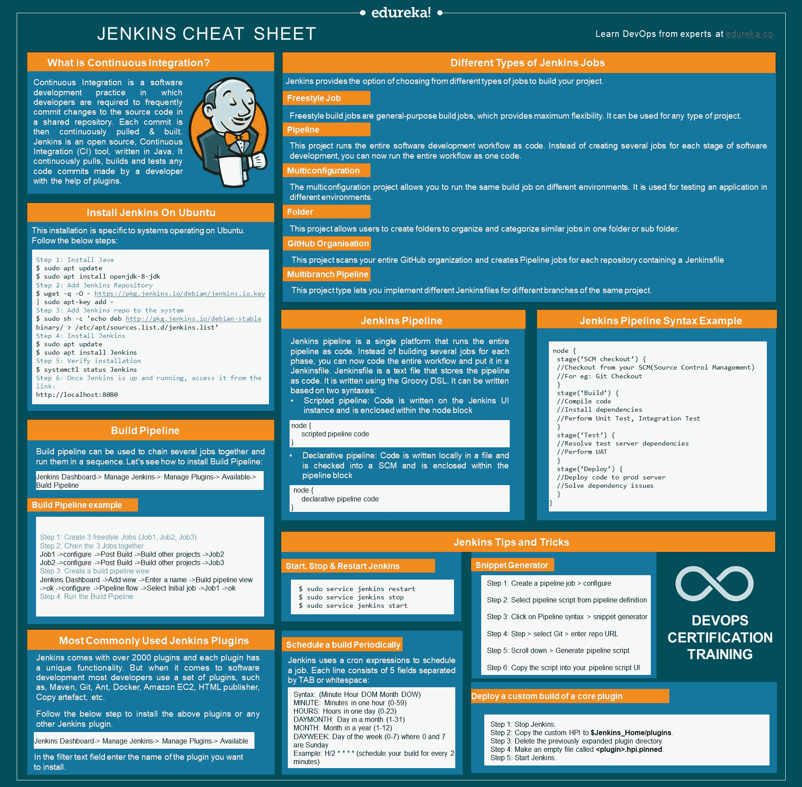
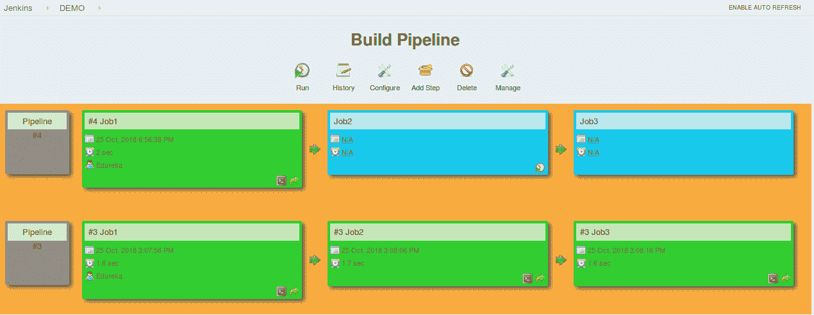
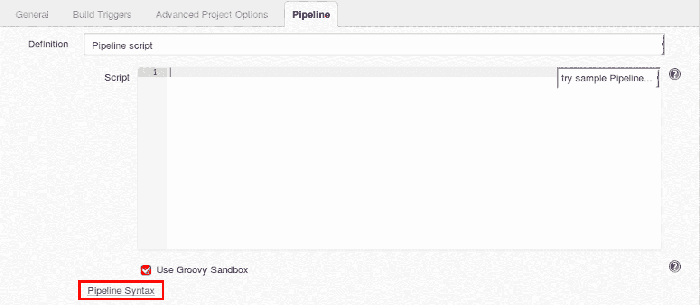
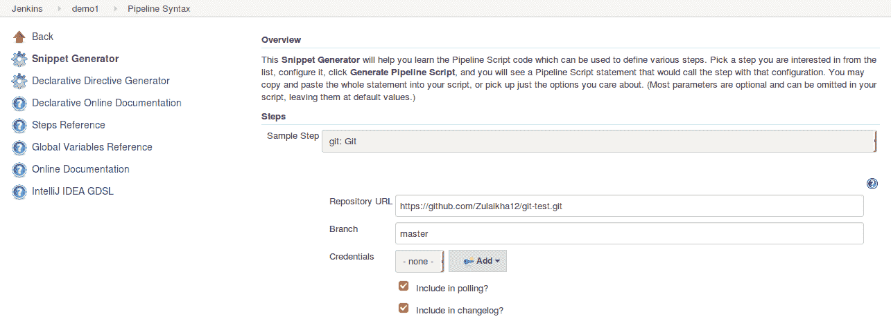
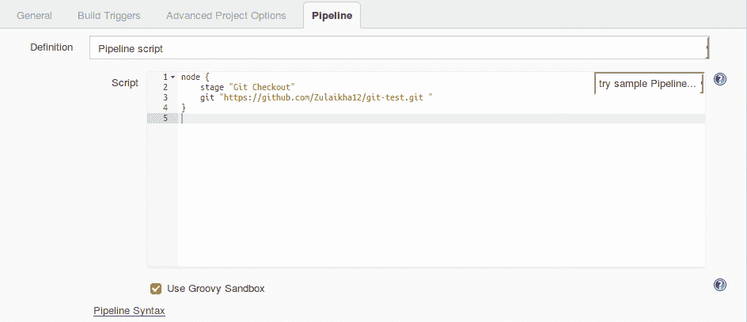

# 詹金斯备忘单——詹金斯初学者指南

> 原文：<https://www.edureka.co/blog/cheatsheets/jenkins-cheat-sheet/>

你是一个 **[DevOps](https://www.edureka.co/blog/what-is-devops/)** 热衷于探索不同工具的人吗？如果是的话，那你就来对地方了。DevOps 工程师是全球最受欢迎、薪酬最高的专业人士。考虑到这一点，让我向您介绍最流行的 **[DevOps 工具](https://www.edureka.co/blog/devops-tools)** ，Jenkins。这份 **[Jenkins](https://www.edureka.co/blog/jenkins-tutorial/)** 备忘单是为那些事先了解软件开发过程如何发生 的初学者准备的。

## 詹金斯小抄

**[持续集成](https://www.edureka.co/blog/all-you-need-to-know-continuous-integration-with-jenkins)** 是一种软件开发实践，在这种实践中，开发人员需要频繁地提交对共享存储库中源代码的更改。然后，每次提交都会不断地被拉进&构建。Jenkins 是一款开源的持续集成(CI)工具，用 [**Java**](https://www.edureka.co/blog/java-tutorial/) 编写。它不断地拉取、构建和测试开发人员在插件的帮助下提交的任何代码。

<figure class="wpb_wrapper vc_figure"></figure>

<figure class="wpb_wrapper vc_figure">[](http://bit.ly/2CQQeeK)</figure>

## 装置

先从安装詹金斯开始。这个安装是特定于在 Ubuntu 上运行的系统的。按照下面的步骤:

```
Step 1: Install Java
$ sudo apt update
$ sudo apt install openjdk-8-jdk

Step 2: Add Jenkins Repository
$ wget -q -O - https://pkg.jenkins.io/debian/jenkins.io.key | sudo apt-key add –

Step 3: Add Jenkins repo to the system
$ sudo sh -c 'echo deb http://pkg.jenkins.io/debian-stable binary/ > /etc/apt/sources.list.d/jenkins.list'

Step 4: Install Jenkins
$ sudo apt update
$ sudo apt install Jenkins

Step 5: Verify installation
$ systemctl status Jenkins

Step 6: Once Jenkins is up and running, access it from the link:
[http://localhost:8080](http://localhost:8080) 
```

## 最常用的 Jenkins 插件

Jenkins 自带 2000 多个插件，每个插件都有独特的功能。但是当涉及到软件开发时，大多数开发者使用一套插件，比如

*   胃
*   **[吉特](https://www.edureka.co/blog/git-tutorial/)**
*   蚂蚁
*   **[码头工人](https://www.edureka.co/blog/docker-tutorial)**
*   亚马逊 EC2
*   HTML 发布者
*   复制神器

按照以下步骤安装上述插件或任何其他 Jenkins 插件。

```
Jenkins Dashboard -> Manage Jenkins -> Manage Plugins -> Available 
```

在过滤器文本字段中输入您想要安装的插件的名称。

## 不同类型的詹金斯工作

Jenkins 提供了从不同类型的工作中进行选择的选项来构建您的项目。

以下是你可以选择的工作类型:

*   自由式

自由式构建作业是通用的构建作业，它提供了最大的灵活性。它可以用于任何类型的项目。

*   管道

这个项目以代码的形式运行整个软件开发工作流程。现在，您可以将整个工作流作为一个代码运行，而不是为软件开发的每个阶段创建几个作业。

*   多配置

多配置项目允许您在不同的环境中运行相同的构建作业。它用于在不同的环境中测试应用程序。

*   文件夹

该项目允许用户创建文件夹，以便在一个文件夹或子文件夹中对相似的工作进行组织和分类。

*   GitHub 组织

该项目扫描您的整个 GitHub 组织，并为包含 Jenkinsfile 的每个存储库创建管道作业

*   多分支管道

这个项目类型允许你为同一个项目的不同分支实现不同的 Jenkinsfiles。

## 构建管道

Build pipeline 可用于将几个作业链接在一起，并按顺序运行它们。 我们来看看如何安装搭建管道:

```
Jenkins Dashboard -> Manage Jenkins -> Manage Plugins -> Available 
```

在过滤器文本字段中输入您想要安装的插件的名称。

### 构建管道示例

```
Step 1: Create 3 freestyle Jobs (Job1, Job2, Job3)

Step 2: Chain the 3 Jobs together
Job1 -> configure -> Post Build -> Build other projects -> Job2
Job2 -> configure -> Post Build -> Build other projects -> Job3

Step 3: Create a build pipeline view
Jenkins Dashboard -> Add view -> Enter a name -> Build pipeline view -> ok ->
configure -> Pipeline flow -> Select Initial job -> Job1 -> ok

Step 4: Run the Build Pipeline
```

<figure class="wpb_wrapper vc_figure"></figure>

## 詹金斯管道公司

Jenkins pipeline 是将整个*管道作为代码运行的单一平台。*现在你可以对整个工作流程进行编码，并把它放在一个 Jenkinsfile 中，而不是为每个阶段构建几个作业。

Jenkinsfile 是一个文本文件，它将管道存储为代码。它是使用 Groovy DSL *编写的。*可以基于两种语法来写:

*   脚本化管道

代码写在 Jenkins UI 实例上，并包含在节点块中

```
node {
      scripted pipeline code
}
```

*   声明性管道

代码写在本地文件中，被检入 SCM，并被封装在流水线块内

```
pipeline {
      declarative pipeline code
}
```

## 管道概念

脚本式和声明式管道的基本原理如下:

1.  **管道:** 包含所有阶段的用户自定义块。它是声明性管道语法的关键部分。
2.  **节点:** 节点是执行整个工作流的机器。它是脚本化管道语法的关键部分。
3.  **代理:** 指示 Jenkins 为构建分配一个执行程序。它是为整个管道或特定阶段定义的。

它有以下参数:

*   *任何* : 在任何可用代理上运行管道/阶段
*   *无* : 应用于管道的根，表示整个管道没有全局代理&每个阶段必须指定自己的代理
*   *标签* : 在带标签的代理上执行流水线/阶段。
*   *Docker* : 使用 Docker 容器作为流水线或特定阶段的执行环境。

4.  **阶段:** 它包含了所有的工作；每个阶段都执行特定的任务。
5.  **步骤:** 步骤依次进行，执行一个阶段

## 创建您的第一个詹金斯管道

在安装完 Jenkins、使用构建管道构建作业并简要讨论了管道概念之后，让我们看看如何创建 Jenkins 管道。

按照以下步骤创建脚本化管道和声明性管道:

## Jenkins 管道语法示例

```
Step 1: Log into Jenkins and select ‘New Item from the Dashboard'

Step 2: Next, enter a name for your pipeline and select ‘Pipeline project’. Click ‘ok’ to proceed

Step 3: Scroll down to the pipeline and choose if you want a Declarative or Scripted pipeline

Step 4a: If you want a Scripted pipeline, then choose ‘pipeline script’ and start typing your code

Step 4b: If you want a Declarative Pipeline, select ‘Pipeline script from SCM’ and choose your SCM and enter your repository URL

Step 5: Within the Script path is the name of the Jenkinsfile that is going to be accessed from your SCM to run. Finally click on ‘apply’ and ‘save’
```

```
node {
     stage(‘SCM checkout’) {
          //Checkout from your SCM(Source Control Management)
          //For eg: Git Checkout
     }
     stage(‘Build’) {
          //Compile code
          //Install dependencies
          //Perform Unit Test, Integration Test
     }
     stage(‘Test’) {
          //Resolve test server dependencies
          //Perform UAT
     }
     stage(‘Deploy’) {
          //Deploy code to prod server
          //Solve dependency issues
     }
}
```

## 詹金斯提示和技巧

## 启动、停止和重启 Jenkins

通过命令行界面，按照以下命令启动、停止和重启 Jenkins。

```
$ sudo service jenkins restart
$ sudo service jenkins stop
$ sudo service jenkins start
```

## 部署核心插件的定制版本

```
Step 1: Stop Jenkins.

Step 2: Copy the custom HPI to **$Jenkins_Home/plugins**.

Step 3: Delete the previously expanded plugin directory.

Step 4: Make an empty file called **<plugin>.hpi.pinned**.

Step 5: Start Jenkins.
```

## 定期安排构建

Jenkins 使用 cron 表达式来安排作业。每行包含 5 个字段，由制表符或空格分隔:

```
Syntax: (Minute Hour DOM Month DOW)

MINUTE: Minutes in one hour (0-59)

HOURS: Hours in one day (0-23)

DAYMONTH: Day in a month (1-31)

MONTH: Month in a year (1-12)

DAYWEEK: Day of the week (0-7) where 0 and 7 are sunday

Example: H/2 * * * * (schedule your build for every 2 minutes)
```

试试这个例子:

```
H/2 * * * * (schedules your build for every 2 minutes)
```

## 代码片段生成器

一种工具，允许用户为脚本化管道中的各个步骤生成代码。我们来看一个例子:

```
Step 1: Create a pipeline job > configure

Step 2: Select pipeline script from pipeline definition

Step 3: Click on Pipeline syntax > snippet generator

Step 4: Step > select Git > enter repo URL

Step 5: Scroll down > Generate pipeline script

Step 6: Copy the script into your pipeline script UI
```

<figure class="wpb_wrapper vc_figure"></figure>

下面是代码片段生成器的图像。您可以从各种步骤中进行选择，并为每个步骤生成一个代码。

<figure class="wpb_wrapper vc_figure"></figure>

下图为脚本化管道用户界面，代码片段生成器生成代码

<figure class="wpb_wrapper vc_figure"></figure>

**[下载詹金斯小抄 Ed ureka](http://bit.ly/2CQQeeK)**

With this, we come to an end to **Jenkins ****Cheat Sheet**. Check out the DevOps Certification Training by [**Edureka**](https://www.edureka.co/), a trusted online learning company with a network of more than 250,000 satisfied learners spread across the globe. Edureka’s [***DevOps certification Training***](https://www.edureka.co/devops)  is designed to provide you with the knowledge and skills that are required to become a successful DevOps Engineer.