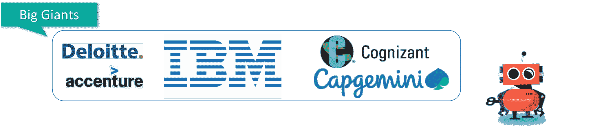
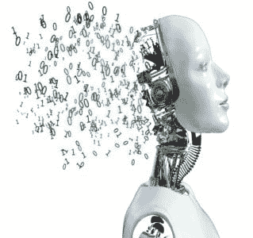
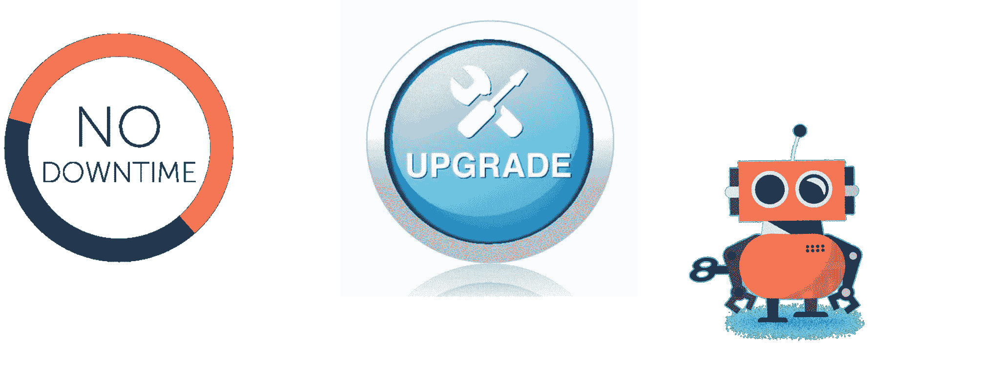
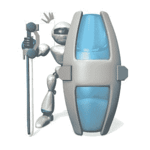
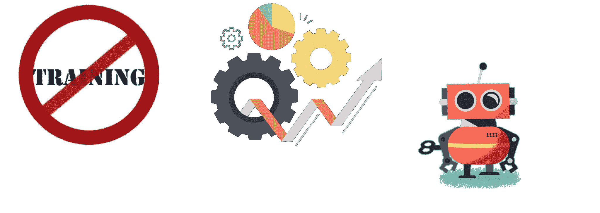

# 学习 RPA 的十大理由

> 原文：<https://www.edureka.co/blog/10-reasons-to-learn-rpa/>

机器人流程自动化是当今市场上的顶级技术之一，从小型到超高速发展的公司都在日常工作中使用自动化。在这篇关于学习 RPA 的 10 大理由的文章中，我 将谈论你为什么应该 ***学习机器人过程自动化*** 的各种理由。这是一种模拟人类执行任务的软件。它能比人更快、更准确、更不知疲倦地做重复性的事情。

## **学习 RPA 的十大理由**

我经常遇到这样的问题，为什么我应该选择 **[在线 RPA 课程](https://www.edureka.co/robotic-process-automation-training)** 。这篇关于学习 RPA 的 10 大理由的文章，基本上是告诉您理解 RPA 的概念在今天是多么重要。

下面是学习 RPA 的 10 个理由:

1.  [RPA 不是“推倒重来”](#RPAisnot)
2.  [软件迁移](#SoftwareMigration)
3.  [与 AI 和 ML 合作](#collaborationwithai)
4.  [易于扩展和实现](#EasyToScaleandImplement)
5.  [送来安全](#DeliversSecurity)
6.  [没有停机时间](#NoDownTime)
7.  [复杂的问题被解决](#ComplexProblemsAreSolved)
8.  [ROI 可见](#ROIIsVisible)
9.  [省时省钱](#SavesTimeandMoney)
10.  [人气和高薪](#PopularityandHighSalary)

## 学习 RPA 的十大理由|使用 UiPath 进行 RPA 培训| RPA 初学者教程| Edureka

[https://www.youtube.com/embed/6lpHPZrm4uU?rel=0&showinfo=0](https://www.youtube.com/embed/6lpHPZrm4uU?rel=0&showinfo=0)This Edureka video on “Top 10 Reasons To Learn RPA” will give you enough reasons why you must learn RPA.

现在让我们从列表开始。

## **10。人气和高薪**

## 

According to Indeed.com, the average salary for an [RPA developer](https://www.edureka.co/blog/how-to-become-rpa-developer/) ranges around **$100,275** per year. Not only at an individual level but many hyper-growth companies like **Dell or Accenture, IBM, Cognizant, Capgemini** use [robotic process automation](https://www.edureka.co/blog/robotic-process-automation/) in the companies to enhance the growth in the scaling industry.

## **9。节省时间和金钱**

节省时间和金钱的流程是任何企业取得成功的最基本标准。 在时间和收入之间找到合适的平衡以确保业务盈利非常重要。目前市场上最顶级的 [RPA 工具](https://www.edureka.co/blog/rpa-tools-list-and-comparison/)是**，提供免费版本**，让客户学习如何自动化任务。

## **8。ROI 可见**

## 

大规模应用程序或 IT 计划通常被定位为成本节约者。虽然 RPA 可以带来一些直接的固定成本，但它有更清晰的部分来展示其回报。RPA 确保在自动化任务的同时，用**最小的花费**，你可以获得**最大的利润**。DHL 是最大的例子之一，DHL 部署了 RPA 来改善其财务和物流流程，并且仅用了一个月就获得了全部投资回报。

## **7。复杂的问题都解决了**

## 

随着我们的数据源和分析能力的增长，构建各种报告所需的时间也在增加。机器人过程自动化系统是解决这类问题的理想解决方案。系统**存储信息，它也可以很容易地记住和转换这些信息**，这意味着这使你可以审计和纳税。因此，您可以设计一个自动化工作流，通过在每天的预定时间从各种来源检索数据来创建报告。

**了解我们在顶级城市的 RPA 与 UiPath 认证课程**

| 印度 | 美国 | 其他热门城市 |
| [在海得拉巴的卢旺达爱国军训练](https://www.edureka.co/robotic-process-automation-training-hyderabad) | [达拉斯 RPA 球场](https://www.edureka.co/robotic-process-automation-training-dallas) | [德里 RPA 认证](https://www.edureka.co/robotic-process-automation-training-delhi) |
| [在班加罗尔的爱国军训练](https://www.edureka.co/robotic-process-automation-training-bangalore) | [夏洛特的 RPA 球场](https://www.edureka.co/robotic-process-automation-training-charlotte) | [孟买 RPA 认证](https://www.edureka.co/robotic-process-automation-training-mumbai) |
| [在钦奈的爱国军训练](https://www.edureka.co/robotic-process-automation-training-chennai) | [纽约 RPA 课程](https://www.edureka.co/robotic-process-automation-training-new-york-city) | [浦那 RPA 认证](https://www.edureka.co/robotic-process-automation-training-pune) |

## **6。没有停机时间**

## 

软件机器人可以一直工作——全年**每天 24 小时**，以 **100%的能力**。如果您的流程发生变化，机器人需要学习新的东西，您可以用新的机器人替换它们，或者改变它们的编程。设计出来的机器人**不易出错**并且能以相当快的方式完成指定的工作。

## **5。交付安全**

## 

A security breach of data is an unfortunate instance as businesses almost get ruined since the data is stored in a central repository and if you are using RPA, it ensures that the setting of accessibility is done by the employee. That means o**nly the right people will have access to the data** that pertains directly to their workflow. Anything else that they’re not supposed to see will remain encrypted and safe from prying eyes.

## **4。易于扩展和实施**

## 

RPA 系统非常**易于使用**和实施，因为它侧重于为终端用户导航提供帮助。这也让员工意识到哪些工作要做得更方便、更快捷。

假设一个工作流程没有正常工作，你可以立即做出改变，看看这些改变对你最终结果的影响有多大。

## **3。与 AI 和 ML 合作**

[人工智能](https://www.edureka.co/blog/artificial-intelligence-tutorial/)是最近与 RPA 合作确定最佳自动化机会的热门概念之一。目前市场上的 RPA 工具在其功能中包括 AI 和 [ML](https://www.edureka.co/blog/introduction-to-machine-learning/) 功能，以增加 RPA 在各种行业(如银行、金融、制造等)中产生的影响。在人工智能功能的帮助下，这些机器人利用认知能力从半结构化和非结构化数据中提取信息。这些机器人还学会检测模式，这样下次遇到这种模式时，机器人就知道该做什么了。

## **2。软件迁移**

## ****

软件迁移既耗时又昂贵，这是事实。迁移到新的 ERP 或任何 AMA 可能需要数年时间，花费数千万或数亿美元。更令人沮丧的是，有时在以前的软件版本中可能以特定方式运行的某些特性和功能在更新的版本中可能甚至不存在。

**例如**:假设一个员工**锁定等待时间**的业务流程合计**人力资源软件 A** 。现在如果软件更新到 **HR 软件 B.** 这种高级的综合软件可能不会跟踪带薪时间。

那么，在这种情况下，公司必须维护一小部分**软件 A** 并手动将数据传递到**软件 b**在这种基于组织的问题中，机器人流程自动化有助于其准确性、速度和软件的持续更新。

## **1。RPA 不是“推倒重来”**

近来有很多关于就业前景黯淡的言论，因为有人声称机器人会偷走所有的工作，但事实上，自动化将刺激许多新工作的增长，包括一些全新的工作类别。

使用**虚拟劳动力或 RPA 机器人的最大优势之一是，它不需要您更换现有系统**，这意味着它们都位于您现有基础架构之上并与之并排 。因此，为了完成您的工作，您将需要一些额外的软件和虚拟机来部署完全独立的数字工作人员或正常的体育活动，但您不需要淘汰和更换现有的基础架构。因此，RPA 不会关闭您的现有系统，而是利用它们。

我相信这十大理由足以让你在 RPA 开始职业生涯。查看 Edureka 提供的 **[自动化随处课程](https://www.edureka.co/automation-anywhere-certification-training)** ，edu reka 是一家值得信赖的在线学习公司，在全球拥有超过 250，000 名满意的学习者。两者，这些认证将帮助你分别在 [UiPath](https://www.edureka.co/blog/uipath-tutorial/) 和 [Automation Anywhere](https://www.edureka.co/blog/rpa-automation-anywhere/) 获得深入的知识。

另外，如果你想从事自动化方面的职业？你应该看看我们的 [RPA 开发者课程](https://www.edureka.co/masters-program/rpa-developer-training)。 *培训课程包括现场讲师指导培训、行业用例、现场动手项目。这个培训项目将帮助你对 RPA 充满信心，并帮助你得到你一直想要的工作。*

有问题要问我们吗？请在这篇文章的评论部分提到它，我们会给你回复。