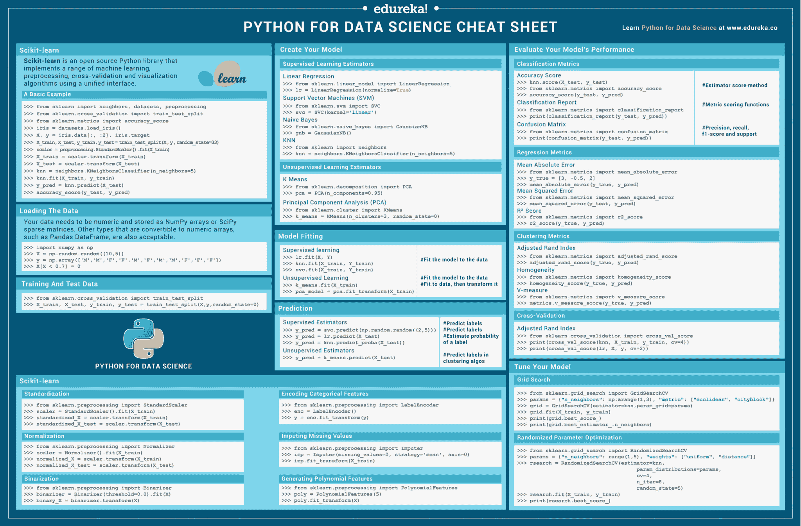

# python sci kit-学习机器学习的备忘单

> 原文：<https://www.edureka.co/blog/cheatsheets/python-scikit-learn-cheat-sheet/>

你是一个正在寻找强大的机器学习库的 Python 程序员吗？如果是，那么你必须考虑 [scikit-learn](https://www.edureka.co/blog/scikit-learn-machine-learning/) 。Python 中的 Scikit learn 在机器学习的概念中起着不可或缺的作用，并且需要获得您的 [Python for Data Science](https://www.edureka.co/data-science-python-certification-course) *认证*。这份 scikit-learn 备忘单是为 已经开始学习 Python 包但想要一本方便的参考资料的人设计的。如果你是初学者，不知道 scikit -learn 是如何工作的，不要担心，这份关于机器学习的 scikit-learn 备忘单将为你提供快速参考，帮助你了解入门所必需的基础知识。

## Scikit 的 Python 备忘单-学习

[Scikit-learn](https://www.edureka.co/blog/scikit-learn-machine-learning/#ScikitLearn) 是一个开源的 [Python 库](https://www.edureka.co/blog/learn-python-for-data-science/#PythonLibraries)，用于[机器学习](https://www.edureka.co/blog/machine-learning-tutorial/)，预处理，交叉验证和可视化算法。它在 [Python](https://www.edureka.co/blog/python-tutorial/) 中提供了一系列监督和非监督学习算法。

<figure class="wpb_wrapper vc_figure"></figure>

<figure class="wpb_wrapper vc_figure">[](http://bit.ly/2xIBJpJ)</figure>

## 一个基本例子

让我们用 scikit 创建一个基本的例子- 学习库，它将被用于

*   加载数据
*   将数据分成训练和测试，
*   使用 KNN 算法训练您的数据，
*   预测结果

```
>>> from sklearn import neighbors, datasets, preprocessing
>>> from sklearn.model_selection import train_test_split
>>> from sklearn.metrics import accuracy_score
>>> iris = datasets.load_iris() 
>>> X, y = iris.data[:, :2], iris.target
>>> X_train, X_test, y_train, y_test = train_test_split(X, y, random_state=33)
>>> scaler = preprocessing.StandardScaler().fit(X_train)
>>> X_train = scaler.transform(X_train) 
>>> X_test = scaler.transform(X_test)
>>> knn = neighbors.KNeighborsClassifier(n_neighbors=5)
>>> knn.fit(X_train, y_train)
>>> y_pred = knn.predict(X_test)
>>> accuracy_score(y_test, y_pred)
```

## 加载数据

你需要在 [NumPy 数组](https://www.edureka.co/blog/python-numpy-tutorial/)或 SciPy 稀疏矩阵中存储一个数值数据。你也可以使用其他数值数组，比如[熊猫数据帧](https://www.edureka.co/blog/python-pandas-tutorial/)。

```
>>> import numpy as np
>>> X = np.random.random((10,5))
>>> y = np.array(['M','M','F','F','M','F','M','M','F','F','F'])
>>> X[X < 0.7] = 0
```

## 培训和测试

一旦数据加载完毕，你的下一个任务就是将数据集分成训练数据和测试数据。

```
>>> from sklearn.model_selection import train_test_split
>>> X_train, X_test, y_train, y_test = train_test_split(X, y, random_state=0)
```

## 数据预处理

## 标准化

数据 [**标准化**](http://scikit-learn.org/stable/modules/generated/sklearn.preprocessing.StandardScaler.html) 是数据预处理步骤之一，用于重新调整一个或多个属性，使属性的平均值为 0，标准差为 1。**标准化**假设你的数据具有高斯(钟形曲线)分布。

```
>>> from sklearn.preprocessing import StandardScaler
>>> scaler = StandardScaler().fit(X_train)
>>> standardized_X = scaler.transform(X_train)
>>> standardized_X_test = scaler.transform(X_test)
```

## 二值化

[二值化](http://scikit-learn.org/stable/modules/generated/sklearn.preprocessing.binarize.html)是对文本计数数据进行的常见操作。例如，使用二值化，分析员可以决定考虑特征的存在或不存在，而不是具有量化的出现次数。

```
>>> from sklearn.preprocessing import Binarizer
>>> binarizer = Binarizer(threshold=0.0).fit(X)
>>> binary_X = binarizer.transform(X)
```

## 正常化

[**归一化**](http://scikit-learn.org/stable/modules/generated/sklearn.preprocessing.Normalizer.html) 是一般用于**机器学习**的数据准备的技术。**规范化**的主要目标是改变数据集中数值列的值，这样我们就可以有一个共同的范围，而不会丢失信息或扭曲值范围的差异。

```
>>> from sklearn.preprocessing import Normalizer
>>> scaler = Normalizer().fit(X_train)
>>> normalized_X = scaler.transform(X_train)
>>> normalized_X_test = scaler.transform(X_test)
```

## 编码分类特征

[label encoder](http://scikit-learn.org/stable/modules/generated/sklearn.preprocessing.LabelEncoder.html)是另一个用于编码类级别的数据预处理的类。也可用于将非数字标签转换为数字标签。

```
>>> from sklearn.preprocessing import LabelEncoder
>>> enc = LabelEncoder()
>>> y = enc.fit_transform(y)
```

## 输入缺失值

python 中的[估算器](http://scikit-learn.org/stable/modules/generated/sklearn.preprocessing.Imputer.html#sklearn.preprocessing.Imputer)类将为你提供输入/填充缺失值的基本策略。它通过使用缺失值所在的行或列的平均值、中间值或最频繁出现的值来实现这一点。这个类还允许对不同的缺失值进行编码。

```
>>> from sklearn.preprocessing import Imputer
>>> imp = Imputer(missing_values=0, strategy='mean', axis=0)
>>> imp.fit_transform(X_train)
```

## 生成多项式要素

[多项式特征](http://scikit-learn.org/stable/modules/generated/sklearn.preprocessing.PolynomialFeatures.html)生成一个新的特征矩阵，该矩阵由次数小于或等于指定次数的特征的所有多项式组合组成。例如，如果输入样本是二维的并且形式为[a，b]，那么 2 次多项式特征是[1，a，b，a^2，ab，b^2].

```
>>> from sklearn.preprocessing import PolynomialFeatures
>>> poly = PolynomialFeatures(5)
>>> poly.fit_transform(X)
```

## 创建您的模型

## 监督学习估计器

[**监督学习**](https://www.edureka.co/blog/machine-learning-tutorial/#SupervisedLearning) 是一种机器学习，它使模型能够在对**标记的数据**进行**训练**后预测未来的结果。

## 无监督学习估计器

[**无监督学习**](https://www.edureka.co/blog/machine-learning-tutorial/#UnsupervisedLearning) 是一种机器学习，它使模型能够预测未来的结果**，而无需对**标记的数据**进行**训练**。**

```
# Linear Regression Algorithm
>>> from sklearn.linear_model import LinearRegression
>>> lr = LinearRegression(normalize=True)
# Naive Bayes Algorithm
>>> from sklearn.naive_bayes import GaussianNB
>>> gnb = GaussianNB()
# KNN Algorithm
>>> from sklearn import neighbors
>>> knn = neighbors.KNeighborsClassifier(n_neighbors=5)
# Support Vector Machines (SVM)
>>> from sklearn.svm import SVC
>>> svc = SVC(kernel='linear’)
```

```
# Principal Component Analysis (PCA)
>>> from sklearn.decomposition import PCA
>>> pca = PCA(n_components=0.95)
# K Means Clustering Algorithm
>>> from sklearn.cluster import KMeans
>>> k_means = KMeans(n_clusters=3, random_state=0)
```

## 模型拟合

是一个衡量**机器学习模型**推广到与其训练数据相似的数据的能力

```
# For Supervised learning
>>> lr.fit(X, y) #Fits data into the model
>>> knn.fit(X_train, y_train)
>>> svc.fit(X_train, y_train)
# For Unsupervised Learning
>>> k_means.fit(X_train)#Fits data into the model
>>> pca_model = pca.fit_transform(X_train) #Fit to data, then transform it
```

## 预言；预测；预告

是一个衡量**机器学习模型**推广到与其训练数据相似的数据的能力

```
# For Supervised learning
>>> y_pred=svc.predict(np.random((2,5))) #predict label
>>> y_pred=lr.predict(x_test) #predict label
>>> y_pred=knn.predict_proba(x_test)#estimate probablity of a label
# For Unsupervised Learning
>>> y_pred=k_means.predict(x_test) #predict labels in clustering algorithm
```

## 评估模型的性能

## 分类指标

[`sklearn.metrics`](http://scikit-learn.org/stable/modules/classes.html#module-sklearn.metrics "sklearn.metrics")模块实现了几个损失、得分和效用函数来测量分类性能。

```
# Mean Absolute Error
>>> from sklearn.metrics import mean_absolute_error
>>> y_true = [3, -0.5, 2]
>>> mean_absolute_error(y_true, y_pred)
# Mean Squared Error
>>> from sklearn.metrics import mean_squared_error
>>> mean_squared_error(y_test, y_pred)
# R² Score
>>> from sklearn.metrics import r2_score
>>> r2_score(y_true, y_pred)
```

## 回归度量

[`sklearn.metrics`](http://scikit-learn.org/stable/modules/classes.html#module-sklearn.metrics "sklearn.metrics")模块实现了几个损失、得分和效用函数来度量回归性能。

```
# Accuracy Score
>>> knn.score(X_test, y_test)
>>> from sklearn.metrics import accuracy_score
>>> accuracy_score(y_test, y_pred)
# Classification Report
>>> from sklearn.metrics import classification_report
>>> print(classification_report(y_test, y_pred))
# Confusion Matrix
>>> from sklearn.metrics import confusion_matrix
>>> print(confusion_matrix(y_test, y_pred))
```

## 聚类度量

```
# Adjusted Rand Index
>>> from sklearn.metrics import adjusted_rand_score
>>> adjusted_rand_score(y_true, y_pred)
# Homogeneity
>>> from sklearn.metrics import homogeneity_score
>>> homogeneity_score(y_true, y_pred)
# V-measure
>>> from sklearn.metrics import v_measure_score
>>> metrics.v_measure_score(y_true, y_pred)
```

## 交互效度分析

```
>>> from sklearn.cross_validation import cross_val_score 
>>> print(cross_val_score(knn, X_train, y_train, cv=4)) 
>>> print(cross_val_score(lr, X, y, cv=2))
```

## 调整您的模型

## 网格搜索

[GridSearchCV](http://scikit-learn.org/stable/modules/generated/sklearn.model_selection.GridSearchCV.html) 实现了一个“fit”和一个“score”方法。它还实现“预测”、“预测 _proba”、“决策 _ 函数”、“变换”和“逆变换”，如果它们在所使用的估计器中实现的话。

```
>>> from sklearn.grid_search import GridSearchCV
>>> params = {"n_neighbors": np.arange(1,3), "metric": ["euclidean", "cityblock"]}
>>> grid = GridSearchCV(estimator=knn, param_grid=params)
>>> grid.fit(X_train, y_train)
>>> print(grid.best_score_)
>>> print(grid.best_estimator_.n_neighbors)
```

## 随机参数优化

[RandomizedSearchCV](http://scikit-learn.org/stable/modules/generated/sklearn.model_selection.RandomizedSearchCV.html) 对超级参数进行随机搜索。与 GridSearchCV 相反，不是所有的参数值都被尝试，而是从指定的分布中采样固定数量的参数设置。尝试的参数设置的数量由 n_iter 给出。

```
>>> from sklearn.grid_search import RandomizedSearchCV
>>> params = {"n_neighbours": range(1,5), "weights":["uniform", "distance"]}
>>>rserach = RandomizedSearchCV(estimator=knn,param_distribution=params, cv=4, n_iter=8, random_state=5)
>>> rsearch.fit(X_train, Y_train)
>>> print(rsearch.best_score)
```

[下载](http://bit.ly/2xIBJpJ)[Python Cheat Sheet for Scikit-learn-edu reka](http://bit.ly/2xIBJpJ)