# AWS 迁移:将本地应用程序迁移到云

> 原文：<https://www.edureka.co/blog/aws-migration/>

不管业务如何，组织总是要经历竞争。因此，与市场需求保持同步就成了必须,“时间”就成了不可或缺的组成部分。如果有一种方法，企业可以专注于他们的业务目标，并将他们的维护和监控任务外包到其他地方，那会怎么样。这是否有助于节省时间&更高效地满足市场需求？迁移到云让你做完全一样的事情。这篇 *AWS 迁移*文章将带您了解在您计划迁移到云之前需要考虑的所有必要要点。通过 [AWS 在线培训](https://www.edureka.co/aws-certification-training)了解亚马逊网络服务。

首先，让我给你定义一下移民:

*‘Moving your data from an on-premise data center to Cloud is called Migration’.***Now that the definition is out of the way, let’s take a look at the pointers the article focuses on:

在我们开始之前，请务必查看班加罗尔的 [AWS 课程，让您掌握 AWS。让我们从理解迁移的必要性开始。](https://www.edureka.co/aws-certification-training-bangalore)

## **需要进行迁移 ** 

当涉及到处理诸如安全性、扩大或缩小规模等情况时，业务并不是一件容易的事情。让我们来看几个场景，其中 *AWS 迁移*可能是更好的选择。

1.  您的项目在一夜之间开始接收大量流量
2.  您的客户希望快速实施和部署应用
3.  管理不断增长的数据库需求变得越来越昂贵
4.  你对数据中心瘫痪的不幸持谨慎态度

如果你迁移到云，那么上面提到的问题会自动得到处理。 让我们更进一步，了解什么是迁移。

## **什么是迁移？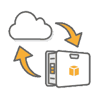T3**

迁移您的项目意味着将您的数据从本地数据中心迁移到云中。仅供参考，我们不是指天空中的云。在这种情况下，云是在数据中心上使用的虚拟化，使功能更加灵活。许多公司如 GoDaddy、Expedia 等。最近将业务转移到了云。 定义好迁移之后，让我告诉你在哪里、如何以及谁来帮你迁移数据。 实现由亚马逊网络服务(AWS)提供。那么，我们来了解一下 AWS 是什么？

## **什么是 AWS？**

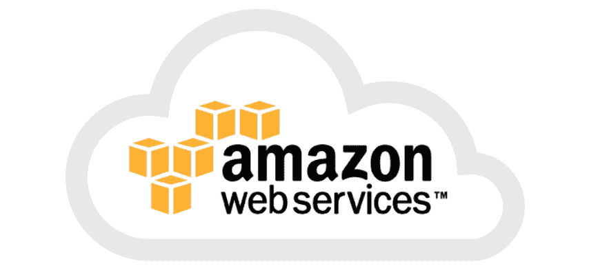亚马逊网络服务(AWS)是 Amazon.com 的子公司，提供按需云服务。AWS 在 2006 年推出了一些服务。然后，在 2012 年推出了 AWS Marketplace，其中包含了 AWS 提供的大量服务。

同样，迁移是一项艰巨的任务，AWS 分阶段推进迁移。那么，让我带您了解一下数据迁移的不同阶段。

## ***AWS 迁移阶段***

数据迁移似乎是一个简单的过程，因为通俗地说，它意味着将数据从一个位置移动到另一个位置。然而，由于该过程涉及不同的阶段，因此更加复杂。 现在我来说说迁移的各个阶段:

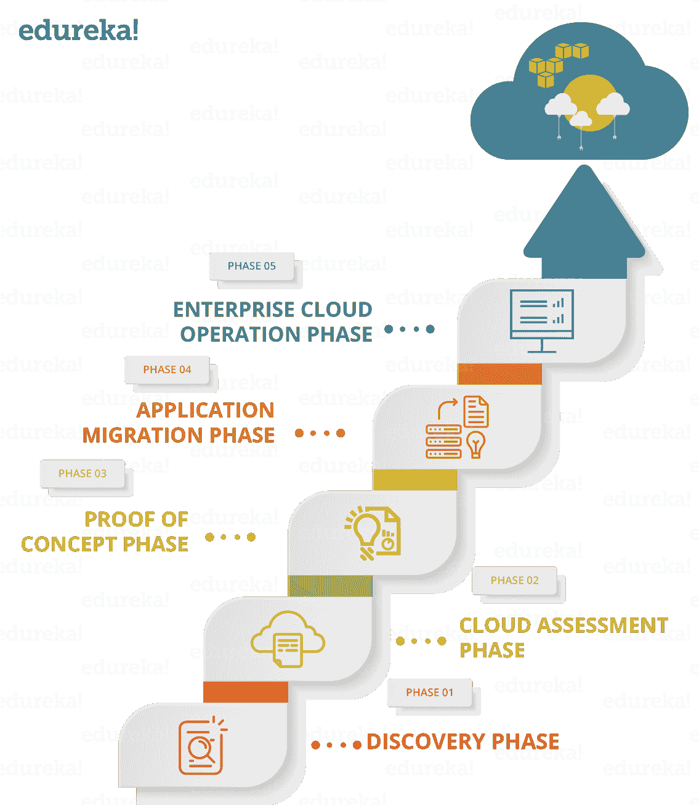

### **第 1 阶段:发现-哪些应用程序可以迁移到云？**

有时候你不需要将整个企业迁移到云中。这就是种族隔离的重要性。您需要确定哪些应用程序可以迁移，哪些不可以。这就是第一阶段的全部内容。现在，l et 进入第二阶段，即选择 *AWS 迁移*的方法。

### **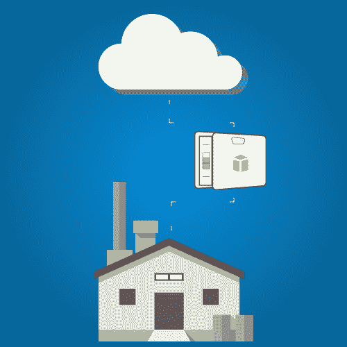第二阶段:评估–选择您的迁移方法** 

根据不同的数据，AWS 提供了不同的方法来迁移您的应用程序，例如 [AWS 雪球](https://aws.amazon.com/snowball/)、 [AWS 雪地车](https://aws.amazon.com/snowmobile/)、 [AWS 直连](https://aws.amazon.com/directconnect/)等。一旦你选择了一种合适的方式来移动你的数据，也要寻找你需要的资源。现在让我们探索在第 3 阶段中在 AWS 云上存储数据的不同方式。

### **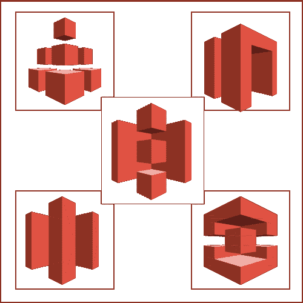**

### **第 3 阶段:AWS 存储的概念验证(POC)**

一旦你知道如何迁移和迁移什么，接下来，你必须弄清楚如何存储和在哪里存储。迁移到 AWS 的全部动机是为了最小化开支。在此阶段，您将测试您的工作负载，并了解 AWS 存储服务、其优势、局限性以及必要的安全控制。

### **第四阶段:应用迁移到 AWS** 

现在，您已经具备了所有先决条件，如蓝图、迁移工具、任务列表、备份及其与本地数据存储库的同步。您最终可以将您的项目迁移到 AWS Cloud。一旦你将你的项目迁移到云上，可靠性和持久性是你得到的额外好处。让我们看看 AWS 在第 5 阶段给你的架构带来的变化。

### **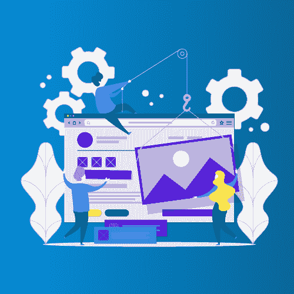**

### **第五阶段:企业云运营**

此时，您已经迁移到了 AWS，AWS 将带来更新，您需要将这些更新整合到您现有的架构中。因此，您必须确保有一个 24×7 的支持团队来跟踪迁移后的系统维护和升级。

那么，这就是关于*AWS 迁移* 的不同阶段以及如何实现它。L et 探索 *AWS 迁移* 的策略。

## **应用迁移策略‘6r’**

根据架构的不同，迁移现有应用程序的复杂性也不同，Amazon 提出了不同的策略，他们通常称之为 6 R。让我们看看他们每个人:

1.  **重新托管** **:-** 你已经准备好了你的应用程序，然后你可以简单地在 AWS 上重新托管它。也称为“提升和移位”。您将您的服务和应用程序从您的托管环境中取出，并使用第三方导出工具将它们转移到云中。
2.  **重新平台** **:-** 你有一个过时版本的应用程序运行在你的托管环境中，所以你必须修改你的应用程序，然后重新托管它。Replatform 是对“提升和移位”的修改。它包括优化云架构，以在不改变应用程序核心架构的情况下实现优势。
3.  **回购** **:-** 会有某些应用与新架构不兼容。在这种情况下，您需要为新的架构购买新的应用程序。AWS Marketplace 提供广泛的服务，也采用“按使用付费”的模式。*回购*也称为*“放弃并购买”*您可以升级、简化实施、接受新架构并对现有模型进行更改。
4.  **重构** **:-** 您想要添加新功能，扩展现有业务模式的极限，以及现有环境难以实现的性能。您重新考虑您的需求，尽管解决方案有点贵。从长远来看，通过转向面向服务的架构(SOA)来改善业务将使您的业务受益。
5.  **退休** **:-** 在 *AWS 迁移之后*你可以区分有用和无用的资源。因此，你砍掉了所有对业务不再有用的资源，并围绕新资源建立了一个战略。这将减少额外的费用。由于担心的事情较少，现在您可以专注于维护新业务模型所使用的资源。
6.  **保留** **:-** 如你所知，你的项目中你需要迁移的部分。你可以简单地使用上述任何一种策略。然后，构建一个策略来保留这些应用程序，根据您的业务模型，这些应用程序尚未准备好迁移到云或最近升级的应用程序。

我们看到了不同的策略，合起来称为 6 R，在 *AWS 迁移*时应该明智地选择。现在让我们看看实现 *AWS 迁移*后的更大图景。

**查看我们在顶级城市的 AWS 认证培训**

| 印度 | 美国 | 其他国家 |
| [在海德拉巴的 AWS 培训](https://www.edureka.co/aws-certification-training-hyderabad) | [亚特兰大 AWS 培训](https://www.edureka.co/aws-certification-training-atlanta) | [AWS 伦敦培训](https://www.edureka.co/aws-certification-training-london) |
| [班加罗尔的 AWS 培训](https://www.edureka.co/aws-certification-training-bangalore) | [波士顿 AWS 培训](https://www.edureka.co/aws-certification-training-boston) | [阿德莱德的 AWS 培训](https://www.edureka.co/aws-certification-training-adelaide) |
| [钦奈的 AWS 培训](https://www.edureka.co/aws-certification-training-chennai) | [纽约市的 AWS 培训](https://www.edureka.co/aws-certification-training-new-york-city) | [新加坡 AWS 培训](https://www.edureka.co/aws-certification-training-singapore) |

## ***AWS 迁移的好处***

AWS 迁移为您的组织带来无限的好处。让我们简单地研究一下主要的问题。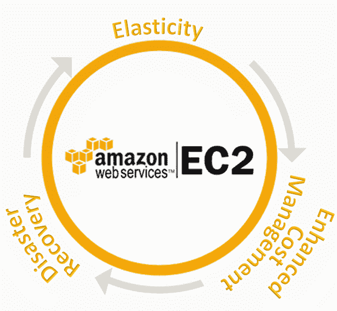

1.  **弹性** :- *按需添加和移除容量是弹性最大的好处。*
2.  **灾难恢复** :- *凭借 99.95%的保证正常运行时间，企业可以放心地知道他们的数据将始终可用。*
3.  **增强成本管理**:-*IaaS 平台提供了两大好处。首先，Amazon Web Services 这样的 IaaS 是按月提供的服务。其次，它消除了继续购买和维护物理硬件的需要。*

这些就是 AWS 迁移的好处。 让我们投入 AWS 提供的服务来简化迁移过程。

## **服务为 *AWS 迁移***

在 Amazon 提供的众多自动化数据迁移工具中，我将讨论一些更常用的工具。

### ** [ AWS 迁移中枢](https://aws.amazon.com/migration-hub/)**:*AWS p**提供 * *单一位置用于跟踪迁移过程。Migration Hub 让您可以自由选择符合您需求的迁移合作伙伴和工具。* 

### [**AWS 服务器迁移服务(SMS)**](https://aws.amazon.com/server-migration-service/):*AWS SMS***是*一种无代理服务，有助于更轻松、更快速地将****内部工作负载迁移到 AWS。它允许您自动迁移和跟踪服务器的复制。它使与您的大规模服务器迁移的协调变得容易。 * 

****

### [**亚马逊 S3 传输加速**](https://docs.aws.amazon.com/AmazonS3/latest/dev/transfer-acceleration.html) : *这使得文件长距离传输到 AWS S3 桶更快更安全。*

### [**AWS 雪球**](https://aws.amazon.com/snowball/):*它是一种使用安全设备将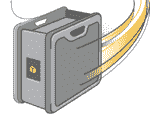  * * 大量数据传输进出 AWS 的 Pb 级数据传输解决方案。 * 

### **[AWSSnowmobile](https://aws.amazon.com/snowmobile/)**:*这是一种将海量数据移动到 AWS 的 EB 级数据传输解决方案。Snowmobile 让海量数据的传输变得更加容易。* 

### [**亚马逊Kinesisfire hose**](https://aws.amazon.com/kinesis/):*这是所有方法中最简单的。它可以捕获并自动加载**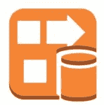****数据流到亚马逊 S3。您可以分析实时数据，及时了解迁移情况。  * 

现在您已经了解了 AWS 的一切，以及 *AWS 迁移*，让我向您展示一个使用案例，您将从我的本地机器向 AWS 云迁移一个虚拟操作系统。

## **演示:使用导入/导出方法实现迁移**

您将使用导入/导出(AWS Direct Connect)方法将运行在 VMWare 上的本地虚拟操作系统迁移到 AWS。

**前置条件**

1.  [安装在本地机器上的 VMware 工作站](https://www.youtube.com/watch?v=7m3f-P-WWbg)
2.  [运行 AWS 账户](https://www.youtube.com/watch?v=PW-V-72MJNY)
3.  [在 AWS 上创建了 IAM 用户](https://www.youtube.com/watch?v=UqKWHZ36yEM)
4.  [本地机器上配置的 AWS CLI](https://www.youtube.com/watch?v=sLtf7Sx8lsQ)
5.  [在 AWS 上创造了 S3 斗](https://www.youtube.com/watch?v=XNeBwuK2_TA)

1。创造一个**。vmdk** 为 Ubuntu 14.04 导出文件。

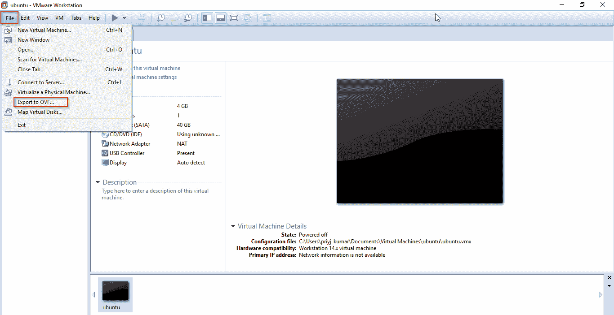

2。下载&配置 AWS CLI。

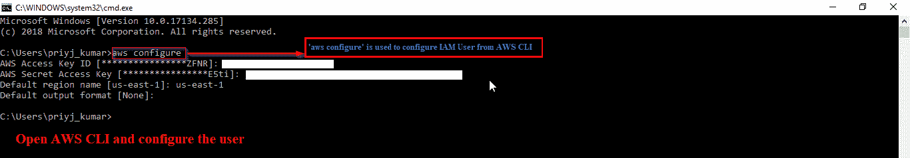

3。创建一个 IAM 用户。

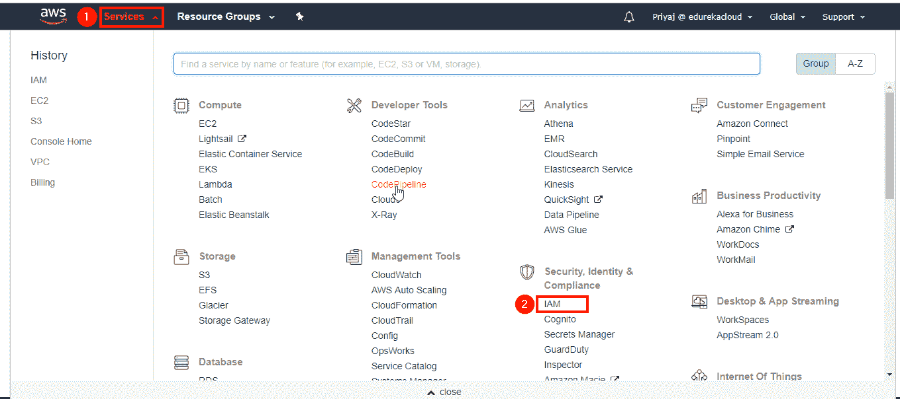

现在点击“添加用户”。

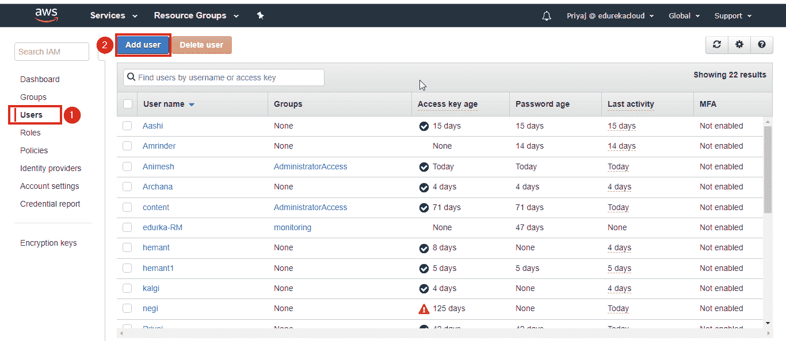接下来，选择一个唯一的用户名。

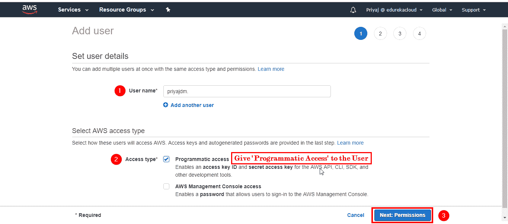

现在授予管理员访问权限。

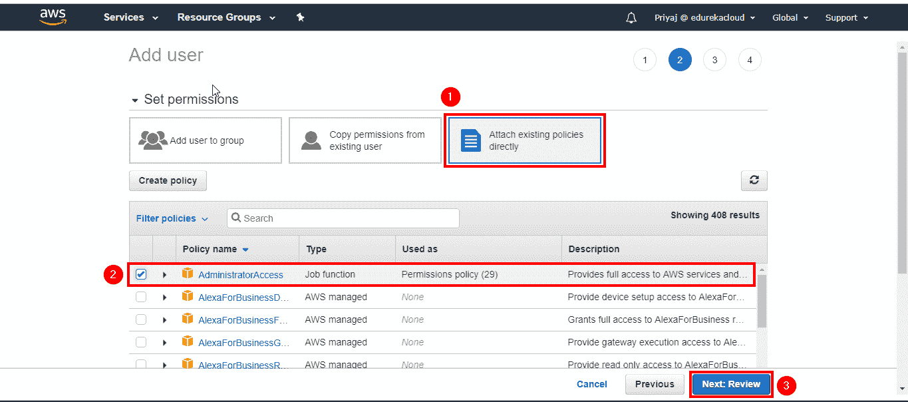

点击创建用户。

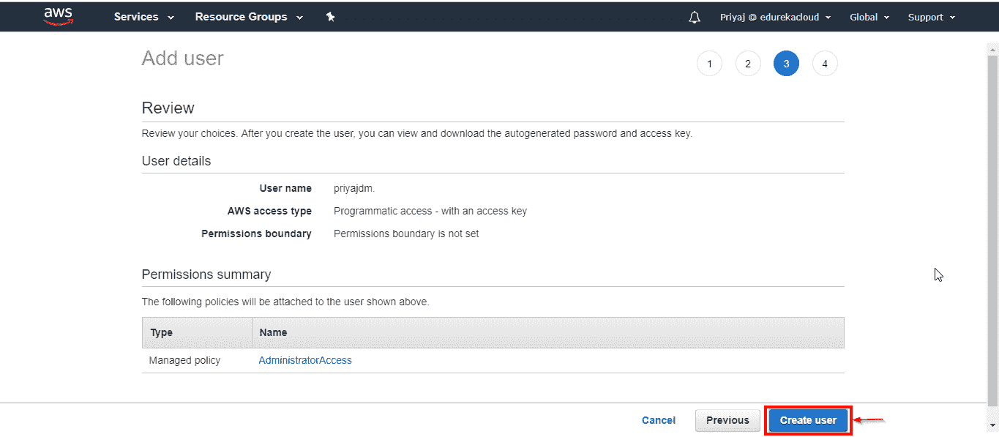

4。 创建一个 S3 桶并添加文件(OS 的镜像文件)。

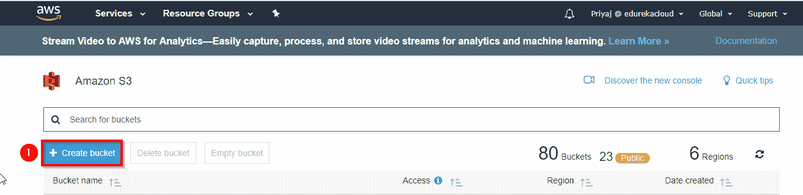

选择一个唯一的用户名。

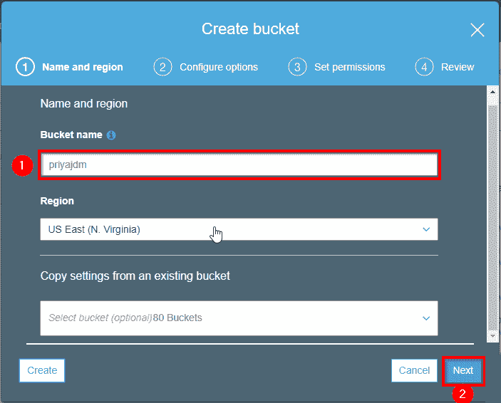

查看并创建存储桶。

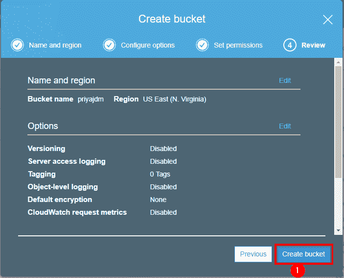

添加导出的。vmdk 文件。

点击上传。

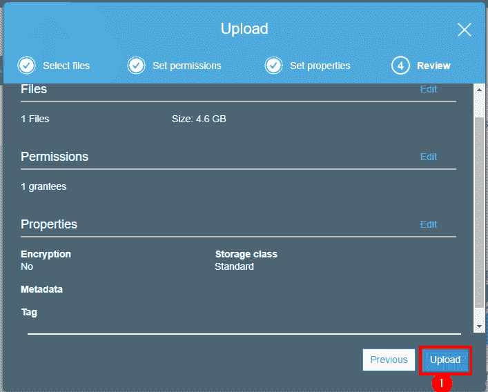

等到图像反映在列表上。

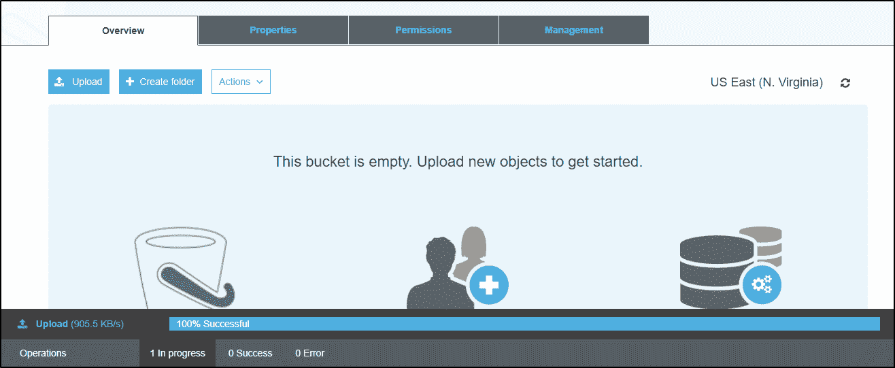

5。您也可以使用 AWS CLI 上传文件。

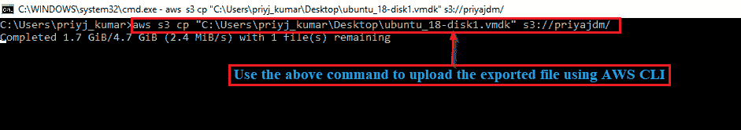

6。文件上传后，为导入的图像文件创建一个 AMI。

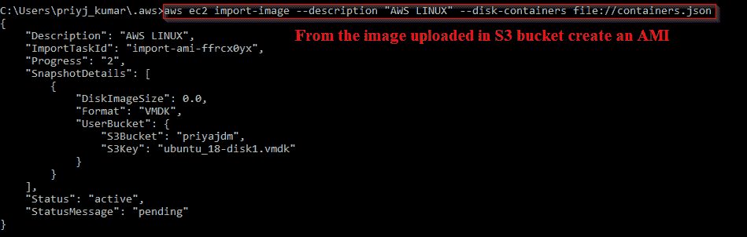

您的图像现在可以作为 AMI 使用。

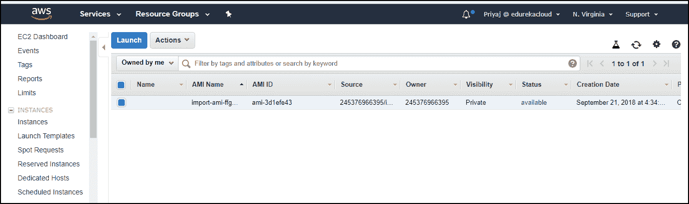

7。你可以用两种方式运行 AMI 创建:-(7 a)。使用 CMDER : 复制连接字符串并粘贴到 CMDER 控制台，这将需要几分钟的时间来连接，然后将打开您的 Ubuntu 14.04。

7 (b)。使用 油灰配置。pem 文件，并提供用户名和连接字符串。它将显示正在初始化，几分钟后你将登陆 Ubuntu 14.04。

就这样，我们在 AWS 上成功迁移了一个虚拟 OS。 我希望你喜欢阅读这篇 AWS 迁移文章。

要了解 AWS、云计算的基础知识，并解释各种 AWS 迁移概念，请观看以下视频

[https://www.youtube.com/embed/ZHczKiPiY9s](https://www.youtube.com/embed/ZHczKiPiY9s)

***如果想要配置 AWS CLI 的源代码，请在下面评论。***

*如果您希望学习 AWS，请查看我们在海得拉巴* *的 [AWS 培训，该培训带有讲师指导的现场培训和真实项目体验。本培训将帮助您深入了解移民，并帮助您掌握该主题。](https://www.edureka.co/aws-certification-training-hyderabad)*

*有问题吗？请在“AWS 迁移”的评论部分提到它，我们会回复您。***