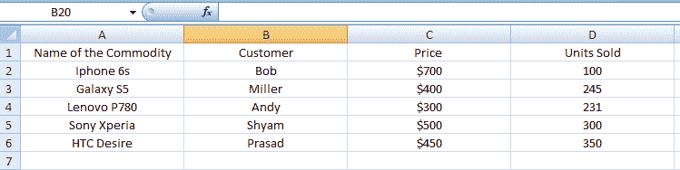
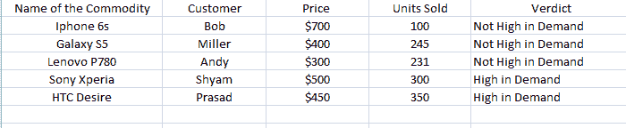
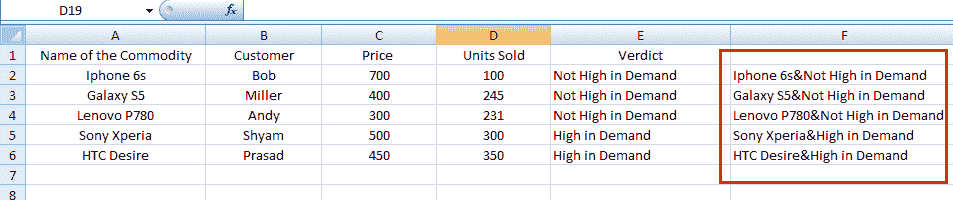

# 高级 Excel 公式教程

> 原文：<https://www.edureka.co/blog/tutorial-on-advanced-excel-formulas/>

我最早使用 MS Excel 的经历可以追溯到我的大学时代，当时我和我的朋友们正在为第二天与另一所大学的比赛招募球员。无论是跟踪跑步率、结束次数还是总得分，我们都疯狂地用尽可能多的相关数据填充电子表格，只是为了从中找出意义。更确切地说，这可能是我第一次接触数据分析、图表和饼状图。我仍然感谢 Excel，因为我们可以系统地计划我们的游戏方法。

微软 Excel 是目前最简单、最强大的软件应用程序之一。它允许用户使用直观的数据操作界面进行定量分析和统计分析，以至于它的使用跨越了不同的领域和专业需求。

我们将不再关注 excel 是什么以及如何做简单的减法、加法，而是关注一些高级公式，这些公式在分析候选人的 Excel 技能时会在面试中经常被问到。高级 Excel 与基本 Excel 有很大不同，用户更关注 DSUM、数据计数、数据透视表、数据透视表图表、公式、函数和宏。

在使用高级 Excel 时，要探索的其他一些重要概念有:

*   If 语句
*   乘积总和
*   VLOOKUP
*   串联
*   总和 if

**我们来看一个场景，移动经销商 Ted 有一个上个月销售不同产品的数据。**

## **IF 语句**

“IF”语句是一个基本概念，有助于查找给定数据在各种情况下的不同反应。简而言之，假设 Ted 想知道上个月最畅销的产品，根据他的说法，任何销售超过 250 部的手机需求都很高，任何低于 250 部的手机需求都很低。

该语句的语法如下:

*=IF(D2 > 250，“需求高”，“需求不高”)*

这将获取结果:

从上表中我们可以了解到索尼 Xperia & HTC Desire 是一款高性能产品(比 Android 好得多:我必须承认我在创建这个数据时有点偏向 Android 产品)

## **总和乘积**

在 excel 计算中，和积公式非常重要。这个公式的特点是它接受一个或多个数字数组，并得到相应数字的乘积之和。

假设 Ted 想知道他上个月销售了不同价位的不同智能手机，获得了多少收入。

语法如下:

*=SUMPRODUCT (C2:C6，D2:D6)*

C2 和 C6 指的是价格，D2/D6 指的是售出的数量；列名根据数据而变化。

这将带来 544800 美元的总收入。

## **串接**

是的，这是一个大词，但不用担心。Concatenate 是将两个或更多不同单元格中的数据合并到一个单元格中的公式。假设我们有销售产品的列表和每个产品的结论，Ted 希望将每个产品与其结论相关联，所以我们在这里使用语法:

*=Concatenate(A1，“&”，B1)*

这也取决于您想要合并的单元格。

因此，它将给出以下结果

## **VLOOKUP**

VLOOKUP 函数用于搜索单元格区域的第一列，然后从同一行区域的任何单元格中返回值。

在这种情况下，假设 Ted 有每种产品的产品 ID，并需要找出它是什么产品(假设他有数千件商品)

他需要找出产品 ID 为“56”的产品的名称。

然后，他使用以下语法:

**=VLOOKUP(56，A2:B6，2，FALSE)**

这里，公式在 A2 到 B6 的范围内查找产品 ID“56 ”,并从第 2 列获取值。

Excel 就是这么简单。这都是关于理解概念，使用语法和获取正确的结果进行分析。

有问题要问我们吗？在评论区提到它们，我们会给你回复。

**相关帖子:**

[高级 Excel 培训](https://www.edureka.co/advanced-ms-excel-self-paced)