# 人工智能应用:10 大现实世界人工智能应用

> 原文：<https://www.edureka.co/blog/artificial-intelligence-applications/>

只要提到人工智能和大脑，就会让人联想到终结者机器毁灭世界的画面。令人欣慰的是，目前的情况要积极得多。因此，让我们探索人工智能如何帮助我们的星球，并最终造福人类。在这篇关于人工智能应用的博客中，我将讨论人工智能如何影响营销、金融、银行等各个领域。

如果你是人工智能的新手，一定要看看这个关于 ***[什么是人工智能](https://www.edureka.co/blog/what-is-artificial-intelligence)*** 的博客。

### **人工智能是用来做什么的？**

1.  [艾在营销](#AI%20in%20Marketing)
2.  [艾在银行业](#AI%20in%20Banking)
3.  [金融中的 AI](#AI%20in%20Finance)
4.  [艾在农](#AI%20in%20Agriculture)
5.  [人工智能医疗](#AI%20in%20HealthCare)
6.  [AI 在游戏中](#AI%20In%20Gaming)
7.  [太空探索中的 AI](#AI%20In%20Space%20Exploration)
8.  自动驾驶汽车中的 AI
9.  [聊天机器人中的 AI](#AI%20In%20Chatbots)
10.  [人工创造中的 AI](#AI%20In%20Artificial%20Creativity)

## **人工智能应用:营销**

营销是给你的产品涂上糖衣以吸引更多顾客的一种方式。我们人类非常擅长糖衣，但如果一个算法或机器人只是为了营销一个品牌或一家公司而存在呢？它会做一个非常棒的工作！

在 21 世纪初，如果我们在不知道产品确切名称的情况下搜索网上商店来寻找产品，这将成为一场噩梦。但是现在，当我们在任何电子商务商店上搜索一个项目时，我们会得到与该项目相关的所有可能的结果。就好像这些搜索引擎在读取我们的思想！在几秒钟内，我们得到了所有相关项目的列表。这方面的一个例子是在网飞寻找合适的电影。

*人工智能应用——AI 在营销中的应用*

我们痴迷于《网飞》和《寒战》的一个原因是，网飞根据顾客对电影的反应提供高度准确的预测技术。它检查了数百万条记录，根据你以前的行为和对电影的选择，向你推荐你可能喜欢的节目和电影。随着数据集的增长，这项技术每天都在变得越来越智能。

随着人工智能的不断进步，在不久的将来，网上的消费者可能会通过拍一张照片来购买产品。像 CamFind 这样的公司和他们的竞争对手已经在尝试这种方法了。

## **人工智能** **应用:银行业**

银行业的人工智能发展比你想象的要快！许多银行已经采用基于人工智能的系统来提供客户支持，检测异常情况和信用卡欺诈。这方面的一个例子是 HDFC 银行。

HDFC 银行开发了一款基于人工智能的聊天机器人，名为 ***[EVA](https://www.hdfcbank.com/htdocs/common/eva/index.html)*** (电子虚拟助理)，由总部位于孟加拉国的 Senseforth AI Research 建造。

自推出以来，Eva 已经处理了超过 300 万个客户查询，与超过 50 万个独立用户进行了互动，并举行了超过 100 万次对话。Eva 可以从成千上万的来源收集知识，并在不到 0.4 秒的时间内提供简单的答案。

*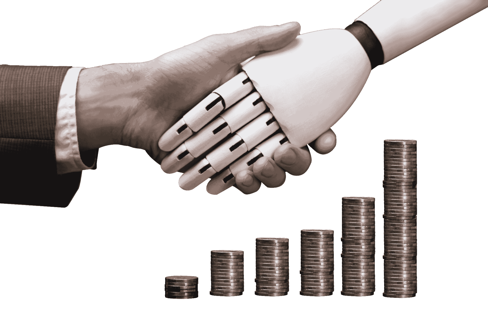 人工智能应用——AI 在银行业的应用* 

使用人工智能来防止欺诈并不是一个新概念。事实上，人工智能解决方案可以增强许多商业领域的安全性，包括零售和金融。

通过跟踪卡的使用和端点访问，安全专家可以更有效地防止欺诈。组织依靠人工智能通过分析交易的行为来跟踪这些步骤。

万事达卡和 RBS WorldPay 等公司多年来一直依靠人工智能和 ***[深度学习](https://www.edureka.co/blog/deep-learning-tutorial)*** 来检测欺诈性交易模式，防止信用卡欺诈。这已经节省了数百万美元。

## **人工智能** **应用:金融**

风险投资一直依赖计算机和数据科学家来确定市场的未来模式。交易主要看对未来的准确预测能力。

机器在这方面很擅长，因为它们可以在短时间内处理大量数据。机器还可以学习观察过去数据中的模式，并预测这些模式在未来可能会如何重复。

在超高频交易时代，金融机构正在转向人工智能，以改善股票交易业绩，提高利润。

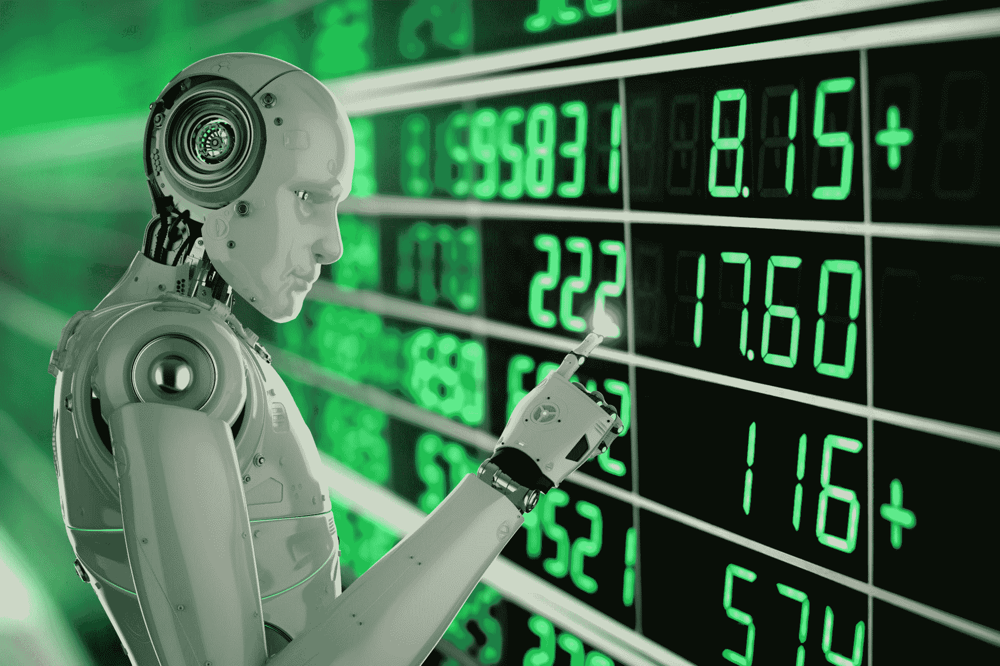

*人工智能应用——AI 在金融中的应用*

日本领先的经纪公司野村证券(Nomura Securities)就是其中之一。该公司一直在不情愿地追求一个目标，即在计算机的帮助下分析经验丰富的股票交易员的洞察力。经过多年的研究，野村证券将推出一种新的股票交易系统。

新系统在电脑中储存了大量的价格和交易数据。通过利用这个信息库，它将做出评估，例如，它可能会确定当前的市场状况与两周前的状况相似，并预测几分钟后股价将如何变化。这将有助于根据预测的市场价格做出更好的交易决策。

## **人工智能应用:农业**

这里有一个令人担忧的事实，到 2050 年，世界将需要多生产 50%的食物，因为我们几乎吃光了所有的东西！实现这一目标的唯一途径是我们更加谨慎地使用我们的资源。也就是说，人工智能可以帮助农民从土地中获得更多，同时更可持续地使用资源。

气候变化、人口增长和粮食安全等问题促使该行业寻求更多创新方法来提高作物产量。

各种组织正在使用自动化和机器人技术来帮助农民找到更有效的方法来保护他们的作物免受杂草侵害。

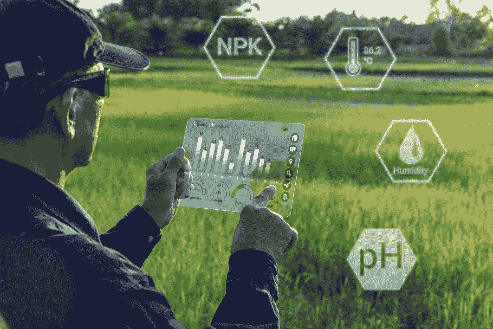

*人工智能应用——AI 在农业中的应用*

蓝河科技开发了一款名为 See & Spray 的机器人，它利用 ***[物体检测](https://www.edureka.co/blog/tensorflow-object-detection-tutorial/)*** 等计算机视觉技术，对棉花植株进行监控并精准喷洒除草剂。精准喷洒有助于防止除草剂抗药性。

除此之外，总部位于柏林的农业科技初创公司 PEAT 开发了一种名为 Plantix 的应用程序，可以通过图像识别土壤中的潜在缺陷和营养缺乏。

图像识别应用通过用户智能手机摄像头捕捉的图像来识别可能的缺陷。然后向用户提供土壤恢复技术、提示和其他可能的解决方案。该公司声称，其软件可以实现模式检测，估计准确率高达 95%。

## **人工智能应用:医疗保健**

当谈到拯救我们的生命时，许多组织和医疗保健中心都依赖人工智能。医疗保健中的人工智能如何帮助世界各地的患者，有许多例子。

一个名为 Cambio Health Care 的组织开发了一个预防中风的临床决策支持系统，当患者有心脏病发作的风险时，该系统可以向医生发出警告。

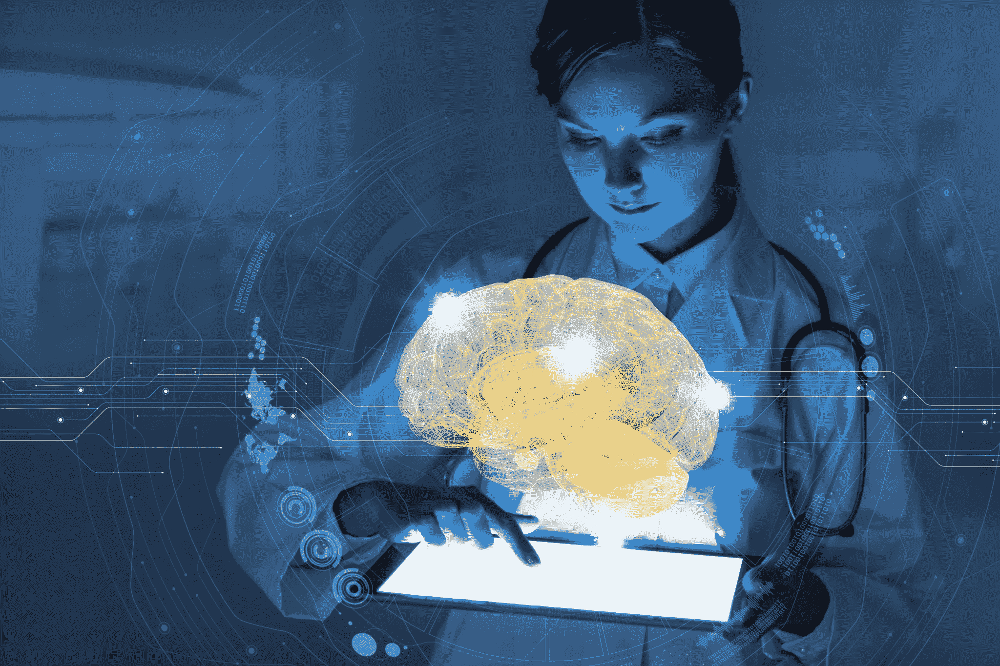

*人工智能应用——人工智能在医疗保健中的应用*

另一个这样的例子是 Coala life，该公司拥有一种可以发现心脏病的数字化设备。

同样，Aifloo 正在开发一个系统，用于跟踪人们在养老院、家庭护理等方面的表现。人工智能在医疗保健领域的最大好处是，你甚至不需要开发一种新药。只要以正确的方式使用现有的药物，你也可以拯救生命。

## **人工智能应用:游戏**

在过去的几年里，人工智能已经成为游戏行业不可或缺的一部分。事实上，AI 最大的成就之一是在游戏行业。

DeepMind 基于人工智能的 AlphaGo 软件因击败围棋世界冠军李·塞多尔而闻名，是人工智能领域最重大的成就之一。

胜利后不久，DeepMind 创造了一个名为 **AlphaGo Zero** 的 AlphaGo 高级版本，在一场人工智能对决中击败了前任。与最初的 AlphaGo 不同，DeepMind 通过使用大量数据和监督(先进的系统)来训练 AlphaGo，AlphaGo Zero 自学掌握了比赛。

人工智能在游戏中的其他例子包括第一次遭遇突击侦察，俗称 F.E.A.R，这是一款第一人称射击游戏。

*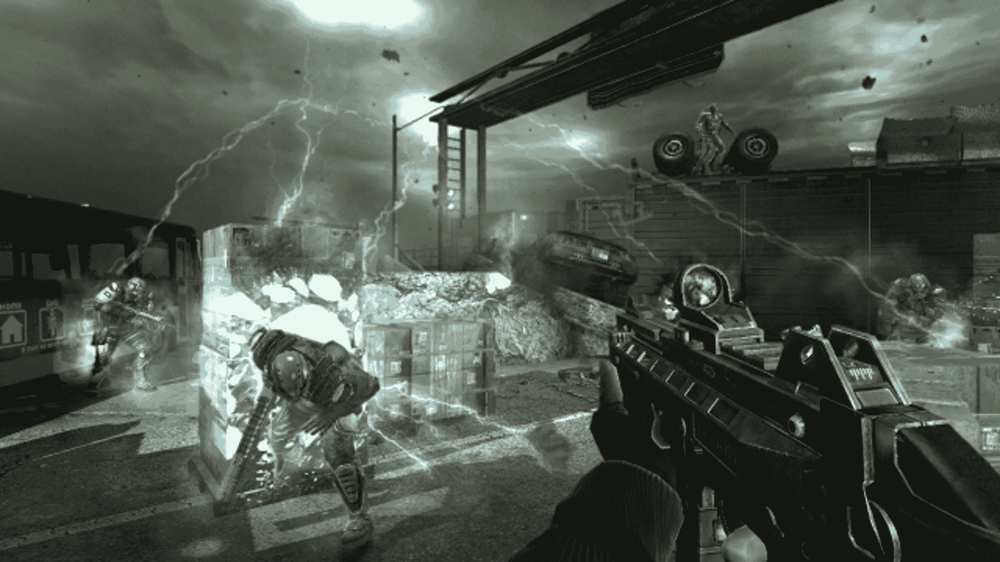*

*但是是什么让这个游戏如此特别呢？* 对手 AI 采取的行动是不可预测的，因为游戏的设计是这样的，对手在整个游戏中被训练，永远不会重复同样的错误。随着游戏越来越难，他们变得越来越好。这使得游戏非常具有挑战性，并促使玩家不断切换策略，永远不要坐在同一个位置。

## **人工智能应用:太空探索**

太空探险和发现总是需要分析大量的数据。人工智能和机器学习是处理和处理这种规模的数据的最佳方式。经过严格的研究，天文学家使用人工智能筛选开普勒望远镜获得的多年数据，以确定一个遥远的八行星太阳系。

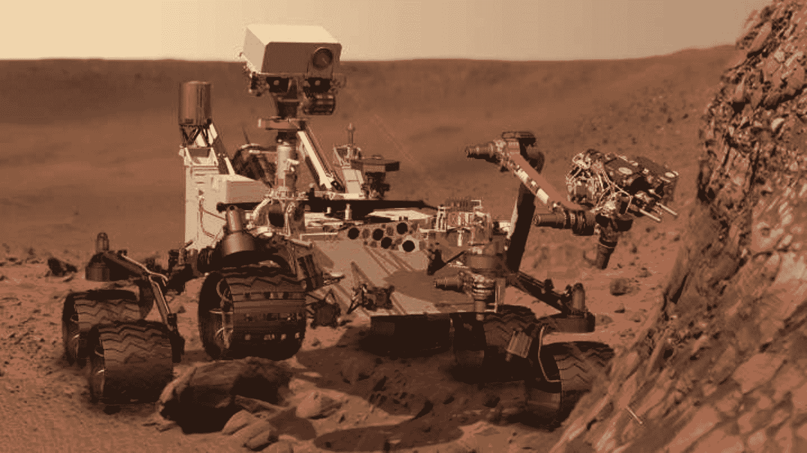

人工智能也被用于美国宇航局的下一个火星探测任务，火星 2020 探测车。基于人工智能的火星漫游车“宙斯盾”已经在这颗红色星球上。漫游车负责相机的自主瞄准，以便在火星上进行调查。

## **人工智能应用:自动驾驶汽车**

很长一段时间以来，自动驾驶汽车一直是人工智能行业的流行语。自动驾驶汽车的发展肯定会彻底改变交通系统。Waymo 等公司在部署其首个基于人工智能的公共打车服务之前，在凤凰城进行了几次试驾。人工智能系统从车辆雷达、摄像头、GPS 和云服务收集数据，以产生操作车辆的控制信号。

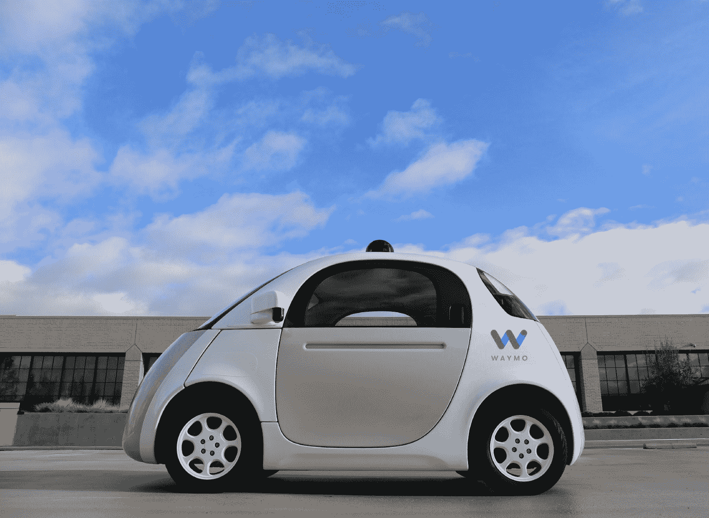

先进的深度学习算法可以准确预测车辆附近的物体可能会做什么。这使得 Waymo 汽车更加有效和安全。

自动驾驶汽车的另一个著名例子是特斯拉的自动驾驶汽车。人工智能实现了计算机视觉、图像检测和深度学习，来制造能够自动检测物体并在没有人类干预的情况下四处行驶的汽车。

Elon Musk 谈了很多关于人工智能如何在特斯拉的自动驾驶汽车和自动驾驶功能中实现的问题。他引用说，

*“Tesla will have fully self-driving cars ready by the end of the year and a “robotaxi” version – one that can ferry passengers without anyone behind the wheel – ready for the streets next year”.*

## ****人工智能应用:聊天机器人****

**如今，虚拟助理已经成为一项非常普遍的技术。几乎每个家庭都有一个虚拟助手来控制家里的电器。几个例子包括 Siri、Cortana，它们因为提供了用户体验而越来越受欢迎。**

**亚马逊的 Echo 是人工智能如何被用来将人类语言翻译成令人满意的行动的一个例子。这个设备使用语音识别和 NLP 来根据您的命令执行各种任务。它能做的不仅仅是播放你喜欢的歌曲。它可以用来控制你家里的设备，预订出租车，打电话，订购你喜欢的食物，查看天气情况等等。**

**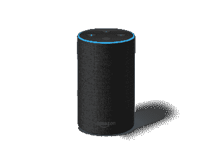**

**另一个例子是谷歌的虚拟助手 Google Duplex，它让数百万人感到惊讶。它不仅可以回复电话，为你预约，还增加了人情味。**

**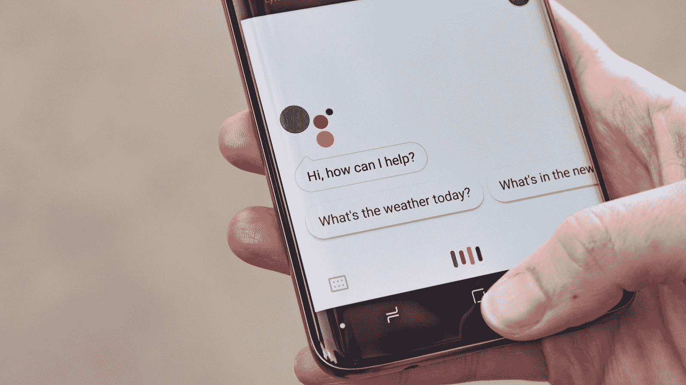**

**该设备使用自然语言处理和机器学习算法来处理人类语言，并执行诸如管理您的日程安排、控制您的智能家居、预订等任务。**

## ****人工智能应用:社交媒体****

**自从社交媒体成为我们的身份，我们已经通过聊天、推文、帖子等方式产生了不可估量的数据。哪里有丰富的数据，哪里就有人工智能和机器学习。**

**在像脸书这样的社交媒体平台上，人工智能被用于面部验证，其中机器学习和深度学习概念被用于检测面部特征和标记你的朋友。深度学习用于通过使用一堆深度神经网络从图像中提取每一个微小的细节。另一方面，机器学习算法用于根据您的兴趣设计您的订阅源。**

**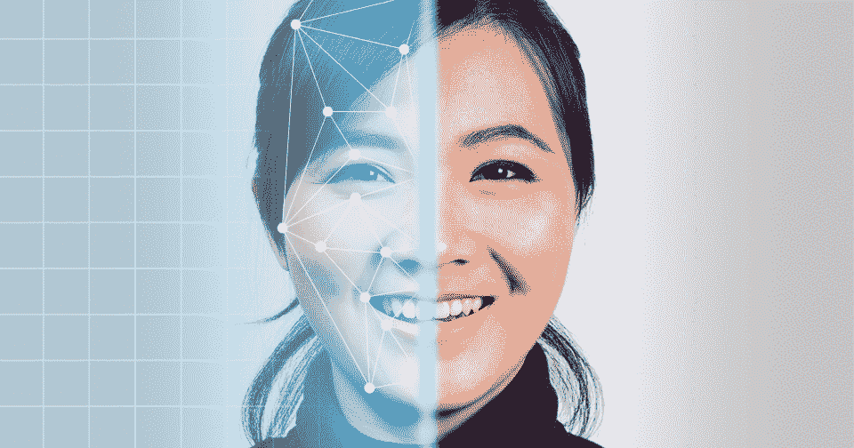**

**另一个这样的例子是 Twitter 的人工智能，它被用来识别推文中的仇恨言论和恐怖主义语言。它利用机器学习、深度学习和自然语言处理来过滤掉令人反感的内容。该公司发现并禁止了 30 万个与恐怖分子有关的账户，其中 95%是由非人类的人工智能机器发现的。**

**如果你想深入学习人工智能和机器学习，来我们这里报名参加 Edureka 的这个研究生文凭[人工智能和机器学习课程](https://www.edureka.co/executive-programs/machine-learning-and-ai)。**

## ****人工智能应用:人工创造力****

**你有没有想过，如果一台人工智能机器试图创造音乐和艺术，会发生什么？ 一个名为 MuseNet 的基于人工智能的系统现在可以创作古典音乐，呼应古典传说，巴赫和莫扎特。**

**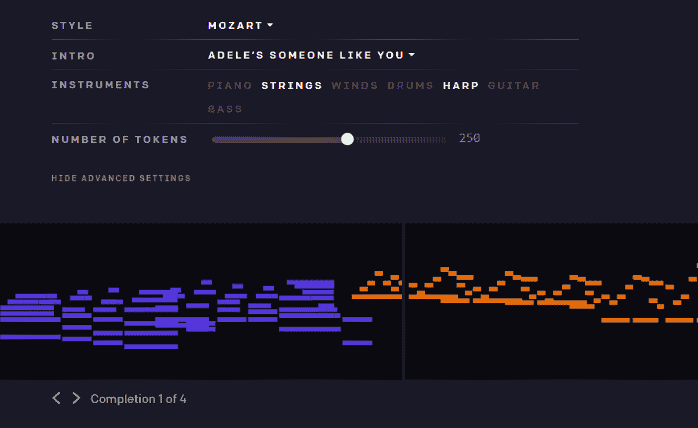**

**MuseNet 是一个深度神经网络，能够用 10 种不同的乐器生成 4 分钟的音乐作品，可以结合从乡村音乐到莫扎特到披头士的风格。**

**MuseNet 并没有明确的音乐理解程序，而是通过自己的学习发现了和谐、节奏和风格的模式。**

**人工智能的另一个创意产品是内容自动化工具——Wordsmith。Wordsmith 是一个自然语言生成平台，可以将您的数据转换为有见地的叙述。**

**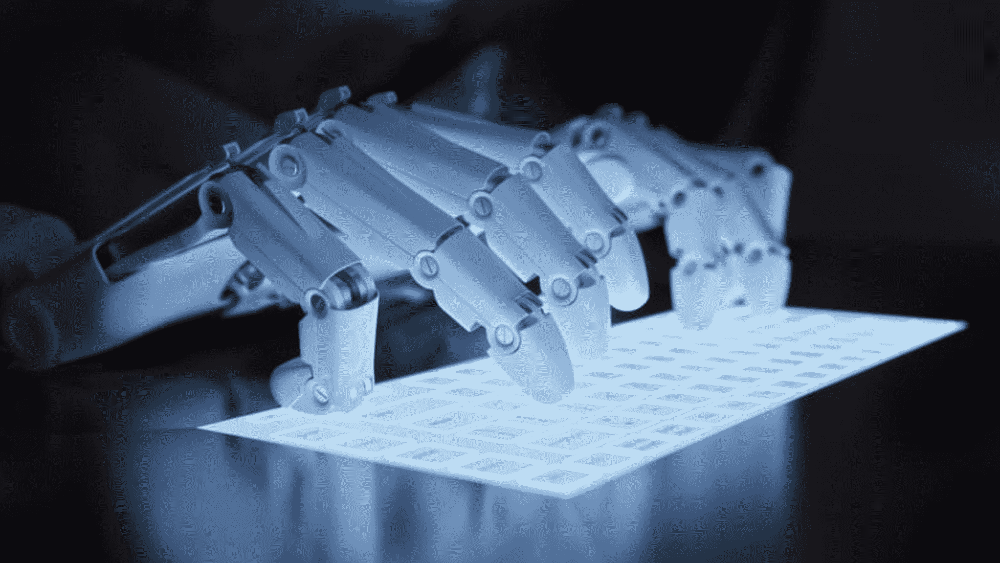**

**雅虎、微软、Tableau 等科技巨头每年都在使用 WordSmith 生成大约 15 亿条内容。**

## ****人工智能简介|爱德华卡****

****

**[//www.youtube.com/embed/4jmsHaJ7xEA?rel=0&showinfo=0](//www.youtube.com/embed/4jmsHaJ7xEA?rel=0&showinfo=0)**

***这个关于人工智能的 Edureka 视频给大家简单介绍了 AI，以及 AI 如何改变世界。***

**最后，我想问你，你认为人工智能在未来会给我们带来什么好处？**