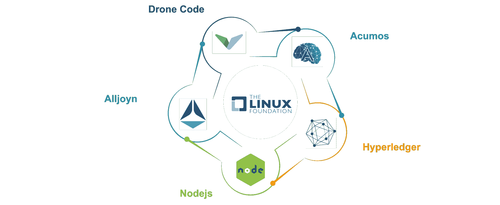
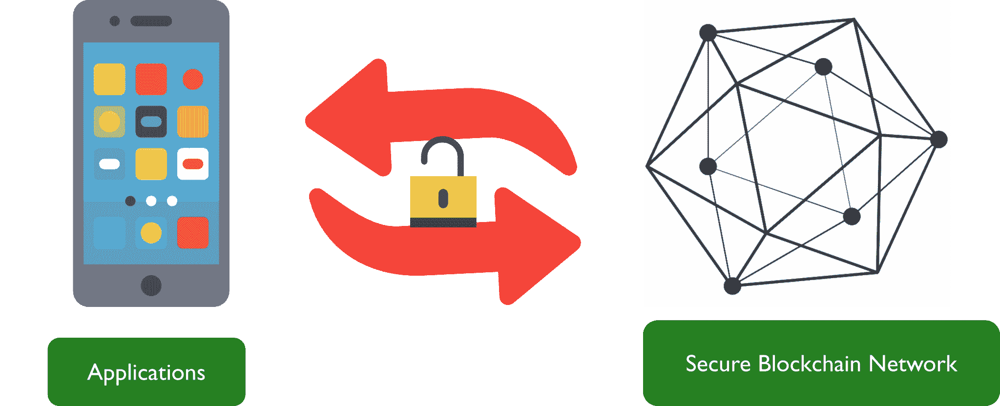
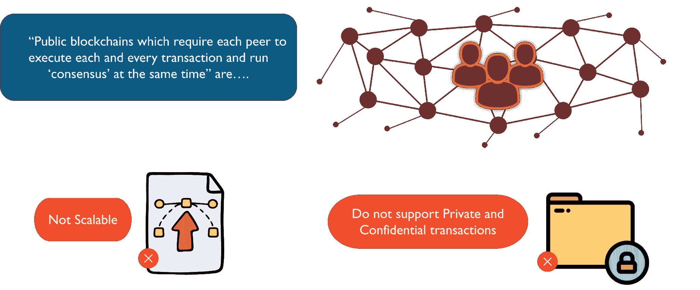
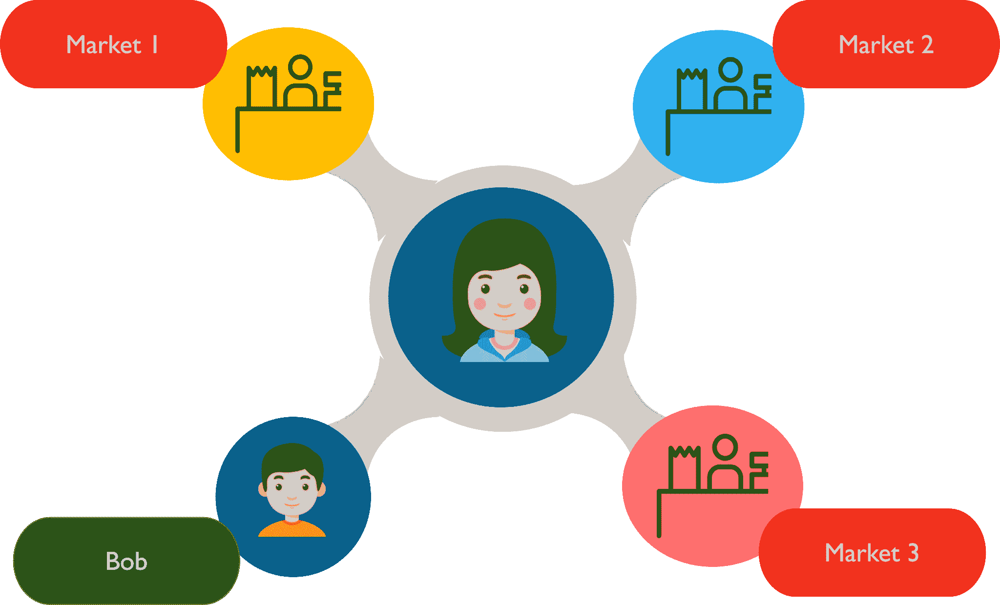
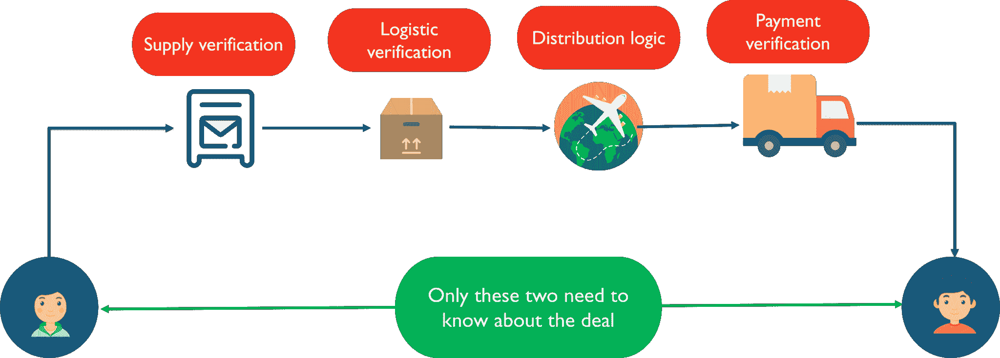
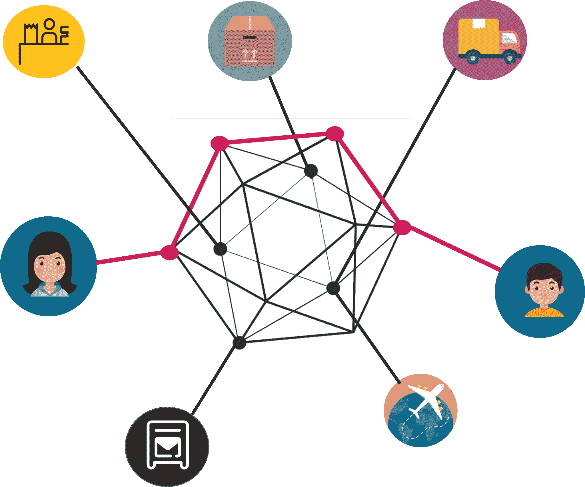
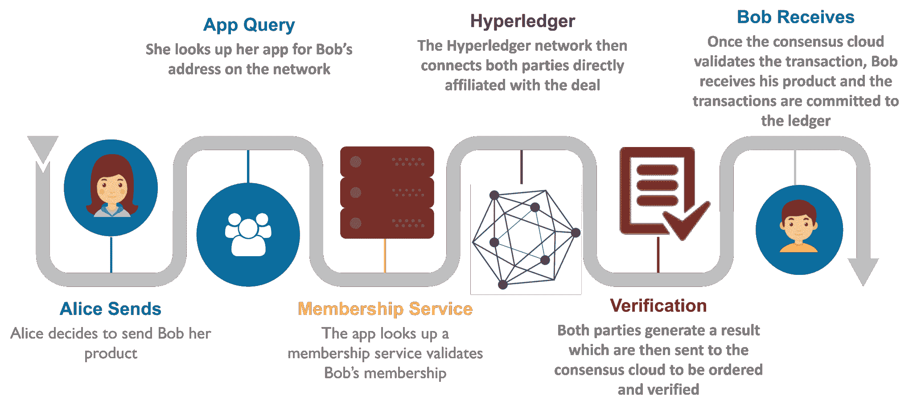
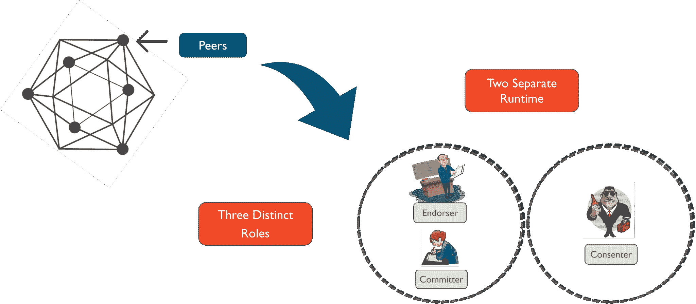
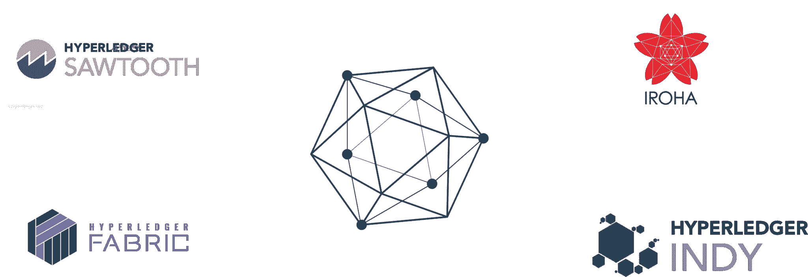

# 什么是 Hyperledger——区块链的工业方法

> 原文：<https://www.edureka.co/blog/what-is-hyperledger/>

***什么是总账？***

*“Hyperledger is an open sourced community of communities to benefit an ecosystem of Hyperledger based solution providers and users focused on blockchain related use cases that will work across a variety of industrial sectors.“ – Brian Behlendorf, Executive Director of Hyperledger.*

**如果这对你来说没有意义，不要担心，因为我会在这篇博客中解释关于 Hyperledger 的一切。我将讨论以下主题:**

***   [什么是总账？](#What)*   [我们为什么需要总账？](#why)*   [Hyperledger 是如何工作的？](#how)*   [总账](#change)*   [总账项目](#projects)**

**您可以浏览一下这段录音，我们的 ***[Hyperledger 培训专家](https://www.edureka.co/blockchain-training)*** 已经用示例详细解释了这些主题，这将有助于您更好地理解这个概念。**

**[https://www.youtube.com/embed/Y177TCUc4g0?rel=0&showinfo=0](https://www.youtube.com/embed/Y177TCUc4g0?rel=0&showinfo=0)**

**在我告诉你什么是 Hyperledger 之前，让我告诉你什么不是 Hyperledger。因为如今 IT 行业中有如此多的区块链平台，很容易让人感到困惑。所以，首先，Hyperledger 不是:**

***   加密货币*   一辆区块链*   某公司**

## ****什么是总账？****

**Hyperledger 是一个伞式项目，隶属于 Linux 基金会。NodeJs、Alljoyn、Dronecode 是采用“Linux 方式”的一些示例项目，即编织一个从事开源项目的开发人员社区，从而保持一个循环，其中一段代码不断被修改和重新分发。**

****

****Linux 家族——什么是 Hyperledger****

**Hyperledger 的理念是，世界将会有多个私人连锁店经营不同的市场。由于每个业务本身都是独一无二的，所以应该使用个性化规则来开发面向这些业务的应用程序。不像以太坊倾向于迫使开发者围绕通用协议构建他们的应用。**

**Hyperledger 项目始于 2015 年末的一小部分开发者。这些开发人员来自不同的部门，如数据科学、制造业、银行业等。，并有一个共同的目标，即使区块链作为一种技术更容易为开发商和行业所接受。该项目从测试应用程序和安全区块链网络之间的交互开始。**

****

*****测试开始——什么是超账*****

## ****我们为什么需要总账？****

**在严格的测试中，相关开发人员意识到，在区块链网络中，每个对等点都需要验证每一个交易并同时运行共识，这在可扩展性方面给 带来了巨大的打击。除此之外，由于采取了详尽的措施来确保交易的完整性，带有保密和隐私措施的交易不能在公开的区块链进行。**

****

****公共区块链的限制——什么是总账****

**假设住在印度的鲍勃想从瑞士的爱丽丝那里买巧克力。因为他们是老朋友，爱丽丝决定以相当大的折扣把她的巧克力卖给鲍勃。这里的问题是，Alice 向许多不同的市场销售她的产品，但仍然需要他们以标准价格从她那里购买。除此之外，要将产品从 Alice 送到 Bob 手中，需要许多第三方来完成交易。**

**

** 

****爱丽丝的市场——什么是超级账本****

**这些第三方可能需要验证产品的其他方面，如质量保证、物流验证、付款验证等等。但是他们不需要知道鲍勃和爱丽丝之间的特殊交易。在区块链的公共网络上，随着矿商验证交易并将其添加到交易链中，网络上的每一个分类账都会得到更新。**

**

** 

****私人和机密合同——什么是总账****

## ****Hyperledger 是如何工作的？****

**然而，在基于 Hyperledger 的网络上，情况就完全不同了！与该交易直接相关的同行被连接起来，并且只有他们的分类帐得到关于该交易的更新。帮助执行交易的第三方只有在网络许可和规定的帮助下才能知道他们需要的确切信息量。**

****

****Hyperledger 网络——什么是 Hyperledger****

**假设 Alice 和 Bob 正在基于 Hyperledger 的网络上执行他们的特殊交易，她会通过一个应用程序查找 Bob，该应用程序会查询会员服务。在成员资格被验证之后，两个对等体被连接并生成结果。在这个双方协议中，两个结果必须相同才能得到验证。但是在有多方参与的其他交易中，可以应用更多的规则。这些生成的交易现在被发送到共识云进行排序，随后它们被提交到各自的分类账。**

****

****总账交易——什么是总账****

## ****总账的显著变化****

**所有这一切之所以成为可能，是因为 Hyperledger 的模块化架构使 consensus 等属性成为即插即用的功能。在这种体系结构中，最显著的变化出现在网络的对等体中。对等体被分成两个独立的运行时和三个不同的角色，即:**

****架构变化——什么是超账****

## ****总账项目****

**如果你还记得的话，我曾提到过 Hyperledger 是一个伞状项目。这意味着 Hyperledger 本身下有无数的项目。这些项目包括:**

**

**                                                             Hyperledger Projects – What is Hyperledger**** 

***   **【Hyperledger Fabric】**广泛用于供应链网络*   被用于捕鱼业来追踪鱼类的行程*   **Hyperledger Burrow，**用于在 Hyperledger 网络中运行以太坊智能合约*   **Hyperledger Iroha，**在区块链的帮助下在移动应用程序优化中找到用途*   Hyperledger Indy 正被用作企业的分散身份数据库服务**

**现在我们知道了什么是 Hyperledger，为什么当今的 it 行业需要它，以及它是如何工作的，让我们将 Hyperledger 与两个最著名的区块链网络进行比较:比特币和以太坊。**

| **参数** | **比特币** |  | **总账** |
|  | 比特币 | 乙醚 | 无；必要时可以实施 |
| **网络** | 公共 | 公共 | 许可 |
| **共识** | 工作证明(SHA26) | Ethash 的缩写 | 实际故障拜占庭容错 |
| **智能合约** | 无 | 是(坚固) | 是(链码) |
| **语言** | c++ | golang/java | golang/python |

**既然我已经解释完了 Hyperledger，我希望你喜欢阅读我的博客！**

**如果您希望了解更多关于区块链的信息，并在区块链技术公司建立职业生涯，那么请查看我们的 [**区块链** **认证**](https://www.edureka.co/blockchain-training) ，它附带有讲师指导的现场培训和真实项目体验。本培训将帮助您深入了解 Hyperledger Fabric，并帮助您掌握该主题。**

***有问题吗？请在“什么是 Hyperledger”的评论部分提到它，我们会给你回复。***