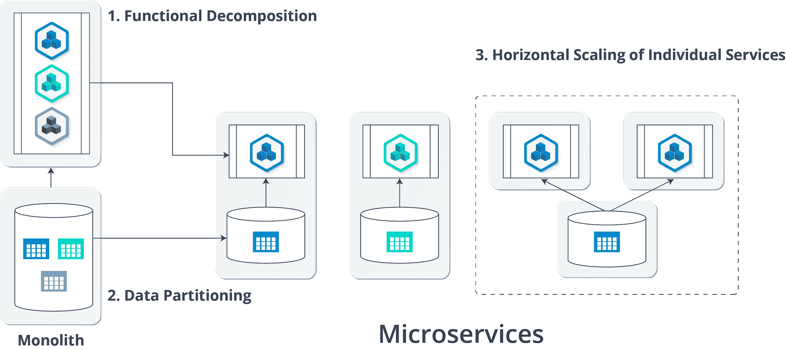
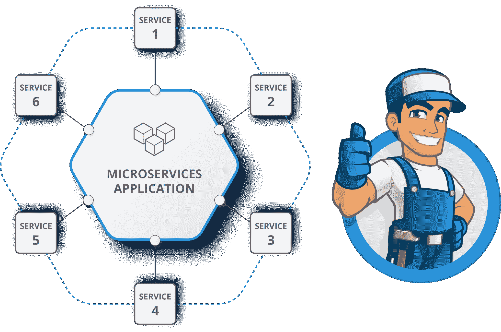
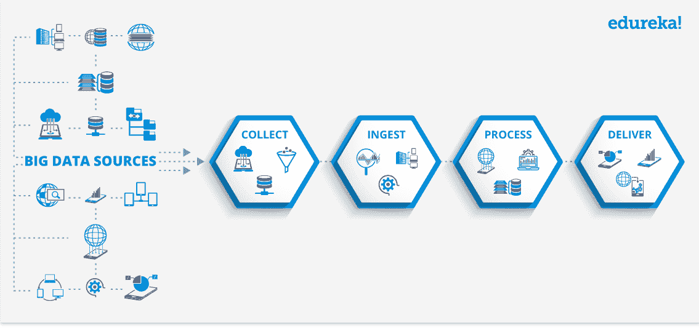
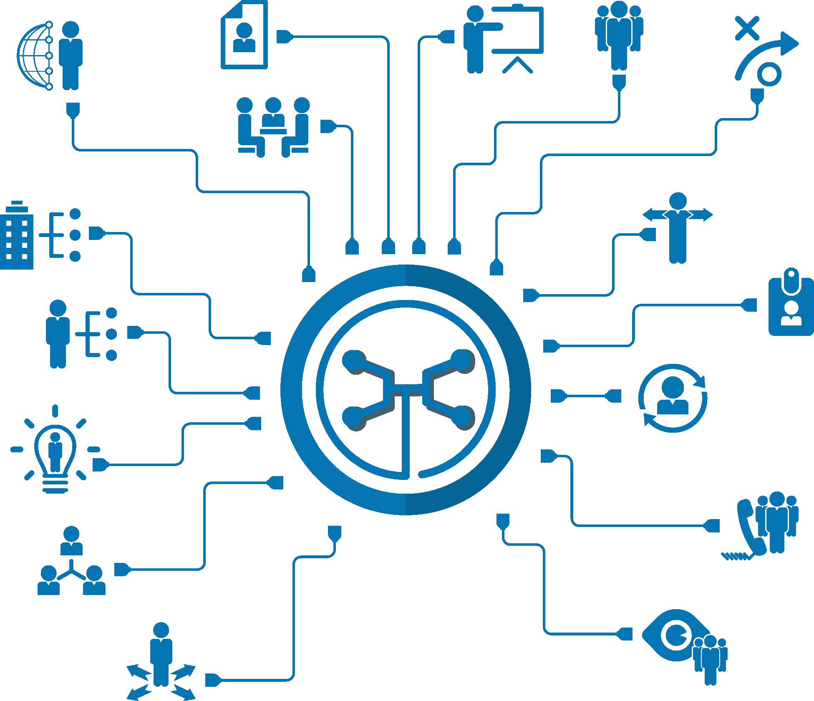

# 你应该学习微服务的 10 大理由

> 原文：<https://www.edureka.co/blog/top-10-reasons-to-learn-microservices/>

## **学习微服务的 10 大理由**

关注新的技术、语言和框架来革新你的组织总是积极的。如果你仍然呆在你的立方体中，在你的整体框架中摆弄代码，那么你可能生活在过去，在那里你有一个小的应用程序和几个员工来处理它。现在情况变了！你需要向前迈出一步，跟随革命性的技术前进，其中**微服务**是领导者之一。

*想知道微服务在 2019 年度热门技术中的排名？在 [Edureka 的职业指南](http://bit.ly/2VwhaH0)中找到答案！！*

你是否正在寻找投入时间[学习微服务](https://www.edureka.co/microservices-architecture-training)的最佳理由，以期成为一名架构师并利用它们开发应用程序？

以下是我学习微服务的 10 大理由:

1.  [高薪职位](#High%20Paying%20Jobs)
2.  [用最少的资源降低拥有成本](#Use%20minimal%20resources%20with%20reduced%20the%20cost%20of%20ownership)
3.  [推广最佳大数据实践](#Promotes%20the%20best%20big%20data%20practices)
4.  [降低风险](#Reduces%20risk)
5.  [提供了粒度缩放](#Provides%20granular%20scaling)
6.  [提供优质代码](#Provides%20high-quality%20code)
7.  [提供跨团队协调](#Offers%C2%A0cross-team%20coordination)
8.  [灵活运用各种工具完成所需任务](#Flexibility%20to%20use%20various%20tools%20for%20the%20required%20task)
9.  [提供连续交货](#Provide%20continuous%20delivery)
10.  [易于构建和维护的应用](#Easy%20to%20build%20and%20maintain%20applications)

## **学习微服务的十大理由| Edureka**

[//www.youtube.com/embed/np2T5grIfRc?rel=0&showinfo=0](//www.youtube.com/embed/np2T5grIfRc?rel=0&showinfo=0)

现在，让我帮助你更详细地理解这些。

## **10。易建&维护应用**

当开发人员构建的产品变得稳定并投放市场供客户使用时，开发人员团队主要分为以下几个部分。

*   实施新功能
*   修复 bug
*   改变现有特征

在这种情况下，如果产品是基于一个单一的框架，那么对代码库的每一个改变都必须通过构建、维护和部署的所有阶段。

所以在这种情况下，微服务就成了救星！！

微服务解决了基于组织的问题，使应用程序的调试和测试变得更加容易。在这个框架的帮助下，连续交付、测试过程和交付无错误应用程序的能力得到了极大的提高。

## **9。提供连续交货**

在单块应用中，专门的团队为每个独立的功能工作，如处理数据库、维护服务器端逻辑，与此不同，微服务使用连续交付模式来处理应用的整个生命周期。

开发人员、运营人员和测试团队同时在一个服务上工作，执行诸如构建、测试和调试等活动。

这种开发方法使得代码能够被不断地开发、测试和部署。

因此，你不必每次做改变时都重新编写代码，你可以直接使用现有库中的代码！

## **8。灵活使用各种工具完成所需任务**

微服务架构鼓励使用最合适的技术来满足特定的服务需求。每个服务都可以自由使用自己的语言、框架或辅助服务。即使使用了如此多样的框架，服务仍然可以轻松地与应用程序中的其他服务进行通信。

## **7。提供跨团队协调**

传统的面向服务的架构(SOA)涉及重量级的进程间通信协议。

但是，微服务遵循服务去中心化和去耦合的概念，以便它们作为独立的实体。因此，在微服务架构中，每个团队处理不同的实体，然后相互通信以处理不同的功能。

## **6。提供优质代码**

遵循微服务的架构，完整的框架被模块化为离散的组件。这有助于应用程序开发团队一次专注于一项特定的工作。因此，这反过来简化了整个编码和测试过程。

## **5。提供粒度缩放**

如果谈到可扩展性，那么微服务优于许多其他架构选择。

由于每个服务都是框架中的一个独立组件，您可以纵向扩展单个功能或服务，而不必扩展整个应用程序。关键业务服务可以部署在多台服务器上，以提高可用性和性能，而不会影响其他服务的性能。

因此，微服务可以轻松识别扩展瓶颈，然后在每个微服务级别解决这些瓶颈。

## **4。降低了的风险**

每个服务都是微服务框架中的一个独立实体，这允许本地化的更改，对质量和端到端回归场景有更高的信心。

因此，即使应用程序的一个服务或组件停止运行，整个应用程序也不会停止运行。相反，开发人员只需要重新构建特定的服务或组件。

因此，这降低了您的业务应用程序完全崩溃的风险！！

## **3。推广大数据实践**

微服务拥有自己的私有数据库来收集、接收、处理和交付数据，以实现各自的业务功能。

因此，你可以说微服务与数据管道架构协作，以微服务的形式协调大数据的收集、摄取、处理和交付方式，以处理小任务。

## **2。使用最少的资源，降低拥有成本**

多个团队在独立的服务上工作，这样可以很容易地部署它们。微服务效率的提高降低了基础设施成本，最大限度地减少了停机时间，优化了资源，并使代码可重用。因此，在这些服务的帮助下，你不必在大量的机器上操作，但基本的机器就可以了。

## **1。高薪职位**

根据 Indeed.com 的调查，*“微服务”的平均年薪从软件工程师的 97，994 美元到高级软件工程师的 116，027 美元不等。*不仅在个人层面，而且许多高速增长的公司，如网飞、易贝、贝宝、推特、亚马逊都在他们的架构中使用微服务。

我希望我的博客“学习微服务的 10 大理由”对你有用。

虽然它仍处于初级阶段，但如果您对这种架构感兴趣，并且想要一种结构化的学习方式*，那么请查看我们的 **[微服务架构培训](https://www.edureka.co/microservices-architecture-training)** ，它附带有讲师指导的现场培训和真实项目体验。本培训将帮助您深入了解微服务，并帮助您掌握该主题。*

*有问题吗？请在“**学习微服务的 10 大理由**”的评论区提出来，我会给你回复。*