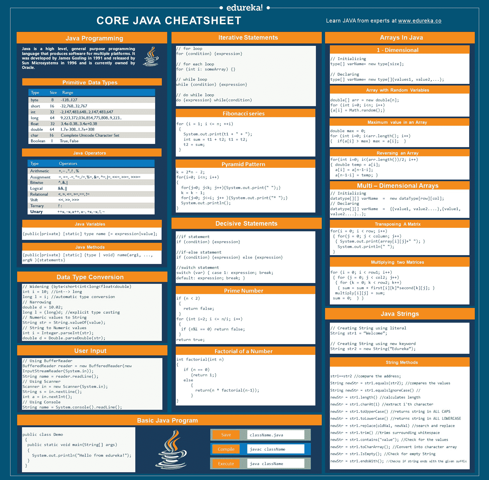

# 核心 Java 备忘单——Java 编程基础

> 原文：<https://www.edureka.co/blog/cheatsheets/java-cheat-sheet/>

你是一个有抱负的 ***Java 开发者*** 吗？好吧，如果你是，那么我打赌你可以利用这个 **Java 备忘单**。 **[Java](https://www.edureka.co/blog/java-tutorial/)** 以其预建的类和库而闻名，有时，跟踪它们变得有点棘手。所以，在这里我给你带来了核心 Java 备忘单。

本备忘单将作为 Java 初学者的速成课程，帮助你掌握 Java 的各种基础知识。

## 核心 Java 备忘单

**[Java](https://www.edureka.co/blog/what-is-java/)** 是一种开源编程语言，它一直在改变着 IT 市场的面貌。它受到程序员的广泛青睐，因为用 Java 编写的代码可以在任何平台上安全地执行，而不管设备的操作系统或架构如何。唯一的要求是，系统上安装了 Java 运行时环境(JRE)。

<figure class="wpb_wrapper vc_figure"></figure>

<figure class="wpb_wrapper vc_figure">[](http://bit.ly/2P9XmJN)</figure>

## 原始数据类型

让我们从学习 Java 提供的原始数据类型[](https://www.edureka.co/blog/java-tutorial/#datatype)开始:

| **数据类型** | **大小** | **射程** |
| 字节 | 8 | -128..127 |
| *简称* | 16 | -32768..32767 |
| *int* | 32 | -2147483648..2147483647 |
| *龙* | 64 | -9223372036854775808..9223372036854775807 |
| *浮动* | 32 | 3.4e-0.38..3.4e+0.38 |
| *双* | 64 | 1.7e-308..1.7e+308 |
| *夏尔* | 16 | 完整的 Unicode 字符集 |
| *布尔* | 1 | 真，假 |

## Java 运算符

Java 中主要有 8 种不同类型的 [**运算符**](https://www.edureka.co/blog/java-tutorial/#operator):

| **算子类型** | **运算符** |
| 算术 | +，–，*，？，% |
| 分配 | =，+=，-=，*=，/=，%=，& =，^=，&#124;=，<，< =，> > =，> > > = |
| 按位 | ^，&，&#124; |
| 逻辑 | & &，&#124;&#124; |
| 关系型 | <，>，< =，> =，==，！= |
| 换挡 | <<>>>>> |
| 三进制 | ？: |
| 一元 | ++x，–x，x++，x-，+x，–x，！，~ |

## Java 变量

[**变量**](https://www.edureka.co/blog/java-tutorial/#variables) 在 Java 中是指保留的内存区域的名称。出于计算或引用的目的，您需要变量来存储任何值。

Java 中有 3 种类型的变量:

1.  局部变量
2.  实例变量
3.  静态变量

```
{public | private} [static] type name [= expression | value];
```

## Java 方法

方法是组合在一起执行特定操作的一组代码。一个方法分两步完成:

1.  方法初始化
2.  方法调用

一个方法可以通过引用或值来调用。

```
{public | private} [static] {type | void} name(arg1, ..., argN ){statements} 
```

## 数据变换

将一个值从一种数据类型更改为另一种数据类型的过程称为数据类型转换。数据类型转换有两种:

1.  *加宽:*将较小的数据类型转换为较大的数据类型，而不会丢失信息。
2.  *缩小:*较大的数据类型被转换成较小的数据类型，但会丢失一些信息。

```
// Widening (byte<short<int<long<float<double)
int i = 10; //int--> long
long l = i; //automatic type conversion
// Narrowing 
double d = 10.02;
long l = (long)d; //explicit type casting
// Numeric values to String
String str = String.valueOf(value);
// String to Numeric values
int i = Integer.parseInt(str); double d = Double.parseDouble(str); 
```

## 用户输入

Java 提供了三种从用户/控制台获取输入的方法:

1.  使用 BufferReader 类
2.  使用扫描仪类
3.  使用控制台类

```
// Using BufferReader
BufferedReader reader = new BufferedReader(new InputStreamReader(System.in));
String name = reader.readLine();

// Using Scanner
Scanner in = new Scanner(System.in);
String s = in.nextLine();
int a = in.nextInt();

// Using Console
String name = System.console().readLine();
```

## 基本 Java 程序

Java 中的一个基本程序至少会由以下组件组成:

1.  班级&对象
2.  方法
3.  变量

```
public class Demo{ 
  public static void main(String[] args) 
 { System.out.println("Hello from edureka!");}
} 
```

## 编译 Java 程序

你需要用包含 main()方法的类名来保存你的 Java 程序。java 扩展。

```
className.java
```

使用 javac 命令调用编译器。

```
javac className
```

最后，使用下面的代码执行程序:

```
java className
```

## 控制流程

## 迭代语句

[**迭代语句**](https://www.edureka.co/blog/java-tutorial/#control) 在需要重复一组语句直到不满足终止条件时使用。

```
// for loop
for (condition) {expression}
// for each loop
for (int i: someArray) {}  
// while loop
while (condition) {expression} 
// do while loop
do {expression} while(condition)
```

**生成斐波那契数列。**

```
for (i = 1; i <= n; ++i)  {System.out.print(t1 + " + ");  int sum = t1 + t2;  t1 = t2;  t2 = sum;}
```

**创造一个金字塔图案。**

```
k = 2*n - 2;
for(i=0; i<n; i++)
{ for(j=0; j<k; j++){System.out.print(" ");}
k = k - 1;
for(j=0; j<=i; j++ ){System.out.print("* ");}
System.out.println(); }
```

## 决定性的陈述

[**选择语句**](https://www.edureka.co/blog/java-tutorial/#control) 在程序执行过程中需要在备选动作之间进行选择时使用。

```
//if statement
if (condition) {expression} //if-else statement
if (condition) {expression} else {expression} //switch statement switch (var) 
{ case 1: expression; break; default: expression; break; } 
```

**检查给定的数是否是质数。**

```
if (n < 2) { return false; } 
for (int i=2; i <= n/i; i++) 
{if (n%i == 0) return false;}
return true;
```

**用递归函数求阶乘。**

```
int factorial(int n)
 { 
 if (n == 0)
       {return 1;}    
   else 
       {return(n * factorial(n-1));}       
 }    
```

## Java 数组

## 一维(1 维)

[**一维或一维数组**](https://www.edureka.co/blog/java-array/) 是一种线性数组，其中元素存储在连续的行中。

```
// Initializing
type[] varName= new type[size];

// Declaring
type[] varName= new type[]{values1, value2,...};
```

**用随机值创建数组。**

```
double[] arr = new double[n];
for (int i=0; i<n; i++)
{a[i] = Math.random();}
```

**查找数组中的最大值。**

```
double max = 0;
for(int i=0; i<arr.length(); i++)
 { if(a[i] > max) max = a[i]; } 
```

**反转一个阵。**

```
for(int i=0; i<(arr.length())/2; i++)
 { double temp = a[i];
   a[i] = a[n-1-i]; 
   a[n-1-i] = temp;
  } 
```

## 多维(二维)

[**二维或 2-D 数组**](https://www.edureka.co/blog/java-array/#MultidimensionalArraysinJava) 是以行和列存储元素的数组。

```
// Initializing datatype[][] varName  =  new dataType[row][col];

// Declaring datatype[][] varName  =  {{value1, value2....},{value1, value2....}..};
```

**转置一个矩阵。**

```
for(i = 0; i < row; i++) { for(j = 0; j < column; j++)
 { System.out.print(array[i][j]+" "); }
 System.out.println(" "); }
```

**将两个矩阵相乘。**

```
for (i = 0; i < row1; i++)
{ for (j = 0; j < col2; j++)
  { for (k = 0; k < row2; k++)
    { sum = sum + first[i][k]*second[k][j]; } 
   multiply[i][j] = sum;
   sum = 0;
  }
}
```

## java 字符串

## 创建字符串

Java 中的 [**字符串**](https://www.edureka.co/blog/java-string/) 是表示一系列 char 值的对象。一个字符串可以通过两种方式创建:

1.  使用文字
2.  使用‘新’关键字

```
String str1 = “Welcome”; // Using literal

String str2 = new String(”Edureka”); // Using new keyword
```

Java . lang . string 类实现 Serializable、Comparable 和 CharSequence 接口。由于字符串对象本质上是不可变的，Java 提供了两个实用程序类:

1.  *StringBuffer:* 它是一个线程安全且同步的可变类。
2.  *StringBuilder:* 它是一个可变类，不是线程安全的，但速度更快，用于单线程环境。

## 字符串方法

下面列出了一些最重要和最常用的字符串方法:

```
str1==str2 //compares address;
String newStr = str1.equals(str2); //compares the values String newStr = str1.equalsIgnoreCase() //compares the values ignoring the case
newStr = str1.length() //calculates length
newStr = str1.charAt(i) //extract i'th character
newStr = str1.toUpperCase() //returns string in ALL CAPS newStr = str1.toLowerCase() //returns string in ALL LOWERvCASE
newStr = str1.replace(oldVal, newVal) //search and replace
newStr = str1.trim() //trims surrounding whitespace newStr = str1.contains("value"); //check for the values newStr = str1.toCharArray(); // convert String to character type array newStr = str1.IsEmpty(); //Check for empty String newStr = str1.endsWith(); //Checks if string ends with the given suffix 
```

## [下载初学者核心 Java 备忘单 Edureka](http://bit.ly/2P9XmJN)