# 公开的设计模式:策略模式

> 原文：<https://www.edureka.co/blog/design-pattern-exposed-strategy-pattern/>

欢迎来到“暴露设计模式”系列的第一篇文章。在这个系列中，我们将从头开始揭示每个设计模式。

仅仅了解一门编程语言及其结构不会让你成为更好的程序员或开发人员。它需要设计模式的知识来创建在今天和将来都能工作的软件。

许多开发人员已经遇到了你现在面临的或者将来会面临的设计问题。他们规定了处理那个问题的标准方法。因此，通过使用设计模式，您可以获得使用成熟技术的优势。

每个设计模式都是为了解决一种特殊的情况；可能存在可以使用多种设计模式的情况。

大多数程序员只是试图解决他们面临的问题，而没有考虑设计模式、冗余代码甚至紧耦合。但是好的程序员开始的时候不一样。他们考虑今天的需求，未来的需求，代码的维护和代码的重用。

好的程序员一旦得到需求，并不急于开始编码。他们坐下来思考问题；他们的设计是否可行。如果是，是否在 6 个月后有效，那时需求会改变。

[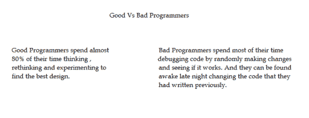](https://cdn.edureka.co/blog/wp-content/uploads/2014/12/image.png)

优秀的程序员拿起笔和纸，开始设计他们的类和类之间的关系。他们试图在设计中获得松散耦合和高内聚，同时在他们的头脑中有面向对象的原则。它们不会立即进入底层代码。要设计灵活且可重用的软件，您应该遵循这种方法；否则，您将总是发现自己在修改先前编写的代码。

在软件行业只有一件事是不变的，那就是**变化。**需求肯定会不断变化。那么我们如何设计你的代码可以轻松适应未来需求的软件呢？为此，您必须尽早开始，并以这样一种方式进行设计，即未来的需求不会破坏您以前的代码。

## **我该怎么做？**

这可以通过遵循设计原则和基于这些原则的设计模式来实现。

现在，让我们深入编码，开始成为更好的程序员的旅程。在这篇文章中，我们将揭示最重要的模式之一**——战略模式**。

当我说最重要的时候，它反映了由策略模式解决的常见问题。

## **什么是策略模式？**

下面是直接来自“四人帮”一书的定义:“ 策略模式用于创建一个可互换的算法家族，在运行时从该家族中选择所需的流程 ”。

如果你不能理解，不要担心，我们将用一种更简单的方式解释给你理解。

让我们首先理解这个问题，然后我们将看到策略模式如何解决这个问题。

[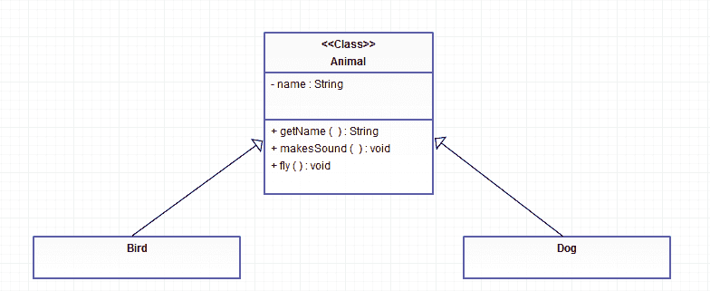](https://cdn.edureka.co/blog/wp-content/uploads/2014/12/1.png)

在上面的 UML 图中，我们有 Animal 抽象类和两个具体类，Dog 和 Bird，它们是从 Animal 超类扩展而来的。

所以让我们定义一个动物抽象类和两个具体类，狗和鸟。

[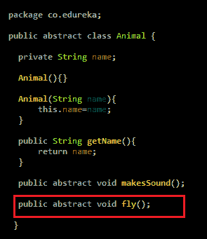](https://cdn.edureka.co/blog/wp-content/uploads/2014/12/23.png)

[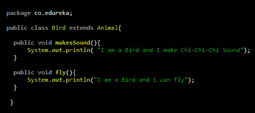](https://cdn.edureka.co/blog/wp-content/uploads/2014/12/31.png)

[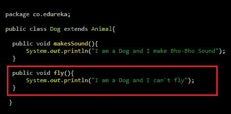](https://cdn.edureka.co/blog/wp-content/uploads/2014/12/41.png)

你觉得上面的设计怎么样？我们的设计中有一个大错误。

所有的动物都不会飞，就像上面的例子中狗不会飞一样。但它仍然有“飞”的行为。

我们犯了一个错误，在 Animal 类中编写了抽象的 fly()方法。这个设计将迫使每个子类狗、鸟、企鹅、鳄鱼、鹅等。实现 fly()方法。

我们应该明白，飞行是一种能力，不是所有的动物都会有的。通过在动物抽象类中提供 fly()方法，我们在所有子类中设置了飞行能力，但这并不适用于所有动物子类。

您可能会想，在子类中实现 fly 方法有什么问题。虽然你可以在非飞行动物子类中实现 fly()方法来只打印“我不会飞”。但问题是，你还是把飞行行为赋予了不会飞的动物。这是不正确的。

叫 dog.fly()或者鳄鱼. fly()是什么感觉？

所以，现在我们已经明白我们的设计是不正确的，我们应该从 Animal 子类中删除 fly()方法。

设计我们的类的另一种方法是什么，我们的设计不强制所有的动物子类都有飞行行为。

我立即想到的一个解决方案是，我们可以创建一个具有 fly 方法的飞行接口，只有会飞的动物才会实现这个飞行接口。这样我们就不会强制所有的动物子类来定义苍蝇的行为。所以让我们编码这个设计方法。

现在，我们的 Animal 类在从 Animal 类中移除 fly 方法后看起来像下面的代码。

[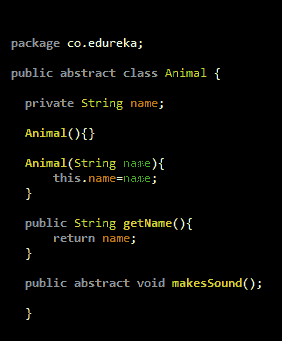](https://cdn.edureka.co/blog/wp-content/uploads/2014/12/51.png)

现在让我们定义飞行界面

[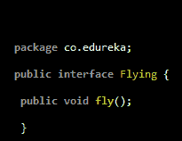](https://cdn.edureka.co/blog/wp-content/uploads/2014/12/61.png)

现在，Dog 类将被更改为下面代码中的和，它不需要有 fly 行为。

[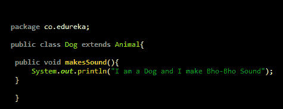](https://cdn.edureka.co/blog/wp-content/uploads/2014/12/72.png)

让我们来看看一些将会有飞行行为的动物子类。[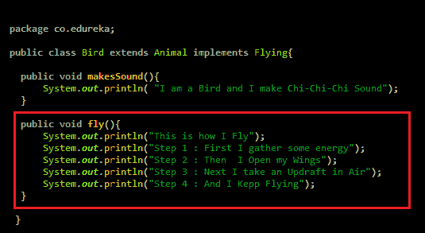](https://cdn.edureka.co/blog/wp-content/uploads/2014/12/81.png)

[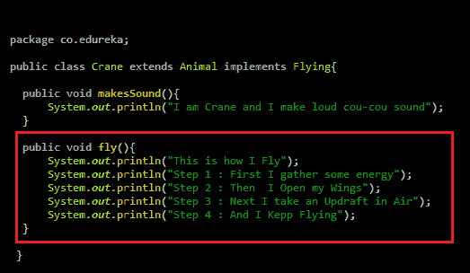](https://cdn.edureka.co/blog/wp-content/uploads/2014/12/92.png)

[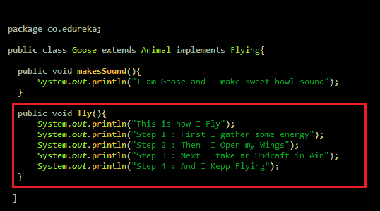](https://cdn.edureka.co/blog/wp-content/uploads/2014/12/101.png)

我们已经解决了之前的问题，但是又遇到了新的麻烦，那就是“代码重复”。

比方说，我们将有 100 个不同的飞行动物子类。我们必须为 fly 行为复制代码，因为 flying 接口不能为 fly 行为提供任何实现，以后如果我们想要更改任何子类中的 fly()方法实现，我们将必须打开该类并更改代码，这很糟糕。我们缺少一些大的东西，也就是说，我们不能在运行时改变一个类的飞行行为。

但是不要担心，战略模式可以帮你解决这个问题。

所以让我们重构我们的代码来使用策略模式。

[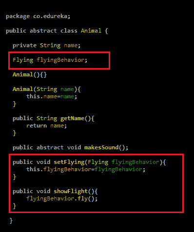](https://cdn.edureka.co/blog/wp-content/uploads/2014/12/111.png)

飞行界面将保持原样。现在，不是每个 flying 子类实现 flying 接口本身，我们将定义单独的具体类来实现不同的 flying 行为。让我们看看如何做到这一点。

[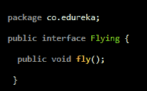](https://cdn.edureka.co/blog/wp-content/uploads/2014/12/121.png)

[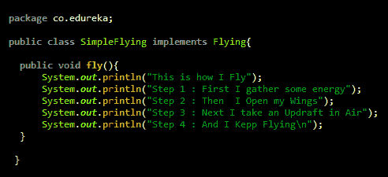](https://cdn.edureka.co/blog/wp-content/uploads/2014/12/131.png)

[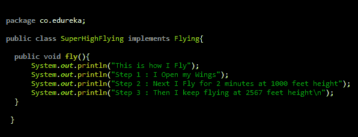](https://cdn.edureka.co/blog/wp-content/uploads/2014/12/141.png)

那么，它是如何工作的，让我们看看测试类

[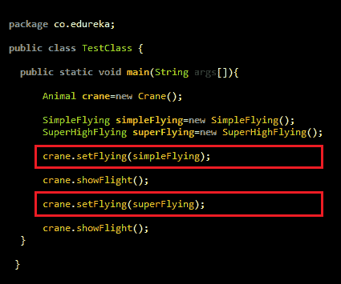](https://cdn.edureka.co/blog/wp-content/uploads/2014/12/151.png)

通过使用策略模式，我们现在能够在运行时改变任何动物的飞行行为，而不需要强制任何子类来指定飞行行为本身。

## **什么时候使用策略模式？**

当您希望能够在运行时动态更改行为时。

为了确保你清楚地理解策略模式，让我们再举一个例子。[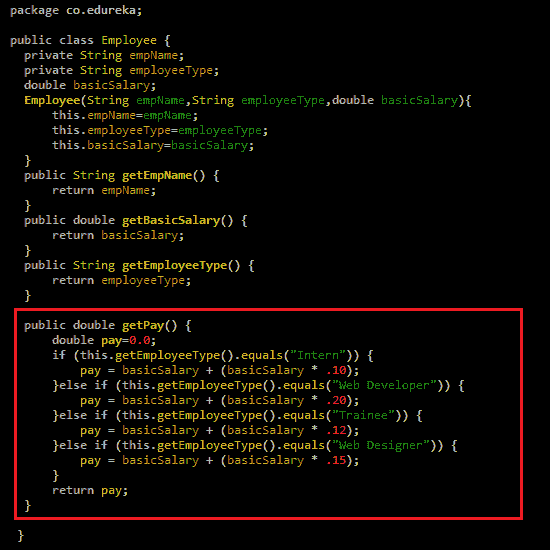](https://cdn.edureka.co/blog/wp-content/uploads/2014/12/16.png)

在上面的雇员类别中，我们根据他/她的职位设定雇员的工资。如果员工是“实习生”,我们将在基本工资的基础上增加 10%的奖金来计算实际工资。

如果员工是“网络开发人员”，我们将在基本工资中增加 20%的奖金来计算实际工资，其他类型的员工也遵循类似的流程。虽然我们计算实际薪酬的算法非常简单，使其更容易理解，但大多数时候，它包括许多比较和计算。

那么，员工类代码有什么问题呢？

计算 pay (getPay())的代码是静态的。假设我想把“实习生”的奖金从 10%改为 14%。我将不得不打开雇员类代码并更改它。

另一个问题是我不能在运行时改变雇员的工资算法。那么，怎么做呢？策略模式是专门用来处理这类问题的。

让我们重构代码以使用策略模式。

我将定义几个算法来计算工资。然后，我将能够使用这些算法中的任何一个来计算运行时的工资。

[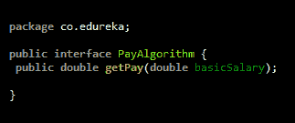](https://cdn.edureka.co/blog/wp-content/uploads/2014/12/17.png)

[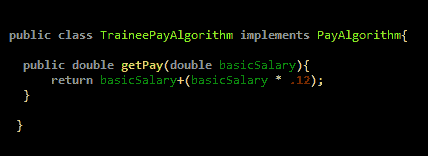](https://cdn.edureka.co/blog/wp-content/uploads/2014/12/19.png)

[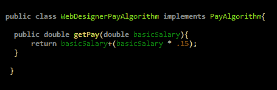](https://cdn.edureka.co/blog/wp-content/uploads/2014/12/20.png)

[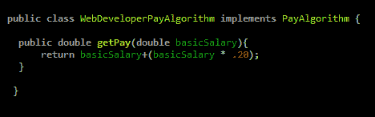](https://cdn.edureka.co/blog/wp-content/uploads/2014/12/211.png)

现在，让我们看看雇员类将如何变化。

[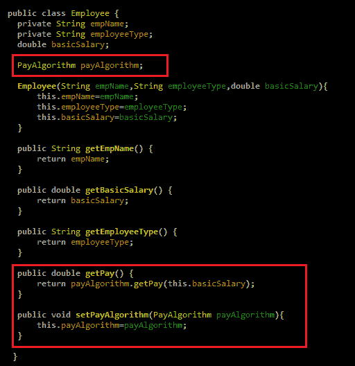](https://cdn.edureka.co/blog/wp-content/uploads/2014/12/221.png)

**注意:**我已经从 Employee 类中移除了工资计算逻辑，并创建了一个 set PayAlgorithm()方法，通过该方法我将设置我想要用于工资计算的工资算法。

这将使我能够通过在运行时动态指定任何支付算法来灵活地计算工资。另外，请注意，如果以后我必须更改工资计算逻辑，我可以创建一个新的工资算法，并使用它来计算工资。我不需要修改之前的代码，是不是很棒？

所以让我们看看它是如何工作的。

[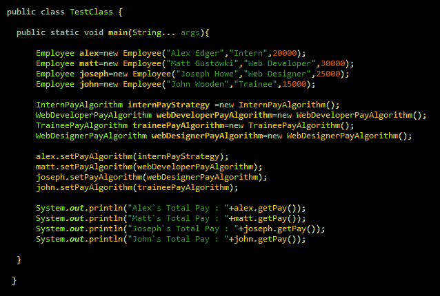](https://cdn.edureka.co/blog/wp-content/uploads/2014/12/231.png)

我希望你很好地理解了策略模式。学习的最好方法是通过练习。

如果您对策略模式或任何其他模式有任何疑问，请在下面留下您的疑问。

请关注下一篇文章，我们将揭示最流行的设计模式之一，工厂模式。

在那之前，你可以下载代码；玩玩它，确保你在头脑中巩固了策略模式。

有问题要问我们吗？在评论区提到它们，我们会给你回复。

**相关帖子:**

[设计模式入门](https://www.edureka.co/design-patterns-self-paced)