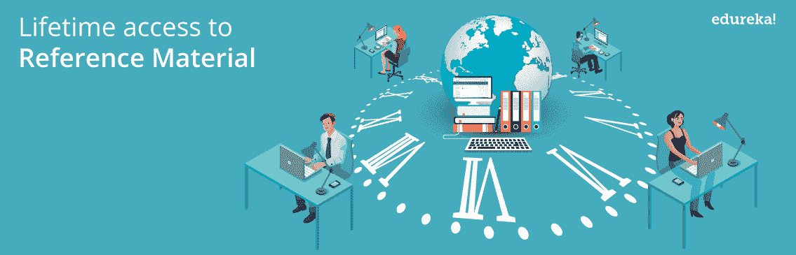
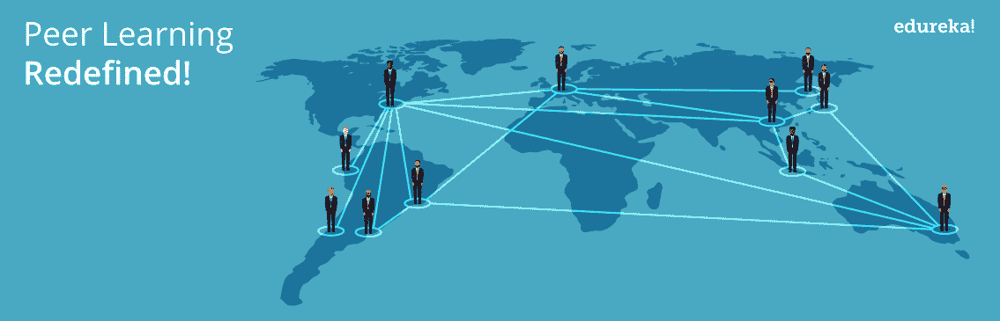

# 选择 Edureka 在线课程的 7 个理由

> 原文：<https://www.edureka.co/blog/edureka-online-courses/>

所以，你决定通过网络掌握一项新技术。虽然世界上有许多提供在线课程的供应商，但你来到了一个课程完成率超过 80%的地方，这是世界上最好的。是的，你可以按照自己的速度，在自己的时间，在自己选择的地点学习。但是 Edureka 的经历远不止这些，它迎合了技能发展的每一个方面。请继续阅读，了解为什么学习者如此喜欢我们，以至于不断回来学习…

## **1。在线直播课程，互动课程，个人关注**

想象一下，在一个虚拟环境中，有一位行业专家在现场指导您某项技术的每一个细微之处！作为一名学习者，你可以选择联系你的老师，或者甚至与老师交谈，甚至在直播课程进行的时候。虽然每个 Edureka 班都有许多像你一样的学习者，他们有着不同的经验水平，但每个人在每堂课中和课后都会得到个性化的关注。当你是学习小组的一员时，你也会得到 Edureka 的单独关注。

## ****

## **2。听从你的命令支援忍者**

我们知道，报名参加 [***在线课程***](https://www.edureka.co/) 就像加入健身房一样。在你的学习旅程中，你一定会在不同的点上停滞不前。别担心，我们会为您提供一整支合格的专家队伍！从技术支持到现场项目期间的危机管理，我们的支持忍者前来救援，以确保您有一个顺利和不间断的学习体验。更重要的是，即使你完成了我们的课程，这些忍者中的一些也可以提供给你，以防你想起我们的课程并希望再次参加。我们非常重视我们的“终生承诺”!

## ****

## **3。包含行业相关案例研究的在线课程，每次都有！**

如果你没有接触过你选择学习的技术，你的学习可能是不完整的。 Edureka 确保我们的每一个 ***[现场课程](https://www.edureka.co/)*** 都以一个具有真实数据集的现场项目而告终，一旦你获得了梦想中的工作，你就可以偷偷进入真正的商店，发布你的 Edureka 课程。当然，如果你遇到困难，我们的支持忍者很乐意帮助你，但是当我们说你在完成我们的项目后会以新的眼光看待自己时，请相信我们。我们的每个项目都是由行业专家共同创建的，并不断更新，以确保您保持相关和最新。

## **4。行业认可的认证**

这是你在我们这里完成课程的奖励！ ***[Edureka 证书](https://www.edureka.co/all-courses)*** 是全球公认的，展示你在你选择掌握的技术方面的能力。但是请记住，只有在成功完成课程和实际项目后，您才能获得认证。我们的一些认证是与实际创造这项技术的人合作提供给你的。你还能要求更多吗？

## ****

## **5。终生查阅参考资料**

如果你觉得有必要在课后阅读额外的材料，你的 LMS(学习管理系统)有一个参考材料目录，包括课堂录音、项目辅助材料和与每堂课和每门课程相关的额外阅读材料。理想情况下，我们建议你在下一堂课之前浏览一下阅读材料。

## ****

## **6。向你的专属学习经理**问好

想象一个专家资源，为您提供您需要了解的关于您的 ***[Edureka 课程](https://www.edureka.co/all-courses)***——从分批计时到课程提醒到课程内容，再到了解更多关于 Edureka 学习方式的信息。在你注册的那一刻，你会被分配到一个专门的学习经理，他会带你经历这一切甚至更多。你的学习经理也会帮助你评估你的进度，如果你需要重新安排课程，也会帮你。

## ****

## **7。同伴学习重新定义！**

不言而喻，每一个 Edureka 课程都汇集了技术爱好者和学习者，他们有着不同的优先事项和不同的课堂收获。一方面，你可以对相同技术的新观点敞开心扉，另一方面，你可以进入一个全球学习社区，不断进行富有成效的讨论。Edureka 论坛相当活跃，超过 600，000 名学习者不断在他们之间讨论话题，巩固他们对概念的理解。

还不服气？请务必查看我们详尽的 [***在线课程目录***](https://www.edureka.co/all-courses) ，选择最适合你的课程。我们正等着你上船呢！

## **Edureka 学员感言**

[https://www.youtube.com/embed/pItNSSa9RWE?rel=0&showinfo=0](https://www.youtube.com/embed/pItNSSa9RWE?rel=0&showinfo=0)