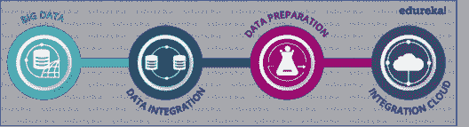
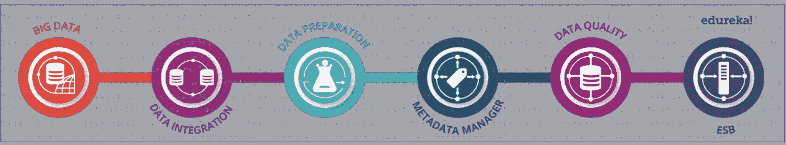
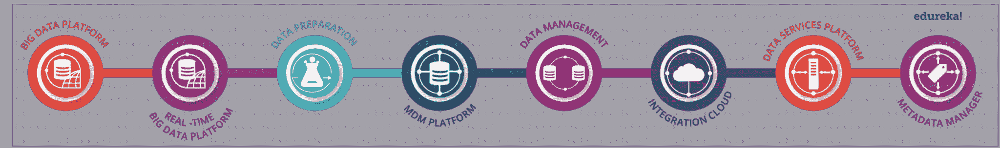
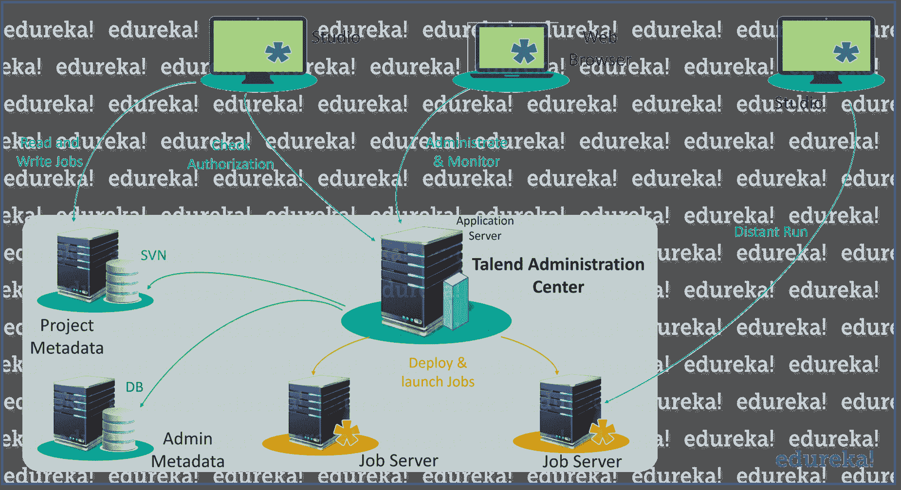

# Talend 架构 Talend Open Studio 的功能架构

> 原文：<https://www.edureka.co/blog/talend-architecture/>

软件的架构就像一个骨架系统，支持数据和流程的结构化流动。为了优化你的软件的使用，你必须清楚地了解它的架构。通过这篇关于 Talend 架构的博客，我将让你对 Talend 的内部和功能架构有一个完整的了解。

以下是我将在这个 Talend 架构博客中讨论的主题:

*   [Talend 简介](#Talend)
*   [Talend 产品](#TalendProducts)
*   [Talend 开放工作室架构](#TOSArchitecture)
*   [Talend 功能建筑](#TalendFunctionalArchitecture)

**塔伦德建筑|爱德华卡**

[https://www.youtube.com/embed/y7luqNnwiqE?rel=0&showinfo=0](https://www.youtube.com/embed/y7luqNnwiqE?rel=0&showinfo=0)

这个关于 Talend 架构的 Edureka 视频将让您全面了解 Talend、其各种产品及其架构。**

## **Talend 简介**

*Talend 是一家**开源软件集成平台/vendo***它是一家为: 提供各种软件和服务的供应商

*   大数据
*   数据整合
*   云存储
*   数据管理
*   主数据管理
*   数据质量
*   数据准备
*   企业应用集成。

根据**Gartner Magic****Quadrant 2017**，Talend 被公认为*大数据和云集成解决方案的全球领导者*。以下是 Talend 提供的几个最有趣的特性:

1.  Talend 目前的版本是之前版本的 **7 倍 f****aster**。
2.  **将** 的费用减少了原来 **的 1/5**。
3.  所有 Talend 工具都充当 **代码生成器** 。
4.  Talend 工具被认为是 **f** **未来证明** 。

*如果你想了解更多关于这些特性的信息，你可以参考这个关于 [**什么是 Talend**](https://www.edureka.co/blog/what-is-talend-tool/) 的博客。*

当考虑到以上各点时，你很容易得出结论，它不太可能很快退出市场。因此，越来越多的公司正在使用 Talend，这导致 Talend 在市场中的份额增加。目前，Talend 持有 **19.3%** 的总市场份额。

Talend 提供软件，通过使数据更易访问来帮助企业成为数据驱动型企业，提高数据质量，并将其快速转移到实时决策所需的地方。Talend 又被称为非程序员的 ***瑞士刀*** 用于大数据。它使得用户可以与 Hadoop、Hive、Spark、Pig 等大数据技术进行交互。，非常简单，因为不需要编写任何代码。

自 2005 年发布至今，Talend 已经发布了广泛的产品和服务。在这篇关于 Talend Architecture 的博客的下一部分，让我们来看看它的几个主要产品。

## **Talend 产品**

产品列表包括授权版本、开源版本和平台。现在让我们逐一看看所有这些产品。

*   ### **Talend 企业产品**

    

*   ### **塔伦德开工作室**

    

*   ### **塔伦平台**

在所有这些产品中， *Talend Open Studios* 是最常用的。原因是，它是开源的，这使得它可以免费下载和使用。它是帮助您入门的最佳工具，几乎包含了您处理数据所需的所有功能。但是如果你想提高你的生产力、协作和投资回报，你可以选择企业版。顾名思义，企业产品最适合商业用途。然而，企业版不在我们今天的讨论列表上，所以让我们把注意力放在开放工作室上，继续讨论这个关于 Talend 架构的博客。

在下一部分，我将试着解释一下 *Talend Open Studio* 的内部架构，它让 Talend 变得如此强大而又用户友好。

## **Talend 开放工作室架构**

但是，在我解释 TOS 的内部工作原理之前，让我先简单介绍一下。

Talend Open Studio 基于 **Eclipse RCP** ，后者*支持面向 ETL 的实现*。它通常用于内部部署，并广泛用于操作系统、ETL 流程等之间的集成。通过它的 GUI，您可以访问包含在 Talend 中执行的每个过程的定义和配置的元数据存储库。你可能知道，Talend 的 GUI 非常具有*交互性*和*用户友好性*，你所需要做的只是拖放和链接组件来执行任务。要执行这些任务，只需点击“运行”选项卡中的“运行”按钮，其余的由 TOS 自己处理。

但是你有没有想过，在后端会发生什么？下图显示了基本的 Talend 架构，显示了 TOS 如何在内部处理作业。

嗯，在后端，我们在 GUI 上创建的工作和业务模型由 TOS 以 XML 格式存储。现在，无论何时执行这些作业，它们都会被代码生成器转换成 Java 代码，业务模型也会被转换成 Perl 代码。

现在你已经对 *Talend Open Studio* 的工作原理有了基本的了解，现在让我们来看看 Talend 的功能架构。

## **功能性** **人才架构**

由于其功能架构，Talend 可以很容易的 识别各种功能，然后交互并响应 IT 市场的各种需求。下面是*Talend Open Studio*:的功能架构

As you can see, the entire Talend architecture is divided into 3 functional blocks which are *color coded* (blue, green and orange). Let’s see the functioning of each of these blocks one by one:

1.  ### **行政&班长**

    这个模块负责*管理和监控*工作。在这里，您可以找到至少一个工作室来执行各种数据集成过程，而不考虑数据量和过程复杂性。有一点，你必须注意的是，你需要一个适当的授权才能在 *Talend Studio 做任何项目。*

    *   #### **行政管理**

        这个模块包含一个基于 web 的管理中心(即一个应用服务器),有两个共享的存储库。其中一个基于 SVN 服务器，而第二个基于数据库服务器。管理中心负责所有项目的管理。数据库服务器存储管理元数据，如用户帐户、访问权限和项目授权，而 SVN 服务器存储项目元数据，如工作、业务模型、例程、路线、服务等。这使得最终用户之间的数据共享更加容易。

2.  ### **执行&部署**

    这个模块负责任务的执行和部署。您可以在信息系统中部署一个或多个作业服务器。这些服务器根据在 *Talend 管理中心* Web 应用程序中设置的预定时间、日期或事件运行作业或技术流程。此外，最终用户可以轻松地将任何作业直接从工作室转移到远程执行服务器，这在 Talend 中称为“远程运行”。

至此，我们结束了这篇关于 Talend Architecture 的博客。希望它是有益的，你喜欢阅读它。想了解更多关于 Talend 的信息可以参考这个 [**Talend 教程博客**](https://www.edureka.co/blog/talend-tutorial-data-integration/) 。

*如果你发现这个 Talend architecture 博客相关，请查看 Edureka 的 [**Talend 培训**](https://www.edureka.co/talend-for-big-data) ，edu reka 是一家值得信赖的在线学习公司，在全球拥有超过 250，000 名满意的学习者。Edureka Talend for DI 和大数据认证培训课程帮助您掌握 Talend 和大数据集成平台，轻松将您的所有数据与您的数据仓库和应用程序集成，或在系统之间同步数据。*

*有问题吗？请在评论区提到它，我们会给你回复。*