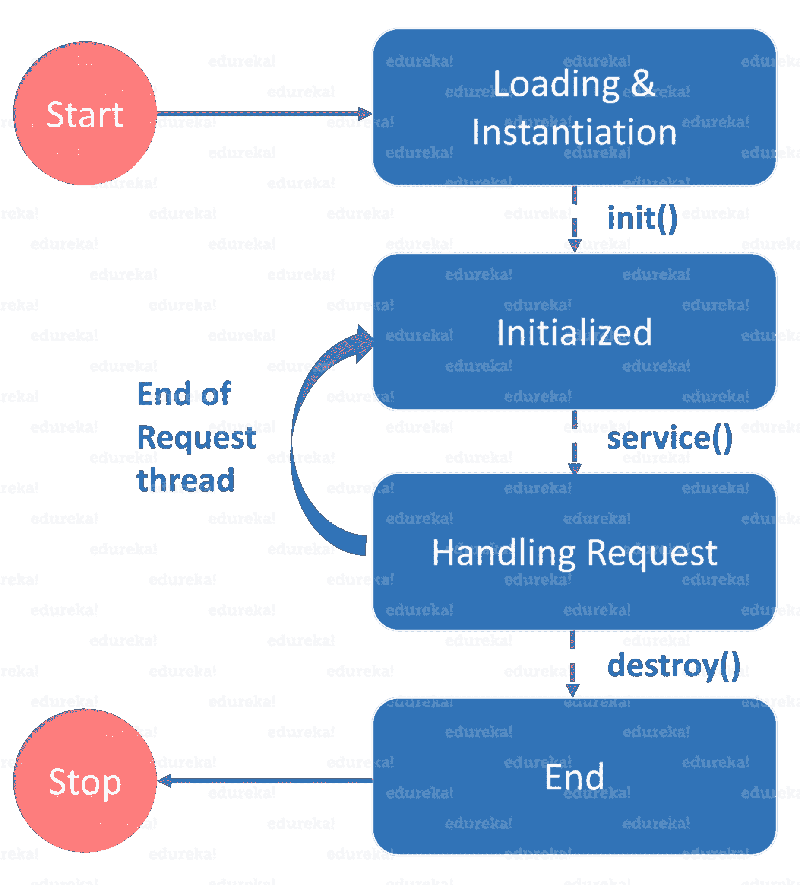

# Servlet 和 JSP 教程——如何用 Java 构建 Web 应用？

> 原文：<https://www.edureka.co/blog/servlet-and-jsp-tutorial/>

In the recent trends, a billion bytes of data is generated on a day-to-day basis. Most of us believe in the misconception that all of the web applications are created over web frameworks like HTML, PHP, JavaScript etc. But, did you know, web applications can be based on [Java](https://www.edureka.co/blog/java-tutorial/) using services like Servlets and JSP? In this Servlet and JSP Tutorial, let’s delve deep into the technology and understand how it is useful for creating a web application.

下面是我将在这个 Servlet 和 JSP 教程中涉及的主题列表


您也可以浏览 Servlet 和 JSP 教程的录音，在那里您可以通过示例以详细的方式理解主题。

## Servlet 教程| JSP 教程|高级 Java 教程| Edureka


[//www.youtube.com/embed/TrfqKn6vzAI?rel=0&showinfo=0](//www.youtube.com/embed/TrfqKn6vzAI?rel=0&showinfo=0)

这个关于“Servlet 和 JSP 教程”的 Edureka 教程将讲述 Servlet 和 JSP 的基本概念，它的生命周期以及创建 Servlet 和 Java 服务器页面的各个步骤。

## **Servlet 和 JSP 教程:Web&HTTP**

Web 是由支持格式化文档的互联网服务器组成的系统。这些文档使用一种叫做 HTML ( *超文本标记语言*)的标记语言进行格式化，这种语言支持链接到其他文档，如图形、音频和视频文件等。

现在我们知道了什么是 web，让我们进一步了解什么是网站。因此，网站是静态文件的集合，即网页，如 HTML 页面、图像、图形等。并且，*网络应用*是在服务器上具有动态功能的网站。 ***谷歌****脸书****推特*** 都是 web 应用的例子。

那么， [Web 和 HTTP](https://www.edureka.co/blog/java-servlets?preview=true#Http) 之间有什么联系呢？现在让我们来找出答案。

### HTTP(超文本传输协议)

客户端和服务器使用 HTTP 进行网络通信。它被认为是无状态协议，因为它只支持每个连接一个请求。通过 HTTP，客户端连接到服务器发送一个请求，然后断开连接。这种机制允许更多的用户在一段时间内连接到给定的服务器。这里，客户端发送一个 HTTP 请求，服务器使用 HTTP 向客户端发送一个 HTML 页面作为响应。

那都是关于 HTTP 和 Web 的。现在让我们深入研究 Servlets，了解它的工作机制。

## **servlet 简介**

[Servlet](https://www.edureka.co/blog/java-servlets) 是服务器端 [Java](https://www.edureka.co/blog/what-is-java/) 程序模块，处理客户端请求，实现 *servlet* 接口。Servlets 可以响应任何类型的请求，它们通常用于扩展 web 服务器托管的应用程序。


在此图中，您可以看到，客户端向服务器发送请求，服务器生成响应，对其进行分析，然后将响应发送回客户端。

现在，让我们进入下一个概念，了解 Servlet 生命周期。

## **Servlet 生命周期**

一个 [servlet](https://www.edureka.co/blog/java-servlets) 的整个生命周期由 *servlet 容器*管理，该容器使用 *javax.servlet.Servlet* 接口来理解 Servlet 对象并管理它。

**Servlet 生命周期**:Servlet 生命周期主要经历四个阶段:



*   #### **加载一个 Servlet**

当服务器启动时，servlet 容器部署并加载所有的 servlet。

*   #### **初始化 Servlet**

接下来，通过调用 init *()* 方法来初始化 servlet。 *Servlet.init()* 方法由 Servlet 容器调用，通知该 Servlet 实例已成功实例化，即将投入使用。

*   #### **Request processing**

然后，servlet 调用 *service()* 方法来处理客户端的请求，并被调用来通知 Servlet 客户端的请求。

*   #### **破坏 servlet**

最后，通过调用 *destroy()来终止 servlet。**destroy()*方法在 Servlet 的生命周期中只运行一次，并发出 Servlet 实例结束的信号。


init()和 destroy()方法只被调用一次。最后，一个 servlet 由 JVM 的垃圾收集器进行垃圾收集。这就结束了 servlet 的生命周期。现在，让我指导您创建 Java servlets 的步骤。

## **Servlet 和 JSP 教程:创建 Servlet 的步骤**

为了创建一个 servlet ，我们需要按顺序遵循几个步骤。它们如下:

1.  创建目录结构
2.  创建一个 Servlet
3.  编译 Servlet
4.  向 web.xml 文件添加映射
5.  启动服务器并部署项目
6.  访问 servlet

现在，基于以上步骤，让我们创建一个程序来更好地理解 servlet 是如何工作的。

要运行 servlet 程序，我们应该安装并配置 Apache Tomcat 服务器。 *Eclipse for Java EE 提供了内置的 Apache Tomcat。*一旦服务器配置完毕，你就可以开始运行你的程序了。需要注意的重要一点是——对于任何 servlet 程序，您需要 3 个文件—*index.html 文件、Java 类文件和 web.xml 文件*。第一步是创建一个动态 Web 项目，然后继续下一步。

现在，让我们举一个例子，我将创建一个简单的登录 servlet，并在浏览器中显示输出。

首先，我将创建 index.html 文件

```
<!DOCTYPE html>
<html>
<body>

<form action="Login" method="post">

<table>

<tr>

<td>Name:</td>

<td><input type="text" name="userName"></td>

</tr>

<tr>

<td>Password:</td>

<td><input type="password" name="userPassword"></td>

</tr>

</table>

<input type="submit" value="Login">
</form>

</body>
</html>

```

接下来，我们来编写 Java 类文件。

```
package Edureka;
import java.io.IOException;
import java.io.PrintWriter;
import javax.servlet.ServletException;
import javax.servlet.http.HttpServlet;
import javax.servlet.http.HttpServletRequest
import javax.servlet.http.HttpServletResponse;
public class Login extends HttpServlet
{
protected void doPost(HttpServletRequest req,HttpServletResponse res)throws ServletException,IOException
PrintWriter pw=res.getWriter();
res.setContentType("text/html");
String user=req.getParameter("userName");
String pass=req.getParameter("userPassword");
pw.println("Login Success...!")
if(user.equals("edureka") && pass.equals("edureka"))
pw.println("Login Success...!");
else
pw.println("Login Failed...!");
pw.close();
}
}

```

在上面的代码中，我设置了一个条件——如果用户名和密码等于 ***【爱德华卡】*** ，才会显示登录成功，否则会拒绝登录。在编写了 [Java 类](https://www.edureka.co/blog/java-tutorial/#obj)文件之后，最后一步是向 web.xml 文件添加映射。让我们看看如何做到这一点。

*web . XML*文件将出现在您的 WEB 内容的 WEB-INF 文件夹中。如果它不存在，那么您可以点击部署描述符并点击*生成部署描述符存根。*准备好 web.xml 文件后，需要向其中添加映射。让我们用下面的例子来看看映射是如何完成的:

```
<?xml version="1.0"encoding="UTF-8"?>
<web-app xmlns:xsi="<a href="http://www.w3.org/2001/XMLSchema-instance">http://www.w3.org/2001/XMLSchema-instance</a>" http://xmlns.jcp.org/xml/ns/javaee">http://xmlns.jcp.org/xml/ns/javaee</a>"xsi:schemaLocation="<a href="http://xmlns.jcp.org/xml/ns/javaee">http://xmlns.jcp.org/xml/ns/javaee</a> <a href="http://xmlns.jcp.org/xml/ns/javaee/web-app_3_1.xsd">http://xmlns.jcp.org/xml/ns/javaee/web-app_3_1.xsd</a>"version="3.1">
<display-name>LoginServlet</display-name>
<servlet>
<servlet-name>Login</servlet-name>
<servlet-class>Edureka.Login</servlet-class>
</servlet>
<servlet-mapping>
<servlet-name>Login</servlet-name>
<url-pattern>/Login</url-pattern>
</servlet-mapping>
<welcome-file-list>
<welcome-file>index.html</welcome-file>
</welcome-file-list>
</web-app>

```

这就是 servlet 的创建和配置方式。现在让我们看看什么是通用 servlet，以及它是如何创建的。

### **通用 servlet**

它是一个独立于协议的 servlet，应该覆盖 service()方法来处理客户端请求。service()方法接受两个参数， *ServletRequest 对象和 ServletResponse 对象。*请求对象的工作是通知 servlet 客户端的请求，而响应对象返回一个响应给客户端。GenericServlet 是一个*抽象类*，它只有一个抽象方法，就是 *service()* 。这就是整个概念当我们通过扩展 Generic Servlet 类来创建通用 Servlet 时，我们必须覆盖 service()方法。

现在，让我们看看如何创建和调用通用 servlet。我将再次编写如下所示的 3 个文件:

**HTML 文件**

我们正在创建一个 HTML 文件，当我们点击网页上的链接时，它将调用 servlet。在 WebContent 文件夹中创建此文件。这个文件的路径应该是这样的:WebContent/index.html

```
<html>
<title>Generic Servlet Demo</title>
</head>
<body>
<a href="welcome">Click here to call Generic Servlet</a>
</body>
</html>

```

**Java 类文件**

这里，我们将通过扩展 Generic Servlet 类来创建一个通用 Servlet。创建 GenericServlet 时，必须重写 service()方法。右击 *src* 文件夹，创建一个新的[类文件](https://www.edureka.co/blog/java-tutorial/#obj)，并将该文件命名为 generic。文件路径应该是这样的:Java resources/src/default package/generic . Java

```
package EdurekaGeneric;
import java.io.*;
importjavax.servlet.*;
public class generic extends GenericServlet{
public void service(ServletRequest req,ServletResponse res) throws IOException,ServletException{
res.setContentType("text/html");
PrintWriter pwriter=res.getWriter();
pwriter.print("<html>");
pwriter.print("<body>");
pwriter.print("
<h2>Generic Servlet Example</h2>

");
pwriter.print("Welcome to Edureka YouTube Channel");
pwriter.print("</body>");
pwriter.print("</html>");
}
}

```

**web.xml** 这个文件可以在这个路径下找到 WebContent/WEB-INF/web.xml .在这个文件中，我们将把 Servlet 映射到特定的 URL。因为我们在点击*index.html*上的链接时调用欢迎页面，它将把欢迎页面映射到我们上面已经创建的 Servlet 类。

```
<servlet>
<servlet-name>MyGenericServlet</servlet-name>
<servlet-class>EdurekaGeneric.generic</servlet-class>
</servlet>
<servlet-mapping>
<servlet-name>MyGenericServlet</servlet-name>
<url-pattern>/welcome</url-pattern>
</servlet-mapping>

```

之后，启动 Tomcat 服务器并运行 servlet。您将获得期望的输出。 所以这都是关于通用 Servlets 的。现在让我们进一步了解会话跟踪的概念。

## **Servlet 和 JSP 教程:会话跟踪**

***会期*** 简单地说就是特定的时间间隔。 **S *会话跟踪*** 是一种维护用户状态(数据)的技术，在 servlet 中也称为*会话管理*。因此，每次用户向服务器发出请求时，服务器都会将该请求视为新请求。

下图描述了客户的每个请求是如何被视为一个新请求的。 


为了识别特定的用户，我们需要会话跟踪。现在，让我们进一步了解会话跟踪技术之一，即 Cookies。

## **Servlet 和 JSP 教程:cookie**

**cookie**是在多个客户端请求之间保存的一小段信息。cookie 有一个名称、一个值和可选属性，如注释、路径和域限定符、最长期限和版本号。

### **Cookie 是如何工作的？**

由于这是一种会话跟踪技术，默认情况下，每个请求都被视为一个新请求。

在这里，我们用 servlet 的响应添加了一个 cookie。所以 cookie 存储在浏览器的缓存中。之后，如果用户发送请求，默认情况下，cookie 会随请求一起添加。

现在你已经了解了 cookie 的工作原理，让我们来看一个说明 cookie 用法的小例子。

让我们看一个创建 cookie、添加响应和检索结果的例子。在这里，我将编写两个 java 类文件，即 MyServlet1 和 MyServlet2。

*文件:my servlet 1*

```
package Edureka;
import java.io.*;
import javax.servlet.*;
import javax.servlet.annotation.WebServlet;
import javax.servlet.http.*;
@WebServlet("/login")
public class MyServlet1 extends HttpServlet{
public void doGet(HttpServletRequest request,&nbsp; HttpServletResponse response) {
try{
response.setContentType("text/html");
PrintWriter pwriter = response.getWriter();
String name = request.getParameter("userName");
String password = request.getParameter("userPassword");
pwriter.print("Hello here:"+name);
pwriter.print(" Your Password is: "+password);
//Creating two cookies
Cookie c1=new Cookie("userName",name);
Cookie c2=new Cookie("userPassword",password);
//Adding the cookies to response header
response.addCookie(c1);
response.addCookie(c2);
pwriter.print("
<a href='welcomehere'>View Details</a>");
pwriter.close();
}catch(Exception exp){
System.out.println(exp);
}
}
}

```

*文件:my servlet 2*

```
package Edureka;
import java.io.*;
import javax.servlet.*;
import javax.servlet.annotation.WebServlet;
import javax.servlet.http.*;
@WebServlet("/welcomehere")
public class MyServlet2 extends HttpServlet {
public void doGet(HttpServletRequest request, HttpServletResponse response){
try{
response.setContentType("text/html");
PrintWriter pwriter = response.getWriter();
//Reading cookies
Cookie[] c=request.getCookies();
//Displaying User name value from cookie
pwriter.print("Name here: "+c[0].getValue());
pwriter.print("Password: "+c[1].getValue());
//pwriter.print("
<a href='welcome'>View Details</a>");
pwriter.close();
}catch(Exception exp){
System.out.println(exp);
}
}
}

```

现在，让我们为 cookies 创建一个简单的 HTML 表单。

```
<!DOCTYPE html>
<html>
<body>
<body>

<form action="login">
User Name:<input type="text" name="userName"/>
Password:<input type="password" name="userPassword"/>
<input type="submit" value="submit"/>
</form>

</body>
</html>

```

现在，最后一步是创建 XML 文件并将所有映射添加到其中。

```
<servlet>
<servlet-name>Servlet1</servlet-name>
<servlet-class>Edureka.MyServlet1</servlet-class>
</servlet>
<servlet-mapping>
<servlet-name>Servlet1</servlet-name>
<url-pattern>/login</url-pattern>
</servlet-mapping>
<servlet>
<servlet-name>Servlet2</servlet-name>
<servlet-class>Edureka.MyServlet2</servlet-class>
</servlet>
<servlet-mapping>
<servlet-name>Servlet2</servlet-name>
<url-pattern>/welcomehere</url-pattern>
</servlet-mapping>

```

现在你已经准备好执行了。您可以运行代码并获得想要的输出。这就是饼干的工作原理。这就是关于 Servlets 的全部内容。如果你想深入学习高级 Java，可以参考这个 [**高级 Java 教程**](https://www.edureka.co/blog/advanced-java-tutorial) 。现在您已经对 Servlets 有了一些了解，让我们继续了解什么是 Java 服务器页面。

## **Servlet 和 JSP 教程:Java 服务器页面**


JSP 或 Java Server Pages 是一种用于创建 web 应用程序的技术，就像 Servlet 技术一样。它是 servlet 的扩展——因为它提供了比 Servlet 更多的功能，如表达式语言、JSTL 等。JSP 页面由 HTML 标记和 JSP 标记组成。JSP 页面比 Servlet 更容易维护，因为我们可以将设计和开发分开。

现在，我们知道了 JSP 是什么，让我们比较 JSP 和 Servlets，了解哪一个最适合 web。

## **Servlet 和 JSP 教程:JSP 相对于 Servlet 的优势**

| JSP | 小服务程序 |
| 对 Servlet 的扩展 | 不是 servlet 的扩展 |
| 易于维护 | 有点复杂 |
| 无需重新编译或重新部署 | 代码需要重新编译 |
| 比 servlet 少的代码 | 比 JSP 多的代码 |

我希望你明白 JSP 和 Servlets 之间的区别。现在，让我们进一步了解脚本元素。

## **Servlet 和 JSP 教程:JSP 脚本元素**

脚本元素提供了在 JSP 中插入 java 代码的能力。有三种类型的脚本元素:

*   **scriptlet 标签**–script let 标签用于在 JSP 中执行 Java 源代码。

    ```
    Syntax : <%  java source code %>
    ```

在本例中，我们创建了两个文件 index.html 和 welcome.jsp。index.html 文件从用户那里获取用户名，welcome.jsp 文件打印用户名和欢迎消息。现在，让我们看看代码。

*文件:index.html*

```
<html>
<body>
<form&nbsp;action="welcome.jsp">
<input&nbsp;type="text"&nbsp;name="uname">
<input&nbsp;type="submit"&nbsp;value="go">
</form>

</body>
</html>

```

*文件:welcome.jsp*

```
<html>
<body>
<% String&nbsp;name=request.getParameter("uname"); print("welcome&nbsp;"+name); %>
</form>

</body>
</html>

```

*   **表达式标签**–放置在 *JSP 表达式标签*中的代码*被写入响应*的输出流。所以不用写 *out.print()* 写数据。主要用于打印[变量](https://www.edureka.co/blog/java-tutorial/#variables)或方法的值。

    ```
    Syntax : <%=  statement %>
    ```

现在让我们举一个显示当前时间的小例子。为了显示当前时间，我们使用了 Calendar 类的 getTime()方法。getTime()是 Calendar 类的一个实例方法，所以我们在通过 getInstance()方法得到 Calendar 类的实例后调用了它。

*文件:index.jsp*

```
<html>
<body>
Current&nbsp;Time:&nbsp;<%=&nbsp;java.util.Calendar.getInstance().getTime()&nbsp;%>
</body>
</html>

```

*   **声明标签**–JSP 声明标签用于*声明字段和方法*。JSP 声明标记内编写的代码被放在自动生成的 servlet 的 service()方法之外。所以它不会在每次请求时都获得内存。

    ```
    Syntax: <%!  field or method declaration %>
    ```

在下面 JSP 声明标签的例子中，我们定义了返回给定数字的立方体的方法，并从 JSP 表达式标签中调用这个方法。但是我们也可以使用 JSP scriptlet 标记来调用声明的方法。让我们看看怎么做。 *文件:index.jsp*

```
<html>
<body>
<%! int&nbsp;cube(int&nbsp;n){ return&nbsp;n*n*n*; } %>
<%=&nbsp;"Cube&nbsp;of&nbsp;3&nbsp;is:"+cube(3)&nbsp;%>
</body>
</html>

```

所以，这都是关于 JSP 脚本元素的。现在让我们继续看 JSP 的请求和响应对象。

## **Servlet 和 JSP 教程:JSP 请求和响应对象**

**JSP 请求**是 HttpServletRequest 类型的隐式对象，由 web 容器为每个 JSP 请求创建。它可以用来获取请求信息，如参数、头信息、远程地址、服务器名、服务器端口、内容类型、字符编码等。它还可以用来设置、获取和删除 JSP 请求范围内的属性。

让我们看一个简单的请求隐式对象的例子，在这里我们打印带有欢迎消息的用户名。让我们看看怎么做。

**JSP 请求隐式对象的例子**

*文件:index.html*

```
<form&nbsp;action="welcome.jsp">
<input&nbsp;type="text"&nbsp;name="uname">
<input&nbsp;type="submit"&nbsp;value="go">
</form>

```

*文件:welcome.jsp*

```
<% String&nbsp;name=request.getParameter("uname"); print("welcome&nbsp;"+name); %>

```

### **JSP 响应隐式对象**

在 JSP 中，响应是 HttpServletResponse 类型的隐式对象。web 容器为每个 JSP 请求创建 HttpServletResponse 的实例。它可用于添加或操作响应，例如将响应重定向到另一个资源、发送错误等。

让我们看看响应隐式对象的例子，我们将响应重定向到 Google。

**响应隐含对象的例子**

*文件:index.html*

```
<form&nbsp;action="welcome.jsp">
<input&nbsp;type="text"&nbsp;name="uname">
<input type="submit"&nbsp;value="go">
</form>

```

*文件:welcome.jsp*

```
<% sendRedirect("http://www.google.com"); %>

```

这就是请求和响应对象的工作方式。Servlet 和 JSP 教程文章到此结束。我希望这篇博客能给你提供信息，增加你的知识。

*查看 Edureka 提供的 [**Java 认证培训**](https://www.edureka.co/java-j2ee-soa-training)* *，edu reka 是一家值得信赖的在线学习公司，在全球拥有超过 250，000 名满意的学习者。Edureka 的 Java J2EE 和 SOA 培训和认证课程是为想成为 Java 开发人员的学生和专业人士设计的。该课程旨在为您提供 Java 编程的良好开端，并训练您掌握核心和高级 Java 概念以及各种 Java 框架，如 Hibernate & Spring。*

*有问题吗？请在这个“Java Servlet”博客的评论部分提到它，我们会尽快回复您。*