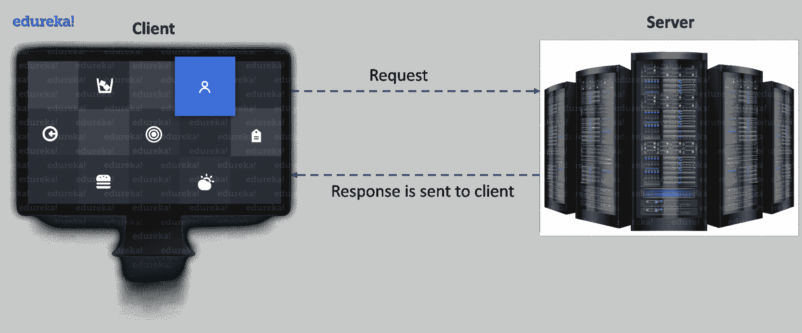
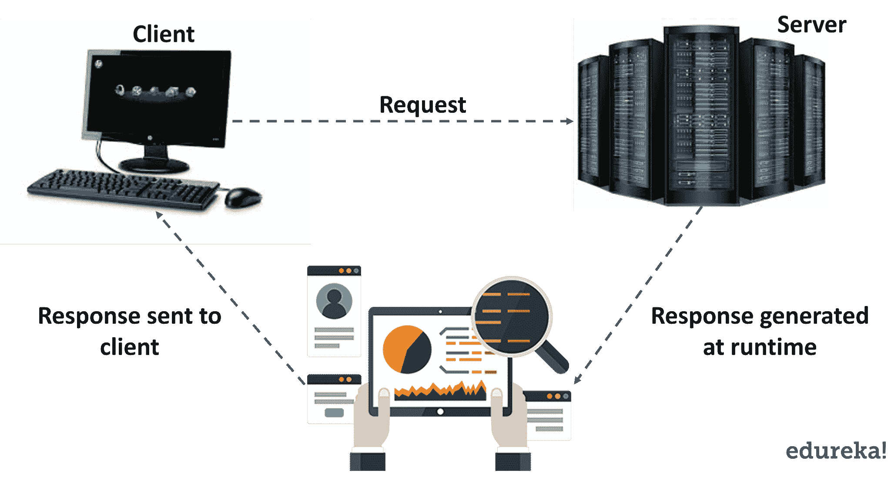

# Java Servlets 简介——简单来说就是 servlet

> 原文：<https://www.edureka.co/blog/java-servlets>

In this modern era of the internet, billion bytes of data is generated on a day-to-day basis. To gain access to this humongous amount of data, every person is required to send a request on the network and await a response. Most of us believe in the misconception that all of these web applications are created over web frameworks like HTML, PHP, JavaScript etc. But, did you know, web applications can be based on Java using a service called Java Servlets? In this article, let’s delve deep into [Java](https://www.edureka.co/blog/advanced-java-tutorial) Servlets and understand how this technology is useful for creating a web application.

下面是我将在本 Java Servlets 教程中涉及的主题列表:

*   [网络简介](#Web)
*   [网页& HTTP](#Http)
*   [Servlet 简介](#Servlet)
*   [Servlet 架构](#ServletArchitecture)
*   [创建 Servlet 的步骤](#StepstoCreateServlet)
*   [通用 Servlet](#GenericServlet)
*   [Servlet 类&接口](#ServletClasses&Interfaces)

*您还可以浏览 Java Servlets 教程的录音，通过示例，您可以详细地理解这些主题。*

**Java Servlets 教程| Servlets 简介| Edureka**

[https://www.youtube.com/embed/ewiOaDitBBw?rel=0&showinfo=0](https://www.youtube.com/embed/ewiOaDitBBw?rel=0&showinfo=0)

这段视频将讲述万维网及其组件的基础知识。它将告诉您 Servlet 的基本概念、它的生命周期以及创建 Servlet 的各个步骤。

在我们进入 servlets 之前，让我们了解一些 Web 的基础知识。

## **网页简介**

Web 基本上是一个由支持格式化文档的互联网服务器组成的系统。文档是用一种叫做 HTML 的标记语言格式化的(*超文本标记语言*，它支持到其他文档的链接，比如图形、音频和视频文件。

 Web 由通过有线和无线网络连接的数十亿个客户端和服务器组成。首先，web 客户端向 web 服务器发出请求。然后，web 服务器接收请求，找到资源并将响应返回给客户端。当服务器响应请求时，它通常会向客户端发送某种类型的内容。然后，客户端使用 web 浏览器向服务器发送请求。服务器通常会向浏览器发回一个响应，其中包含一组用 HTML 编写的指令。所有浏览器都知道如何向客户端显示 HTML 页面。

基本上，这都是关于万维网的后端工作。现在，让我们来理解 Web 和 HTTP 之间的连接。

## **网页&HTTP**

网站是静态文件的集合，即网页，如 HTML 页面、图像、图形等。一个*网络应用*是一个在服务器上具有动态功能的网站。 ***谷歌**、**脸书**、**推特*** 都是 web 应用的例子。

那么，Web 和 HTTP 之间的联系是什么呢？现在让我们来找出答案。

### ****

*   HTTP 是网络上的客户端和服务器进行通信的协议。
*   它类似于其他互联网协议，如 **SMTP** (简单邮件传输协议)和 **FTP** (文件传输协议)。
*   HTTP 是一个*无状态协议，即*它只支持每个连接一个请求。这意味着通过 HTTP，客户端连接到服务器发送一个请求，然后断开连接。这种机制允许更多的用户在一段时间内连接到给定的服务器。
*   客户端发送一个 HTTP 请求，服务器使用 HTTP 向客户端发送一个 HTML 页面作为响应。

可以使用多种方法发出 HTTP 请求，但是我们广泛使用的方法是 **Get** 和 **Post** 。方法名本身告诉服务器正在发出的请求的种类，以及消息的其余部分将如何格式化。

现在，在下表的帮助下，让我们理解 HTTP 的 Get 和 Post 方法之间的区别。

| **获取** | **发帖** |
| 1.数据在标题正文中发送 | 1.数据在请求正文中发送 |
| 2.受限于有限的数据传输 | 2.支持大量数据传输 |
| 3.它不安全 | 3.它是完全安全的 |
| 4.它可以被加入书签 | 4.它不能被加入书签 |

现在，你已经学习了一些 web 的基础知识，让我们跳到核心主题，理解 servlet 的概念。

## **Java Servlets:Servlets 简介**

servlet 是一种 **[Java 编程](https://www.edureka.co/blog/java-tutorial/)** 语言类，用于扩展服务器的功能，这些服务器托管通过请求-响应编程模型访问的应用程序。尽管 servlets 可以响应任何类型的请求，但它们通常用于扩展 web 服务器托管的应用程序。它也是部署在服务器上创建动态网页的 web 组件。

在这张图中，您可以看到，客户端向服务器发送请求，服务器生成响应，对其进行分析，然后将响应发送给客户端。

因此，在我们深入探讨 servlet 之前，让我们先看看 servlet 出现之前使用的技术。

### **CGI vs servlet**

在 servlets 之前，我们有 **CGI** 即**C**ommon**G**ateway**I**interface。It 是 Web 服务器将用户请求传递给应用程序并接收响应以转发给用户的标准方式。当用户请求一个网页时，服务器发送回所请求的页面。然而，当用户在网页上填写表单并发送时，它是由应用程序处理的。Web 服务器通常将表单信息传递给一个小的应用程序。这个程序处理数据并发回确认信息。这种在服务器和应用程序之间来回传递数据的过程称为公共网关接口(CGI)。它是网络超文本传输协议的一部分。

但是，为什么我们停止使用它，转而使用 servlets 呢？让我们借助下表来理解这一点:

| **比较依据** | **通用网关接口** | **小服务程序** |
| *1。基本* | 程序是在本机操作系统中编写的。 | 使用 Java 的程序。 |
| *2。平台依赖性* | 依赖于平台 | 不依赖于平台 |
| *3。进程的创建* | 每个客户端请求都创建自己的进程。 | 根据客户端请求的类型创建流程。 |
| *4。脚本的转换* | 以可执行文件的形式存在(对服务器操作系统来说是本地的)。 | 编译成 Java 字节码。 |
| *5。运行于* | 分离过程 | 虚拟机（Java Virtual Machine 的缩写） |
| *6。安全性* | 更容易受到攻击。 | 可以抵御攻击。 |
| *7。速度* | 慢的 | 更快的 |
| *8。脚本处理* | 直接的 | 在运行脚本之前，它被翻译和编译。 |
| *9。便携性* | 无法移植 | 轻便的 |

我希望基于上面的比较，人们可以得出结论，为什么 Servlets 被用于 Web 应用程序。现在，让我们继续阅读本文，理解 Servlet 架构。

 #### 订阅我们的 youTube 频道以获取新的更新..！