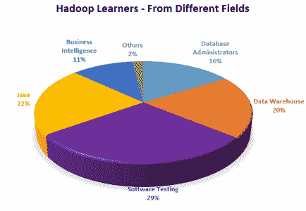
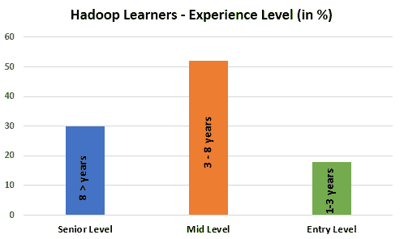
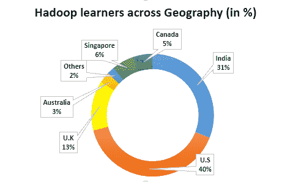

# Hadoop 学习者简介

> 原文：<https://www.edureka.co/blog/hadoop-learners-profile/>

随着世界走向数字时代，Hadoop 已经成为 IT 行业的热门技能。随着数据的字面爆炸，Hadoop 使得保持领先成为可能。由于它是最热门的薪酬工作之一，并且有巨大的机会，不同领域的人现在都将他们的注意力转移到大数据上。让我们看看我们的 Hadoop 学习者档案，看看这些学习者来自什么样的背景、经历和地理位置。

## **不同领域的 Hadoop 学习者:**

我们的 Hadoop 学习者主要来自软件测试、Java 和数据仓库背景。有来自各个领域的学习者，因为许多组织正在向大数据过渡，这些专业人员正在根据 IT 部门的最新趋势更新自己，以获得更好、更大的工作机会。这些专业人士已经意识到技能供求存在巨大缺口，并通过 [Hadoop 培训](https://www.edureka.co/blog/how-essential-is-hadoop-training/) 利用这一机会。

## **不同经验水平的 Hadoop 学习者:**

我们的 Hadoop 课程面向中级专业人员，但从上图可以明显看出，高级和入门级专业人员也参加了我们的 Hadoop 课程并从中受益。

## **全球 Hadoop 学习者:**

我们感到自豪的是，我们在世界各地拥有超过 26，000 名 Hadoop 学习者。我们的实时在线培训使全球各地的人们都能从我们的培训中受益。除了印度，我们的学生主要来自美国，其次是英国、澳大利亚、新加坡、加拿大和世界其他地方。

我们的成功归功于我们的学习方法，它帮助我们实现了许多学习者的梦想工作。

**相关帖子:**

[学习 Hadoop 的理由。](https://www.edureka.co/blog/5-reasons-to-learn-hadoop)

[Hadoop 培训有多重要。](https://www.edureka.co/blog/how-essential-is-hadoop-training/)

[通过 Hadoop 认证的职业优势。](https://www.edureka.co/blog/career-advantages-through-hadoop-certification/ "Career Advantages through Hadoop Certification.")