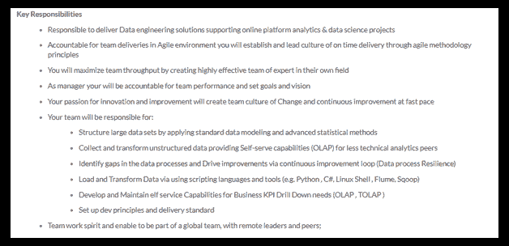
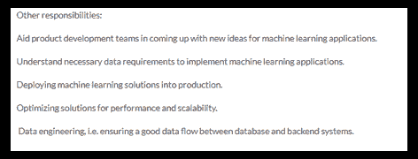
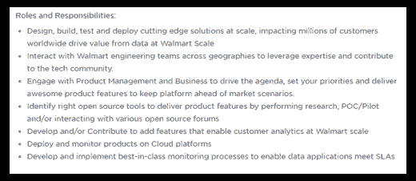
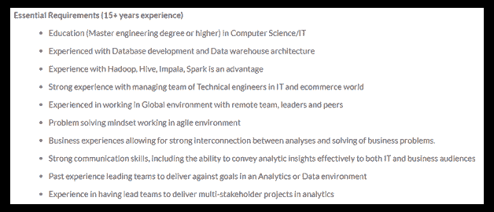
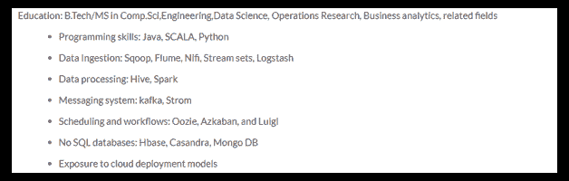
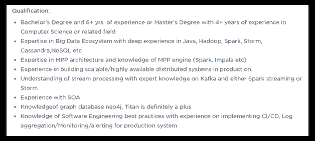
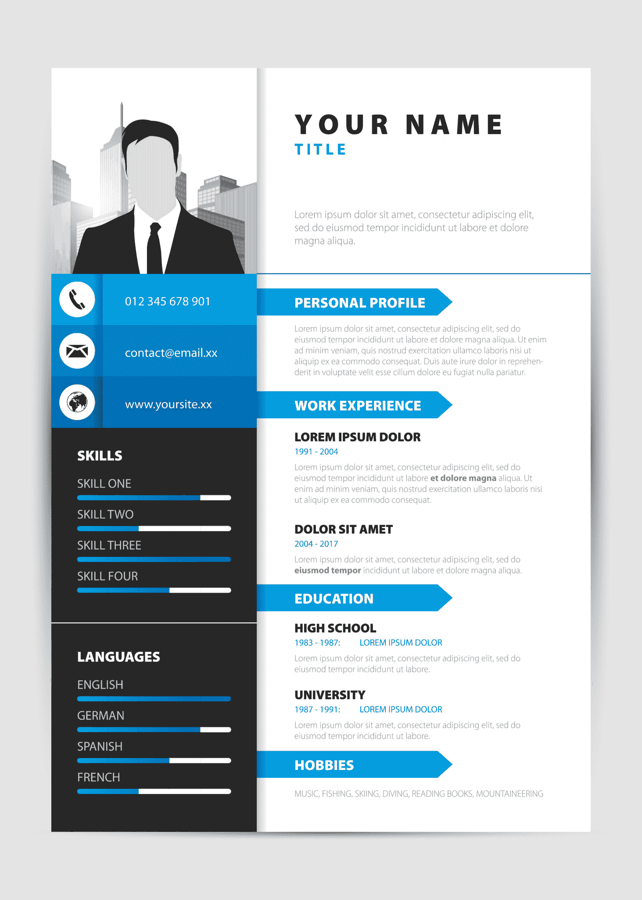

# 大数据工程师简历—打造令人印象深刻的数据工程师简历

> 原文：<https://www.edureka.co/blog/big-data-engineer-resume/>

简历是一张电子羊皮纸，它会在面试官面前树立你的第一印象。&会为你通过第一轮筛选。当谈到大数据工程师这样的精英职位时，责任&期望很高，简历必须自我描述&令人印象深刻。这个关于大数据工程师简历的博客将帮助你建立一个。

经验技能是你简历中最重要的部分。确保它符合工作要求。如果你不清楚成为大数据工程师所需的技能，可以参考这篇 [***大数据工程师技能***](https://www.edureka.co/blog/big-data-engineer-skills/) 博客。

开始创建数据工程师简历的最恰当的方式是看一些真实的工作职责。

## **大数据工程师职位描述**

### **大数据工程师职责**

不浪费任何时间，让我们快速浏览一些职位描述，这些描述 将帮助您了解行业对大数据工程师的期望。你可以做好相应的准备。

*   **戴尔**–***大数据工程***

****

*   **爱立信**–***大数据工程师***

****

*   **沃尔玛实验室**–***数据工程师***

 让我们总结一下大数据工程师/数据工程师的职责。你可以从这个[大数据工程师课程](https://www.edureka.co/masters-program/big-data-architect-training)中学到更多。现在，让我们进入大数据工程师简历博客中最令人期待的部分。

***大数据工程师职责:***

*   设计、创建、测试和维护完整的数据管理&处理系统。
*   与利益相关方密切合作&解决方案架构师。
*   确保架构满足业务需求。
*   构建高度可扩展的、健壮的&容错系统。
*   负责整个 ETL 过程。
*   发现数据采集机会
*   寻找方法&从现有数据中寻找价值的方法。
*   提高数据质量、可靠性&单个组件的效率&整个系统。
*   通过将各种编程语言&工具集成在一起，创建一个完整的解决方案。
*   创建数据模型以降低系统复杂性，从而提高效率&降低成本。
*   在现有系统中引入新的数据管理工具&技术，以提高效率。
*   设定&实现个人和团队目标。

向前推进，现在我们需要看看组织履行这些工作职责所需的技能。

通过 [Hadoop 认证](https://www.edureka.co/big-data-hadoop-training-certification)增强您的技能。

### **大数据工程师必备技能**

理解所需技能的最明智的方法是看同样的工作描述。

*   **戴尔**–***大数据工程***

****

*   **爱立信**–***大数据工程师***

****

*   **沃尔玛实验室**–***数据工程师***

完全正确！现在，我们将找出有助于我们建立简历的重要技能&为面试做准备。

***大数据工程师技能:***

*   了解 Hadoop 生态系统及其内部的不同框架——HDFS、YARN、MapReduce、Apache Pig、Hive、Flume、Sqoop、ZooKeeper、Oozie、Impala 和 Kafka
*   实时处理框架(Apache Spark)
*   数据库架构
*   基于 SQL 的技术(如 MySQL/ Oracle DB)
*   NoSQL 技术公司(如 Cassandra 和 MongoDB)
*   编程语言:Python/R/Java
*   ETL/数据仓库解决方案(Talend，Informatica)
*   了解不同的操作系统——UNIX、Linux、Solaris 或 MS Windows
*   了解 SOA、图形数据库、CI/CD 管道、监控&警报将是加分项。

除了这些技术技能之外，你还需要提到你的人际交往技能，如强大的沟通技能、领导技能、管理技能、解决问题的技能等。这将证明你的能力。要深入了解成为大数据工程师所需的技能，请浏览此 [***大数据工程师技能***](https://www.edureka.co/blog/big-data-engineer-skills/) 博客。

现在让我们把注意力集中在制作简历时应该牢记的要点上。

## **简历**

简历是你在面试官面前的第一印象。这是朝着你的目标迈出的第一步&也是最关键的一步。有两种方法可以制作你的简历:

*   按时间顺序:这是制作简历的传统方式，你可以按照经历发生的方式提及你的经历。保守领域首选这类简历。
*   功能性:这是一种全新的方法，你可以根据所需的技能来提及你最相关的经验。在这种情况下，你的招聘人员不必浏览整个简历来找出所需的技能。这是一种在面试官面前更专注、更简洁地展示自己的方式。你甚至可以在浦那参加 [Azure 数据工程培训，了解大数据的细节。](https://www.edureka.co/microsoft-azure-data-engineering-certification-course-pune)

在制作你的简历时，有一些关键点需要记住。

*   你需要记住的第一件事是，你的简历应该前后一致，简洁明了&清楚地表达你想要传达的信息。

*   不断更新你的简历。建立或更新你的简历真的很累，但是你投入的时间越多，你被选中的几率就越高。招聘人员会收到数百份求职简历，而你的简历将为你扫清第一轮的障碍。
*   对于某人来说，8 年以下的工作经验应该有一页纸的简历。你最多应该带一份两页的简历。两页之后，简历变得冗长，面试官对阅读它失去了兴趣。
*   如果你有 2 年以上的工作经验，试着写一份功能性简历，只写相关的经历，而不是充斥所有的内容。优先考虑特定工作所需的技能。为每一份&每一份工作制作一份定制简历总是更好的。
*   列出活动&提及你在活动中的角色。这是你展示你的人际交往能力的地方，比如领导力、团队精神等。此外，列出你所获得的奖项，以证明你在不同领域的潜力。
*   你的兴趣爱好在打破与面试官的僵局中起着重要的作用。这部分也表明你是一个拥有各种技能&爱好的多面手。

你可以从[数据工程课程](https://www.edureka.co/microsoft-azure-data-engineering-certification-course)中学到更多。现在，让我们进入大数据工程师简历博客中最令人期待的部分。

## **大数据工程师简历**

现在具体说大数据工程师简历，除了你的名字&个人详情，第一节应该是你的工作经历。

### **工作经历**

你应该总是从相关的工作经历开始，这将很快引起招聘人员的注意。它应该以一种简洁、明快、清晰的方式陈述你所承担的责任&以及你从中学到的东西。

你可以把你的经历分成以下几个部分:

*   名称
*   组织名称
*   雇佣期限
*   工作职责简述
*   你从那份工作中学到的东西或经验

***举例:***

**经历:数据工程师——美国银行**

【2015 年 7 月至今

在风险管理团队担任大数据工程师，该银行希望在日常运营中存储、处理&管理从各种来源收集的大量数据。系统主要检查客户的信誉&寻找信用风险。

>与各个团队&管理层合作了解需求&设计完整的系统

>实现了完整的实时处理大数据管道

>使用 Cloudera 5.11.x 及其不同组件

>使用 Spark 2.1.x API 实时传输来自不同来源的数据

>使用 Spark SQL &数据帧聚合在 Scala 中开发 Spark 代码

>与 Sqoop 合作，从 Oracle DB & MySQL 等各种 RDBMS 中获取&检索数据

>使用分桶&分区在配置单元中创建了具有性能优化的模式

>与 Impala 2.8.x 紧密合作执行特别查询

>编写 Hive 查询来转换数据以供进一步的下游处理

>为调度查询创建 Oozie 工作流作业&动作

>参与端到端部署流程

**高级软件工程师——塔塔咨询服务**

【2013 年 6 月至 2015 年 7 月

————————————————————————————————————————————————————————————————————

> —————————————————————————————————-

> —————————————————————————————————-

**Java 开发者——德勤**

【2010 年 11 月至 2013 年 7 月

————————————————————————————————————————————————————————————————————

> —————————————————————————————————-

> —————————————————————————————————-

上面的简历中有一些关键因素，它们不仅会让你更有优势，还会给你的雇主留下深刻印象。

*   试提软件版本&框架。
*   查看职位描述，你同样可以调整你的经历&提及那些组织需要的工具&技能。
*   大数据工程师工作经历比较贴切，所以我阐述了第一部分。在写我的 Java 开发人员&高级软件工程师工作时，我将只包括那些大数据工程师角色所必需的技能。
*   你需要明白，有太多的工具用于一个单一的目的，你不可能掌握所有的工具。所以，我的建议是，不要仅仅提及工具或框架的名字，而是添加一个关于你对该工具的了解&的小描述。这也有助于面试官了解，如果你没有使用相同工具的经验，你有使用另一种工具的经验。

### **技术技能**

在工作经历之后，我建议你创建一个技能部分，在那里你可以列出你的技能。您可以将您认为大数据工程师工作角色所需的所有技能，或者您有信心掌握的技能放入其中。

***举例:***

**技术技能:**

CDH、HDFS、SPARK、Hive、Impala、Sqoop、Map Reduce、Oozie、Putty、Netezza、YARN、Python、R、Talend、Informatica、Power BI、Hibernate、RHEL、UNIX、Windows、敏捷方法论、MongoDB、Cassandra、HBase、MySQL、Oracle DB、SOA、CI/CD。

### **成就&爱好**

这之后，下一节应该是成就&的爱好。尽量不要提及太多的 成就或爱好，因为这会分散面试官的注意力&他/她可能会错过重要的。提及几个你有信心的相关&。

从班加罗尔的 [Hadoop 培训中进一步了解大数据技能。](https://www.edureka.co/big-data-hadoop-training-certification-bangalore)

我希望这篇大数据工程师简历博客能帮助你弄清楚如何撰写一份有吸引力的&有效简历。在我们即将发布的关于大数据工程师薪酬的博客中，我们将讨论影响大数据工程师薪酬的 不同因素。

Start your Big Data Engineer Journey with Edureka [<button>Learn Now</button>](https://www.edureka.co/masters-program/big-data-architect-training)

如果你愿意升级职业&开始你的大数据工程师之旅，那就去看看 ***[数据架构师课程](https://www.edureka.co/masters-program/big-data-architect-training)*** 。